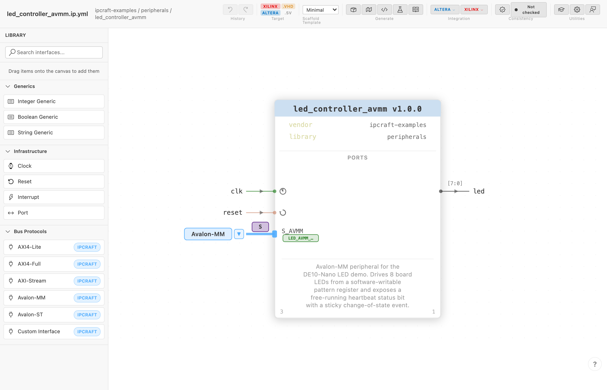
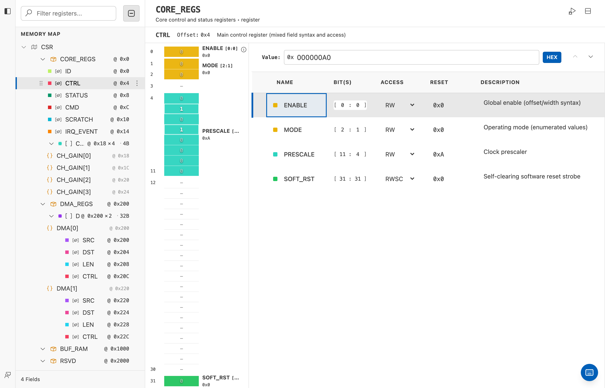
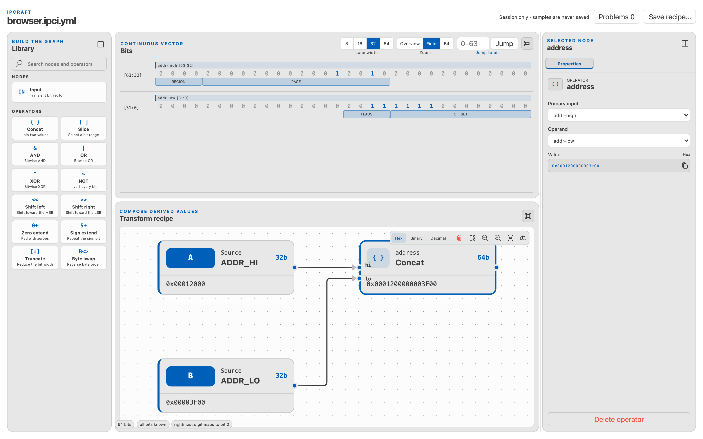

# IPCraft for VS Code

Design reusable FPGA IP without hand-writing every register, HDL wrapper, or
vendor integration file. IPCraft turns a compact YAML specification into a
visual, repeatable workflow for editing, generating, checking, and building IP
cores from inside VS Code.

## See IPCraft in action

<table align="center">
  <tr>
    <td width="720">
      <video src="https://github.com/user-attachments/assets/28238d1e-7c99-47d4-b4de-f0ee3c85f470" controls muted playsinline title="IPCraft demo"></video>
    </td>
  </tr>
</table>

If the video player is unavailable, [watch the demo directly](docs/media/ipcraft-demo.mp4).

## Why IPCraft?

- **Integrate IP with less vendor-specific work** — describe an IP core once,
  then generate the packaging needed by Intel/Altera Platform Designer
  (`*_hw.tcl`) and AMD Vivado (`component.xml`). You can target both toolchains
  without maintaining two independent component descriptions by hand.
- **Build register maps visually** — add, edit, reorder, and inspect address
  blocks, registers, register arrays, and bit fields in a table editor and
  bit-field visualizer. IPCraft recalculates layout after structural changes,
  making memory-map iteration much faster and less error-prone than editing
  offsets and bit ranges manually.
- **Keep one source of truth** — use `.ip.yml` and `.mm.yml` specifications to
  drive HDL, register files, testbenches, documentation, and vendor project
  files. Regeneration is repeatable, while consistency checks reveal when the
  specification, top-level HDL, and generated integration files have drifted
  apart.
- **Start from a scaffold, not boilerplate** — generate a complete VHDL or
  SystemVerilog project with the top level, bus wrapper, register logic,
  user-logic skeleton, testbench, and tool-specific project files already
  connected.
- **Move existing IP into the same workflow** — import a VHDL entity, Platform
  Designer component, or Vivado IP package instead of recreating its interfaces
  from scratch.
- **Shorten the edit-to-build loop** — validate designs while editing, launch
  headless Vivado or Quartus builds from VS Code, and review timing,
  utilization, and CDC results without switching between disconnected tools.
- **Debug register values faster** — decode raw literals and captured CSV data
  against the register map, then transform and combine values visually to
  investigate hardware behavior without repeatedly calculating fields by hand.
- **Reuse common and custom interfaces** — work with built-in AXI, Avalon, and
  streaming bus definitions, or describe project-specific conduit interfaces
  once and reuse them across cores.

## Screenshots

| IP Core Editor                                         | Memory Map Editor                                                                                        | Data Inspector                                                    |
| ------------------------------------------------------ | -------------------------------------------------------------------------------------------------------- | ----------------------------------------------------------------- |
|  |  |  |

Generated from the real editor UI by `npm run docs:screenshots` — see [Automated Docs Screenshots](docs/concepts/docs-screenshots.md).

## Features

- **Visual Editors** — compose interfaces, ports, parameters, clocks, and resets
  on a block-diagram IP Core canvas; create and rearrange address blocks,
  registers, arrays, and bit fields in the Memory Map editor. Both editors sync
  changes to readable YAML while preserving comments and numeric formatting
  ([Create Your First IP Core](docs/how-to/create-your-first-ip-core.md),
  [Memory-Mapped Registers](docs/tutorials/memory-mapped-registers.md))
- **Data Inspector** — decode literals and captured CSV data against registers, then transform and combine values in a visual workspace ([guide](docs/how-to/use-data-inspector.md))
- **Custom Interfaces** — define conduit (custom) bus interfaces with user-named signals, stored as reusable `.busdef.yml` files ([guide](docs/how-to/defining-a-custom-interface.md))
- **Consistency Check** — cross-references a spec against the generated top-level HDL and vendor artifacts (`component.xml`, `_hw.tcl`), flagging drift in either direction ([guide](docs/how-to/check-consistency.md))
- **HDL and Vendor Generation** — scaffolds a full RTL project (package, top entity, user-logic skeleton, bus wrapper, register file, testbench) in VHDL or SystemVerilog, plus Vivado `component.xml`, Platform Designer `*_hw.tcl`, and vendor project files ([guide](docs/how-to/generating-a-project.md))
- **Headless Build** — runs Vivado or Quartus in batch mode from inside VS Code, with a Build Reports sidebar panel (timing, utilization, CDC) and status bar summary; Docker runner supported ([guide](docs/how-to/building-a-project.md))
- **Import** — reverse-engineer an existing VHDL entity, Platform Designer `_hw.tcl`, or Vivado `component.xml` into an `.ip.yml` spec ([guide](docs/how-to/importing-an-existing-design.md))

See [Commands & Settings](docs/reference/commands.md) for the full command list and every setting's default and description, and [Keyboard Shortcuts](docs/reference/keyboard-shortcuts.md) for canvas/table navigation.

IPCraft supports VS Code Restricted Mode with limited functionality. Visual
editing and read-only inspection remain available, while generation, template
rendering, imports that invoke Git, builds, vendor scans, and FPGA tool launches
require a trusted workspace. See
[Workspace Trust and Restricted Mode](docs/reference/commands.md#workspace-trust-and-restricted-mode)
for the complete behavior.

---

## Quick Start

Requires VS Code 1.80 or later.

1. `IPCraft: New IP Core` (or `New IP Core + Register Map`) from the Command Palette
2. Design the core on the visual canvas
3. `IPCraft: Scaffold Project` to generate RTL, testbench, and vendor files
4. `IPCraft: Build` to run a headless Vivado/Quartus compile

Walkthroughs covering these steps (and importing existing VHDL, importing from vendor tools, and synthesizing) are available from **Help → Get Started** or `IPCraft: Open Walkthrough...`.

Installing the Marketplace extension does not add a shell command to your
`PATH`. A separate npm CLI package is being prepared for headless CI and
scripting; until it is published, use the extension commands above. See the
[Generator Reference](docs/reference/generator.md#command-line-package) for
local package testing.

---

## Documentation

Full documentation — commands, settings, keyboard shortcuts, generator internals, schemas, tutorials — is in the [`docs/`](docs/) directory, built with [MkDocs](https://www.mkdocs.org/):

```bash
pip install mkdocs mkdocs-material
mkdocs serve
```

Then open `http://127.0.0.1:8000`.

---

## Development

`ipcraft-spec` (bus definitions and JSON schemas) is a git submodule — clone with `--recurse-submodules`, or run `git submodule update --init --recursive` after a plain clone.

```bash
npm install
npm run compile
```

Press **F5** in VS Code to launch an Extension Development Host.

```bash
npm run watch        # watch mode
npm run test:unit    # unit tests
npm run lint         # ESLint (zero warnings)
npm run type-check   # TypeScript check
```

See [Development Setup](docs/getting-started/development.md) for the full contributor workflow, and [CONTRIBUTING.md](CONTRIBUTING.md) for the setup, lint/type-check/test, and PR checklist.

---

## Community

- [Contributing Guide](CONTRIBUTING.md) — setup, coding conventions, and test expectations
- [Support](SUPPORT.md) — where to ask usage questions, file bugs, or request features
- [Security Policy](SECURITY.md) — how to privately report a vulnerability
- [Code of Conduct](CODE_OF_CONDUCT.md) — expected behavior in this project's spaces

---

## License

[MIT](LICENSE)
