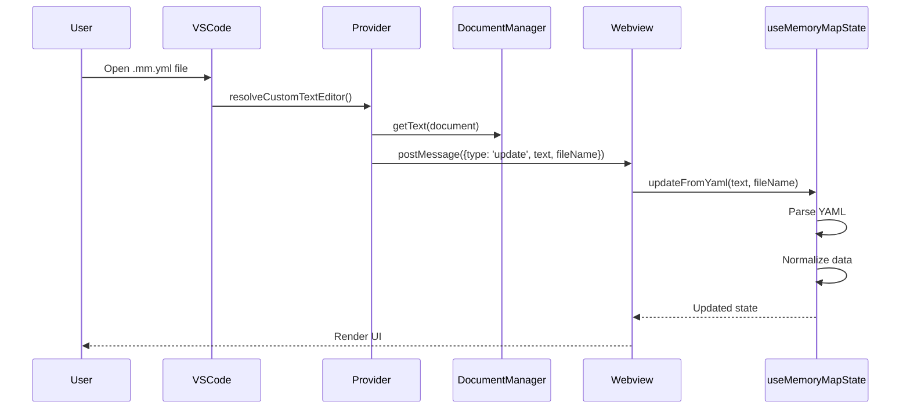
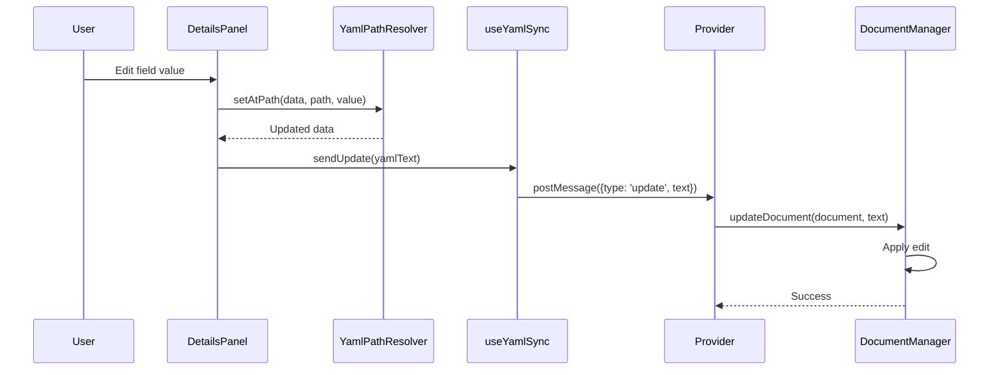
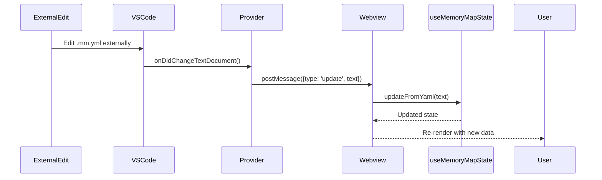
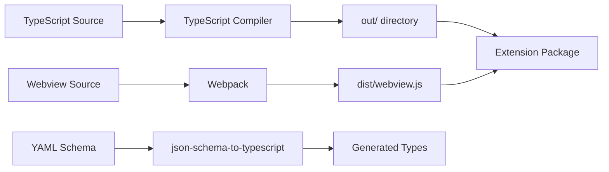

# Architecture Documentation

## Overview

The FPGA Memory Map Visual Editor is a VSCode extension that provides a visual interface for editing memory map YAML files. This document describes the architecture after the DetailsPanel decomposition and spatial-insertion/service refactoring.

## HDL Generation

The extension performs HDL generation and VHDL parsing in TypeScript using Nunjucks templates synced from the
Python generator. We chose this approach to keep the extension fully standalone and responsive, avoiding the
latency and environment drift that comes from invoking a Python backend at runtime. Templates remain the
shared source of truth to preserve output parity across implementations.

## System Architecture

```mermaid
graph TB
    subgraph "VSCode Extension Host"
        EXT[extension.ts<br/>Entry Point<br/>38 lines]
        PROVIDER[MemoryMapEditorProvider<br/>Custom Editor Provider<br/>68 lines]

        subgraph "Services"
            HTML[HtmlGenerator<br/>Webview HTML Generation]
            DOC[DocumentManager<br/>File Operations]
            MSG[MessageHandler<br/>Message Processing]
            YAML[YamlValidator<br/>YAML Validation]
        end

        subgraph "Utilities"
            LOG[Logger<br/>Structured Logging]
            ERR[ErrorHandler<br/>Error Management]
        end
    end

    subgraph "Webview (React)"
        APP[index.tsx<br/>Main App<br/>445 lines]
        DETAILS[DetailsPanel.tsx<br/>Routing Coordinator<br/>~200 lines]
        OUTLINE[Outline.tsx<br/>Tree View<br/>588 lines]

        subgraph "Editors"
            MMEDITOR[MemoryMapEditor]
            REGEDITOR[RegisterEditor]
            BLOCKEDITOR[BlockEditor]
            ARRAYEDITOR[RegisterArrayEditor]
            FIELDSTABLE[FieldsTable]
        end

        subgraph "Webview Services"
            NORM[DataNormalizer<br/>Data Transformation]
            PATH[YamlPathResolver<br/>Path Operations]
            YAMLSVC[YamlService<br/>YAML Serialization]
        end

        subgraph "Custom Hooks"
            MAPSTATE[useMemoryMapState<br/>State Management]
            SELECT[useSelection<br/>Selection State]
            SYNC[useYamlSync<br/>Message Sync]
            TABNAV[useTableNavigation<br/>Keyboard Nav]
            FIELDEDITOR[useFieldEditor<br/>Bit-field Editing]
        end

        subgraph "Algorithms"
            BITREPACK[BitFieldRepacker<br/>5 functions]
            BLOCKREPACK[AddressBlockRepacker<br/>2 functions]
            REGREPACK[RegisterRepacker<br/>2 functions]
        end

        subgraph "Webview Domain Services"
            INSERTION[SpatialInsertionService<br/>Insert/Repack Pipeline]
        end

        subgraph "Visualizers"
            BITVIS[BitFieldVisualizer]
            ADDRVIS[AddressMapVisualizer]
            REGVIS[RegisterMapVisualizer]
        end
    end

    EXT --> PROVIDER
    PROVIDER --> HTML
    PROVIDER --> MSG
    PROVIDER --> DOC
    PROVIDER --> YAML
    PROVIDER --> LOG
    PROVIDER --> ERR

    PROVIDER <-->|postMessage| APP

    APP --> MAPSTATE
    APP --> SELECT
    APP --> SYNC
    APP --> DETAILS
    APP --> OUTLINE

    DETAILS --> MMEDITOR
    DETAILS --> REGEDITOR
    DETAILS --> BLOCKEDITOR
    DETAILS --> ARRAYEDITOR

    REGEDITOR --> FIELDSTABLE
    REGEDITOR --> FIELDEDITOR
    REGEDITOR --> TABNAV
    REGEDITOR --> INSERTION
    REGEDITOR --> BITREPACK

    BLOCKEDITOR --> INSERTION
    BLOCKEDITOR --> BLOCKREPACK
    BLOCKEDITOR --> REGREPACK

    MMEDITOR --> NORM
    REGEDITOR --> PATH
    REGEDITOR --> YAMLSVC
    BLOCKEDITOR --> PATH
    BLOCKEDITOR --> YAMLSVC
    REGEDITOR --> BITVIS
    BLOCKEDITOR --> ADDRVIS
    BLOCKEDITOR --> REGVIS

    MAPSTATE --> NORM
    MAPSTATE --> YAMLSVC
    SELECT --> PATH
    SYNC -->|postMessage| PROVIDER
```



## Data Flow

### 1. Document Loading



### 2. User Edits



### 3. Document Synchronization



## Component Hierarchy

### Extension Host

```
extension.ts (Entry Point)
└── MemoryMapEditorProvider
    ├── HtmlGenerator
    ├── DocumentManager
    ├── MessageHandler
    │   ├── YamlValidator
    │   └── DocumentManager
    ├── Logger
    └── ErrorHandler
```

### Webview

```
index.tsx (Main App)
├── useMemoryMapState
│   ├── YamlService
│   └── DataNormalizer
├── useSelection
│   └── YamlPathResolver
├── useYamlSync
│   └── vscode.postMessage
├── Outline
│   └── Tree rendering logic
└── DetailsPanel
    ├── MemoryMapEditor
    ├── RegisterEditor
    │   ├── FieldsTable
    │   ├── useFieldEditor
    │   ├── useTableNavigation
    │   ├── BitFieldRepacker
    │   ├── SpatialInsertionService
    │   └── BitFieldVisualizer
    ├── BlockEditor
    │   ├── AddressBlockRepacker
    │   ├── RegisterRepacker
    │   ├── SpatialInsertionService
    │   ├── AddressMapVisualizer
    │   └── RegisterMapVisualizer
    └── RegisterArrayEditor
```

## State Management

### Extension Host State

Managed by VSCode:
- Document content (TextDocument)
- Webview lifecycle
- File system watchers

### Webview State

Managed by React hooks:

**useMemoryMapState:**
- `memoryMap`: Normalized memory map object
- `rawText`: YAML source text
- `parseError`: Parsing errors
- `fileName`: Current file name

**useSelection:**
- `selectedId`: Selected item ID
- `selectedType`: Type of selection (memoryMap/block/register/array)
- `selectedObject`: Selected object data
- `breadcrumbs`: Navigation path
- `selectionMeta`: Additional metadata

**Detail editors (local state):**
- `RegisterEditor` + `useFieldEditor`: active cell state, field drafts, field validation errors
- `BlockEditor`: block insertion/selection state and insertion error messaging
- `RegisterArrayEditor` and `MemoryMapEditor`: focused form editing state
- `DetailsPanel`: routing + imperative focus delegation only

## Message Passing Protocol

### Extension → Webview

```typescript
interface UpdateMessage {
  type: 'update';
  text: string;        // YAML content
  fileName: string;    // File name for display
}
```

### Webview → Extension

```typescript
interface UpdateMessage {
  type: 'update';
  text: string;        // Modified YAML content
}

interface CommandMessage {
  type: 'command';
  command: 'save' | 'validate';
}
```

## Data Normalization

The `DataNormalizer` service transforms various YAML structures into a consistent format:

```typescript
// Input: YAML (can be array, nested, or direct)
const parsed = YamlService.parse(yamlText);

// Normalize structure
let map;
if (Array.isArray(parsed)) {
  map = parsed[0];
} else if (parsed.memory_maps) {
  map = parsed.memory_maps[0];
} else {
  map = parsed;
}

// Normalize data
const normalized = DataNormalizer.normalizeMemoryMap(map);
// Output: Consistent MemoryMap type
```

## Build Process



**Commands:**
- `npm run compile`: Build extension and webview
- `npm run watch`: Watch mode for development
- `npm run generate-types`: Generate types from schema
- `npm run test`: Run unit tests

## Testing Strategy

### Unit Tests (Jest)

- **Algorithm modules**: BitFieldRepacker, AddressBlockRepacker, RegisterRepacker
- **Services**: DataNormalizer, YamlPathResolver, YamlService
- **Utilities**: Logger, ErrorHandler

### Integration Tests (Mocha)

- Extension activation
- Custom editor registration
- Document operations

### Manual Testing

- Extension Development Host
- Sample YAML files in `src/test/fixtures/`

## Security Considerations

### Content Security Policy

Currently using relaxed CSP (includes CDN):
```html
<meta http-equiv="Content-Security-Policy"
      content="default-src 'none';
               style-src ${webview.cspSource} 'unsafe-inline' https://cdn.tailwindcss.com;
               script-src ${webview.cspSource} 'unsafe-inline';">
```

**TODO**: Remove CDN dependencies and tighten CSP.

### Message Validation

All webview messages are type-checked:
```typescript
interface WebviewMessage {
  type: string;
  [key: string]: unknown;
}
```

## Extension Points

### Adding a New Service

1. Create service in `src/services/`
2. Inject into `MemoryMapEditorProvider` constructor
3. Use in provider methods

### Adding a New Webview Service

1. Create service in `src/webview/services/`
2. Import in components that need it
3. Call static methods or instantiate

### Adding a New Algorithm

1. Create module in `src/webview/algorithms/`
2. Export pure functions
3. Write unit tests in `src/test/suite/algorithms/`
4. Import in the appropriate sub-editor (`RegisterEditor`, `BlockEditor`, etc.)

## Performance Considerations

- Webview bundle size: ~5.6 MB (with source maps)
- Extension bundle size: ~395 KB
- Initial load time: <2s for typical files
- Re-render on edit: <100ms

**Optimization opportunities:**
- Code splitting for webview
- Lazy loading of visualizers
- Memoization of expensive computations
- Virtual scrolling for large tables

## Future Enhancements

- Command palette commands
- Export to C header files
- Generate documentation
- Custom themes
- Multi-file editing
- Validation against custom schemas
