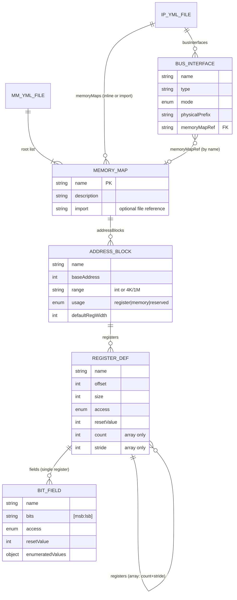
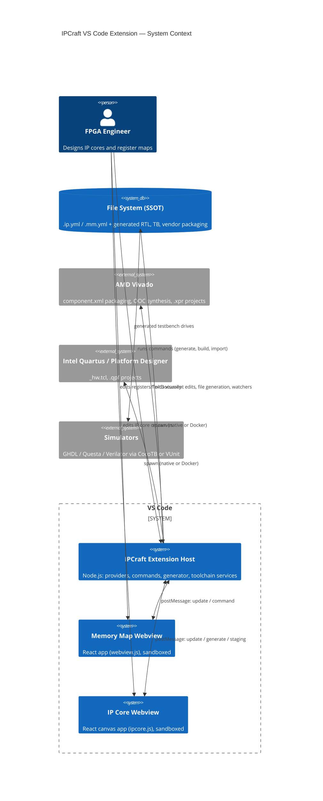
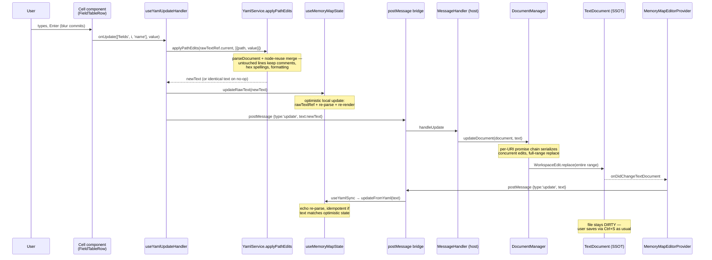

# IPCraft for VS Code — Software Architecture Document

> Reverse-engineered from the codebase at version 0.2.0 (June 2026). Every statement in this
> document is derived from reading the actual source; where the implementation diverges from
> the ideal architecture, the divergence is documented as-is and flagged in
> [§7 Technical Debt](#7-technical-debt--vibe-code-assessment).
>
> Companion documents: [overview.md](overview.md), [extension-host.md](extension-host.md),
> [webview.md](webview.md), [technical-debt.md](technical-debt.md) (actionable TD items TD-1…TD-5).

---

## 1. Executive Summary

`ipcraft-vscode` is a VS Code extension for designing FPGA IP cores. It treats two YAML file
types as the **Single Source of Truth (SSOT)**:

| File | Content | Custom editor |
| --- | --- | --- |
| `*.ip.yml` | IP core definition: VLNV identity, clocks, resets, ports, bus interfaces, parameters, file sets, simulation config | `fpgaIpCore.editor` (canvas-based React app, `ipcore.js` bundle) |
| `*.mm.yml` | Memory map: memory maps → address blocks → registers / register arrays → bit fields | `fpgaMemoryMap.editor` (outline + details React app, `webview.js` bundle) |

Around these files the extension provides:

1. **Two-way-synced visual editing.** Each custom editor is a React webview that renders the
   parsed YAML and writes edits back to the `TextDocument` through `postMessage`. The text
   document remains authoritative; the user can switch to the raw text editor at any time
   (`fpga-ip-core.openAsText`) and both views stay consistent.
2. **Code generation.** A scaffold-pack-driven Nunjucks pipeline turns `.ip.yml` (+ referenced
   `.mm.yml`) into RTL (VHDL/SystemVerilog), register files, testbenches (CocoTB/VUnit),
   vendor packaging (`component.xml` for Vivado, `*_hw.tcl` for Quartus Platform Designer),
   and project/build scripts.
3. **Toolchain integration.** Detection and launching of Vivado/Quartus (native or Docker),
   OOC synthesis builds, report parsing into a tree view, and experimental importers
   (VHDL, `_hw.tcl`, `component.xml` → `.ip.yml`).

The architecture has three hard process boundaries: the **extension host** (Node.js),
the **webviews** (browser sandbox, one per open editor), and **external EDA tools**
(child processes). All cross-boundary communication is asynchronous message passing or
file I/O — there is no shared memory.

---

## 2. Domain Data Model

### 2.1 `.ip.yml` — IP core definition

JSON Schema: `ipcraft-spec/schemas/ip_core.schema.json` (copied into `dist/resources/schemas/`
at build time; AJV-validated in `IpCoreScaffolder.loadIpCore`). Root keys:

```yaml
vlnv: { vendor, library, name, version }   # identity — REQUIRED; presence of `vlnv` is how
                                           # IpCoreEditorProvider detects an IP core file
description: ...
scaffold_pack: builtin-ipcraft            # per-file generator pack selection (round-trips)
clocks:      [{ name, logicalName, direction, frequency, associatedReset, ... }]
resets:      [{ name, polarity, associatedClock, ... }]
interrupts:  [{ name, logicalName, ... }]
ports:       [{ name, direction, width, type, ... }]          # raw conduit ports
busInterfaces:
  - name: s_axi
    type: axi4lite                         # resolved against the bus definition library
    mode: slave
    physicalPrefix: s_axi_
    associatedClock: clk
    associatedReset: rst_n
    memoryMapRef: CSR_MAP                  # cross-file link into a memory map by NAME
    array: { count, indexStart, namingPattern, physicalPrefixPattern }   # replicated interfaces
memoryMaps:                                # inline maps OR per-entry { import: file.mm.yml }
  - import: ./regs.mm.yml
parameters:  [{ name, value, dataType, ... }]
fileSets:    [{ name, files: [{ path, type, managed, ... }] }]   # generator writes back here
subcores:    [...]                         # hierarchical composition
simulation:  { framework, engine, compileArgs, simArgs, env }
targets:     [...]                         # replaces legacy `vendor:` (migration command exists)
useBusLibrary: ./bus_defs                  # per-IP custom bus definition directory
```

Key relationship: `busInterfaces[].memoryMapRef` refers to `memoryMaps[].name`. The referenced
entry may itself be an `import:` pointing at a `.mm.yml` file — `ImportResolver` (editor display)
and `registerProcessor.resolveMemoryMaps` (generation) both follow the import and merge
entry-level overrides (e.g. `name`) over the imported file's content.

### 2.2 `.mm.yml` — memory map

JSON Schema: `ipcraft-spec/schemas/memory_map.schema.json`. The document root is a **list** of
memory maps (the webview also tolerates a single object or a `memory_maps:` wrapper —
see `useMemoryMapState.parseAndNormalize` and `YamlPathResolver.getMapRootInfo`).

Hierarchy:

```yaml
- name: CSR_MAP                  # MemoryMap
  addressBlocks:
    - name: CONTROL_REGS         # AddressBlock
      baseAddress: 0
      range: 4K                  # int or "4K"/"1M" strings
      usage: register            # register | memory | reserved
      defaultRegWidth: 32
      registers:
        - name: CTRL             # RegisterDef (single register)
          offset: 0
          access: read-write
          fields:
            - name: ENABLE       # BitFieldDef
              bits: '[0:0]'      # OR offset+width — both spellings in the schema
              access: read-write
              resetValue: 0
        - name: CHANNEL          # RegisterDef used as a REGISTER ARRAY:
          count: 4               # count + stride + nested `registers:` =
          stride: 64             # array of register groups
          registers:
            - { name: CTRL, offset: 0, fields: [...] }
            - { name: STATUS, offset: 4, fields: [...] }
```

A `RegisterDef` is polymorphic: with `count`/`stride`/nested `registers` it represents an
array of register groups; without them it is a single register with `fields`.

Access types: `read-only`, `write-only`, `read-write`, `write-1-to-clear`,
`read-write-1-to-clear`. W1C fields may carry `monitorChangeOf` (change-of-state monitoring,
extension-specific).

### 2.3 ER diagram (mm.yml structure)



### 2.4 The dual-spelling problem (schema vs. webview internals)

The schemas use **camelCase** (`addressBlocks`, `resetValue`, `defaultRegWidth`) but the memory
map webview internally normalizes to **snake_case** (`address_blocks`, `reset_value`,
`bit_offset`/`bit_width` instead of `bits`). Conversion happens in three places:

- `DataNormalizer` (webview): YAML → normalized internal model on every update.
- `YamlSanitizer` + `YamlService.cleanForYaml` (webview): internal model → schema keys before
  writing back (`bit_offset`+`bit_width` recombined into a `bits: '[msb:lsb]'` string).
- `YamlPathResolver.KEY_ALIASES`: path navigation falls back from `addressBlocks` to
  `address_blocks` so both spellings in user files keep working.

This is a deliberate tolerance for hand-written files, but it means **three different key
vocabularies coexist** (schema camelCase, legacy snake_case in user files, internal normalized
form) — see TD note V-1.

---

## 3. System Architecture

### 3.1 C4 system context



### 3.2 Boundaries and ownership

| Boundary | Owns | Must not |
| --- | --- | --- |
| **Extension host** (`src/` minus `src/webview/`) | `TextDocument` lifecycle, file I/O, YAML validation (AJV), import resolution, generation, toolchain spawning, VS Code UI (commands, trees, status bar) | Render editor UI |
| **Webviews** (`src/webview/`) | Parsing/normalizing YAML text for display, editing state (drafts, selection, undo), serializing edits back to full YAML text | Touch the file system, run commands directly (the `command` message is allow-listed host-side) |
| **File system** | The authoritative content; generated artifacts | — |
| **Generators** (`src/generator/`) | Pure(ish) text-in/text-out rendering; dry-run produces an in-memory `Record<relativePath, content>` | Write to disk during dry run |

Security posture worth noting (both deliberate, post-hoc hardening): the IP Core provider
restricts `localResourceRoots` to `dist/` + codicons, and the generic `command` message from
the webview is checked against `WEBVIEW_COMMAND_ALLOWLIST`
(`IpCoreEditorProvider.ts:48`).

### 3.3 Component diagram

```mermaid
graph TB
    subgraph host["Extension Host (Node)"]
        EXT[extension.ts<br/>activate: registers everything]
        subgraph providers["Providers"]
            MMP[MemoryMapEditorProvider]
            IPP[IpCoreEditorProvider<br/>own messageHandlers table + watchers]
            SPP[IpCoreSourcePreviewProvider]
            SB[WebviewStagingBridge<br/>singleton]
            SCP[StagingContentProvider<br/>virtual staging:// docs]
            TPP[TemplatePreviewProvider<br/>.j2 live preview]
        end
        subgraph services["Services"]
            MH[MessageHandler<br/>update/command dispatch]
            DM[DocumentManager<br/>serialized WorkspaceEdit queue]
            YV[YamlValidator AJV]
            IR[ImportResolver<br/>mm.yml + fileset + bus lib]
            HG[HtmlGenerator]
            TD2[ToolDetector / BuildRunner / ReportParser]
        end
        subgraph generator["Generator"]
            SC[IpCoreScaffolder.generateAll]
            SPL[ScaffoldPackLoader<br/>scaffold.yml manifests]
            TL[TemplateLoader<br/>Nunjucks, multi-root search]
            RP[registerProcessor<br/>bus expansion, register prep]
            TB[testbench/<br/>Framework x Engine strategies]
            TCH[toolchains/<br/>Vivado + Quartus strategies]
        end
        CMD[commands/<br/>GenerateCommands.runGenerator<br/>BuildCommands, importers]
    end

    subgraph wvmm["Memory Map Webview (webview.js)"]
        MMAPP[index.tsx App]
        MMSTATE[useMemoryMapState<br/>rawTextRef + normalized model]
        MMSYNC[useYamlSync<br/>window message listener]
        MMUPD[useYamlUpdateHandler<br/>path edits]
        YS[YamlService.applyPathEdits<br/>comment-preserving merge]
        DN[DataNormalizer / YamlSanitizer]
        ALG[algorithms/<br/>LayoutEngine, Repackers, MutationService]
    end

    subgraph wvip["IP Core Webview (ipcore.js)"]
        IPAPP[IpCoreApp.tsx]
        IPSTATE[useIpCoreState<br/>doc.setIn full reserialize]
        IPSYNC[useIpCoreSync<br/>500ms debounced full-text push]
        UNDO[useCanvasUndo]
    end

    EXT --> providers
    EXT --> CMD
    MMP --> MH --> DM
    MMP --> HG
    IPP --> MH
    IPP --> IR
    IPP --> SB
    CMD --> SC
    SC --> SPL & TL & RP & TB & TCH
    CMD --> SB
    SB --> SCP
    MMP <-->|postMessage| MMAPP
    IPP <-->|postMessage| IPAPP
    MMAPP --> MMSTATE & MMSYNC & MMUPD
    MMUPD --> YS
    MMSTATE --> DN
    MMAPP --> ALG
    IPAPP --> IPSTATE & IPSYNC & UNDO
```



Bundling: webpack builds three entries — `dist/extension.js` (Node target), `dist/webview.js`
(memory map app), `dist/ipcore.js` (IP core app). `HtmlGenerator` selects the script per
editor type. Webviews use `retainContextWhenHidden: true`.

---

## 4. Data Flow & State Management

### 4.1 The authoritative loop

The `TextDocument` (in-memory VS Code buffer of the YAML file) is the single source of truth.
Webviews never hold a divergent model for long — every edit is immediately serialized to full
YAML text and pushed to the host, and every document change is echoed back to the webview.

**Exact lifecycle of one memory map edit** (e.g. user renames a bit field and presses Enter):



Saving is the standard VS Code dirty-document flow; the webview can also request it via
`{type:'command', command:'save'}`.

### 4.2 The two editors implement this loop differently

| Aspect | Memory Map editor | IP Core editor |
| --- | --- | --- |
| Local model | Normalized snake_case model + `rawTextRef` (text is primary) | Parsed JS object + `rawYaml` string in one state |
| Edit serialization | `YamlService.applyPathEdits` — surgical node-reuse merge, preserves comments/hex/format of untouched nodes, restores hex spellings post-stringify | `yaml.parseDocument` + `doc.setIn(path)` + full `toString` per edit (`useIpCoreState.updateIpCore`) |
| Push to host | Immediate, per edit | **Debounced 500 ms** full-text push (`useIpCoreSync` effect on `rawYaml`) |
| Undo | VS Code text-document undo only | `useCanvasUndo` snapshot stack **plus** VS Code undo |
| Host message dispatch | Generic `MessageHandler` (`update`/`command`) | Provider-local `messageHandlers` table (~20 message types) with `MessageHandler` as fallback |
| Initial handshake | Webview sends `ready`, provider replies | `ready` handler **and** an unconditional `setTimeout(100)` initial push |

Both providers re-push the full document on `onDidChangeTextDocument`, so external edits
(raw text editor, git checkout) propagate into open webviews automatically. The IP core
provider additionally re-pushes on config changes (HDL language, scaffold pack, toolbar
targets, bus library paths) and on file-watcher events for generated artifacts
(`component.xml`, `*_hw.tcl`, `.xpr`, `.qpf`) so toolbar button enablement stays current.

### 4.3 Race-condition mitigations that exist (and what they tell us)

These mitigations were each added in response to an observed corruption/glitch (visible in
git history) — they are load-bearing:

- **`DocumentManager.updateQueues`** — per-document promise chain. Reason documented in
  source: a full-range replace computed against a stale document leaves "a tail of the
  previous content behind."
- **Single-pass structural edits** — `index.tsx handleUpdateWithRepack` merges structural
  edit + layout repack + sanitize into *one* document update, with a comment stating that
  two back-to-back updates "can corrupt the file when the second edit races the first one
  in the extension host."
- **No-op suppression** — `applyPathEdits` returns the identical string when nothing changed;
  callers compare by identity before sending. `DocumentManager.performUpdate` also skips
  when text is equal, which breaks echo loops.
- **Draft state in cells** — editable cells keep keystrokes in local draft maps
  (`nameDrafts`, `bitsDrafts`, …) so the echo re-render does not clobber in-progress typing;
  `useCellEditGuard` snapshots rows on focus for ESC-revert and blur-commit on Enter.

### 4.4 Auxiliary data flows

- **Import resolution (display):** on every IP core webview update, `ImportResolver` follows
  `memoryMaps[].import`, `fileSets[].import`, and `useBusLibrary` relative to the document and
  ships the resolved objects alongside the raw text, so the canvas can render register counts
  and validate `memoryMapRef` without file access.
- **Staging bridge:** generation results are staged in memory; `WebviewStagingBridge`
  (singleton, keyed by `.ip.yml` fsPath) shows the confirm overlay inside the canvas webview
  when one is open, else falls back to a standalone `StagingPanel`. Diff/preview use virtual
  documents under the `staging://` scheme fed by `StagingContentProvider`.

---

## 5. Code Generation Pipeline

### 5.1 Trigger surface

All generation funnels into `GenerateCommands.runGenerator()`. Triggers: command palette /
explorer context menu commands (`generateHdl`, `scaffoldProject`, `exportXilinx`,
`exportAltera`, `generateTestbench`, `generateVivadoProject`, …) and toolbar buttons inside
the IP core webview, which post `{type:'command', command:'fpga-ip-core.*'}` through the
allow-list, or `{type:'generate'}` handled by `IpCoreGenerateHandler`.

### 5.2 Four-phase execution (`runGenerator`)

1. **Dry run.** `new IpCoreScaffolder(...).generateAll(inputPath, outputDir, {dryRun: true})`
   produces `generatedContents: Record<relativePath, string>` entirely in memory.
2. **Categorize.** Each generated file is compared against disk → `new` / `modified` /
   `unchanged`, with `protectedPaths` flagged (pack rules with `managed: false` — user-owned
   files the generator must not overwrite once they exist).
3. **Confirm.** Staged list shown in the canvas overlay (via `WebviewStagingBridge`) or the
   standalone `StagingPanel`; user can inspect per-file diffs before accepting.
4. **Write.** Only `new`+`modified`, minus protected-existing. Optionally writes back
   `fileSets:` and `scaffold_pack:` into the `.ip.yml` (`updateYaml` option) so the SSOT
   records what was generated.

### 5.3 Inside `IpCoreScaffolder.generateAll`

```
load .ip.yml ──► AJV validate (ip_core.schema.json)
              ──► normalizeIpCoreData (registerProcessor)
              ──► bus expansion: busInterfaces[].array → N concrete interfaces;
                  port lists resolved from the bus definition library
                  (built-in dist/resources/bus_definitions + useBusLibrary overrides)
              ──► resolveMemoryMaps: follow mm.yml imports, prepareRegisters
                  (flatten arrays, compute offsets/widths for templates)
              ──► resolve scaffold pack:
                  options.scaffoldPack > .ip.yml scaffold_pack > legacy IPCraft flag
                  search: .vscode/ipcraft/packs/<name>/ then built-in dist/packs/<name>/
              ──► for each pack file rule {source, target, condition, managed}:
                  Nunjucks-render condition + source/target names + template content
              ──► testbench files: Framework (CocoTB|VUnit) × Engine (GHDL|Questa|Verilator…)
                  strategy classes under generator/testbench/
              ──► per-target vendor packaging via toolchain strategies
                  (VivadoToolchain → component.xml + TCL; QuartusToolchain → _hw.tcl)
```

**Scaffold packs** are the extensibility mechanism: a pack is a directory with a
`scaffold.yml` manifest (`files[]` rules, `fullGeneration` flag) plus `.j2` templates that
shadow the built-in template directory via `TemplateLoader`'s ordered multi-root search.
Built-ins: `builtin-minimal`, `builtin-ipcraft`, plus example packs. Workspace packs live in
`.vscode/ipcraft/packs/` and can be exported from built-ins
(`fpga-ip-core.exportScaffoldPack`). `TemplatePreviewProvider` renders `.j2` files live
against a pinned IP core. Conditions in `scaffold.yml` are Nunjucks boolean expressions
evaluated in the sandbox (`TemplateLoader.evaluateCondition`), not `eval`.

`fullGeneration: false` packs deliberately suppress the bus/register context
(`has_memory_mapped_slave` forced false) so the rendered top-level has an empty architecture
and the testbench doesn't import a register package that was never generated.

### 5.4 Build integration

`BuildCommands` + `BuildRunner` spawn the vendor tools (native install dir or Docker image,
per `ipcraft.{vivado,quartus}.runner` settings). `ToolDetector` probes installs and sets
context keys (`ipcraft.vivadoFound`, …) that grey out commands. `ReportParser` +
`ReportsTreeProvider` surface timing/utilization reports in a tree view.

---

## 6. Module Inventory (where to look)

| Concern | Location |
| --- | --- |
| Activation, command registry | `src/extension.ts` |
| Custom editor providers | `src/providers/{MemoryMap,IpCore}EditorProvider.ts` |
| Host-side message dispatch | `src/services/MessageHandler.ts` + provider-local table in `IpCoreEditorProvider` |
| Serialized document writes | `src/services/DocumentManager.ts` |
| Comment-preserving YAML edits (webview) | `src/webview/services/YamlService.ts` (`applyPathEdits`, `mergeNode`) |
| MM normalization / sanitization | `src/webview/services/{DataNormalizer,YamlSanitizer}.ts` |
| MM layout invariants (bit/register/block packing) | `src/webview/algorithms/` — see `docs/refactor/memory_layout_invariants.md` |
| IP core canvas state | `src/webview/ipcore/hooks/useIpCoreState.ts`, `useCanvasUndo.ts` |
| Generation orchestration | `src/commands/GenerateCommands.ts` (`runGenerator`) |
| Generator core | `src/generator/IpCoreScaffolder.ts`, `registerProcessor.ts` |
| Scaffold packs | `src/generator/ScaffoldPackLoader.ts`, `src/generator/packs/` |
| Templates | `src/generator/templates/*.j2` (Nunjucks via `TemplateLoader`) |
| Testbench strategies | `src/generator/testbench/{frameworks,engines}/` |
| Vendor toolchains | `src/services/toolchains/` |
| Importers (experimental) | `src/parser/{Vhdl,HwTcl,ComponentXml,Verilog}Parser.ts` |
| Schemas / spec | `ipcraft-spec/` (nested repo; schemas copied to `dist/resources/schemas/`) |

---

## 7. Technical Debt & "Vibe Code" Assessment

The existing [technical-debt.md](technical-debt.md) tracks five scoped items (TD-1…TD-5).
The items below are **architectural** observations from this review, labelled V-*. Each is
documented as currently implemented — none of these block current functionality, but they
shape where bugs keep appearing.

### V-1 — Three key vocabularies for the same domain model
Schema camelCase (`addressBlocks`, `resetValue`), legacy snake_case accepted in user files,
and the webview's internal normalized form (`bit_offset`/`bit_width`) coexist. Conversions
are scattered across `DataNormalizer`, `YamlSanitizer`, `YamlService.cleanForYaml`, and
`YamlPathResolver.KEY_ALIASES`. Symptom: every new feature that touches fields must remember
both spellings (`reset_value ?? resetValue ?? reset` appears verbatim in `DataNormalizer`).
**Recommendation:** define one internal TypeScript domain model (generated from the JSON
schemas — a `generate-types` npm script already exists) and confine all alias handling to a
single parse/serialize boundary module.

### V-2 — Two divergent YAML write paths
The MM editor's `applyPathEdits` (node-reuse merge, comment/hex preservation, indentSeq
detection) is markedly more careful than the IP core editor's `doc.setIn` + full restringify.
Both also contain **independent, slightly different `detectIndentSeq` implementations**
(`YamlService.ts:15` regex-based vs `useIpCoreState.ts:13` line-scanning). Formatting fidelity
therefore differs between editors. **Recommendation:** extract one shared YAML-edit module
used by both webviews.

### V-3 — Echo loop is convention, not contract
The webview optimistically updates local state, then relies on the host echo being byte-equal
to suppress churn. There is no version/sequence number on messages: a slow echo arriving after
a newer local edit re-parses stale text. The MM editor's draft maps and the IP core editor's
500 ms debounce both paper over this. Recent git history (stale `nameDrafts` flashes, blur/Enter
commit glitches) is the visible symptom — UI drafts and the echo cycle interact non-obviously.
**Recommendation:** tag `update` messages with a monotonic revision; webview drops echoes older
than its last sent revision.

### V-4 — IP core debounced full-text push can drop concurrent external edits
`useIpCoreSync` pushes the entire `rawYaml` 500 ms after any change. If the document changes
externally (git, text editor) inside that window, the webview's push overwrites it — last
writer wins on whole-file granularity. The MM editor has the same whole-file write but without
the delay window. Low probability, silent-data-loss severity.

### V-5 — Dual message-dispatch mechanisms on the host
`MessageHandler` is the "official" dispatcher, but `IpCoreEditorProvider` grew its own ~20-entry
`messageHandlers` table and uses `MessageHandler` only as a fallback. The MM provider also
duplicates the `ready` handshake inline rather than through `MessageHandler`. Organic growth:
each new webview feature added a new message type to the nearest table. **Recommendation:**
a typed message-routing layer shared by both providers (the message interfaces in
`MessageHandler.ts` already sketch the shape).

### V-6 — Handshake belt-and-suspenders
`IpCoreEditorProvider.resolveCustomTextEditor` both implements the `ready` handshake **and**
fires an unconditional `setTimeout(100)` initial update — a leftover race fix that masks
whether the handshake actually works. The MM provider implements `ready` correctly with an
`isReady` flag and no timer.

### V-7 — Import resolution duplicated host-side
`ImportResolver` (editor display path) and `registerProcessor.resolveMemoryMaps` (generation
path) independently implement `.mm.yml` import following and merging. They can drift —
entry-level override semantics live in both.

### V-8 — Index- and name-keyed draft state in the field editor
`useFieldEditor` keys `nameDrafts` by field **name** but `bitsDrafts`/`resetDrafts` by row
**index**, with two separate cleanup effects (order-signature reset for index-keyed, stale-key
pruning for name-keyed). Renames, moves, and inserts must keep both schemes coherent; the
last several fix commits all touched this area. **Recommendation:** one stable per-row ID
(generated on normalize) keying all draft maps.

### V-9 — Path-resolution heuristics for packaged vs dev vs test runtime
`IP_CORE_SCHEMA_PATH` (3 fallbacks), `ScaffoldPackLoader.BUILTIN_PACKS_DIR` (2 fallbacks), and
`TemplateLoader.resolveTemplatesPath` (falls back to `process.cwd()`!) each re-derive where
resources live relative to `__dirname` under webpack/ts-jest/VSIX. A wrong fallback fails at
generation time, not load time. **Recommendation:** resolve all resource roots once at
activation from `context.extensionPath` and inject them.

### V-10 — `ipcraft-spec` is an untracked nested repo
The schema/spec directory sits inside the extension repo but is not tracked by it (appears as
`?` in git status). Schema and code can silently diverge; the build copies schemas into
`dist/` at pack time. **Recommendation:** make it a proper git submodule or vendored versioned
dependency.

### What is genuinely solid

Worth preserving through any refactor: the four-phase staged generation with dry-run +
diff confirmation; the scaffold-pack design (data-driven file rules, sandboxed conditions,
workspace shadowing); `DocumentManager`'s serialized edit queue; `applyPathEdits`' minimal-diff
merge; the toolchain strategy registry; and the webview command allow-list.
