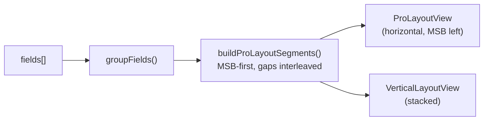
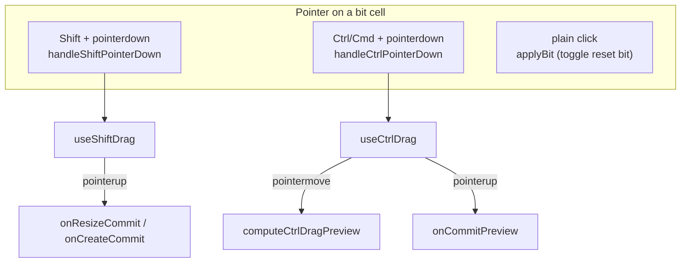
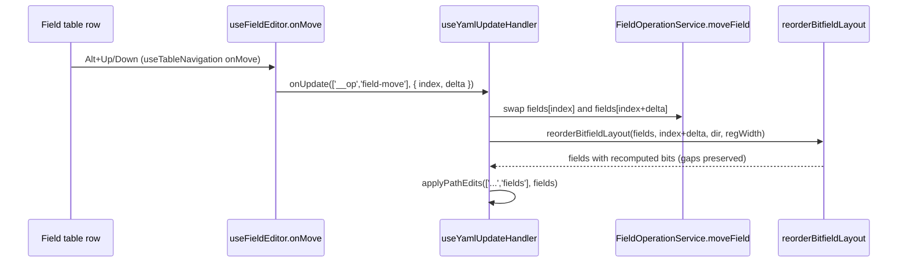
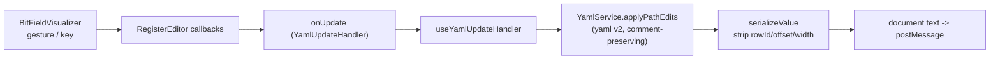

# Bit Field Handling

How the Memory Map editor models, visualizes, and edits the bit fields of a
register: the offset model, the two visualizer layouts, the three direct-
manipulation gestures (Shift-drag, Ctrl-drag, click-to-toggle), keyboard
reorder/resize, inline table editing, and the path that commits every change
back to YAML.

This is a companion to [Spatial Editing](../concepts/spatial-editing.md)
(which covers *insertion*) and [Memory Layout Invariants](../refactor/memory_layout_invariants.md).

## Mental model

A register owns an ordered array of fields. Each field occupies a contiguous
run of bits described by a `bits` string in MSB-first datasheet notation:

```yaml
fields:
  - name: BUSY        # bits [0:0]
    bits: '[0:0]'
  - name: FIFO_LEVEL  # bits [15:4]  (a 3-bit gap at [3:1] is allowed)
    bits: '[15:4]'
  - name: FSM_STATE   # bits [18:16]
    bits: '[18:16]'
```

Two facts drive everything below:

1. **`bits` is the persisted source of truth.** Only `name`, `bits`, `access`,
   `resetValue`, `description` (and optional `enumeratedValues` /
   `monitorChangeOf`) are written to disk. The numeric `offset` / `width` /
   `bitRange` carried at runtime are *derived* and are stripped on serialize
   (`src/domain/serialize.ts`).
2. **Gaps are legitimate.** Unused bits between fields are preserved. Operations
   that move or reorder fields must keep gaps intact; only a handful of
   *structural* operations deliberately pack fields contiguously.

## Data shapes

| Type | File | Role |
|------|------|------|
| `bits` string `'[hi:lo]'` | persisted YAML | Canonical, MSB-first |
| `NormalizedField` | `src/domain/internal.types.ts` | Domain model; `offset` = LSB, `width` = bit count |
| `BitFieldRecord` | `src/webview/types/editor.d.ts` | Loose runtime shape used by table/editor code |
| `FieldModel` | `src/webview/components/BitFieldVisualizer.tsx` | Loose shape consumed by the visualizer; carries `bitRange: [hi, lo]` |
| `ProSegment` | `src/webview/components/bitfield/types.ts` | A `field` or a `gap` span: `{ start, end }` plus `idx`/`name`/`color` for fields |

`ProSegment` is the unit the visualizer and the drag/keyboard algorithms
operate on. A register's bit space is expressed as an MSB-first list of
segments that alternates fields and gaps and exactly tiles `[0, registerSize)`.

## Offset calculation and recalculation

### Parsing and formatting

A small set of pure helpers convert between the `bits` string and numeric
bounds. Prefer these over ad-hoc regexes.

| Function | File | Purpose |
|----------|------|---------|
| `parseBitsRange('[hi:lo]')` -> `[hi, lo]` | `src/webview/utils/BitFieldUtils.ts` | Strict bracketed parse |
| `parseBitsLike` / `parseBitsInput` | `BitFieldUtils.ts` / `shared/utils/fieldValidation.ts` | Tolerant parse (accepts `7:0` without brackets) |
| `formatBitsRange(hi, lo)` -> `'[hi:lo]'` | `BitFieldUtils.ts` | Build a `bits` string |
| `fieldToBitsString(field)` | `BitFieldUtils.ts` | Canonical string: prefers `offset`/`width`, falls back to `bits` |
| `parseBits` | `src/domain/parse.ts` | Import-time normalization of `bits` -> `{ offset, width }` |

`bitRange` is always `[msb, lsb]` (high first); `offset` is the LSB; `width` is
`msb - lsb + 1`. The visualizer's `getFieldRange` (in
`src/webview/components/bitfield/utils.ts`) normalizes any field into
`{ lo, hi }` regardless of which of these properties are present.

### Two repack strategies

There are two distinct ways bit positions get recomputed, and choosing the
wrong one is a real source of bugs.

| Strategy | Function | File | Keeps gaps? | Used by |
|----------|----------|------|-------------|---------|
| **Contiguous pack** | `recomputeBitfieldLayout` | `src/webview/algorithms/LayoutEngine.ts` | No -- packs from bit 0 with no gaps | Structural register-array writes (insert/delete) via `recomputeFullLayout` |
| **Gap-preserving swap** | `reorderBitfieldLayout` | `LayoutEngine.ts` | Yes | Field reorder from the table (Alt+Up/Down) |
| **Segment repack** | `repackSegments` | `bitfield/utils.ts` | Yes -- gap segments are repacked too | Visualizer Ctrl-drag and Alt+Arrow reorder |

`recomputeBitfieldLayout` walks the array in order (index 0 = LSB) and stamps
each field directly above the previous one, collapsing any gaps. It is correct
only when the intent is to compact the register.

`reorderBitfieldLayout` is the gap-preserving counterpart: it rebuilds the
MSB-first segment list (including gap segments) from the fields' *current*
bits, swaps the moved field with its adjacent segment, repacks from the LSB,
and writes the new `bits`/`offset`/`width`/`bitRange` back onto only the field
entries. If the moved index cannot be located it falls back to
`recomputeBitfieldLayout`.

`repackSegments` is the visualizer-side primitive: it reverses the MSB-first
segment list to LSB order, assigns each segment a contiguous `[lo, hi]` from
bit 0, and reverses back. Because gap segments are part of the list, gaps are
preserved through the operation.

## Visualization

`BitFieldVisualizer` builds the segment list once and renders one of two
layouts. The shared entry point:

```ts
const segments =
  ctrlDrag.active && ctrlDrag.previewSegments
    ? ctrlDrag.previewSegments                       // live preview while dragging
    : buildProLayoutSegments(fields, registerSize);  // steady state
```

`buildProLayoutSegments` (`bitfield/utils.ts`):

1. `groupFields` maps each field to `{ idx, start, end, name, color }`.
2. Sort fields MSB-first by their high bit.
3. Walk a cursor down from `registerSize - 1`, emitting a `gap` segment wherever
   the cursor sits above the next field, then the `field` segment.
4. Emit a trailing `gap` down to bit 0 if needed.



| Layout | File | Orientation | Chosen when |
|--------|------|-------------|-------------|
| `pro` | `bitfield/ProLayoutView.tsx` | Horizontal, MSB on the left (renders segments as-is) | Register layout is stacked |
| `vertical` | `bitfield/VerticalLayoutView.tsx` | Stacked rows (renders `segments` reversed) | Register layout is side-by-side |
| `default` | `bitfield/DefaultLayoutView.tsx` | Legacy grid | Not used by `RegisterEditor` |

`RegisterEditor` picks `vertical` for the side-by-side register layout and
`pro` otherwise (`src/webview/components/register/RegisterEditor.tsx`).

**Colors** are stable per field *name*, not per position, so a field keeps its
color when reordered. `getFieldColor` (`src/webview/shared/colors.ts`) hashes
the name into one of 32 palette entries.

**Per-bit cell styling** is centralized in
`bitfield/renderBitCellStyle.ts`, which resolves the field color, the
reset-bit ring (a set bit gets an inset ring), the drag in/out-of-range
opacity, and the cursor (`grab` while Ctrl is held, `grabbing` while dragging).

**Reset value editing**: clicking a bit cell toggles that bit of the owning
field's `resetValue` (`applyBit` -> `setBit` -> `onUpdateFieldReset`). The
`ValueBar` / `useValueEditing` let the user type a whole-register value that is
decomposed back onto each field (`applyRegisterValueToFields`, `extractBits`).

## Direct manipulation gestures

All three gestures share the same per-bit pointer handlers wired into every bit
cell of both layouts. Modifier state is tracked by two hooks so the UI can show
affordances (resize handles, grab cursor) before a drag starts.



### Shift-drag: resize an existing field, or create a new one

Hook: `bitfield/useShiftDrag.ts`. Pointer entry: `handleShiftPointerDown` in
`BitFieldVisualizer.tsx`.

- **On a field** -> `mode: 'resize'`. The grabbed edge is inferred from which
  half of the field was clicked; the opposite edge becomes the drag *anchor*.
  Travel is clamped to `[minBit, maxBit]` from
  `findResizeBoundary` (the neighbours on each side), so a resize can never
  overlap an adjacent field.
- **On a gap** -> `mode: 'create'`. The anchor is the clicked bit; bounds come
  from `findGapBoundaries` (the extent of the empty run).

`handleShiftPointerMove` updates `currentBit` (clamped). On `pointerup`
`useShiftDrag` commits: resize calls `onResizeCommit(fieldIndex, [hi, lo])`,
create calls `onCreateCommit([hi, lo])`. In `BitFieldVisualizer` these map to
`onUpdateFieldRange` and `onCreateField`. `pointercancel` / window blur cancel
without committing.

### Ctrl-drag: relocate a field

Hook: `bitfield/useCtrlDrag.ts`. Preview algorithm:
`bitfield/reorderAlgorithm.ts` `computeCtrlDragPreview`.

`handleCtrlPointerDown` starts a drag only if a field occupies the grabbed bit.
On each `pointermove`, `computeCtrlDragPreview`:

1. Removes the dragged segment and repacks the remainder.
2. Locates the target segment under the cursor.
3. Inserts the dragged field on the MSB or LSB side of a target *field* (which
   half the cursor is over), or splits a target *gap* around the dragged field.
4. `repackSegments` produces the final tiling and the `{ idx, range }` updates.

The preview segments are stored in `ctrlDrag.previewSegments` and rendered
live (the visualizer prefers them over the steady-state segments). On
`pointerup`, `onCommitPreview` converts the field segments to range updates and
commits them through `onBatchUpdateFields`; `onCancelPreview` clears the
preview. The commit is deferred one animation frame so React paints the final
arrangement before the drag state resets.

## Keyboard editing in the visualizer

Each field cell is focusable (`role="button"`, `tabIndex={0}`) and handles
modifier+arrow keys. Direction maps to the layout's orientation:

| Layout | Reorder | Resize |
|--------|---------|--------|
| `pro` (horizontal) | Alt+Left = toward MSB, Alt+Right = toward LSB | Shift+Left/Right grow/shrink the MSB or LSB edge |
| `vertical` (stacked) | Alt+Up = toward LSB, Alt+Down = toward MSB | Shift+Up/Down |

Both call into `bitfield/keyboardOperations.ts`:

- `getKeyboardReorderUpdates` -- builds segments, swaps the field with its
  adjacent segment, `repackSegments`, returns range updates. Gap-preserving.
  Committed via `onBatchUpdateFields`.
- `getKeyboardResizeRange` -- grows/shrinks one edge by a bit, bounded by
  `findResizeBoundary`; shrinks the far edge when already at the boundary.
  Committed via `onUpdateFieldRange`.

## Reorder from the field table (Alt+Up / Alt+Down)

This is a separate path from the visualizer reorder above, and the two must
stay behaviourally consistent.



`useFieldEditor.onMove` (and `moveSelectedField`) emit the `field-move`
operation. `useYamlUpdateHandler` applies it: `FieldOperationService.moveField`
swaps the two array entries, then `reorderBitfieldLayout` recomputes the bit
positions while preserving gaps, and the whole `fields` array is written back
in a single `applyPathEdits` pass.

> Historical note: this path previously called `recomputeBitfieldLayout`, which
> packs contiguously and silently consumed gaps -- e.g. moving `FSM_STATE`
> above `FIFO_LEVEL` produced `[3:1]` instead of `[6:4]`. Switching to
> `reorderBitfieldLayout` fixed it; see the regression tests in
> `LayoutEngine.test.ts`.

## Inline editing and renaming

The field table (`register/FieldsTable.tsx`, `register/FieldTableRow.tsx`,
state in `hooks/useFieldEditor.ts`) edits one cell at a time with a draft layer.

- **Renaming**: typing into the name cell updates a local `nameDrafts` entry and
  validates; a valid commit writes `onUpdate(['fields', index, 'name'], next)`.
  Field colors follow the name, so a rename recolors the field.
- **Editing `bits` directly**: the new value is validated
  (`validateBitsString`) and checked for register overflow against the other
  fields' widths. On a valid edit the field's `offset`/`width`/`bitRange` are
  recomputed (`parseBitsInput`) and **all fields below it cascade upward** so
  the layout stays non-overlapping, then the whole array is committed.
- **access / reset / description**: committed per-cell;
  `monitorChangeOf` is cleared when access changes away from a W1C type.

Row identity is preserved across reloads by `rowId` (UI-only, never persisted),
reconciled in `src/webview/utils/rowIdentity.ts`. See the data round-trip notes
in `CLAUDE.md`.

## Commit path (how an edit reaches disk)

Every gesture and edit ultimately routes through one of the visualizer
callbacks, which `RegisterEditor` implements, which call the `onUpdate`
(`YamlUpdateHandler`) chain.

| Visualizer callback | Meaning | RegisterEditor action |
|---------------------|---------|-----------------------|
| `onUpdateFieldRange(idx, [hi, lo])` | One field's range changed (resize, kbd resize) | Rewrite that field's `bits`/`offset`/`width` |
| `onBatchUpdateFields(updates)` | Many ranges changed (Ctrl-drag, kbd reorder) | Apply all, then re-sort fields by offset |
| `onCreateField({ bitRange, name })` | New field from a gap drag | Append with a unique name, sort by offset |
| `onUpdateFieldReset(idx, value)` | A reset bit toggled | Write `resetValue` |
| `onDragPreview(updates \| null)` | Transient Ctrl-drag preview | Update `dragPreviewRanges` only (no YAML write) |



`useYamlUpdateHandler` resolves the selection's register path, applies the
edit with `YamlService.applyPathEdits` (built on `yaml` v2 so comments and hex
literals survive), and the field's derived numeric properties are dropped by
`serializeValue` before the text is sent to the extension host. The
`field-move` op is special-cased there to run `reorderBitfieldLayout` before
writing.

## Implementation files

| File | Responsibility |
|------|----------------|
| `src/webview/components/BitFieldVisualizer.tsx` | Orchestrates pointer handlers, drag hooks, keyboard reorder/resize, commit callbacks |
| `src/webview/components/bitfield/ProLayoutView.tsx` | Horizontal layout + key handling |
| `src/webview/components/bitfield/VerticalLayoutView.tsx` | Stacked layout + key handling |
| `src/webview/components/bitfield/utils.ts` | `buildProLayoutSegments`, `repackSegments`, `getFieldRange`, boundary helpers |
| `src/webview/components/bitfield/useShiftDrag.ts` | Resize / create drag state machine |
| `src/webview/components/bitfield/useCtrlDrag.ts` | Relocate drag state machine |
| `src/webview/components/bitfield/reorderAlgorithm.ts` | `computeCtrlDragPreview` |
| `src/webview/components/bitfield/keyboardOperations.ts` | `getKeyboardReorderUpdates`, `getKeyboardResizeRange` |
| `src/webview/components/bitfield/renderBitCellStyle.ts` | Per-bit cell styling |
| `src/webview/algorithms/LayoutEngine.ts` | `recomputeBitfieldLayout` (contiguous), `reorderBitfieldLayout` (gap-preserving) |
| `src/webview/utils/BitFieldUtils.ts` | bits string parse/format |
| `src/webview/shared/utils/fieldValidation.ts` | `validateBitsString`, `parseBitsInput`, reset validation |
| `src/webview/hooks/useFieldEditor.ts` | Table editing state, drafts, `onMove`, insertion |
| `src/webview/components/register/FieldTableRow.tsx` | Per-cell inline editors and cascade-on-bits-edit |
| `src/webview/hooks/useYamlUpdateHandler.ts` | Applies edits and the `field-move` op to YAML |
| `src/domain/parse.ts` / `src/domain/serialize.ts` | bits <-> offset/width on the process boundary |
| `src/webview/shared/colors.ts` | Stable per-name field colors |

## Testing

| Test file | Covers |
|-----------|--------|
| `src/test/suite/algorithms/LayoutEngine.test.ts` | `recomputeBitfieldLayout` packing; `reorderBitfieldLayout` gap-preserving swaps (incl. the FSM_STATE/FIFO_LEVEL regression) |
| `src/test/suite/algorithms/BitFieldRepacker.test.ts` | Forward/backward repacking for insertion |
| `src/test/suite/services/FieldOperationService.test.ts` | `field-move` array mutation |
| `src/test/suite/hooks/useFieldEditor.test.ts` | Table reorder/insert, draft handling |
| `src/test/suite/services/SpatialInsertionService.test.ts` | Field/register/block insertion pipeline |
</content>
