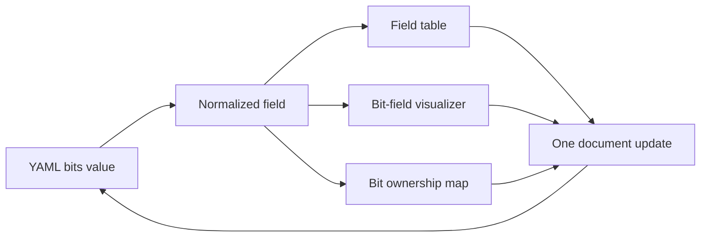
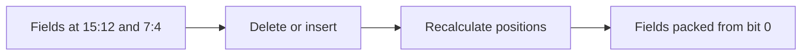
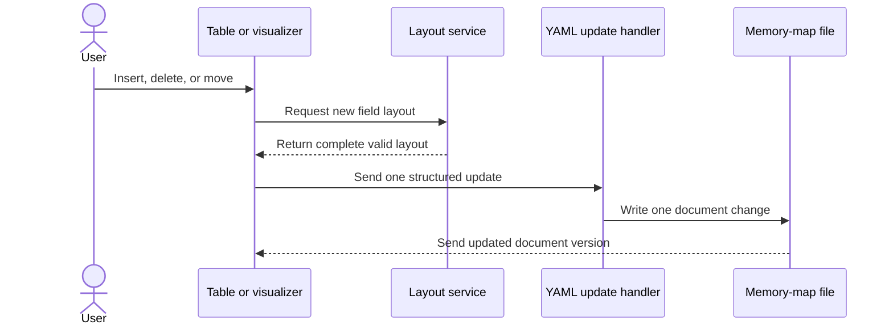

# Bit Field Handling

This page explains how IPCraft stores, displays, moves, and saves register bit
fields. It is intended for contributors changing the Memory Map editor.

For keyboard commands and function names, see the
[bit field interaction reference](../reference/bitfield-interaction.md).

## Core rule

The `bits` value in the memory-map document is the saved source of truth. For
example, `"7:4"` means a four-bit field covering bits 7 through 4.

The editor derives three temporary views from that value:

- table rows for editing names, access, reset values, and positions;
- visual segments for drawing the register;
- a bit-ownership array for pointer interactions.

Temporary row IDs, selected cells, and unfinished text edits are editor state.
They must never be written to YAML.



## Main modules

| Responsibility | Main module |
|---|---|
| Calculate positions | `src/webview/algorithms/LayoutEngine.ts` |
| Insert into free space | `src/webview/services/SpatialInsertionService.ts` |
| Apply field operations | `src/webview/services/FieldOperationService.ts` |
| Edit field rows | `src/webview/hooks/useFieldEditor.ts` |
| Draw fields and gaps | `src/webview/components/bitfield/` |
| Commit YAML changes | `src/webview/hooks/useYamlUpdateHandler.ts` |
| Preserve row identity | `src/webview/utils/rowIdentity.ts` |

Keep position calculations in `LayoutEngine.ts`. Components and hooks should
request a layout change, not calculate one themselves.

## Two layout operations

IPCraft deliberately uses two different rules.

### Insert or delete: close all gaps

`recomputeBitfieldLayout(fields, regWidth)` places fields next to each other
from bit 0 upward. It is used after a structural change such as insertion or
deletion.



### Move: keep existing gaps

`reorderBitfieldLayout(fields, movedIdx, direction, regWidth)` swaps a field
with the next field in the requested direction. Empty space between fields is
kept.

This makes a move predictable: the chosen field changes place, but unrelated
parts of the register do not shift.

## Field order

The field array is stored from the highest bit to the lowest bit. The table and
visualizer use the same order.

After an operation:

1. every field must remain inside the register width;
2. fields must not overlap;
3. array order must match bit order;
4. saved `bits` values must match the displayed positions.

Reject an invalid change before writing it to the document.

## Insert, delete, and move



A structural gesture must result in one document update. Do not send one update
for the array change and another for recalculated positions. Two updates can be
processed against different document versions and leave the file inconsistent.

Field moves use the special path `['__op', 'field-move']`. The update handler
passes that operation to `FieldOperationService`, which calls the layout
engine and writes the complete result.

## Editing the Bits cell

The Bits cell accepts either a single bit such as `3` or a range such as
`7:4`. While the user types, the editor keeps a draft string so incomplete
input is not immediately written to YAML.

The cell follows these rules:

- valid committed input updates the field and any affected neighbors;
- invalid or overlapping input is rejected;
- Escape restores the value from the document;
- an external document update replaces a stale draft, even while focused;
- the displayed range always follows the normalized field value.

Direct position edits may move neighboring fields to keep the layout valid.
The change follows array order and remains within the current register.

## Selection after an operation

Selection uses the field's stable `rowId`, not its old array index. This lets
focus follow a field after rows are reordered.

Keyboard and mouse insertion have different focus behavior:

- keyboard insertion selects the new row but keeps focus at table level;
- mouse insertion selects the row and opens the first editable cell.

Calling `focusCellEditor` after keyboard insertion makes later table shortcuts
look like text input. Keep the two paths separate.

## Document synchronization

Every edit includes the document version it was based on. The extension rejects
an edit based on an older version and sends the current document back to the
webview.

The webview also ignores echoes of its own completed edits. This prevents an
older render from replacing a newer local state.

The paired implementation is in:

- `src/services/WebviewRouter.ts` on the extension side;
- `src/webview/sync/revisionFilter.ts` on the webview side.

Change and test these two modules together.

## Design decisions

### Saved positions remain authoritative

Positions are part of the memory-map format and affect generated hardware.
They cannot be reconstructed from row order alone because valid documents may
contain gaps.

### Layout calculations are pure

The layout engine receives fields and returns fields. It does not access React,
VS Code, or the file system. This makes the rules easier to test.

### Commits are atomic

One gesture produces one complete document change. This protects the revision
protocol and makes undo behave as the user expects.

### Row identity is not document data

`rowId` exists only to keep React rows stable. Serialization removes it along
with other editor-only properties.

## Tests to run

Changes to bit-field behavior should cover:

- layout calculations and boundary cases;
- insertion into gaps and full registers;
- move behavior with and without gaps;
- direct Bits-cell edits and invalid drafts;
- keyboard and pointer focus behavior;
- serialization without `rowId` or other editor-only values;
- stale update and echo filtering.

Run the focused Jest test first, then the complete unit suite and browser tests:

```bash
npm test
npm run compile
npm run test:browser
```
