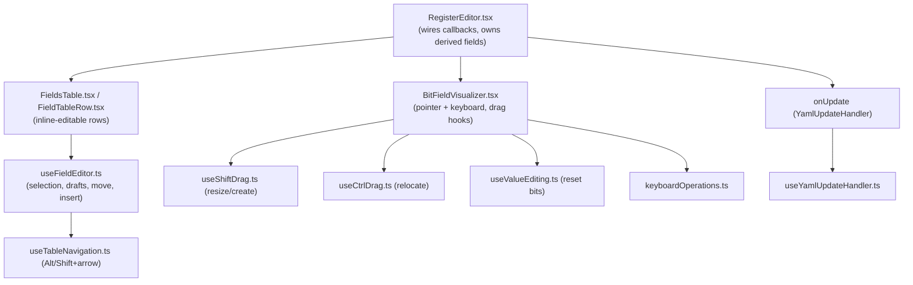
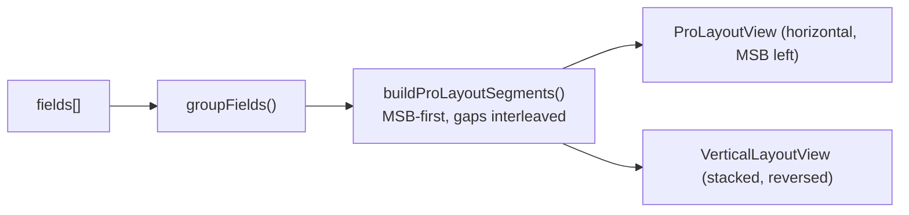
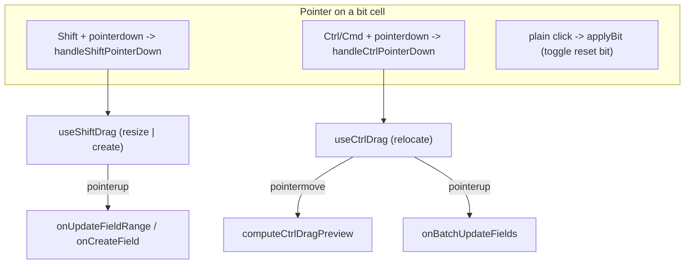
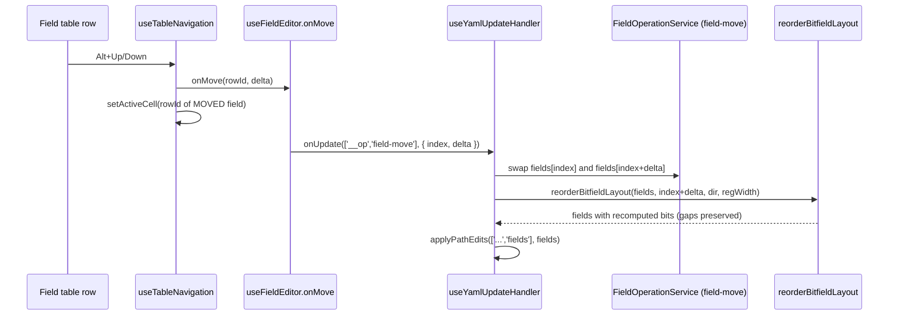

# Bit Field Handling

The "how" and "where" of bit-field editing: the components involved, how a
gesture or keystroke becomes a layout change, how that change reaches disk, and
the design decisions that shape the code. It also covers the structural
insertion path shared with registers and address blocks.

Read [Spatial Editing](../concepts/spatial-editing.md) first for the mental
model. For exact shortcuts, callback contracts, and function signatures, use the
[Bit Field Interaction Reference](../reference/bitfield-interaction.md). For the
layout rules registers and blocks obey, see
[Memory Layout Invariants](../refactor/memory_layout_invariants.md).

## Where the data lives

A register owns an ordered array of fields. Each field is persisted as a `bits`
string in MSB-first notation; the numeric position properties are added at
runtime and stripped on save.

```yaml
fields:
  - name: BUSY        # bits [0:0]
    bits: '[0:0]'
  - name: FIFO_LEVEL  # bits [15:4]  (a 3-bit gap at [3:1] is preserved)
    bits: '[15:4]'
  - name: FSM_STATE   # bits [18:16]
    bits: '[18:16]'
```

| Type | File | Role |
|------|------|------|
| `bits` string `'[hi:lo]'` | persisted YAML | Canonical, MSB-first source of truth |
| `NormalizedField` | `src/domain/internal.types.ts` | Domain model; `offset` = LSB, `width` = bit count |
| `BitFieldRecord` | `src/webview/types/editor.d.ts` | Loose runtime shape used by table/editor code |
| `FieldModel` | `src/webview/components/BitFieldVisualizer.tsx` | Loose shape consumed by the visualizer; carries `bitRange: [hi, lo]` |
| `ProSegment` | `src/webview/components/bitfield/types.ts` | Tagged union: `{ type: 'field', idx, start, end, name, color }` or `{ type: 'gap', start, end }` |

`bitRange` is always `[msb, lsb]`; `offset` is the LSB; `width` is
`msb - lsb + 1`. `getFieldRange` (`bitfield/utils.ts`) normalizes any field into
`{ lo, hi }` regardless of which of these properties are present.

`ProSegment` is the unit the visualizer and the drag/keyboard algorithms operate
on. A register's bit space is an MSB-first list of segments that alternates
fields and gaps and exactly tiles `[0, registerSize)`.

## Component map



| File | Responsibility |
|------|----------------|
| `src/webview/components/register/RegisterEditor.tsx` | Wires visualizer + table callbacks; computes derived `bitRange`; sorts by offset |
| `src/webview/components/BitFieldVisualizer.tsx` | Orchestrates pointer handlers, drag hooks, keyboard reorder/resize, reset toggling, commit callbacks |
| `src/webview/components/bitfield/ProLayoutView.tsx` | Horizontal layout (MSB left) + key handling |
| `src/webview/components/bitfield/VerticalLayoutView.tsx` | Stacked layout + key handling |
| `src/webview/components/bitfield/DefaultLayoutView.tsx` | Legacy grid; the `default` branch, not selected by `RegisterEditor` |
| `src/webview/components/bitfield/utils.ts` | `buildProLayoutSegments`, `repackSegments`, `getFieldRange`, `buildBitOwnerArray`, boundary + value helpers |
| `src/webview/components/bitfield/useShiftDrag.ts` | Resize / create drag state machine |
| `src/webview/components/bitfield/useCtrlDrag.ts` | Relocate drag state machine |
| `src/webview/components/bitfield/useValueEditing.ts` | Whole-register value entry state machine |
| `src/webview/components/bitfield/reorderAlgorithm.ts` | `computeCtrlDragPreview` |
| `src/webview/components/bitfield/keyboardOperations.ts` | `getKeyboardReorderUpdates`, `getKeyboardResizeRange` |
| `src/webview/components/bitfield/renderBitCellStyle.ts` | Per-bit cell styling |
| `src/webview/components/register/FieldTableRow.tsx` | Per-cell inline editors; cascade-on-bits-edit |
| `src/webview/hooks/useFieldEditor.ts` | Table editing state, drafts, `onMove`, insertion |
| `src/webview/hooks/useFieldDrafts.ts` | Draft maps keyed by `rowId` |
| `src/webview/hooks/useTableNavigation.ts` | Arrow navigation, Alt+arrow move, Shift handling |
| `src/webview/algorithms/LayoutEngine.ts` | `recomputeBitfieldLayout` (compact), `reorderBitfieldLayout` (gap-preserving) |
| `src/webview/services/FieldOperationService.ts` | `applyFieldOperation` (`field-move` array swap, add, delete) |
| `src/webview/hooks/useYamlUpdateHandler.ts` | Applies edits and the `field-move` op to YAML |
| `src/webview/utils/BitFieldUtils.ts` | bits string parse/format |
| `src/webview/shared/utils/fieldValidation.ts` | `validateBitsString`, `parseBitsInput`, reset validation |
| `src/webview/utils/rowIdentity.ts` | `reconcileRowIds` -- stable UI row identity |
| `src/domain/parse.ts` / `src/domain/serialize.ts` | bits <-> offset/width on the process boundary |
| `src/webview/shared/colors.ts` | Stable per-name field colors |

## How positions are recomputed

There are three places bit positions get recomputed. Picking the wrong one is a
real source of bugs (see ADR-2).

| Strategy | Function | File | Keeps gaps? | Used by |
|----------|----------|------|-------------|---------|
| **Compact pack** | `recomputeBitfieldLayout` | `LayoutEngine.ts` | No -- packs from bit 0 | Structural register-array writes (insert/delete) via `recomputeFullLayout` |
| **Gap-preserving swap** | `reorderBitfieldLayout` | `LayoutEngine.ts` | Yes | Field reorder from the table (Alt+Up/Down) |
| **Segment repack** | `repackSegments` | `bitfield/utils.ts` | Yes (gap segments repacked too) | Visualizer Ctrl-drag and Alt+arrow reorder |

- **`recomputeBitfieldLayout`** walks the array in order (index 0 = LSB) and
  stamps each field directly above the previous one, collapsing gaps. Correct
  only when the intent is to compact.
- **`reorderBitfieldLayout`** rebuilds the MSB-first segment list (including gap
  segments) from the fields' *current* bits, finds the moved field's segment,
  then **steps over any gap segments to land on the next field segment** and
  swaps the two. It repacks from the LSB and writes new
  `bits`/`offset`/`width`/`bitRange` back onto only the field entries. If the
  moved index cannot be located it falls back to `recomputeBitfieldLayout`. The
  gap-skipping step is what makes a swap correct even when the two fields are not
  adjacent in bit space (see ADR-3).
- **`repackSegments`** reverses the MSB-first segment list to LSB order, assigns
  each segment a contiguous `[lo, hi]` from bit 0, and reverses back. Because gap
  segments are part of the list, gaps survive.

## Visualization

`BitFieldVisualizer` builds the segment list once and renders one of two layouts:

```ts
const segments =
  ctrlDrag.active && ctrlDrag.previewSegments
    ? ctrlDrag.previewSegments                       // live preview while dragging
    : buildProLayoutSegments(fields, registerSize);  // steady state
```

`buildProLayoutSegments` (`bitfield/utils.ts`):

1. `groupFields` maps each field to `{ idx, start, end, name, color }`.
2. Sort fields MSB-first by their high bit.
3. Walk a cursor down from `registerSize - 1`, emitting a `gap` segment wherever
   the cursor sits above the next field, then the `field` segment.
4. Emit a trailing `gap` down to bit 0 if needed.



| Layout | File | Orientation | Chosen when |
|--------|------|-------------|-------------|
| `pro` | `ProLayoutView.tsx` | Horizontal, MSB on the left | Register layout is stacked |
| `vertical` | `VerticalLayoutView.tsx` | Stacked rows (segments reversed) | Register layout is side-by-side |
| `default` | `DefaultLayoutView.tsx` | Legacy grid | Fallback branch; not selected by `RegisterEditor` |

`RegisterEditor` picks `vertical` for the side-by-side register layout and `pro`
otherwise.

A per-bit ownership array, `buildBitOwnerArray(fields, registerSize)`
(`owners[bit] = fieldIndex | null`), drives hit testing, resize-boundary
calculation, and gap detection in the layout views.

**Colors** are stable per field *name*, not per position, so a field keeps its
color when reordered. `getFieldColor` (`shared/colors.ts`) hashes the name into
one of 32 palette entries. **Per-bit cell styling** is centralized in
`renderBitCellStyle.ts` (field color, reset-bit ring, drag in/out-of-range
opacity, grab/grabbing cursor).

## Gestures and keyboard (structure)

All three pointer gestures share the per-bit handlers wired into every cell of
both layouts. Modifier state is tracked so the UI can show affordances before a
drag begins.



- **Shift-drag** (`useShiftDrag.ts`): on a field it resizes (the grabbed edge is
  inferred from the clicked half; the opposite edge anchors; travel is clamped by
  `findResizeBoundary` so it cannot overlap a neighbour). On a gap it creates a
  new field bounded by `findGapBoundaries`.
- **Ctrl-drag** (`useCtrlDrag.ts` + `reorderAlgorithm.ts`): relocates a field.
  `computeCtrlDragPreview` removes the dragged segment, repacks the rest, finds
  the target under the cursor, inserts the field on the MSB/LSB side of a target
  field or splits a target gap, then `repackSegments` produces the final tiling.
  Preview segments render live; the commit is deferred one animation frame so
  React paints the final arrangement before drag state resets (see ADR-4).
- **Keyboard in the visualizer** (`keyboardOperations.ts`): `Alt+arrow` reorders
  (`getKeyboardReorderUpdates` -> `repackSegments`), `Shift+arrow` resizes
  (`getKeyboardResizeRange`). Direction maps to layout orientation -- see the
  reference for the full shortcut table.

Reset value editing: clicking a bit toggles that bit of the owning field's
`resetValue` (`applyBit` -> `setBit` -> `onUpdateFieldReset`). `useValueEditing` /
`ValueBar` let the user type a whole-register value, decomposed back onto each
field via `applyRegisterValueToFields`.

## Reorder from the field table (Alt+Up / Alt+Down)

This is a **separate path** from the visualizer reorder, and the two must stay
behaviourally consistent (see ADR-2).



`useFieldEditor.onMove` (and the button-driven `moveSelectedField`) emit the
`field-move` operation and clear drafts -- nothing else.
`useYamlUpdateHandler` applies it: `FieldOperationService` swaps the two array
entries, `reorderBitfieldLayout` recomputes bit positions while preserving gaps,
and the whole array is written back in one `applyPathEdits` pass.

Focus follows the moved field, not its displaced neighbour: `useTableNavigation`
sets the active cell to the *moved* field's `rowId` immediately, and
`reconcileRowIds` re-matches that `rowId` to the field's new array index after
the document round-trips (see ADR-5).

## Inline editing and renaming

The field table (`FieldsTable.tsx`, `FieldTableRow.tsx`, state in
`useFieldEditor.ts`) edits one cell at a time with a draft layer keyed by
`rowId` (`useFieldDrafts.ts`).

- **Rename**: typing updates a local `nameDrafts[rowId]` entry and validates; a
  valid commit writes `onUpdate(['fields', index, 'name'], next)`. Colors follow
  the name, so a rename recolors the field.
- **Edit `bits` directly**: validated (`validateBitsString`) and checked for
  register overflow against the other fields. On a valid edit the field's
  `offset`/`width`/`bitRange` are recomputed (`parseBitsInput`) and **fields
  below cascade upward** to stay non-overlapping; the whole array is committed.
- **access / reset / description**: committed per-cell; `monitorChangeOf` is
  cleared when access changes away from a W1C type.

Row identity is preserved across reloads by `rowId` (UI-only, never persisted),
reconciled in `rowIdentity.ts`.

## Commit path: how an edit reaches disk

Every gesture and edit routes through a `RegisterEditor` callback, then the
`onUpdate` chain.

| Visualizer callback | Meaning | RegisterEditor action |
|---------------------|---------|-----------------------|
| `onUpdateFieldRange(idx, [hi, lo])` | One field's range changed (resize, kbd resize) | Rewrite that field's `bits`/`offset`/`width` |
| `onBatchUpdateFields(updates)` | Many ranges changed (Ctrl-drag, kbd reorder) | Apply all, re-sort by offset |
| `onCreateField({ bitRange, name })` | New field from a gap drag | Append with a unique name, sort by offset |
| `onUpdateFieldReset(idx, value)` | A reset bit toggled | Write `resetValue` |
| `onDragPreview(updates \| null)` | Transient Ctrl-drag preview | Update `dragPreviewRanges` only (no YAML write) |

```mermaid
graph LR
    V["BitFieldVisualizer<br/>gesture / key"] --> RE["RegisterEditor callbacks"]
    RE --> U["onUpdate (handleUpdateWithRepack)"]
    U --> H["useYamlUpdateHandler"]
    H --> PE["YamlService.applyPathEdits<br/>(yaml v2, comment-preserving)"]
    PE --> SER["serializeValue<br/>strip rowId/offset/width"]
    SER --> TXT["updateRawText"]
    TXT --> SY["useYamlSync.sendUpdate<br/>(revisioned V-3/V-4 protocol)"]
    SY --> EXT["postMessage -> extension DocumentManager"]
```



`useYamlUpdateHandler` resolves the selection's register path and applies the
edit with `YamlService.applyPathEdits` (built on `yaml` v2 so comments and hex
literals survive). The field's derived numeric properties are dropped by
`serializeValue` before the new text is staged locally (`updateRawText`) and sent
through `useYamlSync.sendUpdate`, which stamps the revisioned sync envelope. The
`field-move` op is special-cased in `useYamlUpdateHandler` to run
`reorderBitfieldLayout` before writing.

## Insertion architecture (shared with registers and blocks)

Field/register/block insertion runs the conceptual five-stage pipeline (see
[Spatial Editing](../concepts/spatial-editing.md)) through one service.

| File | Purpose |
|------|---------|
| `src/webview/services/SpatialInsertionService.ts` | Pure insertion pipeline; `insertField` / `insertRegister` / `insertBlock` (+ `*After` / `*Before`); returns `InsertionResult<T>` |
| `src/webview/algorithms/BitFieldRepacker.ts` | `repackFieldsForward` / `repackFieldsBackward` |
| `src/webview/algorithms/RegisterRepacker.ts` | `repackRegistersForward` / `repackRegistersBackward` |
| `src/webview/algorithms/AddressBlockRepacker.ts` | `repackBlocksForward` / `repackBlocksBackward` |

`useFieldEditor` triggers field insertion (`o` after, `O` before) via
`SpatialInsertionService.insertField('after' | 'before', ...)`; `BlockEditor`
does the same for registers and blocks. Each repacker preserves an entity's
width/size and shifts only its position, clamping to avoid negative offsets or
overflow.

Structural array writes (insert/delete/reorder at the register or block level)
are funnelled through `handleUpdateWithRepack` in `src/webview/index.tsx`, which
applies the structural edit, the layout repack (`recomputeRegisterLayout`), and
schema sanitization in a **single** `applyPathEdits` pass -- two back-to-back
updates can corrupt the file if the second races the first in the extension host
(see ADR-4).

## Design decisions

### ADR-1: `bits` is the persisted source of truth

Only `name`, `bits`, `access`, `resetValue`, `description` (and optional
`enumeratedValues` / `monitorChangeOf`) are written. `offset` / `width` /
`bitRange` are derived at runtime and stripped by `serialize.ts`.

**Why:** one authoritative representation in datasheet notation; the file stays
minimal and the layout can always be recomputed from notation alone. No risk of
`offset` and `bits` drifting out of sync on disk.

### ADR-2: two repack strategies, deliberately separate

Rearranging operations preserve gaps (`reorderBitfieldLayout`,
`repackSegments`); structural compaction removes them
(`recomputeBitfieldLayout`).

**Why:** reserved-bit gaps are meaningful and must survive a reorder. A single
"always compact" routine silently consumed gaps -- moving `FSM_STATE` above
`FIFO_LEVEL` produced `[3:1]` instead of `[6:4]`. The table reorder path now uses
`reorderBitfieldLayout`; regression tests live in `LayoutEngine.test.ts`. The
visualizer and table reorder paths are distinct code and must stay behaviourally
consistent.

### ADR-3: reorder swaps fields, skipping intervening gaps

`reorderBitfieldLayout` steps over gap segments to swap the moved field with the
next *field*, not with an adjacent gap.

**Why:** when two fields have a gap between them (e.g. `FIFO_LEVEL [15:4]` and
`BUSY [0:0]` with a hole at `[3:1]`), swapping with the immediately adjacent
segment would swap a field *with a gap* and leave the other field untouched.
Skipping gaps makes a one-step reorder always exchange two fields, regardless of
the holes between them.

### ADR-4: atomic, single-pass commits

Ctrl-drag and keyboard reorder commit via `onBatchUpdateFields` (one update),
and structural array writes go through `handleUpdateWithRepack` (one
`applyPathEdits`). The Ctrl-drag commit is also deferred one animation frame.

**Why:** sequential per-field updates pass through transient overlapping states,
and two updates racing in the extension host can corrupt the document. One
atomic write per gesture avoids both.

### ADR-5: focus follows the moved field

On Alt+arrow, `useTableNavigation` sets the active cell to the moved field's
`rowId` (not the displaced neighbour's), and `useFieldEditor.onMove` no longer
re-selects a row by index after the move.

**Why:** the user's logical cursor is the field they are moving. Selecting by
index pointed at whatever field now sat at the old slot. A deferred
`selectRow(next)` call also reintroduced this bug via a stale `rows` closure, so
it was removed; identity-based (`rowId`) selection plus `reconcileRowIds` keeps
focus on the moved field at its new index. Covered by `useTableNavigation.test.tsx`.

## Testing

| Test file | Covers |
|-----------|--------|
| `src/test/suite/algorithms/LayoutEngine.test.ts` | `recomputeBitfieldLayout` packing; `reorderBitfieldLayout` gap-preserving + gap-skipping swaps (FSM_STATE/FIFO_LEVEL and FIFO_LEVEL/BUSY regressions) |
| `src/test/suite/algorithms/BitFieldRepacker.test.ts` | Forward/backward field repacking |
| `src/test/suite/algorithms/RegisterRepacker.test.ts` | Register repacking |
| `src/test/suite/algorithms/AddressBlockRepacker.test.ts` | Block repacking |
| `src/test/suite/services/FieldOperationService.test.ts` | `field-move` array mutation |
| `src/test/suite/services/SpatialInsertionService.test.ts` | Field/register/block insertion pipeline |
| `src/test/suite/hooks/useFieldEditor.test.ts` | Table reorder/insert, draft handling |
| `src/test/suite/hooks/useTableNavigation.test.tsx` | Arrow navigation, Alt+arrow move, focus-follows-field |
