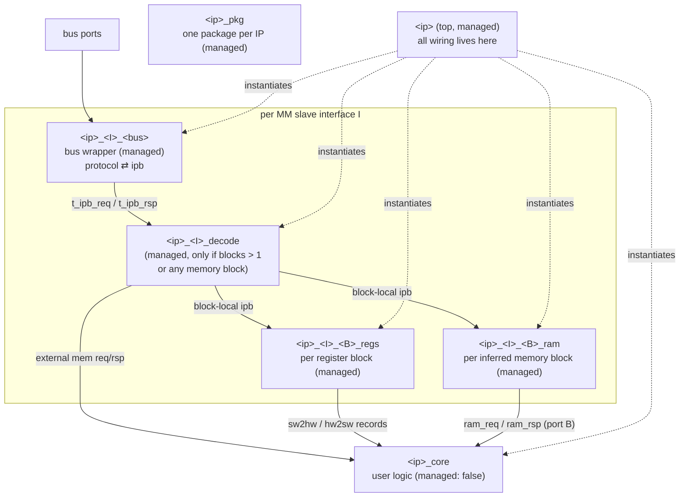

# Code Generation for Multiple Memory-Mapped Interfaces

**Status: concept / design document.** Nothing described here is implemented yet; section 11 lays out the phased implementation plan.

Related documents: [Architecture Overview](overview.md), [Memory Layout Invariants](../refactor/memory_layout_invariants.md), [Scaffold Packs](../how-to/scaffold-packs.md).

## 1. Purpose

This document specifies the next evolution of the bahonavi generation methodology: producing VHDL, SystemVerilog, `component.xml` (IP-XACT for Vivado), and `hw.tcl` (Quartus Platform Designer) for IP cores with

- **N memory-mapped slave interfaces**, each bound to its own memory map,
- **M address blocks** per memory map,
- address blocks containing **registers, register arrays (count + stride), and RAM regions** (`usage: memory`),

while preserving the methodology's central promise: **users edit exactly one file (`<ip>_core`); every other generated file can be regenerated at any time, and growing the memory map never breaks user code.**

## 2. Requirements and design goals

| Goal | Meaning |
|---|---|
| Multi-interface | Each MM slave (`busInterfaces[].memoryMapRef`) gets its own wrapper, decode, and register/RAM subsystem |
| Multi-block | Address blocks become first-class generation units instead of being flattened away |
| RAM regions | `usage: memory` blocks generate inferred dual-port RAM or a core-facing memory port (per-block choice) |
| Regeneration safety | Regenerating after any memory-map or interface change is always safe; user logic is isolated behind record contracts |
| Degeneration | One interface with one register block produces the same file set and the same identifiers as today |
| Extensibility | A new bus protocol costs one wrapper template pair; a new vendor target costs one `Toolchain` implementation; users customize via scaffold packs without forking |

## 3. Where we are today

The current `builtin-bahonavi` pack ([scaffold.yml](../../src/generator/packs/builtin-bahonavi/scaffold.yml)) generates five RTL files: `<ip>_pkg`, `<ip>` (top), `<ip>_core`, `<ip>_<bus>` (wrapper), `<ip>_regs`. Known limitations this design removes:

1. **Single primary slave.** `registerProcessor.ts` selects one primary memory-mapped slave; its `bus_type` picks the single wrapper template `bus_{{ bus_type }}`. Secondary interfaces (AXI-Stream, conduit) are wired raw to the core. The per-interface `memoryMapRef` association introduced for the data model is ignored by the generator — all maps are merged into one flat register list.
2. **Flattening.** `prepareRegisters()` flattens register arrays and groups into prefixed scalar names (`NAME_0_`, `NAME_1_`, …). Address blocks disappear entirely from the generated RTL structure.
3. **Enum-position decode.** `register_file.vhdl.j2` decodes by declaration order (`t_reg_index'pos`, see `register_file.vhdl.j2:147,195`), not by the YAML offsets the layout engine so carefully maintains. `buildTemplateContext` pads `addr_width` to paper over the mismatch.
4. **Wrapper owns the regfile.** `bus_axil.vhdl.j2:124` instantiates `u_regs` inside the bus wrapper, coupling protocol translation to register storage.
5. **RAM regions ignored.** `usage: memory` exists in the schema and editor but produces nothing in RTL, `component.xml`, or `hw.tcl`.
6. **No IP-XACT memory maps.** `VivadoComponentXmlGenerator.ts` emits no `spirit:memoryMaps`; Vivado infers apertures from address-port widths.
7. **Hardcoded hw.tcl clocking.** `altera_hw_tcl.j2:54–115` declares a single `clk`/`reset` pair and hardcodes `associatedClock clk` for every interface — already incorrect for the `multi_interface_accelerator` example.
8. **Implicit core protection.** The core rule in `scaffold.yml` is not marked `managed: false`; protection currently relies on `fileSets` entries in the IP YAML.

## 4. Target architecture

### 4.1 Module taxonomy



Structural changes versus today:

- The register file instance moves **out of the bus wrapper into the top**. Wrappers become pure protocol translators (`bus ports ⇄ t_ipb_req/t_ipb_rsp`).
- A decoder appears per interface when its map has more than one block or any memory block. With one register block and no RAM the wrapper drives the regfile directly — no decoder file is emitted.
- **One package per IP.** All types live in `<ip>_pkg`, namespaced by interface/block name segments. This keeps the N=1 package name, requires no compile-order management, and makes collisions impossible. A future per-interface package split could be a pack option without changing any type name.

#### File ownership matrix

| File | managed | Notes |
|---|---|---|
| `<ip>_pkg`, top, wrappers, decoders, regfiles, RAMs | `true` | Regenerated every run; users never edit |
| `<ip>_core` | `false` (**made explicit in scaffold.yml**) | User-owned after first write |
| `gen/<ip>_core.ref.vhd` (new) | `true` | Always-fresh reference stub, excluded from file sets and compilation; users diff it to pick up new ports |
| `component.xml`, `hw.tcl`, XGUI, build scripts, testbench harness | `true` | As today |
| Testbench user test files (cocotb tests) | `false` | As today |

### 4.2 Naming scheme and the compat profile

The only identifiers user code touches are the package name, record type names, record member names, core entity port names, and the top entity name. These obey the additive-only promise, which **rules out count-based name collapsing**: going from one block to two must never rename `t_regs_sw2hw`.

Canonical names (always valid, used verbatim under the `canonical` profile):

| Thing | Canonical name |
|---|---|
| Field record per register | `t_<I>_<B>_reg_<reg>` |
| Register array type | `t_<I>_<B>_reg_<reg>_arr` = `array (0 to count-1) of t_<I>_<B>_reg_<reg>` |
| Block aggregates | `t_<I>_<B>_regs_sw2hw`, `t_<I>_<B>_regs_hw2sw` (+ `C_<I>_<B>_REGS_*_RESET`) |
| W1C pulse / CoS value | `t_<I>_<B>_reg_<reg>_pulse`, `…_val` (today's suffix conventions kept) |
| RAM port B records (inferred) | `t_<I>_<B>_ram_req`, `t_<I>_<B>_ram_rsp` |
| External memory records | reuse `t_ipb_req` / `t_ipb_rsp` on ports `<I>_<B>_mem_req/_rsp` |
| Core ports | `<I>_<B>_sw2hw : in …`, `<I>_<B>_hw2sw : out …`, `<I>_<B>_ram_req : out …`, … |
| Address constants | `C_<I>_ADDR_WIDTH`, `C_<I>_<B>_BASE`, `C_<I>_<B>_RANGE`, per-register `C_<I>_<B>_REG_<reg>_ADDR` |

**Compat profile** (the default; per-IP override `codegen.naming: compat | canonical`): segments are elided **by primacy, not by count**:

- the **first-declared** MM slave interface elides its `<I>_` segment everywhere;
- the **first-declared** register block of each interface elides its `<B>_` segment.

Because primacy is frozen by declaration order — never by how many interfaces or blocks exist — growth is purely additive: adding a second interface or block introduces new, fully-qualified names without touching the elided ones. N=1/M=1 therefore degenerates to exactly today's identifiers (`t_regs_sw2hw`, `C_REGS_SW2HW_RESET`, file set `<ip>_pkg.vhd`, `<ip>.vhd`, `<ip>_core.vhd`, `<ip>_axil.vhd`, `<ip>_regs.vhd`).

Two deliberate caveats:

1. **Reordering interfaces or blocks in the YAML is a breaking edit under the compat profile** (it moves the elision). The generator must emit a warning when the elided primary changes; a persisted `codegen.primary` hint is listed as an open question.
2. **Legacy core port spellings.** Today's core ports are `regs_in : in t_regs_sw2hw` / `regs_out : out t_regs_hw2sw` (`core.vhdl.j2:32–35`). The compat profile keeps these two spellings for the elided primary block only, so regenerated tops still bind to existing user cores. Everything else uses canonical `<I>_<B>_sw2hw` / `<I>_<B>_hw2sw`. This wart is contained and documented rather than fixed, to keep N=1 regeneration drop-in.

File and entity names use the same elision, so the `hdl.test.ts` suffix-rank compile ordering keeps working for existing fixtures; the rank function gains entries for `_decode` and `_ram` (between `_pkg` and `_core`).

### 4.3 Internal bus `ipb`

The wrapper⇄regfile seam already exists informally (`wr_en/wr_addr/wr_data/wr_strb` + `rd_en/rd_addr/rd_data/rd_valid` in `bus_axil.vhdl.j2`). It is formalized as two records in `<ip>_pkg` (SystemVerilog: packed structs in `<ip>_pkg.sv`):

```vhdl
constant C_DATA_WIDTH : natural := 32;
constant C_ADDR_WIDTH : natural := <max over interfaces>;

type t_ipb_req is record
  wr    : std_logic;                                   -- write request, held until wready
  rd    : std_logic;                                   -- read request, 1-cycle accept
  addr  : std_logic_vector(C_ADDR_WIDTH-1 downto 0);   -- byte address, interface-local
  wdata : std_logic_vector(C_DATA_WIDTH-1 downto 0);
  wstrb : std_logic_vector(C_DATA_WIDTH/8-1 downto 0);
end record;

type t_ipb_rsp is record
  rdata  : std_logic_vector(C_DATA_WIDTH-1 downto 0);
  rvalid : std_logic;  -- read completion, self-timed (>= 1 cycle after rd)
  wready : std_logic;  -- write acceptance (backpressure)
  error  : std_logic;  -- qualified by rvalid (reads) / wready (writes)
end record;
```

One record type is sized to the widest interface; decoders compare only `C_<I>_ADDR_WIDTH-1 downto 0`. This avoids VHDL-2008 unconstrained records (weak vendor synthesis support) and keeps the SV struct shape identical.

Transaction semantics:

| Responder | `wready` | `rvalid` | `error` |
|---|---|---|---|
| Register file | constant `'1'` | 1 cycle after `rd` (today's timing preserved) | `'0'` |
| Inferred RAM | constant `'1'` | `readLatency` cycles after `rd` | `'0'` |
| External memory (user core) | user-driven | user-driven | user-driven |
| Decoder default responder (unmapped/reserved) | `'1'` | 1 cycle after `rd` | `'1'`, `rdata = 0` |

- One outstanding transaction per interface; the AXI-Lite and Avalon-MM wrappers naturally serialize (today's wrapper already waits on `rd_valid`).
- Wrappers map `error` to AXI `SLVERR` / the Avalon `response` signal. Today's wrapper hardcodes `OKAY`; surfacing decode errors is an intentional, observable behavior change (section 10).
- Arbitrary read latency and write backpressure come for free from `rvalid`/`wready` self-timing — this is what lets external memory blocks have user-defined latency without touching any wrapper.

**Why this seam pays off:** a new bus protocol costs exactly one wrapper template pair (`bus_<type>.vhdl.j2` / `.sv.j2`) translating protocol ⇄ `t_ipb_req/rsp`, plus map entries (section 8). Decoder, register files, RAMs, package, and core are protocol-agnostic.

#### Decoder

`<ip>_<I>_decode` fans the interface request out by **range claim**: combinational block select from the high address bits against `C_<I>_<B>_BASE .. BASE+RANGE-1`, a registered block-select for response muxing, and the default error responder for unmapped addresses. Per-block requests are re-based to block-local byte addresses. Register blocks claim their declared range; RAM blocks always claim their full range (RAM is never per-register decoded).

#### Register file decode fix

Register files switch from enum-position decode to **offset constants** (`when C_<I>_<B>_REG_<reg>_ADDR`, byte offset within the block). `t_reg_index` is retired. This is a deliberate behavioral fix: the layout engine guarantees dense, explicit offsets (array position is the source of truth — see [memory layout invariants](../refactor/memory_layout_invariants.md)), and offset decode makes RTL agree with the YAML, the documentation, and `component.xml`.

### 4.4 Regeneration-safety invariants

Every template must obey these rules. They are the methodology's contract and should be enforced in template review and tests.

1. **Names from YAML only.** Member, type, port, and constant names derive from user-given names (lowercased, sanitized) — never from position or index.
2. **Named association everywhere.** Generated instantiations, port maps, and record aggregates use named association exclusively (`others =>` permitted only as a final default). Adding members can therefore never shift existing bindings.
3. **Additive evolution.** Adding registers, fields, blocks, or interfaces only adds members, types, and ports. Nothing existing is renamed or changes meaning. Member textual order is ascending address offset, then declaration order; mid-list insertion is safe because of rule 2.
4. **Arrays are arrays.** `count`/`stride` registers become an array-of-record type and a single member (`<reg> : t_…_arr`); register groups become a group record; group arrays are arrays of the group record. SystemVerilog uses unpacked arrays of packed structs (fallback: packed arrays, gated by the iverilog check — section 10).
5. **Every type has a reset constant** (`C_…_RESET`), built with named aggregates.
6. **Stable suffix vocabulary.** `_sw2hw`, `_hw2sw`, `_pulse`, `_val`, `_req`, `_rsp`, `_arr`, `_RESET` is the complete suffix set; never overloaded with other meanings.
7. **Core port granularity = interface × block.** One `sw2hw`/`hw2sw` pair per register block; one `ram_req`/`ram_rsp` or `mem_req`/`mem_rsp` pair per memory block. This keeps clock-domain association explicit (each interface may run on its own clock) and keeps growth additive.
8. **User-owned files are never rewritten.** Structural growth surfaces only as compile errors at the core entity boundary, with `gen/<ip>_core.ref.vhd` as the copy source.

#### How structural growth reaches user code

- *Adding a register or field to an existing block:* the block record gains a member. User core recompiles untouched (rule 2: it only names existing members).
- *Adding a block or interface:* the core entity needs new ports. Two modes, selected per IP via `codegen.coreStyle`:

| Mode | Behavior |
|---|---|
| `combined` (default — today's behavior) | Entity + architecture in one user-owned file. Regeneration skips it; the regenerated top references the new ports, producing a deliberate, localized compile error. The user copies the new port declarations from `gen/<ip>_core.ref.vhd`. Existing logic is never rewritten. |
| `split-entity` (opt-in, recommended for new projects) | Generator owns `<ip>_core_ent.vhd` (entity only, `managed: true`); the user owns only `architecture rtl of <ip>_core`. New input ports appear automatically; new unused output ports are legal VHDL (undriven). SV equivalent: a generated `<ip>_core_ports.svh` included in the user module's ANSI port list. Cannot be the default — existing combined user files would double-declare the entity. |

### 4.5 RAM regions

Schema extension on `AddressBlock` (in `ipcraft-spec/schemas/memory_map.schema.json`, mirrored into `src/webview/types/memoryMap.d.ts`):

```yaml
addressBlocks:
  - name: buf
    usage: memory
    baseAddress: 0x1000
    range: 4K
    memory:
      implementation: inferred   # inferred | external (default: inferred)
      readLatency: 1             # inferred only; 1 or 2 (2 = output register)
      init: zeros                # optional; future: hex file
```

**Inferred** — generated `<ip>_<I>_<B>_ram` is a true-dual-port, byte-write-enable, synchronous-read RAM (VHDL: shared-variable TDP idiom; SV: standard `always_ff` TDP idiom — both must pass the GHDL synth gate and be Vivado/Quartus inferable). No content reset. Port A is driven by the decoder (word-addressed; low two address bits dropped). Port B faces the core:

```vhdl
type t_<I>_<B>_ram_req is record
  en, we : std_logic;
  addr   : std_logic_vector(C_<I>_<B>_RAM_ADDR_WIDTH-1 downto 0);  -- word address
  wdata  : std_logic_vector(C_DATA_WIDTH-1 downto 0);
  wstrb  : std_logic_vector(C_DATA_WIDTH/8-1 downto 0);
end record;

type t_<I>_<B>_ram_rsp is record
  rdata : std_logic_vector(C_DATA_WIDTH-1 downto 0);  -- valid readLatency cycles after en
end record;
```

Core ports: `<I>_<B>_ram_req : out …`, `<I>_<B>_ram_rsp : in …`. Both ports default to the interface clock; an optional `memory.coreClock` selecting a different port-B clock (TDP RAM as CDC boundary) is an open question for phase 3.

**External** — no RAM entity is generated. The decoder's block-local request is exported through the core boundary as `<I>_<B>_mem_req : in t_ipb_req` / `<I>_<B>_mem_rsp : out t_ipb_rsp` (block-local byte address). The user supplies storage — BRAM, FIFO, register-backed window, external memory controller. Latency and backpressure are self-timed via `rvalid`/`wready`, so `readLatency` does not apply.

## 5. Generator architecture

### 5.1 Canonical template context

A new `prepareInterfaces()` (in `registerProcessor.ts` or a sibling `interfaceProcessor.ts`) builds the structured context; `buildTemplateContext` in `IpCoreScaffolder.ts` assembles:

```js
{
  name, entity_name, generics, user_ports, clocks_with_period, resets,
  data_width: 32,
  naming_profile: 'compat' | 'canonical',

  interfaces: [{
    name, hdl_name, if_seg,            // if_seg: '' for the elided primary, else '<i>_'
    bus_type, is_memory_mapped, mode, physical_prefix, ports,
    associated_clock, associated_reset,
    addr_width,                        // per interface, derived from its own map
    memory_map_name,
    has_decode,                        // blocks > 1 || any memory block
    blocks: [{
      name, hdl_name, blk_seg, usage, base_address, range_bytes, addr_width,
      registers, reg_groups,           // structured: array nodes keep count/stride
      sw_registers, hw_registers, w1c_registers, cos_registers,
      memory: { implementation, read_latency, words, ram_addr_width }
    }]
  }],

  mm_interfaces,                       // filtered: MM slaves only
  register_blocks,                     // flat: one entry per (interface, register block)
  inferred_ram_blocks, external_ram_blocks,

  // N=1 backward-compat aliases, populated from the primary slave / primary block:
  bus_type, bus_ports, bus_prefix, registers, sw_registers, hw_registers,
  w1c_registers, cos_registers, addr_width, has_memory_mapped_slave, includeRegs,
  secondary_bus_interfaces, expanded_bus_interfaces, /* …existing keys… */
}
```

The flat aliases keep every existing pack template, `condition:` expression, testbench generator, and toolchain template working unmodified for N=1 — and merely primary-only for N>1 until each consumer migrates. `prepareRegisters()` is retained to feed the aliases, so the legacy surface stays bit-identical during the transition.

### 5.2 Scaffold pack `foreach`

`ScaffoldFileRule` gains an optional `foreach: <context-key>`: the key must name an array in the context; the rule renders once per element, with the element's properties merged over the base context. Flat pre-computed collections (`mm_interfaces`, `register_blocks`, …) avoid any nested-loop syntax in `scaffold.yml`:

```yaml
- source: "bus_{{ bus_type }}.vhdl.j2"            # element's bus_type shadows the alias
  target: "rtl/{{ name }}_{{ if_seg }}{{ bus_type }}.vhd"
  foreach: "mm_interfaces"
  condition: "not is_systemverilog"

- source: "decode.vhdl.j2"
  target: "rtl/{{ name }}_{{ if_seg }}decode.vhd"
  foreach: "mm_interfaces"
  condition: "not is_systemverilog and has_decode"

- source: "register_file.vhdl.j2"
  target: "rtl/{{ name }}_{{ if_seg }}{{ blk_seg }}regs.vhd"
  foreach: "register_blocks"
  condition: "not is_systemverilog and includeRegs"

- source: "ram.vhdl.j2"
  target: "rtl/{{ name }}_{{ if_seg }}{{ blk_seg }}ram.vhd"
  foreach: "inferred_ram_blocks"
  condition: "not is_systemverilog"
```

Loader changes: `ScaffoldPackLoader` parses `foreach`; the rule loop in `IpCoreScaffolder.generateAll()` expands per element. Rules without `foreach` behave exactly as today, so existing workspace packs are unaffected. With `if_seg`/`blk_seg` empty under the compat profile, N=1/M=1 reproduces today's target paths exactly.

### 5.3 Template inventory

| Template | Change |
|---|---|
| `package.vhdl.j2` / `pkg.sv.j2` | Loop interfaces × blocks; emit ipb types, per-block records/constants, array types, RAM records |
| `top.vhdl.j2` / `top.sv.j2` | Instantiate wrappers, decoders, regfiles, RAMs, core; all named association; all inter-module wiring |
| `bus_axil.*.j2`, `bus_avmm.*.j2` | Drop internal `u_regs`; expose `ipb_req`/`ipb_rsp` ports |
| `register_file.*.j2` | Block-scoped; offset-constant decode; ipb req/rsp ports |
| `decode.*.j2` (new) | Range-claim fan-out, response mux, default error responder |
| `ram.*.j2` (new) | TDP byte-enable RAM, port A ipb, port B record |
| `core.*.j2` | Per-(interface × block) ports; also rendered to `gen/<ip>_core.ref.*` as managed reference stub |

## 6. Vendor packaging

### 6.1 component.xml (Vivado, IP-XACT 1685-2009)

Changes in `VivadoComponentXmlGenerator.ts`:

1. New `renderMemoryMaps()` emitting `<spirit:memoryMaps>`, placed **before** `<spirit:model>` (1685-2009 element sequence: busInterfaces → … → memoryMaps → model). One `spirit:memoryMap` per resolved memory map. Each `addressBlock` carries `name`, `baseAddress`, `range`, `width` (32), `usage` (`register` / `memory` / `reserved`), `access`; registers carry `addressOffset`, `size`, `access`, `reset`, and `field` children (`bitOffset` / `bitWidth` / `access`). Register arrays use `spirit:dim`. Register groups are flattened to expanded names — Vivado's support for 1685-2009 `registerFile` is uncertain, so flatten + `dim` is the baseline (open question).
2. In `renderBusInterface()`: MM slaves with a `memoryMapRef` emit `<spirit:slave><spirit:memoryMapRef spirit:memoryMapRef="…"/></spirit:slave>` instead of the bare `<spirit:slave/>`. Slaves without a ref fall back to the first map, mirroring the generator.
3. Plumbing: the scaffolder already resolves memory maps in `buildTemplateContext`; pass them through the toolchain `ScaffoldContext`.

Payoff: Vivado's Address Editor sees correct per-interface apertures from the declared maps instead of inferring them from `AWADDR` widths.

### 6.2 hw.tcl (Quartus Platform Designer)

Changes in `altera_hw_tcl.j2` plus small context additions in `QuartusToolchain.ts`:

1. Emit one clock interface and one reset interface **per declared clock/reset**, instead of the single hardcoded `clk`/`reset` pair.
2. `set_interface_property <if> associatedClock/associatedReset` from each interface's `associated_clock`/`associated_reset` (currently hardcoded at `altera_hw_tcl.j2:87–88`).
3. Each slave's address-port default width derives from its own map (`C_<I>_ADDR_WIDTH`). Explicit `portWidthOverrides` win; the generator warns if an override is smaller than the map requires.
4. For Avalon slaves keep `addressUnits WORDS`; maps containing memory blocks may optionally emit `set_interface_assignment <if> embeddedsw.configuration.isMemoryDevice 1`.

Platform Designer consumes only spans and interface properties — registers need no further reflection in `hw.tcl`. Exporting CMSIS-SVD for software headers is noted as future work.

## 7. Degeneration and migration

For one MM slave with one register block (the overwhelmingly common case today), output under the compat profile is unchanged:

| Aspect | Today | This design (N=1, M=1, compat) |
|---|---|---|
| Files | `<ip>_pkg`, `<ip>`, `<ip>_core`, `<ip>_axil`, `<ip>_regs` | identical (no decoder emitted) |
| Records | `t_regs_sw2hw` / `t_regs_hw2sw` | identical |
| Core ports | `regs_in` / `regs_out` | identical (frozen legacy spelling) |
| Regfile decode | enum position | **offset constants** (behavioral fix; same addresses for dense maps) |
| Bus error response | always `OKAY` | `SLVERR` on unmapped addresses (behavioral change, intentional) |
| Wrapper internals | instantiates `u_regs` | regfile instantiated in top (invisible to user code) |

Breaking changes to document in release notes:

1. **Register arrays.** Flattened `NAME_0_`, `NAME_1_` record members become a single array member of an array-of-record type. User cores indexing arrays must migrate (`regs_in.channel_2_ctrl.enable` → `regs_in.channel(2).ctrl.enable`). The compat profile cannot mask this; it is the price of a sane array contract.
2. **YAML reorder caveat.** Under the compat profile, reordering interfaces/blocks moves the elided segment — a breaking edit. The generator warns when the primary changes.
3. **Error responses.** Reads/writes to unmapped addresses now return an error instead of silently succeeding.

## 8. Extensibility guide

| Extension | Cost |
|---|---|
| New bus protocol | Bus definition YAML (bus library) + one wrapper template pair (`bus_<type>.vhdl.j2`/`.sv.j2`) translating to `t_ipb_req/rsp` + entries in `VLNV_BUS_NAME_MAP` / `MEMORY_MAPPED_TEMPLATE_TYPES` (`registerProcessor.ts`) and vendor type maps (`resolveVivadoBusType`, hw.tcl type mapping). Nothing else changes. |
| New vendor target | Implement the `Toolchain` interface (`src/services/toolchains/registry.ts`) consuming `interfaces[]` from the context. |
| Methodology variants | Workspace scaffold packs (`.vscode/ipcraft/packs/`) override any template via the pack-dir-first `TemplateLoader`; `foreach` is available to user packs. |

## 9. Testing strategy

- `hdl.test.ts`: extend the suffix-rank compile ordering and `topUnit()` regexes for `_decode` and `_ram`.
- New example fixtures under `ipcraft-spec/examples/`: `multi_if` (two MM slaves, distinct maps/clocks), `multi_block` (one slave, several blocks), `ram_inferred`, `ram_external`. Each compiles through the existing GHDL (VHDL) and iverilog/verilator (SV) gates in both languages.
- **GHDL synth gate for the TDP-RAM idiom** before committing the `ram.*.j2` templates; manual confirmation of BRAM inference in Vivado and Quartus.
- iverilog `-g2012` check for unpacked arrays of packed structs in ports; fall back to packed arrays if unsupported.
- Regeneration-safety test: generate, simulate a user edit to `<ip>_core`, grow the map (add register, add block, add interface), regenerate, assert the core file is untouched and that adding a register keeps the previously generated core compiling.

## 10. Open questions and risks

1. **Positional primacy.** Compat elision keys off declaration order; YAML reordering silently renames elided identifiers. Mitigation: generator warning; consider a persisted `codegen.primary` hint.
2. **Array contract break** for existing register-array users (section 7).
3. **iverilog struct-array support** for unpacked arrays of packed structs in ports may force the packed-array fallback.
4. **TDP byte-enable RAM inference** (shared-variable VHDL idiom) must be validated across GHDL synth, Vivado, and Quartus before the template is fixed.
5. **IP-XACT `registerFile`** (nested groups) support in Vivado is unverified; flatten + `dim` is the committed baseline.
6. **Multi-clock scope.** Each interface subsystem runs on its interface clock by design; RAM port-B clock selection (`memory.coreClock`, CDC) may be deferred past phase 3.
7. **Address width precedence.** Per-interface derived `addr_width` vs explicit `portWidthOverrides` (the `multi_interface_accelerator` example overrides `AWADDR` to 16) — explicit wins with a warning when too small.
8. **Error-response behavior change** (OKAY → SLVERR for unmapped addresses) is observable on the bus; intentional, but release notes must call it out.

## 11. Phased implementation plan

1. **Context restructure** — `prepareInterfaces()`, structured `interfaces[]` context, N=1 compat aliases, scaffold `foreach` (loader + scaffolder). No template changes; all existing output byte-identical.
2. **ipb + decoder + per-block regfiles** — formalize `t_ipb_req/rsp`, move regfile out of wrappers, new `decode.*.j2`, offset-constant decode, multi-interface/multi-block fixtures.
3. **RAM blocks** — schema `memory:` extension, `ram.*.j2` (inferred) and external mem ports, synth gates.
4. **Vendor packaging** — `renderMemoryMaps()` + `memoryMapRef` in component.xml; hw.tcl per-interface clocks/resets/spans.
5. **Core evolution** — `gen/<ip>_core.ref.*` stub, `codegen.coreStyle: split-entity`, regeneration-safety test.
