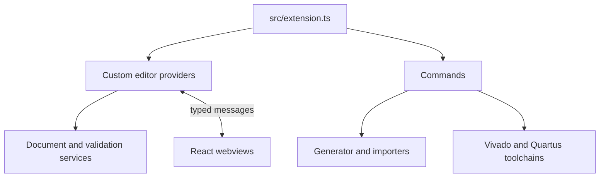
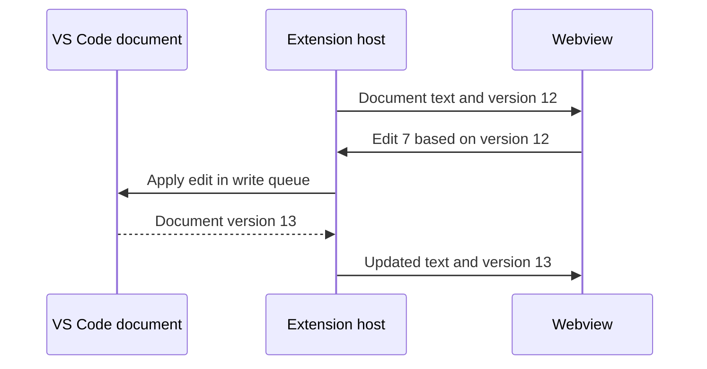
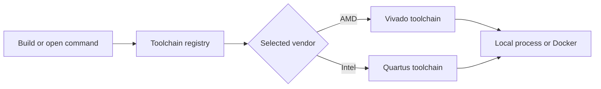

# Extension Host

The extension host is the Node.js side of IPCraft. It can read files, register
VS Code commands, start external tools, and create webviews. The webviews cannot
perform these privileged tasks directly.

## Responsibilities

`src/extension.ts` is the entry point. During activation it registers providers,
commands, views, and services with the extension context.

## Custom editors

| Document | Provider | Webview |
|---|---|---|
| `*.mm.yml` | `MemoryMapEditorProvider` | Memory Map editor |
| `*.ip.yml` | `IpCoreEditorProvider` | IP Core editor |

A provider creates the webview, sends the current document, receives edits, and
applies accepted changes through VS Code's document API.

The providers share these central services:

| Service | Plain-language role |
|---|---|
| `WebviewRouter` | Sends each incoming message to the matching handler |
| `DocumentManager` | Applies document writes in order and rejects edits based on old versions |
| `HtmlGenerator` | Creates secure webview HTML |
| `YamlValidator` | Checks documents against the IPCraft schemas |
| `ImportResolver` | Loads `$import` references in IP core files |
| `BusLibraryService` | Loads known interface definitions |

## Document revisions

Each document update has a version. Each webview edit states which document
version it was based on.

If the file changed after the webview's starting version, the host rejects the
stale edit and sends the current document back. This prevents two updates from
silently overwriting each other.

See [YAML data flow](../concepts/yaml-data-flow.md) for the paired webview logic.

## Commands

Command modules under `src/commands/` group the main workflows:

| Area | Examples |
|---|---|
| Create | Create IP core, memory map, or both |
| Generate | Generate RTL, tests, and vendor projects |
| Import | Read VHDL, Platform Designer, or IP-XACT files |
| Build | Run Vivado or Quartus and show reports |
| Open external tools | Open Vivado, IP Packager, Quartus, or Platform Designer |
| Maintain | Scan catalogs, migrate older files, switch editor mode |

The complete user-facing list is in the [commands reference](../reference/commands.md).

## Generation and imports

`src/generator/IpCoreScaffolder.ts` coordinates code generation. It validates
the source, prepares stable template data, renders the selected scaffold pack,
and asks vendor toolchains for their output.

Importers under `src/parser/` convert existing files into IPCraft documents:

- `VhdlParser.ts` and `VerilogParser.ts` read HDL modules;
- `HwTclParser.ts` reads Quartus component metadata;
- `ComponentXmlParser.ts` reads Vivado IP-XACT component metadata;
- `VivadoInterfaceXmlParser.ts` reads Vivado interface definitions for catalog
  discovery.

Import results still require user review because source formats do not always
contain design intent.

## External tools

Toolchains under `src/services/toolchains/` provide one interface for local and
Docker-based tools.

Commands ask the registry for a toolchain instead of reading installation
settings themselves. `BuildRunner` streams output, and `ReportParser` extracts
timing and size summaries for the Build view.

## Resource files

At activation, `ResourceRoots` locates templates, schemas, packs, and interface
definitions inside the installed extension. Edit their source locations, not
the copied files under `dist/`:

- templates: `src/generator/templates/`;
- packs: `src/generator/packs/`;
- schemas and bus definitions: `ipcraft-spec/`.
