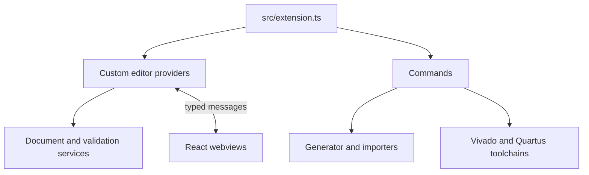
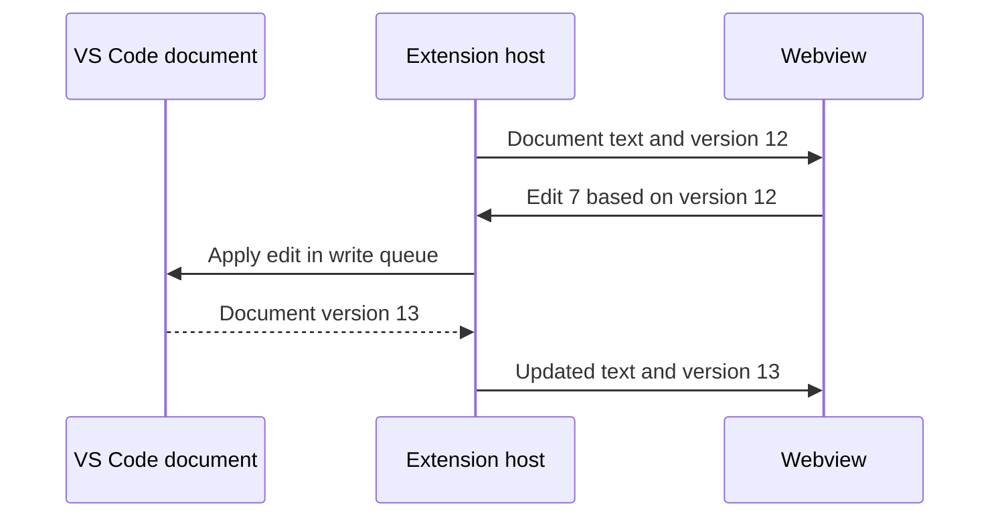
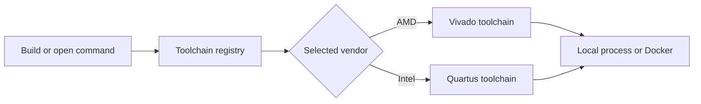

# Extension Host

The extension host is the Node.js side of IPCraft. It can read files, register
VS Code commands, start external tools, and create webviews. The webviews cannot
perform these privileged tasks directly.

## Responsibilities

```mermaid
flowchart TD
    A[src/extension.ts] --> B[Custom editor providers]
    A --> C[Commands]
    B --> D[Document and validation services]
    C --> E[Generator and importers]
    C --> F[Vivado and Quartus toolchains]
    B <-->|typed messages| G[React webviews]
```

`src/extension.ts` is the entry point. During activation it registers providers,
commands, views, and services with the extension context.

## Custom editors

| Document | Provider | Webview |
|---|---|---|
| `*.mm.yml` | `MemoryMapEditorProvider` | Memory Map editor |
| `*.ip.yml` | `IpCoreEditorProvider` | IP Core editor |

A provider creates the webview, sends the current document, receives edits, and
applies accepted changes through VS Code's document API.

The providers share these central services:

| Service | Plain-language role |
|---|---|
| `WebviewRouter` | Sends each incoming message to the matching handler |
| `DocumentManager` | Applies document writes in order and rejects edits based on old versions |
| `HtmlGenerator` | Creates secure webview HTML |
| `YamlValidator` | Checks documents against the IPCraft schemas |
| `ImportResolver` | Loads `$import` references in IP core files |
| `BusLibraryService` | Loads known interface definitions |

## Document revisions

Each document update has a version. Each webview edit states which document
version it was based on.

```mermaid
sequenceDiagram
    participant File as VS Code document
    participant Host as Extension host
    participant View as Webview
    Host->>View: Document text and version 12
    View->>Host: Edit 7 based on version 12
    Host->>File: Apply edit in write queue
    File-->>Host: Document version 13
    Host->>View: Updated text and version 13
```

If the file changed after the webview's starting version, the host rejects the
stale edit and sends the current document back. This prevents two updates from
silently overwriting each other.

Asynchronous conformance and generation results also carry `sourceRevision`,
which compares the exact source text before applying a result. This correlation
guard is intentionally separate from the V-3/V-4 document revision protocol:
it neither advances nor filters document versions. The full-text comparison is
a deliberate per-result cost and should be considered if this mechanism is
extended to larger or more frequent payloads.

See [YAML data flow](../concepts/yaml-data-flow.md) for the paired webview logic.

## Commands

Command modules under `src/commands/` group the main workflows:

| Area | Examples |
|---|---|
| Create | Create IP core, memory map, or both |
| Generate | Generate RTL, tests, and vendor projects |
| Import | Read VHDL, Platform Designer, or IP-XACT files |
| Build | Run Vivado or Quartus and show reports |
| Open external tools | Open Vivado, IP Packager, Quartus, or Platform Designer |
| Maintain | Scan catalogs, migrate older files, switch editor mode |

The complete user-facing list is in the [commands reference](../reference/commands.md).

## Generation and imports

`src/generator/IpCoreScaffolder.ts` coordinates code generation. It validates
the source, prepares stable template data, renders the selected scaffold pack,
and asks vendor toolchains for their output.

Importers under `src/parser/` convert existing files into IPCraft documents:

- `VhdlParser.ts` and `VerilogParser.ts` read HDL modules;
- `HwTclParser.ts` reads Quartus component metadata;
- `ComponentXmlParser.ts` reads Vivado IP-XACT component metadata;
- `VivadoInterfaceXmlParser.ts` reads Vivado interface definitions for catalog
  discovery.

Import results still require user review because source formats do not always
contain design intent.

### Vendor format boundary review

`ComponentXmlParser`, `HwTclParser`, and `VivadoComponentXmlGenerator` exceed
the general module-size review threshold because each owns one ordered vendor
format transformation: IP-XACT traversal, Tcl command traversal, or IP-XACT
document assembly. Their syntax handling and source-order-dependent control
flow remain local so the format can be read and reviewed in execution order.
Format-independent policy and transformations are kept in focused shared
modules, including contract property import and observed-port reconciliation.

The extraction rule is: logic with a second consumer belongs in
`src/shared/busContracts/` when it neither reads nor emits XML/Tcl syntax nor
depends on vendor source ordering. This makes the size exception a cohesion
decision, not an exemption from future extraction.

### Generator projection modules

`registerProcessor.ts` also exceeds the general module-size review threshold. It
owns the one-way projection from normalized domain data into the template
context: width-expression evaluation, register access derivation, bus-interface
array expansion, and memory-map projection. These stages share the width and
`getString` coercion helpers and run in a fixed order for every generated
artifact, so they are reviewed together.

Policy that a second caller needs is extracted instead of grown in place:

- `resolvers/endiannessPolicy.ts` decides which canonical ports need big-endian
  lane or bit reflow and how wide each reflowed element is. `resolvers/bus.ts`
  is the second consumer, so this policy must not live in `registerProcessor`.
- `resolvers/boundaryTransforms.ts` plans the HDL-boundary signals that realize
  a reflow or a polarity inversion.
- Contract-declared questions such as "is this a memory-mapped consumer" belong
  to `src/shared/busContracts/`, never to a generator-local name heuristic.

## External tools

Toolchains under `src/services/toolchains/` provide one interface for local and
Docker-based tools.

```mermaid
flowchart LR
    A[Build or open command] --> B[Toolchain registry]
    B --> C{Selected vendor}
    C -->|AMD| D[Vivado toolchain]
    C -->|Intel| E[Quartus toolchain]
    D --> F[Local process or Docker]
    E --> F
```

Commands ask the registry for a toolchain instead of reading installation
settings themselves. `BuildRunner` streams output, and `ReportParser` extracts
timing and size summaries for the Build view.

## Resource files

At activation, `ResourceRoots` locates templates, schemas, packs, and interface
definitions inside the installed extension. Edit their source locations, not
the copied files under `dist/`:

- templates: `src/generator/templates/`;
- packs: `src/generator/packs/`;
- schemas and bus definitions: `ipcraft-spec/`.
