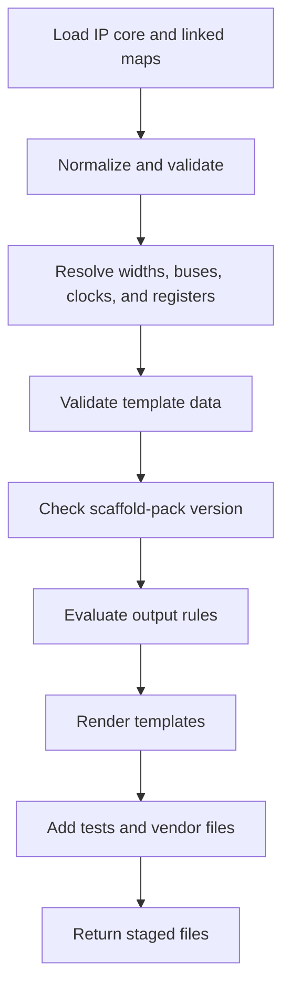
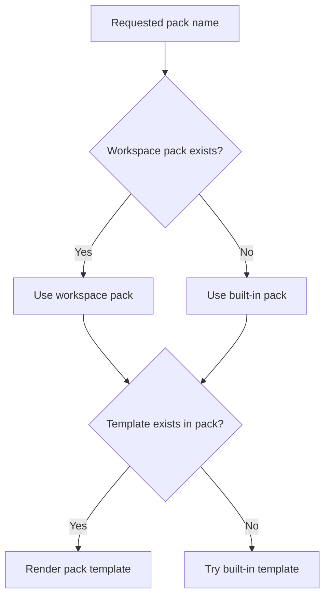

# Generator Architecture

The generator converts an `.ip.yml` file and linked memory maps into HDL,
tests, and vendor project files. This page describes the contributor-facing
design. Pack authors should start with [scaffold packs](../how-to/customizing-generated-files-with-scaffold-packs.md).

## Pipeline



`src/generator/IpCoreScaffolder.ts` coordinates the pipeline. It returns file
contents to the staging workflow; it does not ask React components to write
files directly.

## Main areas

| Area | Location | Responsibility |
|---|---|---|
| Orchestration | `IpCoreScaffolder.ts` | Runs the complete generation flow |
| Input preparation | `registerProcessor.ts` | Prepares maps, registers, and interfaces |
| Template data | `contract/` and `resolvers/` | Defines and calculates values supplied to templates |
| Bus rules | `buses/` | Maps interface names to supported bus behavior |
| Scaffold packs | `packs/` and `ScaffoldPackLoader.ts` | Chooses output rules |
| Rendering | `TemplateLoader.ts` and `templates/` | Finds and renders Nunjucks templates |
| Test generation | `testbench/` | Combines a test framework with a simulator |

## Stable template data

Templates receive a documented object rather than raw YAML. Its JSON Schema is
`src/generator/contract/template_context.schema.json`. The generated TypeScript
file `templateContext.types.ts` must not be edited by hand.

Before rendering, `assertValidContext` checks the object against the schema. A
failure stops generation and reports the invalid values. In the source this
check uses AJV, a JSON Schema validator.

Scaffold packs may declare `apiVersion`. IPCraft compares that range with the
current template-data version before rendering:

| Pack value | Result |
|---|---|
| Missing | Accepted for older packs |
| Compatible range such as `^1.0` | Rendered normally |
| Incompatible major version | Rejected with a version error |

## Resolvers

A resolver is a small conversion function that calculates one part of the
template data.

| Resolver | Result |
|---|---|
| Clock and reset | Primary names, reset polarity, and clock periods |
| Parameters | HDL types, defaults, and Vivado UI groups |
| Register behavior | Software, hardware, write-one-to-clear, and change-event views |
| Addressing | Data width, byte width, and address width |
| Bus | Active bus signals, user ports, interrupts, and expanded arrays |

Keep resolvers independent of file writing and template rendering. Their output
is easier to test when it depends only on their inputs.

## Bus rules

`BusRuleRegistry` accepts full interface identities and short names, then
returns one known bus rule. The rule supplies the short template name and
whether the bus is memory mapped.

This keeps bus-name interpretation in one place. Templates should use normalized
values such as `axil` or `avmm` instead of recognizing aliases themselves.

## Pack and template lookup



A workspace pack can replace a built-in template by using the same filename.
Unchanged templates fall back to the built-in library.

Source templates live in `src/generator/templates/` and are copied to
`dist/templates/` during compilation. Never edit the copied files.

## Width expressions

`src/shared/evalWidthExpr.ts` evaluates arithmetic width expressions for both
the webview and generator. It supports numbers, parameter names, parentheses,
and basic arithmetic without JavaScript `eval`.

Keeping one evaluator prevents the canvas preview and generated vendor metadata
from calculating different widths.

## Verification

Generator changes should prove progressively more:


Run the focused unit tests, then:

```bash
npm run generate-types   # only after schema changes
npm run compile
npm run test:integration:hdl
```

Run the matching EDA integration suite for vendor-specific changes.
