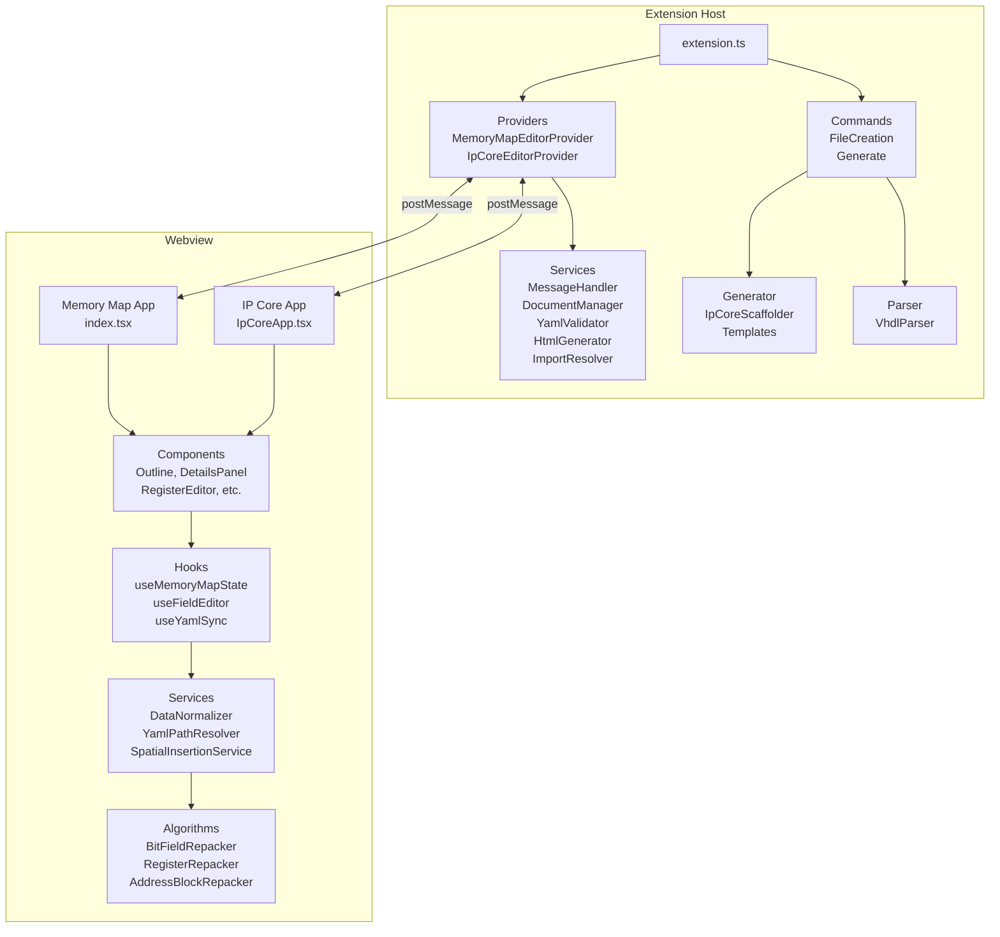

# Architecture Overview

## System Overview

`ipcraft-vscode` is a VS Code extension providing two custom visual editors:

- **Memory Map editor** for `*.mm.yml` -- edit address blocks, registers, and bit fields
- **IP Core editor** for `*.ip.yml` -- edit IP core metadata, clocks, resets, bus interfaces

Both share common extension-host services while keeping editor-specific UI and domain logic separate.

## High-Level Structure

## Data Flow

### Document open

1. VS Code opens a matching YAML file
2. Provider resolves webview HTML and waits for `type: 'ready'`
3. Provider sends `type: 'update'` with text (+ filename; IP Core includes resolved imports)
4. Webview parses, normalizes, and renders

### User edit

1. User edits in the webview UI
2. Webview updates in-memory model and serializes YAML
3. Webview posts `type: 'update'` with full text
4. Host `MessageHandler` routes to `DocumentManager.updateDocument()`
5. VS Code document updates and re-syncs

### Host commands

Webview can post `type: 'command'` (`save`, `validate`, `openFile`). Host executes VS Code actions and may show notifications.

## Build and Packaging

| Output | Location |
|--------|----------|
| Extension bundle | `dist/extension.js` |
| Webview bundle | `dist/webview.js` |
| Compiled tests | `out/**` |

Built with webpack. See [Development Setup](../getting-started/development.md) for commands.

## YAML Libraries

This project uses two YAML libraries by design:

| Library | Package | When to use |
|---------|---------|-------------|
| `js-yaml` (v4) | `js-yaml` | Simple parse/dump (no comment preservation) |
| `yaml` (v2) | `yaml` | Comment-preserving round-trip manipulation (`parseDocument`) |

Rule: if only reading YAML, use `js-yaml`. If modifying and writing back while preserving comments, use `yaml` v2.
