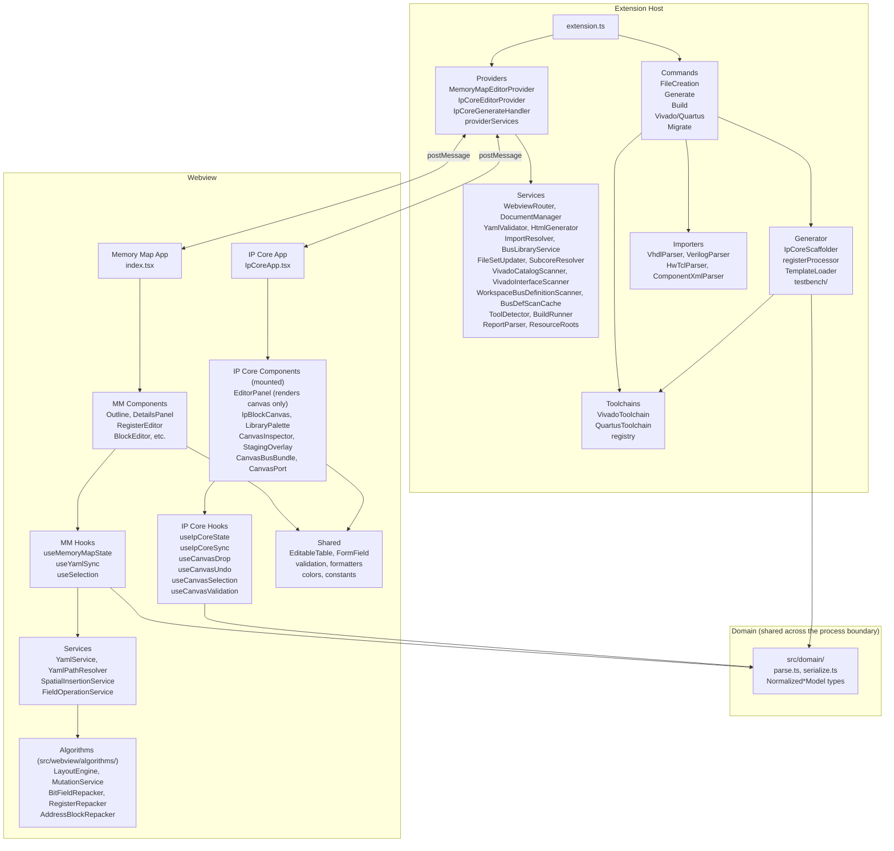

# Architecture Overview

## System overview

`ipcraft-vscode` is a VS Code extension providing two custom visual editors:

- **Memory Map editor** for `*.mm.yml` -- edit address blocks, registers, and bit fields
- **IP Core editor** for `*.ip.yml` -- edit IP core metadata, clocks, resets, bus interfaces, parameters, file sets, and generate VHDL projects

The **extension host** is the Node.js process that can access VS Code and the
file system. A **webview** is an embedded browser that renders an editor. They
share domain types but communicate only through messages.

## High-Level Structure

```mermaid
graph TB
    subgraph "Extension Host"
        EXT["extension.ts"]
        PROV["Providers\nMemoryMapEditorProvider\nIpCoreEditorProvider\nIpCoreGenerateHandler\nproviderServices"]
        SVC["Services\nWebviewRouter, DocumentManager\nYamlValidator, HtmlGenerator\nImportResolver, BusLibraryService\nFileSetUpdater, SubcoreResolver\nVivadoCatalogScanner, VivadoInterfaceScanner\nWorkspaceBusDefinitionScanner, BusDefScanCache\nToolDetector, BuildRunner\nReportParser, ResourceRoots"]
        CMD["Commands\nFileCreation\nGenerate\nBuild\nVivado/Quartus\nMigrate"]
        GEN["Generator\nIpCoreScaffolder\nregisterProcessor\nTemplateLoader\ntestbench/"]
        TC["Toolchains\nVivadoToolchain\nQuartusToolchain\nregistry"]
        PAR["Importers\nVhdlParser, VerilogParser\nHwTclParser, ComponentXmlParser"]
    end
    subgraph "Domain (shared across the process boundary)"
        DOMAIN["src/domain/\nparse.ts, serialize.ts\nNormalized*Model types"]
    end
    subgraph "Webview"
        MM["Memory Map App\nindex.tsx"]
        IP["IP Core App\nIpCoreApp.tsx"]
        MMCOMP["MM Components\nOutline, DetailsPanel\nRegisterEditor\nBlockEditor, etc."]
        IPCOMP["IP Core Components (mounted)\nEditorPanel (renders canvas only)\nIpBlockCanvas, LibraryPalette\nCanvasInspector, StagingOverlay\nCanvasBusBundle, CanvasPort"]
        HOOK["MM Hooks\nuseMemoryMapState\nuseYamlSync\nuseSelection"]
        IPHOOK["IP Core Hooks\nuseIpCoreState\nuseIpCoreSync\nuseCanvasDrop\nuseCanvasUndo\nuseCanvasSelection\nuseCanvasValidation"]
        WSVC["Services\nYamlService, YamlPathResolver\nSpatialInsertionService\nFieldOperationService"]
        ALG["Algorithms (src/webview/algorithms/)\nLayoutEngine, MutationService\nBitFieldRepacker, RegisterRepacker\nAddressBlockRepacker"]
        SHARED["Shared\nEditableTable, FormField\nvalidation, formatters\ncolors, constants"]
    end
    EXT --> PROV
    EXT --> CMD
    PROV <-->|"postMessage"| MM
    PROV <-->|"postMessage"| IP
    PROV --> SVC
    CMD --> GEN
    CMD --> PAR
    CMD --> TC
    GEN --> TC
    GEN --> DOMAIN
    MM --> MMCOMP --> HOOK --> WSVC --> ALG
    HOOK --> DOMAIN
    IP --> IPCOMP --> IPHOOK
    IPHOOK --> DOMAIN
    MMCOMP --> SHARED
    IPCOMP --> SHARED
```

## Data Flow

### Document open

1. VS Code opens a matching YAML file
2. Provider resolves webview HTML and waits for `type: 'ready'`
3. Provider sends `type: 'update'` with text (+ filename; IP Core includes resolved imports)
4. Webview parses, normalizes, and renders

### User edit

1. User edits in the webview UI
2. Webview updates in-memory model and serializes YAML
3. Webview posts `type: 'update'` with full text
4. Host `WebviewRouter` routes to `DocumentManager.updateDocument()`
5. VS Code document updates and re-syncs

### Host commands

Webview can post `type: 'command'` (`save`, `validate`, `openFile`). Host executes VS Code actions and may show notifications.

### Message lifecycle and revisions

1. VS Code calls `resolveCustomTextEditor` for a matching file.
2. The provider creates the webview HTML and waits for a `ready` message.
3. The provider sends the document text with its current `docVersion`.
4. Webview edits carry a monotonic `editId` and the `baseDocVersion` they were based on.
5. `DocumentManager` serializes document writes and rejects stale base versions.

The revision pair distinguishes a genuine external update from an echo or a stale edit. See
[YAML Data Flow](../concepts/yaml-data-flow.md) for the complete protocol.

### Canvas edit (IP Core only)

1. User drags an item from the library palette and drops it on the `IpBlockCanvas`
2. `useCanvasDrop` resolves the payload into an IP Core update (e.g., push to `clocks`, `ports`, or `busInterfaces`)
3. `useCanvasUndo` snapshots the prior YAML before applying the update
4. `updateIpCore` writes the new value into the parsed model
5. `useIpCoreSync` serialises the model back to YAML and posts `type: 'update'` to the host (same path as a form edit)

Canvas keyboard shortcuts (Delete, Ctrl+D, Ctrl+Z/Y) follow the same update path through `updateIpCore`.

### HDL generation

1. User configures options in the Generator Panel (bus type, targets, testbench)
2. Webview posts `type: 'generate'` with options
3. Host `IpCoreGenerateHandler` invokes `IpCoreScaffolder.generateAll()`
4. Scaffolder loads templates, builds context from IP Core data, renders files
5. Host posts `type: 'generateResult'` back to webview with file list or error

## Build and Packaging

| Output | Location |
|--------|----------|
| Extension bundle | `dist/extension.js` |
| Webview bundle | `dist/webview.js` |
| Nunjucks templates | `dist/templates/` |
| Compiled tests | `out/**` |

Built with webpack. See [Development Setup](../getting-started/development.md) for commands.

## Webview Security

`HtmlGenerator` applies a Content Security Policy with `default-src 'none'`. Scripts, styles,
fonts, and other resources are restricted to the extension's own `webview.cspSource`. Webviews
cannot access the file system directly; all privileged operations cross the typed message bridge,
and host commands are checked against an allow-list.

## YAML Libraries

This project uses two YAML libraries by design:

| Library | Package | When to use |
|---------|---------|-------------|
| `js-yaml` (v4) | `js-yaml` | Simple parse/dump (no comment preservation) |
| `yaml` (v2) | `yaml` | Comment-preserving round-trip manipulation (`parseDocument`) |

Rule: if only reading YAML, use `js-yaml`. If modifying and writing back while preserving comments, use `yaml` v2.
