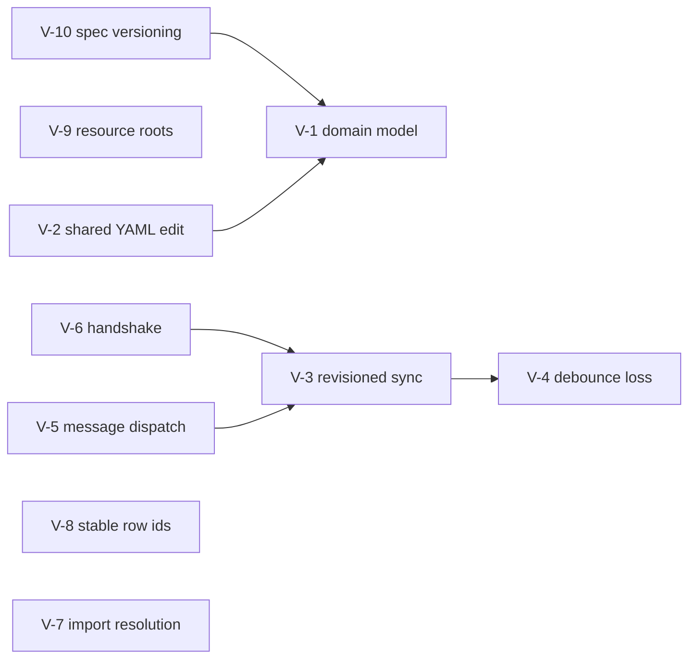

# Architectural Refactoring Concepts (V-Series)

Concept and task documents for the architectural debt items V-1…V-10 identified in the
[Software Architecture Document, §7](../architecture.md#7-technical-debt--vibe-code-assessment).
Each document is self-contained: it explains **why** the current state is a problem, **how**
to fix it (target design with code sketches), and breaks the work into independently
shippable tasks with acceptance criteria.

These are distinct from [technical-debt.md](../technical-debt.md) (TD-1…TD-5), which tracks
small, mechanical cleanups. The V-series items are architectural: they change contracts
between modules.

## Index

| ID | Document | Theme | Severity | Effort |
| --- | --- | --- | --- | --- |
| V-1 | [Unified domain model](V-01-unified-domain-model.md) | Three key vocabularies for one domain | High (bug breeding ground) | L |
| V-2 | [Shared YAML edit module](V-02-shared-yaml-edit-module.md) | Two divergent YAML write paths | Medium | M |
| V-3 | [Revisioned sync protocol](V-03-revisioned-sync-protocol.md) | Echo loop is convention, not contract | High (correctness) | M |
| V-4 | [Debounce data-loss window](V-04-debounce-data-loss.md) | Stale whole-file overwrite | High (silent data loss) | S |
| V-5 | [Unified message dispatch](V-05-unified-message-dispatch.md) | Two dispatch mechanisms on the host | Medium | M |
| V-6 | [Handshake cleanup](V-06-handshake-cleanup.md) | `setTimeout(100)` masking the ready handshake | Low | S |
| V-7 | [Import resolution consolidation](V-07-import-resolution-consolidation.md) | Duplicated `.mm.yml` import logic | Medium | S |
| V-8 | [Stable row identity](V-08-stable-row-ids.md) | Name- vs index-keyed draft state | High (recurring UI bugs) | M |
| V-9 | [Resource root resolution](V-09-resource-root-resolution.md) | `__dirname` heuristics ×3 | Medium (fails late) | S |
| V-10 | [Spec versioning](V-10-spec-versioning.md) | Untracked `ipcraft-spec` nested repo | Medium (silent drift) | S |

Effort: S ≈ ≤1 day, M ≈ 2–4 days, L ≈ 1–2 weeks.

## Recommended order and dependencies

Suggested sequencing:

1. **Foundations, zero behavior change:** V-9, V-10, V-6 — small, de-risk everything after.
2. **Sync correctness:** V-5 → V-3 → V-4. The revision protocol (V-3) is the keystone; V-5
   gives it one place to live; V-4 falls out of V-3 almost for free.
3. **Editing robustness:** V-8 (independent, fixes the recurring field-editor bug class),
   V-2 (shared serializer).
4. **The big one:** V-1 (unified domain model), best done last — it benefits from V-2's
   single serializer and V-10's pinned schemas.
5. **Anytime:** V-7 (independent).

## Shared design principles

All documents apply the same ground rules:

- **SSOT stays the `TextDocument`.** No refactor introduces a second authoritative model;
  webview state remains a derived cache.
- **Behavior-preserving steps.** Every task is shippable on its own with tests green;
  no big-bang rewrite. (See the [refactor skill](../../refactor) philosophy.)
- **Contracts over conventions.** Where two modules currently agree by accident
  (echo suppression, key spellings), introduce an explicit typed contract.
- **One conversion boundary.** Format/spelling/normalization conversions live in exactly
  one module per direction; everything inside the boundary uses one vocabulary.
- **Tests pin behavior first.** Each task starts by characterizing current behavior with a
  test, then refactors under it.
