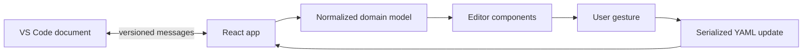
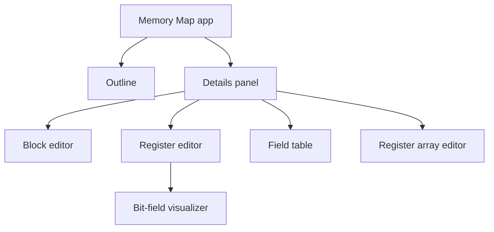

# Webview Architecture

IPCraft has two React applications running in VS Code webviews. A webview is an
embedded browser: it can render the editor interface, but it cannot read project
files or start external tools directly.

| Editor     | Entry point                        | Root element   |
| ---------- | ---------------------------------- | -------------- |
| Memory Map | `src/webview/index.tsx`            | `#root`        |
| IP Core    | `src/webview/ipcore/IpCoreApp.tsx` | `#ipcore-root` |

## Shared boundary



Both applications use `src/domain/parse.ts` to convert document data into the
editor model and `src/domain/serialize.ts` to remove editor-only values before
writing YAML.

`rowId` identifies a React row across renders. It is never document data.

## Memory Map application

The Memory Map app has three main regions:

- `Outline` selects blocks, registers, arrays, and fields;
- `DetailsPanel` chooses the editor for the selected item;
- visualizers show bit and address layouts.

The table editors for blocks, registers, and fields share
`useTableEditorState`. It combines keyboard navigation, draft protection, and
the pointer insert bar.



Layout calculations belong in pure functions under
`src/webview/algorithms/`. Components request an operation and render the
result; they should not contain separate address or bit-position formulas.

## IP Core application

The IP Core app uses a block-diagram canvas:

- `LibraryPalette` supplies items to add;
- `IpBlockCanvas` draws ports, parameters, clocks, resets, and interfaces;
- `CanvasInspector` edits the current selection;
- `StagingOverlay` reviews generated files before they are accepted.

`useIpCoreState` owns parsed data and validation. `useIpCoreSync` sends serialized
changes to the extension host. Canvas hooks handle drop, selection, undo, and
keyboard actions.

### IP Core dependency and ownership boundaries

Keep the IP Core import direction one-way:

```text
types and pure canvas utilities
  -> editor/message controllers and interaction hooks
  -> feature components
  -> IpBlockCanvas and IpCoreApp composition roots
```

`IpCoreApp` owns top-level composition and lifecycle. It must delegate document
edits, revision-aware messaging, selection commands, session state, and overlay
routing to typed boundaries rather than accumulating raw listeners, YAML path
calculations, or feature state machines.

`IpBlockCanvas` owns canvas composition and rendering coordination. Geometry,
selection transitions, drag and keyboard lifecycles, and model-changing commands
belong in focused pure utilities, hooks, or controllers. Renderer callbacks
request typed actions; they do not independently recreate mutations or
cross-process messages.

Hooks may depend on neutral types and pure utilities, but not on React
components. Move shared types or constants to a dependency-neutral module
instead of importing them from a component. Cross-process messages must pass
through the typed message boundary; do not add isolated `postMessage` calls or
parallel `message` listeners inside feature components.

### Canvas inspector ownership

`CanvasInspector.tsx` owns only the resizable shell, header, footer, and feature
router composition. Selection-specific panels, reusable inspector controls,
message builders, and domain transformations live under
`components/canvas/inspector/`. Panels receive explicit typed props rather than
reading shared mutable module state.

Keep one inspector feature per production module. Aim for no more than roughly
400 lines; 500 lines is the review trigger for extracting controls,
transformations, or a cohesive subfeature. A larger module should retain one
clear responsibility and document why splitting it would make ownership less
clear.

Apply the same size review to other production modules. Line count is evidence
to inspect ownership, not a reason to split cohesive logic into arbitrary
fragments. Generated files, declarative data, and templates are excluded.

## Updates and drafts

Text cells keep an unfinished draft separately from the last valid document
value. This allows users to type partial ranges or numbers without immediately
creating invalid YAML.

When a valid edit is committed:

1. the component requests an update;
2. the domain model is serialized;
3. the webview sends an edit ID and starting document version;
4. the extension host applies or rejects the update;
5. the webview accepts the resulting document version.

See [YAML data flow](../concepts/yaml-data-flow.md) for the message rules and
[bit field handling](bit-field-handling.md) for structural field edits.

## Shared components

Reusable form and table controls are under `src/webview/shared/components/`.
Shared validation, formatting, focus, and YAML-key helpers are under
`src/webview/shared/utils/`.

Use VS Code theme variables for colors and keep form behavior consistent across
both applications.

## Security

The extension host provides a content security policy that limits scripts,
styles, fonts, and resources to approved extension locations. Webviews send
typed messages for file access and commands. Do not add direct Node.js or file
system assumptions to webview code.

## Contributor checklist

When changing a webview feature:

- identify the owning layer and keep imports flowing toward the composition root;
- extract a focused seam when a change would add another responsibility to a
  root or renderer;
- keep dependencies explicit and avoid hidden module state or broad contexts;
- use one tested implementation for behavior shared by multiple surfaces;
- update both sides of a changed message;
- keep editor-only fields out of serialized YAML;
- use the shared table pattern in all parallel editors;
- put layout calculations in pure algorithm modules;
- preserve one gesture's update and undo boundary during refactors;
- test focus and keyboard behavior in a browser;
- verify narrow and wide editor widths;
- verify light, dark, and high-contrast themes.
