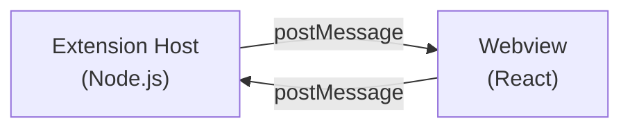

# Building IPCraft: A Visual FPGA Register Editor in VS Code

*A technical walkthrough of IPCraft for VS Code -- how it works, why it exists, and what you can do with it.*

---

## The Problem

Every FPGA project reaches a point where you need to define registers. A status register here, a control register there, an interrupt mask, a DMA descriptor -- before long, you have dozens of registers spread across multiple address blocks, each with specific bit fields, access policies, and reset values.

The traditional workflow looks something like this:

1. Open a spreadsheet or Word document to plan the register layout
2. Manually write VHDL for the register file
3. Manually write the bus interface wrapper (AXI-Lite or Avalon-MM)
4. Manually create vendor integration files for Quartus or Vivado
5. Write a C header file for the software team
6. Discover a mistake at step 4, go back to step 1

This process is error-prone because the register specification and the implementation are separate artifacts that must be kept in sync by hand. Change a bit field width in the spec and you need to update the VHDL, the vendor files, and the software headers.

IPCraft replaces this workflow with a single source of truth: a YAML specification file that defines your IP core and its registers. A visual editor lets you manipulate registers and bit fields directly. A code generator produces all the downstream artifacts.

## What IPCraft Looks Like

IPCraft provides two custom editors inside VS Code:

**Memory Map Editor** (`*.mm.yml`) -- for defining address blocks, registers, and bit fields:

- A sidebar tree shows the memory map hierarchy
- Click a register to see its bit field table
- A visual diagram shows the register layout with color-coded fields
- Drag field edges to resize, drag fields to reorder, click gaps to create new fields

**IP Core Editor** (`*.ip.yml`) -- for defining the complete IP core:

- Dedicated section editors for metadata, clocks, resets, ports, parameters, bus interfaces, memory maps, and file sets
- A generator panel for scaffolding the entire RTL project
- Cross-reference validation (e.g., does the bus interface reference a valid clock?)

Both editors maintain bi-directional sync with the YAML source. You can split-view the visual editor alongside the text editor and see changes reflected in real time.

## Architecture: Two Processes, One Editor

VS Code extensions run in Node.js, but custom editors render in an embedded browser (the "webview"). These two processes communicate exclusively through `postMessage`:



The **extension host** handles file I/O, YAML validation, import resolution, and VHDL generation. The **webview** handles rendering, user interaction, and the spatial editing algorithms.

This separation is enforced by VS Code's security model -- the webview cannot access the file system, and the extension host cannot render UI. All data flows as plain objects through the message channel.

### Data Flow

When you open a `.mm.yml` file:

1. The extension provider reads the file and waits for the webview to signal ready
2. The provider sends the raw YAML text to the webview
3. The webview's `DataNormalizer` parses and normalizes the YAML into an in-memory model
4. React components render the model

When you edit a field:

1. The component calls `onUpdate(path, value)` with a path like `['fields', 0, 'name']`
2. `YamlPathResolver` applies the update to the parsed YAML document (preserving comments)
3. `YamlService` serializes the document back to text
4. The webview sends the updated text to the extension host
5. `DocumentManager` applies the edit to the VS Code document

## Spatial Editing: Insert Without Breaking Things

The most interesting technical challenge is spatial insertion. Memory maps, registers, and bit fields all occupy spatial positions -- addresses, offsets, and bit ranges. When you insert a new 4-byte register at offset 0x08, every register after it needs to shift forward.

IPCraft handles this with a five-stage pipeline for every insertion:


1. **Locate** -- find the selected item and compute the insertion position
2. **Create** -- build a default entity at the computed position
3. **Splice** -- insert into the array at the correct index
4. **Repack** -- shift neighboring entities to resolve collisions
5. **Validate** -- check bounds, sort into canonical order, return result or error

The same pipeline handles bit fields (bounded by register width), registers (bounded by address block range), and address blocks (bounded by memory map space). Each level has its own repacker that preserves entity widths while shifting positions.

On failure, the original array is returned unchanged -- no partial updates, no data corruption.

## Code Generation: From Spec to RTL

The generator reads an IP Core specification and produces a complete, ready-to-synthesize project:

```text
led_controller/
  rtl/
    led_controller_pkg.vhd     -- package with register constants
    led_controller.vhd          -- top-level entity
    led_controller_core.vhd     -- user logic skeleton
    led_controller_axil.vhd     -- AXI-Lite bus wrapper
    led_controller_regs.vhd     -- register file with decode
  altera/
    led_controller_hw.tcl       -- Platform Designer component
  amd/
    component.xml               -- Vivado IP-XACT descriptor
    xgui/led_controller_v1_0_0.tcl
  tb/
    led_controller_test.py      -- cocotb test skeleton
    Makefile                    -- GHDL simulation
```

Templates use Nunjucks (Jinja2-compatible) and receive a rich context built from the IP Core spec: resolved register maps, expanded bus interfaces (including arrays), port definitions with parameterized widths, and clock/reset associations.

The bus type is automatically detected from the IP Core's bus interfaces. If you define an AXI-Lite interface with a memory map reference, the generator produces AXI-Lite wrappers. Switch to Avalon-MM and the wrappers change accordingly.

Vendor integration files are a significant time saver. The Altera `_hw.tcl` file defines the component for Platform Designer (Qsys) with all ports, interfaces, and parameters. The AMD `component.xml` follows the IP-XACT standard for Vivado IP Packager, including file sets, supported FPGA families, and GUI customization scripts.

## Example: Defining an LED Controller

Here is the essential structure of an IP Core YAML spec:

```yaml
vlnv:
  vendor: my-hardware.com
  library: peripherals
  name: led_controller
  version: 1.0.0

description: A configurable LED controller with AXI-Lite interface

parameters:
  - name: NUM_LEDS
    value: 8
    dataType: integer

clocks:
  - name: i_clk
    direction: in
    frequency: 100MHz

resets:
  - name: i_rst_n
    polarity: activeLow

ports:
  - name: o_led
    direction: out
    width: NUM_LEDS

busInterfaces:
  - name: S_AXI_LITE
    type: AXI4L
    mode: slave
    memoryMapRef: CSR_MAP
```

The corresponding memory map file defines the register layout:

```yaml
- name: CSR_MAP
  addressBlocks:
    - name: CONTROL_REGS
      baseAddress: 0
      registers:
        - name: CONTROL
          fields:
            - name: ENABLE
              bits: "[0:0]"
              access: read-write
            - name: PWM_ENABLE
              bits: "[1:1]"
              access: read-write
        - name: STATUS
          access: read-only
          fields:
            - name: READY
              bits: "[0:0]"
              access: read-only
```

Open these files in VS Code with IPCraft installed and you get interactive visual editors. Click "Generate Files" in the Generator Panel and you get a complete RTL project.

## Technology Stack

- **Extension host**: TypeScript, Node.js, VS Code Extension API
- **Webview**: React 18, TypeScript, Tailwind CSS, webpack
- **Templates**: Nunjucks (Jinja2-compatible)
- **YAML**: `js-yaml` for parsing, `yaml` v2 for comment-preserving round-trip editing
- **Specifications**: JSON Schema validated via `ipcraft-spec` submodule
- **Testing**: Jest (209 tests across 27 suites)

## Getting Started

IPCraft is open source and available at [github.com/bleviet/ipcraft-vscode](https://github.com/bleviet/ipcraft-vscode).

```bash
git clone https://github.com/bleviet/ipcraft-vscode.git
cd ipcraft-vscode
npm install
npm run compile
```

Press **F5** in VS Code to launch the Extension Development Host. Create a new `.mm.yml` or `.ip.yml` file using the command palette (`IPCraft: New IP Core` or `IPCraft: New Memory Map`) and start editing.

Full documentation is at `docs/index.md`, built with MkDocs:

```bash
pip install mkdocs mkdocs-material
mkdocs serve
```
