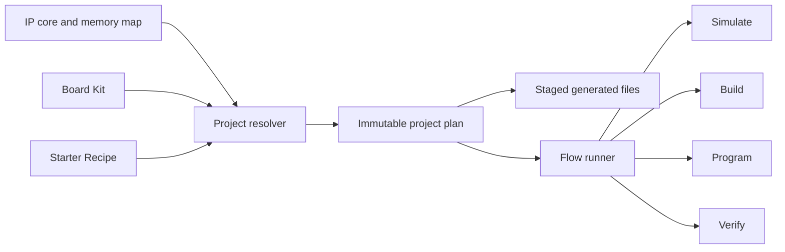
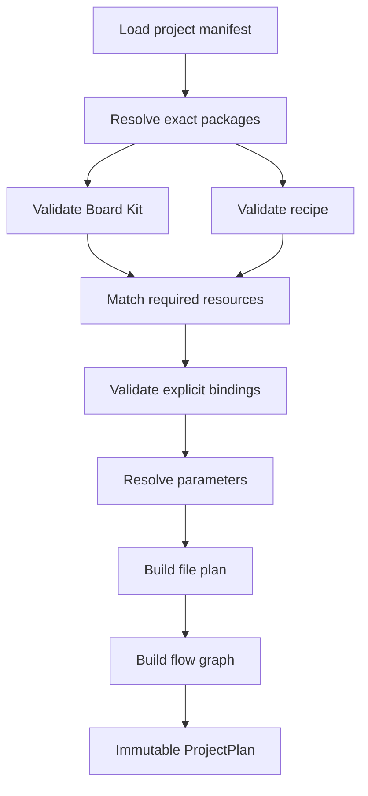

# Board Kits and Project Quickstarts

## Status

This document proposes the architecture and implementation plan for creating a
complete, runnable FPGA board project from IPCraft.

The first supported path targets the Terasic DE10-Nano and produces a
memory-mapped LED peripheral that can be simulated, compiled, programmed, and
verified over JTAG without requiring a processor system.

## Problem

IPCraft currently describes and generates reusable IP cores well, but selecting
a board supplies little more than an FPGA device number. A developer must still
assemble several board-specific pieces:

- clock and reset connections;
- pin assignments and electrical constraints;
- a board-level top entity or module;
- interconnect and debug infrastructure;
- vendor project scripts;
- programming commands;
- a hardware test that proves the programmed design works.

The repository contains these pieces in maintained DE10-Nano examples, but they
are example-specific assets rather than reusable inputs to IPCraft's project
generator.

The goal is to promote that board knowledge into versioned, validated packages
that IPCraft can discover and combine with reusable project recipes.

## Design objective

Adding a board supported by an existing IPCraft toolchain must require no
TypeScript changes.

A normal board contribution should consist of declarative board data, optional
assets, validation fixtures, and retained build or hardware evidence. Code
changes are reserved for new toolchains, programmer types, transports, or
resource kinds.

## Goals

- Create a working board project from an empty workspace.
- Keep `.ip.yml` and `.mm.yml` specifications portable and board-independent.
- Describe common board resources semantically instead of embedding them only
  in vendor scripts.
- Match reusable recipes to boards by capability.
- Reuse IPCraft's staging, ownership, and safe-path behavior.
- Expose the same project plan to the VS Code UI and the IPCraft CLI.
- Provide typed, diagnosable stages for generation, simulation, build,
  programming, and hardware verification.
- Make generated projects reproducible through versioned package references and
  an integrity lockfile.
- Allow workspace-local board definitions before requiring a package
  distribution service.

## Non-goals

- A general graphical system-integration editor in the first implementation.
- Automatic support for every peripheral on a board.
- Encoding a complete vendor project format in `board.yml`.
- Storing user-specific tool installation paths in a Board Kit.
- Allowing Board Kits or recipes to execute arbitrary shell commands.
- Moving board pins, clocks, or programming information into `.ip.yml`.
- Replacing the existing IP scaffold-pack format.

## Concepts and ownership

Five concepts remain separate:

| Concept | Responsibility |
|---|---|
| IP core | Portable interfaces, parameters, ports, files, and register behavior |
| Board Kit | Physical board identity, resources, constraints, programmers, and transports |
| Starter Recipe | Required capabilities, generated board-project files, and runnable stages |
| Board project | Selected Board Kit, recipe, cores, parameters, and resolved bindings |
| Flow executor | Trusted implementation of one runnable operation |



The Board Kit never interprets an IP core. The recipe never searches the
filesystem for tools. The flow runner never decides which board resource a
logical role means. The project resolver joins these inputs once and records
the result.

## Board Kit package

### Package layout

Built-in Board Kits live in source-controlled package directories and are
copied into the extension distribution during compilation:

```text
src/boardKits/builtin/terasic-de10-nano/
├── board.yml
├── README.md
├── assets/
│   └── board.svg
└── fragments/
    └── quartus-defaults.qsf
```

The compiled form is copied to:

```text
dist/board-kits/terasic-de10-nano/
```

Workspace-local packages use:

```text
.vscode/ipcraft/boards/<package-name>/board.yml
```

The initial lookup order is:

1. the exact package and version recorded by the project lockfile;
2. workspace-local Board Kits;
3. built-in Board Kits.

Lookup must report an ambiguity instead of silently choosing between two
packages with the same identity and version.

### Manifest identity

Every Board Kit declares both a manifest API range and a package version:

```yaml
apiVersion: "^1.0"
id: "terasic:de10-nano"
version: "1.0.0"
displayName: "DE10-Nano"
vendor: "Terasic"

target:
  toolchain: "quartus"
  family: "Cyclone V"
  device: "5CSEBA6U23I7"
  operations:
    build: "quartus.compile"
```

`apiVersion` protects IPCraft's manifest contract. `version` identifies a
specific revision of the package data. Changing a pin, constraint, programmer
definition, or other generated behavior requires a package version change.

User tool locations, Docker image choices, and build-job counts remain IPCraft
settings. They are environment choices rather than board facts.

### Resource model

Board resources use a discriminated union. The initial resource kinds are:

- `clock`;
- `reset`;
- `gpio`;
- `connector`;
- `memory`;
- `debugTransport`.

Each resource has a stable `id`, a `kind`, and kind-specific fields. For
example:

```yaml
resources:
  - id: "fpgaClock1"
    kind: "clock"
    frequencyHz: 50000000
    signal:
      pin: "V11"
      ioStandard: "3.3-V LVTTL"

  - id: "userLeds"
    kind: "gpio"
    direction: "output"
    width: 8
    activeLevel: "high"
    signals:
      - index: 0
        pin: "W15"
        ioStandard: "3.3-V LVTTL"
      - index: 1
        pin: "AA24"
        ioStandard: "3.3-V LVTTL"
```

The complete DE10-Nano package supplies all eight LED signals. The shortened
example only illustrates the shape.

Semantic resource data is the canonical source for common pin and clock
constraints. Toolchain-specific renderers convert it into QSF, SDC, XDC, or
Tcl output. A Board Kit may include a constraint fragment for settings that
cannot yet be expressed semantically, but fragments must not duplicate
canonical pins or clocks.

### Programmers and transports

Programming a bitstream and communicating with a running design are separate
capabilities:

```yaml
programmers:
  - id: "usbBlaster"
    executor: "quartus.program"
    expectedDevice: "5CSEBA6U23I7"

transports:
  - id: "jtagAvalon"
    kind: "avalonMm"
    executor: "systemConsole.run"
```

A programmer identifies how IPCraft loads an artifact onto the board. A
transport identifies how a verification stage communicates with the running
design. A recipe may require one, both, or neither.

## Starter Recipe package

### Package layout

Recipes are independent packages:

```text
src/projectRecipes/builtin/jtag-register-led/
├── recipe.yml
├── README.md
└── implementations/
    └── quartus-avalon/
        ├── implementation.yml
        └── templates/
            ├── board-top.vhdl.j2
            ├── platform-designer-system.tcl.j2
            ├── quartus-project.tcl.j2
            └── verify-registers.tcl.j2
```

They are copied to `dist/project-recipes/` when the extension is built.
Workspace-local recipes use:

```text
.vscode/ipcraft/recipes/<package-name>/recipe.yml
```

### Capability requirements

A recipe requests logical roles instead of naming a board:

```yaml
apiVersion: "^1.0"
id: "ipcraft:jtag-register-led"
version: "1.0.0"
displayName: "Control LEDs through JTAG registers"

requirements:
  resources:
    - role: "systemClock"
      kind: "clock"
      minimumFrequencyHz: 10000000

    - role: "statusOutputs"
      kind: "gpio"
      direction: "output"
      minimumWidth: 4

  transports:
    - role: "registerTransport"
      kind: "avalonMm"

  programmers:
    - role: "bitstreamProgrammer"
```

The resolver matches each role against the selected Board Kit. A single valid
match is selected automatically. Multiple matches require a user choice.
Missing matches make the recipe incompatible and produce a diagnostic that
names the unsatisfied role.

The selected bindings are persisted. IPCraft does not repeat the choice during
every generation or build.

### Recipe implementations

Recipe intent and vendor implementation are separate. The top-level recipe
defines its name, parameters, and semantic requirements. Each implementation
defines compatibility, generated files, and flow configuration:

```yaml
id: "quartusAvalon"

compatibility:
  toolchains:
    - "quartus"
  transports:
    - "avalonMm"

files:
  - source: "templates/board-top.vhdl.j2"
    target: "altera/hdl/{{ projectName }}_top.vhd"

flows:
  build:
    usesOperation: "target.build"
    with:
      project: "altera/quartus/{{ projectName }}.qpf"

  program:
    needs: ["build"]
    usesBinding: "bitstreamProgrammer"
    with:
      artifact: "altera/quartus/output_files/{{ projectName }}.sof"

  verify:
    needs: ["program"]
    usesBinding: "registerTransport"
    with:
      script: "altera/debug/verify-registers.tcl"
```

`usesOperation` resolves an operation supplied by the selected board target.
`usesBinding` resolves the executor and fixed configuration supplied by a
matched programmer or transport. The implementation contributes project paths
and stage-specific inputs.

This prevents a reusable recipe from pretending that one vendor project format
works everywhere. The first `jtag-register-led` recipe may initially provide
only a Quartus Avalon implementation. Another Quartus board can reuse it
without recipe changes. Supporting a different project format requires one new
recipe implementation, not a fork for every board.

### Recipe parameters

Recipes declare typed user choices with defaults and validation:

```yaml
parameters:
  - id: "ledWidth"
    type: "integer"
    default: 8
    minimum: 1
```

Parameter values become part of the resolved project plan. A recipe may limit
a parameter using a matched resource, such as clamping `ledWidth` to the width
of `statusOutputs`.

### Generated files

Implementation file rules use the same ownership semantics as scaffold packs:

```yaml
files:
  - source: "templates/board-top.vhdl.j2"
    target: "altera/hdl/{{ projectName }}_top.vhd"
    managed: true

  - source: "templates/user-logic.vhdl.j2"
    target: "rtl/{{ projectName }}_user.vhd"
    managed: false
```

Board-project generation must use the existing staged review. No file is
written before the user confirms the generated plan. Existing
`managed: false` files remain protected.

## Board project manifest

The workspace records project intent in `ipcraft.project.yml`:

```yaml
apiVersion: "^1.0"

project:
  name: "registerLedDemo"

board:
  id: "terasic:de10-nano"
  version: "1.0.0"

recipe:
  id: "ipcraft:jtag-register-led"
  version: "1.0.0"

bindings:
  systemClock: "fpgaClock1"
  statusOutputs: "userLeds"
  registerTransport: "jtagAvalon"
  bitstreamProgrammer: "usbBlaster"

parameters:
  ledWidth: 8

cores:
  - path: "ledController.ip.yml"
```

The manifest stores user intent and stable resource identifiers. It does not
copy pins or recipe file rules. Those remain owned by the referenced packages.

An `ipcraft.lock.yml` records resolved package sources and integrity hashes:

```yaml
packages:
  terasic:de10-nano:
    version: "1.0.0"
    source: "builtin"
    integrity: "sha256:..."

  ipcraft:jtag-register-led:
    version: "1.0.0"
    source: "builtin"
    integrity: "sha256:..."
```

The lockfile is generated data but should normally be committed so CLI and
extension runs resolve the same inputs.

## Resolution pipeline

Raw manifests are confined to package loaders. The rest of the application
uses normalized domain types.



The normalized result has one public shape:

```ts
interface ProjectPlan {
  project: ProjectIdentity;
  board: ResolvedBoard;
  bindings: ResolvedResourceBinding[];
  parameters: Record<string, string | number | boolean>;
  files: PlannedFile[];
  flows: ResolvedFlow[];
  diagnostics: ProjectDiagnostic[];
}
```

The CLI, commands, project panel, staging view, and tests consume this plan.
They must not independently repeat resource matching, output-path resolution,
or flow dependency logic.

Resolution is side-effect free. It may read package and project files, but it
does not write generated output or start external tools.

## File planning and generation

Board-project generation creates a file plan before producing writes:

```ts
interface PlannedFile {
  relativePath: string;
  content: string;
  managed: boolean;
  executable: boolean;
  owner: "board" | "recipe" | "core";
}
```

The existing scaffold implementation already has safe target-path resolution,
file ownership, dry-run output, and staging behavior. Extract the reusable
parts into a lower-level `FilePlanBuilder` rather than making the new project
planner depend directly on `IpCoreScaffolder`.


The shared layer owns:

- template source resolution;
- rendered target-path validation;
- condition evaluation;
- managed and user-owned file metadata;
- executable-bit metadata;
- dry-run content collection.

IP-specific template context construction remains in the IP generator.
Board-resource matching and project flow construction remain in the board
project planner.

## Flow execution

### Standard stages

The first version defines these user-facing stages:

| Stage | Purpose |
|---|---|
| `doctor` | Check tools, packages, device support, and connected hardware |
| `generate` | Resolve and stage project files |
| `simulate` | Run the generated functional test |
| `build` | Produce the board bitstream |
| `program` | Load the selected bitstream |
| `verify` | Exercise the running design and retain a result |

Stages form a directed dependency graph. A stage becomes ready only when all
required stages have passed and its inputs still match their recorded hashes.


The initial recipe may permit `build` after `generate` even when the developer
explicitly skips simulation. The UI must show the skipped gate instead of
reporting it as passed.

### Typed executors

Recipe implementations reference a concrete executor, a board-target
operation, or a resolved resource binding:

```yaml
flows:
  simulate:
    uses: "cocotb.run"
    with:
      directory: "tb"

  build:
    needs: ["generate"]
    usesOperation: "target.build"
    with:
      project: "altera/quartus/{{ projectName }}.qpf"

  program:
    needs: ["build"]
    usesBinding: "bitstreamProgrammer"
    with:
      artifact: "altera/quartus/output_files/{{ projectName }}.sof"

  verify:
    needs: ["program"]
    usesBinding: "registerTransport"
    with:
      script: "altera/debug/verify-registers.tcl"
```

During resolution, `usesOperation` and `usesBinding` become concrete registered
executor IDs. Board-supplied fixed configuration is merged with the
implementation's stage inputs using an explicit schema owned by that executor.

Packages do not supply raw commands. Each resolved executor validates its
configuration, performs diagnostics, resolves configured local or Docker
tools, and runs the operation:

```ts
interface FlowExecutor<TConfig> {
  readonly id: string;

  validate(rawConfig: unknown): TConfig;

  diagnose(
    context: FlowContext,
    config: TConfig
  ): Promise<ProjectDiagnostic[]>;

  run(
    context: FlowContext,
    config: TConfig
  ): Promise<FlowResult>;
}
```

The current synthesis toolchains remain responsible for vendor-specific IP
packaging and build behavior. Flow executors adapt those services where
possible and add board-level operations without adding board conditions to the
toolchain classes.

### Diagnostics

Doctor and flow failures return structured diagnostics:

```ts
interface ProjectDiagnostic {
  code: string;
  severity: "info" | "warning" | "error";
  message: string;
  remediation?: string;
  resource?: string;
}
```

The DE10-Nano doctor initially checks:

- Quartus command resolution;
- Platform Designer command resolution;
- required device-family installation;
- programmer command resolution;
- USB-Blaster visibility;
- expected device presence in the JTAG chain;
- project package integrity.

Doctor is read-only. Programming remains a separate, explicit stage.

## Discovery and registries

Board selection moves from a compiled array to package discovery:

```ts
interface BoardPackageSource {
  list(): Promise<BoardPackageSummary[]>;

  load(
    reference: BoardPackageReference
  ): Promise<BoardPackage>;
}
```

`BoardRepository` combines built-in and workspace sources, validates summaries,
and exposes them to the picker. Complete templates and assets are loaded only
after selection.

Toolchains and flow executors remain code registries because they contain
trusted executable behavior. Board Kits and recipes remain data repositories.

Adding another board using existing resource kinds and executors therefore
does not modify:

- command registration;
- the board picker;
- the project resolver;
- the flow runner;
- toolchain implementations;
- application roots.

## Security and workspace trust

- Loading and validating package metadata is allowed in Restricted Mode.
- Generation, executable templates, tool launches, builds, programming, and
  verification require a trusted workspace.
- All generated targets use the canonical safe-output-path resolver.
- Board Kit and recipe assets may only reference files inside their package.
- Flow manifests may only reference registered executors.
- No package lifecycle or post-install scripts are supported.
- Programming always names the target device and artifact and requires an
  explicit user action.
- External package support must verify the integrity recorded in the lockfile
  before rendering files or running a flow.

## Proposed implementation structure

```text
src/
├── boardKits/
│   ├── types.ts
│   ├── BoardPackageLoader.ts
│   ├── BoardRepository.ts
│   ├── validateBoardPackage.ts
│   └── builtin/
├── projectRecipes/
│   ├── types.ts
│   ├── RecipeLoader.ts
│   ├── RecipeRepository.ts
│   └── builtin/
├── boardProjects/
│   ├── types.ts
│   ├── matchRecipeResources.ts
│   ├── resolveBoardProject.ts
│   ├── BoardProjectPlanner.ts
│   └── BoardProjectService.ts
├── flows/
│   ├── types.ts
│   ├── FlowRunner.ts
│   ├── FlowExecutorRegistry.ts
│   └── executors/
│       ├── CocotbRunExecutor.ts
│       ├── QuartusCompileExecutor.ts
│       ├── QuartusProgramExecutor.ts
│       └── SystemConsoleRunExecutor.ts
└── generator/
    └── FilePlanBuilder.ts
```

Dependencies follow the project direction:

```text
types and pure validators
    -> repositories, resolvers, planners, and executors
    -> commands and providers
    -> extension and webview roots
```

UI components receive narrow summaries and project-plan data. They do not load
packages or start tools directly.

## Actionable implementation plan

### Phase 1: Contracts and characterization

Deliverables:

- Characterization tests for the current Vivado and Quartus board pickers.
- JSON Schemas for `board.yml`, `recipe.yml`, and `ipcraft.project.yml`.
- Normalized TypeScript domain types.
- A documented package identity and versioning policy.
- Test fixtures for valid and invalid Board Kits.

Implementation tasks:

1. Inventory the current board catalog and separate board identity from
   remembered or pinned device selection.
2. Define resource discriminated unions and reject unknown properties.
3. Define recipe requirement types for the initial resource, programmer, and
   transport kinds.
4. Define implementation compatibility and operation or binding references.
5. Add validation for duplicate resource IDs, invalid widths, incomplete pin
   arrays, and unsupported executor IDs.
6. Add API-version compatibility checks matching scaffold-pack behavior.

Exit criteria:

- Package validation is pure and directly unit-tested.
- Invalid packages produce path-specific, actionable diagnostics.
- Existing board selection behavior remains unchanged.

### Phase 2: Package discovery and DE10-Nano Board Kit

Deliverables:

- `BoardPackageLoader`.
- Built-in and workspace `BoardPackageSource` implementations.
- `BoardRepository`.
- The first `terasic:de10-nano` Board Kit.
- Build-time copying of Board Kit assets into `dist/board-kits/`.

Implementation tasks:

1. Convert the DE10-Nano device, clock, and LED pins into semantic resources.
2. Add USB-Blaster and JTAG transport descriptions.
3. Move only reusable board facts out of the example harness; keep
   example-specific system topology in place until the recipe exists.
4. Populate the existing board picker from `BoardRepository` summaries through
   a compatibility adapter.
5. Add a packaging test proving the Board Kit is present in the compiled
   extension and VSIX.

Exit criteria:

- The DE10-Nano appears through package discovery.
- The existing Quartus part picker still returns `5CSEBA6U23I7`.
- A workspace Board Kit can be added without editing source code.
- No board-specific logic is introduced into commands or providers.

### Phase 3: Recipe resolution and file planning

Deliverables:

- `RecipeLoader` and `RecipeRepository`.
- Pure capability matching.
- `ipcraft.project.yml` parsing and serialization.
- Immutable `ProjectPlan`.
- Shared `FilePlanBuilder`.
- The `ipcraft:jtag-register-led` recipe.

Implementation tasks:

1. Extract safe path, condition, ownership, and executable metadata planning
   from the scaffold generator without changing existing generation behavior.
2. Implement deterministic matching and explicit ambiguity diagnostics.
3. Persist selected bindings and parameters in the project manifest.
4. Adapt the existing DE10-Nano top, Platform Designer system, Quartus project,
   and hardware verification assets into recipe templates.
5. Generate a processor-free JTAG-to-Avalon system around an IPCraft-generated
   LED register peripheral.
6. Feed the complete generated file plan through the existing staging UI.

Exit criteria:

- Resolving the DE10-Nano recipe performs no writes and starts no tools.
- The staged output contains all files required for simulation and a Quartus
  board build.
- Cancelling staging writes nothing.
- Regeneration preserves user-owned files and produces one reviewable change
  set.

### Phase 4: Flow runner and Board Doctor

Deliverables:

- `FlowExecutorRegistry`.
- Dependency-aware `FlowRunner`.
- Executors for Cocotb, Quartus compile, Quartus programming, and System
  Console verification.
- Structured Board Doctor diagnostics.
- Machine-readable flow results.

Implementation tasks:

1. Adapt existing process execution and local/Docker configuration rather than
   adding another process runner.
2. Validate executor configuration when resolving the project, before a flow
   starts.
3. Hash stage inputs and outputs so stale builds cannot be programmed without a
   warning.
4. Require an explicit programming action and display the board, device, and
   artifact before launch.
5. Reuse the generated verification manifest and transport-independent
   register model for simulation and hardware verification.
6. Retain `hardware-result.json` with tool, board, bitstream, manifest, and
   individual-check provenance.

Exit criteria:

- A user can run doctor, generate, simulate, build, program, and verify through
  one resolved project.
- A missing tool, board, or JTAG service is a failed stage rather than a passed
  or skipped verification.
- The hardware result proves that the programmed bitstream matches the tested
  register manifest.

### Phase 5: VS Code and CLI workflow

Deliverables:

- `IPCraft: New Board Project`.
- A board and recipe picker based on repository summaries.
- Resource-binding prompts only when matching is ambiguous.
- A Board Project view showing stage state and diagnostics.
- Equivalent IPCraft CLI commands.

Planned command surface:

```bash
ipcraft board validate path/to/board-kit
ipcraft project init --board terasic:de10-nano --recipe ipcraft:jtag-register-led
ipcraft doctor
ipcraft run generate
ipcraft run simulate
ipcraft run build
ipcraft run program
ipcraft run verify
```

Implementation tasks:

1. Keep command handlers thin and delegate to `BoardProjectService`.
2. Display `blocked`, `ready`, `running`, `passed`, `failed`, and `skipped`
   distinctly.
3. Link diagnostics to settings or output files when a concrete target exists.
4. Use the same plan and executor services from the extension and CLI.
5. Add walkthrough completion events without making the walkthrough the only
   way to discover or run a stage.

Exit criteria:

- The extension and CLI resolve identical files, bindings, and flow graphs.
- No stage relies on a hidden command that exists only in a generated
  Makefile.
- A new user can reach a verified board result without manually editing Tcl,
  QSF, or HDL integration files.

### Phase 6: Prove board extensibility

Deliverables:

- A second Board Kit using an already implemented toolchain.
- Board-package author documentation.
- Board Kit conformance tests.
- Package lockfile support for built-in and workspace packages.

Implementation tasks:

1. Add the second board only through its package data and test fixtures.
2. Bind at least one existing recipe without changing the recipe.
3. Add planned `ipcraft board init` scaffolding for package authors.
4. Document the required validation, compile, and hardware evidence levels.
5. Record package source and integrity in `ipcraft.lock.yml`.

Exit criteria:

- The second board requires no TypeScript changes.
- The existing recipe implementation either binds automatically or reports
  only the precise missing capability or compatibility condition.
- Built-in and workspace packages resolve reproducibly from the lockfile.

## Test strategy

| Level | Required evidence |
|---|---|
| Unit | Schema validation, resource matching, binding validation, path safety, flow graph |
| Generation | Stable project plan and staged file snapshots |
| HDL integration | Generated peripheral and board wrapper compile |
| Vendor integration | Platform Designer system and Quartus project build |
| VS Code | Picker, staging, diagnostic, and stage-state behavior |
| CLI | Same resolved plan and flow dependencies as the extension |
| Hardware | Programmed artifact passes retained JTAG register scenarios |
| Packaging | Built-in Board Kits and recipes are present in the VSIX |

Hardware absence must never be converted into a passing hardware result.
Vendor tests remain separate from fast unit tests so normal development does
not require every installed tool.

## Board contribution workflow

Once the planned author commands exist, adding a board follows this path:

1. Run `ipcraft board init <name>`.
2. Fill in target identity and semantic resources.
3. Add programmer and transport descriptions supported by existing executors.
4. Run `ipcraft board validate <path>`.
5. Select an existing compatible recipe and generate a dry-run project plan.
6. Review generated constraints and resource bindings.
7. Run HDL and vendor integration checks.
8. Run and retain the hardware smoke test when physical validation is claimed.
9. Add the package and evidence without changing application source code.

A board that passes metadata validation but has no retained hardware result may
be listed as experimental. The UI must distinguish experimental, build-tested,
and hardware-verified support.

## MVP acceptance criteria

The first vertical slice is complete when all of the following are true:

- A trusted empty workspace can create a DE10-Nano board project.
- The user selects a board, recipe, project name, and HDL language.
- IPCraft resolves clock, LED, programmer, and JTAG transport bindings.
- The staged project includes the IP specification, generated RTL, testbench,
  board top, Platform Designer system, Quartus project, constraints, and
  verification script.
- No manual Tcl, QSF, or board-wrapper edits are required.
- Simulation and hardware verification exercise the same register semantics.
- Build produces a bitstream, programming uses that exact artifact, and
  verification records its hash.
- Re-running generation preserves user-owned logic.
- Missing tools or hardware produce actionable failed diagnostics.
- A second board using an existing toolchain can be added without changing
  TypeScript.

## Deferred extensions

The following features are intentionally deferred until the MVP and second
board prove the package boundary:

- remote package discovery;
- signed external package distribution;
- board revision inheritance;
- graphical board-resource binding;
- reusable system-topology components;
- cached prebuilt diagnostic bitstreams;
- additional transport protocols;
- a general board-system composition editor.

These extensions must continue to consume the same Board Kit, recipe, project
plan, and typed executor boundaries.
