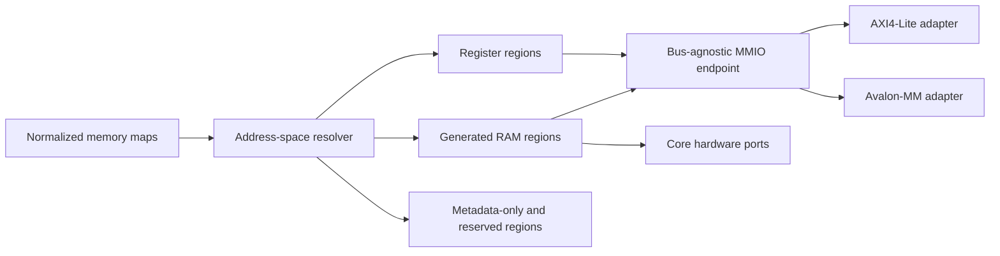

# Generated RAM Buffers

## Status

Draft concept. This document proposes generator behavior; it does not describe
functionality available today.

## Problem

The memory-map schema can describe an address block with `usage: memory`, but
the HDL generators only implement registers. A memory block currently survives
normalization and appears in generated metadata, while the bus-facing HDL has
no storage or address decoder for it.

The DAQ controller makes the mismatch visible:

```yaml
- name: SAMPLE_BUFFER
  baseAddress: 0x1000
  range: 4K
  usage: memory
  description: 1024 x 32-bit sample buffer, backed by a separate BRAM
```

For this input, the current register projection:

- emits no storage for `SAMPLE_BUFFER`;
- calculates `addr_map_size` and `addr_width` from the last register instead of
  the complete address map;
- truncates the bus address before it can reach `0x1000`; and
- can only return register data from the bus-agnostic register file.

`usage: memory` is therefore metadata, not an executable hardware contract.

## Goal

Allow a memory address block to opt into a synthesizable, bus-accessible RAM
with a second native port for the generated core. The same normalized memory
description must drive:

- address-space validation and sizing;
- the versioned template context;
- VHDL and SystemVerilog generation;
- AXI4-Lite and Avalon-MM access;
- vendor metadata; and
- generated verification.

The generated RTL should infer ordinary FPGA block RAM where supported. The
concept must not depend on a Xilinx or Intel memory primitive.

## Non-goals for the first version

- AXI burst support;
- asynchronous clock-domain crossing;
- ECC, parity, or byte-enable behavior on the hardware-side port;
- initialization files;
- asymmetric bus and hardware port widths;
- multiple bus interfaces exposing the same memory map;
- vendor-specific RAM primitives; and
- adding Memory Map editor controls in the first generator increment.

These can be added after the address-space and transaction contracts are
stable. Note that editor *controls* are a non-goal but normalization is not: the
new fields have to survive an editor round-trip from the moment they are
authorable, for the reason given under the authoring model below.

## Proposed authoring model

Keep `usage` as the IP-XACT-compatible classification and add an explicit
implementation request. Existing memory blocks remain descriptive unless they
opt in.

```yaml
- name: SAMPLE_BUFFER
  baseAddress: 0x1000
  range: 4K
  usage: memory
  access: read-only
  defaultRegWidth: 32
  implementation: inferredRam
  hardwareAccess: write-only
  description: 1024 x 32-bit sample buffer
```

Proposed fields on an address block:

| Field            | Values                                          | Default    | Meaning                             |
| ---------------- | ----------------------------------------------- | ---------- | ----------------------------------- |
| `implementation` | `metadata`, `inferredRam`                       | `metadata` | Whether the generator emits storage |
| `hardwareAccess` | `none`, `read-only`, `write-only`, `read-write` | `none`     | Native access exposed to core logic |

Both property names are camelCase in schemas and TypeScript. Template-context
projections use the existing snake_case convention.

An address block already carries `access`, which resolves to the shared
`AccessType` definition used by registers and bit fields. That definition has
seven values, including the write-1-to-clear and self-clearing forms, which are
meaningless for a memory window. `hardwareAccess` therefore needs its own
four-value definition rather than a reference to `AccessType`, and the two
fields must be documented together so the difference between "what software may
do" and "what the core may do" is unambiguous at the authoring surface.

Registers express the same idea implicitly: a `read-only` register is understood
to be hardware-driven, and the generator derives its hardware ports from the
software access mode alone. Memory blocks get an explicit, orthogonal field
because a buffer that is readable by software and writable by the core cannot be
described by one access string. The inconsistency is deliberate; a later
revision may add an explicit `hardwareAccess` to registers, but this concept
does not change register behavior.

### Where the new fields have to be added

The address-block definition is duplicated: once in the memory-map schema and
once inside the IP-core schema, which embeds memory maps. Both copies must
change, and both live in the `ipcraft-spec` submodule as committed generated
artifacts, so the schema change is an upstream pull request plus a submodule
bump rather than a local edit.

Downstream of the schemas, the same block shape exists in the generated IP-core
types, in the two older hand-maintained webview type files, and in the
hand-written normalized domain type used by the editor at runtime. The type
generator does not read the memory-map schema, so only one of those files is
regenerated; the rest are manual.

Normalization is the part that cannot be deferred. The memory-map normalizer
rebuilds each address block from a fixed set of keys instead of copying unknown
properties through, so a hand-authored `implementation:` is dropped the moment
the editor parses the file. Scalar cell edits are unaffected because they are
written as targeted path edits, but any block insert, delete, or reorder
rewrites the whole block array from the normalized model and would erase the new
fields from every block in the map. Extending the normalized address-block type
is therefore a prerequisite of authoring support, not a later editor task.

`implementation: inferredRam` is valid only when:

- `usage` is `memory`;
- `range` resolves to a positive byte count;
- `defaultRegWidth` is a positive multiple of eight;
- `baseAddress` and `range` are aligned to the word size;
- `range` is an integer multiple of the word size;
- the resulting depth in words is a power of two;
- `access` is `read-only`, `write-only`, or `read-write`; and
- the pair of `access` and `hardwareAccess` resolves to a realizable memory
  shape in the table under "Selecting the memory shape".

The bus data width and `defaultRegWidth` must match in the first version.
Rejecting mismatched widths is preferable to silently dropping or duplicating
bits.

The string size forms already accepted by the schema, such as `4K` and `1M`,
need one canonical parser shared by validation, address resolution, metadata,
and template projection. Suffixes mean powers of 1024.

A correct suffix parser already exists in the webview block-size helper, but it
is module-private and unreachable from the generator, and three other consumers
disagree with it today:

- the IP-XACT emitter calls `Number(range)`, so `4K` becomes `NaN` and the
  authored range is silently replaced by the computed register extent;
- the layout engine accepts only a numeric `range`, so `4K` degrades to the
  literal value 4; and
- the block-size helper itself ignores `range` entirely once a block contains at
  least one register.

The work is therefore to consolidate on the existing parser and retire those
three divergent paths, rather than to write a new one. Until that is done, the
editor and the generator do not agree on how large `SAMPLE_BUFFER` is.

Consolidation is not a pure move. The existing helper accepts a decimal
mantissa and floors the result, so `1.5K` silently becomes 1536 and `1.1K`
becomes 1126, which is neither a round size nor an error. The first version
rejects a fractional size instead. That makes the promotion a behavior change to
an existing webview helper, and it needs its own test rather than riding along
with the resolver work.

### Why generation is opt-in

Existing projects use `usage: memory` to reserve or document address space.
Automatically turning every such block into storage would change resource
usage and top-level behavior during regeneration. An explicit
`implementation` preserves compatibility and separates these meanings:

- `metadata`: describe a memory window owned elsewhere;
- `inferredRam`: ask IPCraft to implement the window.

A later `external` implementation could forward bus-side requests to
user-owned logic, but that protocol should be designed separately.

## Generated hardware contract

### Bus port

The bus port operates on byte addresses. Within a generated RAM block:

```text
wordIndex = (busAddress - baseAddress) / wordBytes
depth     = rangeBytes / wordBytes
```

That division is only meaningful for an aligned address. A request whose low
address bits are nonzero is rejected as an invalid address rather than floored
into the containing word, matching the exact-address decoding the register bank
already performs. Sub-word access is expressed with byte enables, not with a
shifted address, and both bus adapters need a test for it.

Bus writes honor the bus byte-enable lanes. Disabled bytes retain their
previous values. Bus reads are synchronous and return one cycle after the read
request, matching the current register-file read timing.

Block `access` controls software access:

| Access       | Bus read                                          | Bus write                                            |
| ------------ | ------------------------------------------------- | ---------------------------------------------------- |
| `read-only`  | Allowed                                           | Error or ignored where the bus has no error response |
| `write-only` | Error or zero where the bus has no error response | Allowed                                              |
| `read-write` | Allowed                                           | Allowed                                              |

### Hardware port

`hardwareAccess` is stated from the core's perspective and is independent of
software `access`. Each block with `hardwareAccess` other than `none` exposes a
word-addressed synchronous port between the generated MMIO endpoint and the
core, expressed as block-specific aggregates rather than unrelated top-level
ports.

It cannot be one aggregate. A VHDL record port and a SystemVerilog packed-struct
port carry a single direction for the whole object, and a read-write hardware
port mixes core-driven members with RAM-driven ones. The existing register
interface already solves this by splitting `t_regs_sw2hw` from `t_regs_hw2sw`,
and the hardware port follows the same rule with a request bundle and a response
bundle:

```text
request  (core -> RAM):  en, addr, write, wdata
response (RAM -> core):  rdata, rvalid
```

`read-only` omits `write` and `wdata` from the request; `write-only` omits the
response bundle entirely. The hardware address is a word index from zero, not an
absolute byte address.

Its width is `max(1, ceil(log2(depth)))`, so a one-word memory still has a
one-bit port rather than a null range. The first version additionally requires
the depth in words to be a power of two, because otherwise the top of the
address space indexes past the end of the array and the generated HDL would need
a bounds guard that also obstructs memory inference. Relaxing that to an
arbitrary word-multiple range is a later change and needs an explicit
out-of-range rule for both ports.

The bus and hardware ports share the primary bus clock and reset in the first
version. The memory contents are not reset; FPGA RAM reset semantics are
device-specific and resetting every word often prevents block-RAM inference.

Sharing one clock is a real constraint on the motivating example: acquisition
logic usually runs on a converter clock rather than the bus clock, so a DAQ core
must cross into the bus clock domain itself until asynchronous ports are
supported. This is the main reason the first version is worth keeping small.

### Concurrent access

The generated memory has two independently addressed synchronous ports:

- the bus owns port A;
- the core owns port B;
- accesses to different words proceed independently; and
- same-cycle same-word access needs an explicit rule per case, below.

Three same-address cases must be distinguished. They behave differently, and
only one of them is an error.

**Read during write on one port**, which arises only in the true dual-port shape
where a single port both reads and writes, is defined rather than unspecified.
Since the first version generates no single-address-port memory, this is the
narrower of the two cases. The templates below use a
clocked array whose update is scheduled, so a read issued in the same cycle as a
write to the same word returns the previous contents. The first version adopts
that as the contract: same-port read-during-write returns old data. Stating it
is safer than calling it undefined, because the generated HDL behaves that way
whether or not the document says so, and a later template rewrite could change
it silently.

**Read during write across ports**, which applies to both dual-port shapes, is
genuinely undefined on real block RAM, and this is the dangerous case. A
single-process model simulates it as clean old data, so a testbench can pass in
simulation while hardware differs. The generated memory must therefore drive `X`
on a cross-port same-address read, or the generated scenarios must exclude that
access pattern, so the board gate is not the only thing that can detect the
mismatch. The same reasoning applies to the write priority that a single process
imposes in the true dual-port variant, which real dual-port memory does not have.

**Two writes to the same word** is an error wherever both ports can write, and
simulation should assert on it.

Note that cross-port read-during-write is *normal* for the motivating DAQ
configuration, where software polls the buffer while the core fills it. It is
the returned data that is unreliable, not the access itself, so the scenarios
must avoid depending on it rather than warn on every occurrence.

Designs that require deterministic cross-port collision behavior must arbitrate
before driving the hardware port.

### Bus-side concurrency

The bus itself needs two ports, not one. The endpoint's read and write requests
are independent, and the AXI4-Lite adapter drives `wr_en` and `rd_en` from
separate channel handshakes, so both can be asserted in the same cycle at
different addresses. Neither the endpoint contract nor the Avalon-MM adapter has
an acceptance or backpressure signal today, and adding one would change both
adapters and the AXI channel handshakes.

The first version therefore never generates a single-address-port RAM. Storage
that is bus-readable and bus-writable uses a one-read one-write shape with the
bus owning both ports. Arbitration with backpressure remains possible later, and
would be the way to recover a genuine single-port implementation, but it is a
separate transaction-contract change.

One consequence follows directly, and it is easy to get wrong. Because the two
bus directions land on *separate* RAM ports, a bus read and a bus write to the
same word in the same cycle is a **cross-port** collision, not a same-port one.
It therefore follows the undefined rule and must be made visible as `X`; it does
not inherit the same-port old-data guarantee, even though both accesses come
from the same bus master and a reader might reasonably expect read-before-write
ordering. The current register bank does handle that case cleanly, so this is a
genuine behavioral difference between a register and a generated RAM at the same
address space. Generated scenarios must not depend on the value returned.

### Selecting the memory shape

Here, "dual-port" describes two independently addressed synchronous ports. There
are exactly two of them, so shape selection is a port budget, not a preference.
Each access mode costs:

| Requirement                                        | Ports |
| -------------------------------------------------- | ----: |
| Bus `read-only` or `write-only`                    |     1 |
| Bus `read-write`, concurrent acceptance            |     2 |
| Bus `read-write`, arbitrated acceptance            |     1 |
| Hardware `none`                                    |     0 |
| Hardware any other mode                            |     1 |

Bus `read-write` costs two ports **only because the first version accepts a read
request and a write request in the same cycle**, as described above. That cost is
a property of the acceptance rule, not of the access mode: an endpoint that
arbitrates the two directions onto one port pays one, and every budget below
changes accordingly. The whole table therefore holds only under the
no-arbitration contract this version adopts.

The hardware port costs one in every mode, because its `write` member selects the
direction and it never reads and writes in the same cycle.

A combination is realizable when the total is at most two *and* the block has
both a producer and a consumer. Every combination:

| Bus access   | Hardware access | Generated memory shape                                |
| ------------ | --------------- | ----------------------------------------------------- |
| `read-only`  | `none`          | Rejected: no writer, and initialization is a non-goal |
| `read-only`  | `read-only`     | Rejected: no writer                                   |
| `read-only`  | `write-only`    | Simple dual-port: hardware writes, bus reads          |
| `read-only`  | `read-write`    | True dual-port, single clock                          |
| `write-only` | `none`          | Rejected: no reader                                   |
| `write-only` | `read-only`     | Simple dual-port: bus writes, hardware reads          |
| `write-only` | `write-only`    | Rejected: two writers, no reader                      |
| `write-only` | `read-write`    | True dual-port, single clock                          |
| `read-write` | `none`          | Simple dual-port: bus owns both ports                 |
| `read-write` | `read-only`     | Rejected in the first version: needs three ports      |
| `read-write` | `write-only`    | Rejected in the first version: needs three ports      |
| `read-write` | `read-write`    | Rejected in the first version: needs three ports      |

The last three are the important limitation. A buffer that software can both
read and write *and* that the core also touches needs three logical ports under
the concurrent-acceptance rule, which no ordinary block RAM provides. Recovering
them means arbitrating the two bus directions onto one port, which drops that
requirement back to two.

Arbitration is not uniformly available, and the Avalon-MM case decides it. Two
separate limits apply, and they must not be conflated.

First, what the bus definition declares. Every signal that would let a slave
defer an accepted read is `presence: optional` in the Avalon-MM definition:
`readdatavalid`, `waitrequest`, their inverted forms `readdatavalid_n` and
`waitrequest_n`, plus `writeresponsevalid` and `response`. An interface may
legitimately declare none of them.

Second, and more restrictive, what the generated adapter actually supports. Both
Avalon adapters recognize exactly two of those six: positive-polarity
`readdatavalid` and `waitrequest`. The inverted forms, `writeresponsevalid`, and
`response` are not wired at all, so declaring `waitrequest_n` in place of
`waitrequest` yields a slave with no deferral mechanism even though the bus
definition considers the interface complete.

An Avalon configuration outside that supported pair is a fixed-latency,
always-ready slave with no way to stall a request or delay a response, so
arbitration there is not transparent: it would either break the fixed-latency
contract or require ports the adapter cannot currently consume. AXI4-Lite has no
equivalent problem, since its channel handshakes are always present.

So arbitration cannot simply be declared a later refinement. It must be gated on
a specifically supported signal set rather than on what the bus definition
permits, and any option that relies on the four unsupported signals has to carry
the adapter work as part of its scope. Either way it gives up the fixed
one-cycle read latency the rest of this document relies on. It is deferred rather
than designed here, and it is the main reason to expect a second increment.

This specialization matters because a simple dual-port RAM has one write port
and one read port, while a true dual-port RAM allows both ports to write.
Calling every configuration "simple dual-port" would hide a material synthesis
difference.

Because no realizable combination resolves to a single-address-port memory, the
first version generates two shapes per language rather than three.

### Portable inference templates

The built-in pack must generate standard synchronous HDL rather than instantiate
Xilinx `xpm_memory_*`, Intel `altsyncram`, or another vendor primitive. Vivado
and Quartus should infer the device memory resource from the same generated
source.

The portable subset is:

- `ieee.numeric_std` for VHDL address conversion;
- a clocked read with a registered output;
- no reset or bulk clear of the memory array;
- no initialization file;
- one shared clock in the first version;
- equal widths on both ports;
- byte enables only where the access contract requires them; and
- no synthesis attributes in the portable template.

Do not copy the Xilinx shared-variable example verbatim. Its
`std_logic_unsigned`, `conv_integer`, and unprotected `shared variable` usage
is accepted by some tool modes but is not a good cross-vendor VHDL contract.

For the common DAQ configuration (`access: read-only`,
`hardwareAccess: write-only`), generate this simple dual-port VHDL shape:

```vhdl
library ieee;
use ieee.std_logic_1164.all;
use ieee.numeric_std.all;

entity sample_buffer_ram is
  generic (
    G_DATA_WIDTH : positive := 32;
    G_DEPTH      : positive := 1024;
    G_ADDR_WIDTH : positive := 10
  );
  port (
    clk    : in  std_logic;
    wr_en  : in  std_logic;
    wr_addr: in  std_logic_vector(G_ADDR_WIDTH - 1 downto 0);
    wr_data: in  std_logic_vector(G_DATA_WIDTH - 1 downto 0);
    rd_en  : in  std_logic;
    rd_addr: in  std_logic_vector(G_ADDR_WIDTH - 1 downto 0);
    rd_data: out std_logic_vector(G_DATA_WIDTH - 1 downto 0)
  );
end entity;

architecture rtl of sample_buffer_ram is
  type ram_type is array (0 to G_DEPTH - 1)
    of std_logic_vector(G_DATA_WIDTH - 1 downto 0);
  signal ram : ram_type;
begin
  process (clk)
  begin
    if rising_edge(clk) then
      if wr_en = '1' then
        ram(to_integer(unsigned(wr_addr))) <= wr_data;
      end if;
      if rd_en = '1' then
        rd_data <= ram(to_integer(unsigned(rd_addr)));
      end if;
    end if;
  end process;
end architecture;
```

Generate the equivalent SystemVerilog shape from the same resolved context:

```systemverilog
module sample_buffer_ram #(
  parameter int DATA_WIDTH = 32,
  parameter int DEPTH = 1024,
  parameter int ADDR_WIDTH = 10
) (
  input  logic                  clk,
  input  logic                  wr_en,
  input  logic [ADDR_WIDTH-1:0] wr_addr,
  input  logic [DATA_WIDTH-1:0] wr_data,
  input  logic                  rd_en,
  input  logic [ADDR_WIDTH-1:0] rd_addr,
  output logic [DATA_WIDTH-1:0] rd_data
);
  logic [DATA_WIDTH-1:0] ram [0:DEPTH-1];

  always_ff @(posedge clk) begin
    if (wr_en)
      ram[wr_addr] <= wr_data;
    if (rd_en)
      rd_data <= ram[rd_addr];
  end
endmodule
```

Both listings assign to the array with a scheduled, non-blocking update, so a
read issued in the same cycle as a write to the same address returns the
previous contents. Where one port both reads and writes, in the true dual-port
shape, that is the defined same-port read-during-write behavior described above,
and a simulation check should pin it down so a later template rewrite cannot
change it silently.

In the simple dual-port listing shown here, however, `wr_addr` equal to
`rd_addr` is the *cross-port* case, and there the old-data result is an artifact
of the model rather than a guarantee. Real block RAM does not define it. Written
as above, these templates make an undefined condition look clean in simulation,
which is precisely the failure mode to avoid: a cocotb suite would pass while the
board could differ. The generated memory must drive `X` when the two addresses
collide, or the generated scenarios must never depend on the returned value.

The true dual-port variants use the same array and registered-read rules, but
provide `en`, `write`, `addr`, `wdata`, and `rdata` for each port. The bus port
also has `wstrb`; hardware-port writes remain full-word in the first version.
Use a single clocked process or `always_ff` block so there is one HDL writer for
the array. Apply bus byte strobes as per-byte array slices. Both variants must
pass Vivado and Quartus inference tests before being added to the built-in
pack.

A scaffold pack may replace the portable module with a primitive-backed
implementation by shadowing the built-in template of the same file name; the
pack template directory is searched before the built-in one. There are no
vendor-specific packs today, and vendor output is produced by the Vivado and
Quartus toolchain services rather than by a pack, so a primitive-backed RAM
would be the first use of the shadowing mechanism for vendor purposes. Any such
replacement must preserve the generated entity or module ports, one-cycle read
latency, byte-enable behavior, and collision contract. The portable built-in
template remains the reference behavior.

## Generator architecture

RAM support belongs beside register preparation, not inside bus-specific
templates.



### Address-space resolver

Add a pure resolver that produces a sorted, validated list of regions for **one**
address space. It owns:

- parsing byte-size strings;
- calculating each half-open interval `[baseAddress, endAddress)`;
- detecting overlaps;
- calculating the complete address width;
- distinguishing implemented, metadata-only, and reserved regions; and
- deriving RAM word width, depth, and local address width.

The scoping matters. A bus interface names its map through `memoryMapRef`, and
two independent maps may legally use overlapping addresses because they are
reached through different interfaces. Register preparation ignores this today and
flattens every resolved map into one sorted list, which is already latent
incorrectness and becomes a false overlap error once the resolver validates
address space. The resolver must therefore be keyed by interface: resolve the map
referenced by the primary memory-mapped slave, and reject rather than merge a
configuration that presents more than one address space, until per-interface
region sets are supported.

`addressingResolver` should consume this result. `addr_width` must cover the
highest declared block end, while bus success must come from an implemented
region hit rather than the current `address < addr_map_size` approximation.
This prevents holes and reserved blocks below the highest address from being
reported as valid registers.

`addr_map_size` itself must not be widened. The contract documents it as the
exclusive end of the mapped *register* address space, and a compatible pack that
range-checks with `address < addr_map_size` would silently start accepting holes
and metadata windows if the value grew to cover all blocks. That is a change in
meaning, not an addition, and would be a major contract revision. Keep the key
as it is defined and add a separate total-extent value for the complete address
space; `addr_width` derives from the new value.

Widening `addr_width` is a behavior change, not only a fix. Today the value is
derived from the last register alone, so every existing project that declares a
`memory` or `reserved` block will regenerate with a different address-constant
width once blocks are included. The DAQ controller moves from roughly seven bits
to thirteen. This changes generated HDL and the generator snapshot baseline, and
needs a migration note when it lands.

The resolver must also reconcile the derived width against the authored bus
port. The relevant authoring surface is the address entry of a bus interface's
port width overrides, which the register conformance example already uses. A
separate top-level address-width field is read by the addressing resolver but is
absent from the IP-core schema and is never written, so it is not the mechanism
to validate against. The failure this prevents is worse than truncation: the
AXI4-Lite adapter slices the address port down to the derived constant width, so
an authored port narrower than the map produces an out-of-range slice at
elaboration rather than a wrapped address.

### Template context

Add a top-level `memory_blocks` array to the generator contract. A projected
entry should contain resolved values so templates perform no size parsing or
address arithmetic:

```yaml
memory_blocks:
  - name: SAMPLE_BUFFER
    base_address: 4096
    range_bytes: 4096
    word_width: 32
    word_bytes: 4
    depth_words: 1024
    local_addr_width: 10
    access: read-only
    hardware_access: write-only
```

Also add:

```yaml
has_memory_blocks: true
address_space_end: 8192
implemented_regions:
  - kind: register
    base_address: 0
    end_address: 96
  - kind: memory
    base_address: 4096
    end_address: 8192
```

`address_space_end` is the total extent described above. `addr_map_size` keeps
its documented register-only meaning so existing packs are not reinterpreted.

`memory_blocks` is a derived flat view, not a replacement for the existing
`memory_maps[].address_blocks[]` projection, which already carries `usage` and
the raw authored `range`. That projection keeps its current shape so existing
packs are unaffected; the new array exists so templates never parse a size
string or compute an address. The two must be produced from one resolver result
so they cannot disagree.

Adding these fields is backward-compatible for built-in templates, but it
changes the public scaffold-pack contract and therefore requires a minor
contract version increment. The new top-level keys must be declared optional:
the contract schema sets `additionalProperties: false` and lists every currently
required key, so an undeclared addition fails context validation outright and a
newly required one breaks any caller that builds a context.

The increment is four coordinated edits: add the optional properties and bump
the version constant in the contract schema, regenerate the contract types, bump
the exported contract version, and update the version assertion in the
conformance test. Packs declaring a caret range on the current major keep
working.

### Bus-agnostic endpoint

The module currently named `<entity>_regs` is already the bus-agnostic target
for reads and writes. In the first increment it can retain that generated file
and entity name for compatibility, while its responsibility becomes the
complete implemented MMIO address space:

1. decode a request once;
2. route it to a register bank or RAM block;
3. return read data and completion; and
4. report whether the address and operation were valid.

The endpoint needs an explicit response contract, for example:

```text
wr_en, wr_addr, wr_data, wr_strb -> wr_valid, wr_error
rd_en, rd_addr                   -> rd_data, rd_valid, rd_error
```

Only part of this is new. The register bank already has `rd_valid` and already
asserts it one cycle after every `rd_en`, mapped or not; the write side has no
acknowledgement at all. So `wr_valid`, `wr_error`, and `rd_error` are the
additions, and `rd_valid` keeps its present meaning of "a response is available"
rather than "the address was decoded". Because these are ports on a generated
entity, adding them changes the entity's interface. That is the real
compatibility question for the current `<entity>_regs` name, and it affects any
hand-written top level that instantiates the bank; keeping the file name
unchanged does not avoid it.

Address-hit truth moves from the adapters into the endpoint. AXI4-Lite already
maps out-of-range accesses to `SLVERR` on both the write and read channels, so
for that adapter the change is a relocation of existing logic, not new behavior.
Avalon-MM performs no address checking at all today and hardwires its wait
request low, so an out-of-range read currently returns the register bank's
default of zero with no indication; that adapter changes more than AXI4-Lite
does.

The Avalon-MM bus definition does define an optional two-bit response signal,
along with a write-response-valid signal. The generated adapter ignores both.
The first version continues to ignore them and completes the transfer with zero
data for an invalid read, keeping the behavior visible in generated simulation
checks; that is a deliberate decision to keep the port list stable, not an
absence of any mechanism. Adopting the optional response is the natural follow-up
once the endpoint reports errors, but it is adapter work rather than a wiring
change: neither signal appears in either Avalon adapter today, so there is no
guarded path waiting to be enabled. The same distinction governs the arbitration
question above.

Read latency needs one explicit rule. Register reads and RAM reads are both
registered and both land one cycle after the request, so the endpoint's read-data
multiplexer must be selected by the *registered* region hit. Selecting it
combinationally, or registering the decode before driving the RAM address, adds
a second cycle and breaks the one-request-to-one-response timing this document
requires everywhere else.

Do not model RAM words as expanded registers. A 4 KiB buffer would create 1024
register objects, inflate the template context, produce large case statements,
and usually synthesize flip-flops instead of block RAM.

### Generated files

Keep RAM implementation in focused templates:

```text
rtl/<entity>_ram_<block>.vhd
rtl/<entity>_ram_<block>.sv
```

The MMIO endpoint instantiates these modules. Keeping storage separate from
register behavior makes RAM inference easy to inspect and allows later
replacement with a vendor-specific implementation.

The scaffold manifest cannot express this today. A file rule is a fixed source,
target, and condition, evaluated exactly once, and the loader has no iteration
binding, so a manifest cannot emit one file per implemented block. Two ways
forward exist: add an iterable rule to the pack manifest schema, or have the
scaffolder emit the per-block files directly. The first version should take the
second route, because it needs no public manifest change and the files are still
rendered through the pack-aware template loader, so a pack can shadow
`inferred_ram_*.j2` by name. The cost is that a pack cannot suppress or rename
these files; an iterable rule is the follow-up that restores that control. Either
way, this is a delivery step in its own right and not a consequence of adding
templates.

The package templates define the block-specific hardware-port records or
packed structures. The top and core templates wire those typed ports without
adding address decoding to the user-owned core stub.

The source templates should be access-specialized rather than one template
containing every possible port:

```text
inferred_ram_simple_dual_port.vhdl.j2
inferred_ram_true_dual_port.vhdl.j2
inferred_ram_simple_dual_port.sv.j2
inferred_ram_true_dual_port.sv.j2
```

There is no single-address-port template in the first version, because no
realizable access-mode combination selects one. A single-port shape becomes
available only once the endpoint gains arbitration and backpressure.

All four templates consume the same resolved memory-block contract. Their
selection is generator logic and must not be repeated in scaffold manifests or
bus templates.

## DAQ controller result

After opting in, `SAMPLE_BUFFER` becomes 1024 words of 32 bits:

| Property               |                     Value |
| ---------------------- | ------------------------: |
| Bus byte range         | `0x1000` through `0x1fff` |
| Word indices           |        `0` through `1023` |
| Bus byte lanes         |                         4 |
| Hardware address width |                   10 bits |
| Storage                |                  32 Kibit |

Acquisition logic writes samples through the hardware port. Software reads the
same words through AXI4-Lite. The natural DAQ contract is therefore
`access: read-only` with `hardwareAccess: write-only`, and in the first version
it is also the only available one: adding software write access would raise the
port budget to three and be rejected. Making the buffer software-writable means
giving up the hardware fill port until arbitration exists.

The DAQ interface address width must cover the end of the buffer. A 13-bit byte
address is required for addresses through `0x1fff`. An authored 12-bit address
entry in the bus interface's port width overrides cannot represent that range
and must fail validation, rather than producing an out-of-range address slice
inside the generated adapter.

## Additional RAM conformance example

Add `examples/ram_buffer_conformance_avmm` as a generated Avalon-MM example and
DE10-Nano hardware target. It should be smaller and more diagnostic than the
DAQ controller, and contain three implemented memory blocks:

```yaml
- name: RAM_BUFFER_CONFORMANCE
  addressBlocks:
    - name: SAMPLE_BUFFER
      baseAddress: 0x1000
      range: 4K
      usage: memory
      access: read-only
      defaultRegWidth: 32
      implementation: inferredRam
      hardwareAccess: write-only

    - name: SCRATCHPAD
      baseAddress: 0x2000
      range: 1K
      usage: memory
      access: read-write
      defaultRegWidth: 32
      implementation: inferredRam
      hardwareAccess: none

    - name: CORE_SCRATCH
      baseAddress: 0x2400
      range: 1K
      usage: memory
      access: read-only
      defaultRegWidth: 32
      implementation: inferredRam
      hardwareAccess: read-write
```

`SAMPLE_BUFFER` proves the natural acquisition path: a small example core
writes a deterministic counter or seeded pattern through the hardware port,
then software reads and checks it over Avalon-MM. Control/status registers
start the fill, report completion, and expose the seed without adding special
test-only ports to the RAM.

`SCRATCHPAD` proves software writes, reads, and byte enables against a
bus-only buffer, which is the shape where the bus owns both ports. It is
deliberately not also core-visible: software read-write combined with any
hardware access exceeds the port budget in the first version, so a block that
tried to do both would be rejected at generation.

`CORE_SCRATCH` supplies the missing observation path and the only true dual-port
selection. The core reads and writes it through the hardware port and exposes a
checksum register; software reads the same words back and checks agreement.
Together the three blocks exercise both generated shapes and every realizable
access-mode class without requiring the full DAQ application.

Keep hand-written scenario logic, the example core, and the DE10-Nano harness
as `managed: false` files so regeneration updates the RAM and bus endpoint
without overwriting the verification behavior.

The scenario module is hand-written and is already byte-identical in the
Avalon-MM and AXI4-Lite register conformance examples. Adding a third copy is an
explicit decision, not an oversight: the shared scenario layer should either be
promoted into the generator alongside the verification manifest, or the
duplication should be accepted and recorded here. This concept does not require
an AXI4-Lite twin of the RAM example in the first version, because the Avalon-MM
example is the one with a hardware gate.

## Diagnostics

Diagnostics split into two phases, and the split is forced by where information
still exists.

**Before normalization**, against the raw parsed map, with the file path and
property name retained:

- an unrecognized block property, including a misspelling such as
  `hardware_access`;
- an `implementation` or `hardwareAccess` value outside its enumeration; and
- a malformed size string, including a fractional size.

These cannot be deferred to the resolver. Normalization rebuilds each address
block from a known set of keys, so by the time the resolver runs, a misspelled
property has already been discarded and there is nothing left to report. Nothing
enforces this today either: the memory-map schema is not compiled by any
production code path, the editor's validate command is a YAML syntax check only,
and the address-block definition does not set `additionalProperties: false`, so
both the new fields and a misspelling validate without complaint. Raw-input
validation with provenance has to be added.

**After normalization**, in the address-space resolver, where addresses are
resolved and comparable:

- overlapping address blocks within one address space;
- a generated RAM with a missing or invalid range;
- unaligned base or range, or a depth that is not a power of two;
- a RAM width that differs from the bus data width;
- an address-port override too narrow for the declared map;
- an `access` and `hardwareAccess` pair with no realizable shape;
- more than one address space presented to the generator; or
- duplicate normalized block names.

A `usage: memory` block left as `implementation: metadata` is valid. The
built-in scaffold may show an informational staging diagnostic that no HDL is
generated for it, but custom packs must still be able to consume its metadata.

## Verification strategy

### Resolver tests

- parse integer, hexadecimal, `4K`, and `1M` ranges;
- reject malformed or fractional sizes, including the `1.5K` form the current
  helper accepts;
- calculate region ends and address widths, including the one-word case where the
  local address width clamps to one;
- reject overlaps and alignment errors, and a depth that is not a power of two;
- reject a too-narrow authored bus address width;
- reject every access-mode pair with no realizable shape;
- resolve only the map referenced by the primary memory-mapped interface, and
  reject a second address space rather than merging it; and
- project stable `memory_blocks` context entries while leaving `addr_map_size`
  at its register-only value.

### Generated-template tests

For both VHDL and SystemVerilog:

- render the expected simple dual-port or true dual-port template from each
  realizable access-mode combination;
- compile the generated array with GHDL and Icarus Verilog;
- apply bus write strobes per byte;
- reject an unaligned bus address instead of flooring it into the containing
  word, on both bus adapters;
- service a bus read and a bus write to different words in the same cycle;
- expose hardware ports only when requested, as separate request and response
  aggregates;
- avoid resetting the memory array;
- decode the first and last word of each block;
- confirm the same-port read-during-write result is old data, and that a
  cross-port same-address read is not silently reported as valid data; and
- return an error for holes, reserved space, and out-of-range addresses.

Do not use source-text matching as the primary proof of RAM behavior. Compile
and simulate the rendered HDL; reserve text assertions for properties such as
the absence of a reset loop or vendor primitive.

### Cocotb testbench verification

Extend the generated verification manifest with resolved memory regions and
access capabilities. Add a transport-independent RAM scenario module, modeled
after the existing register conformance scenarios, and run the same logical
checks through AXI4-Lite, Avalon-MM, and the DE10-Nano hardware transport.

The manifest has no notion of an address region today: it carries a bus
description, policy flags, and a flat register list, and its consumer model is
keyed entirely on register offsets. Adding memory regions means a manifest
schema version bump and a new consumer alongside the register model, not a field
addition. The narrow transport interface the scenarios use — read, write, and
write sequence, plus capability flags — already exists and does not need to
change.

The testbench must:

1. write and read every bus-writable memory using walking-bit, address-derived,
   and seeded pseudorandom patterns;
2. verify partial-byte writes for every byte lane and confirm disabled bytes
   retain their previous value;
3. drive the hardware port directly, then read the result through the bus;
4. write through the bus, then check the value or checksum observed by the
   hardware port;
5. check the first word, last word, and transitions between register, hole,
   reserved, and RAM regions;
6. verify read-only and write-only behavior;
7. issue simultaneous accesses to different words on both ports;
8. flag same-address collisions instead of depending on returned data; and
9. use a fixed default seed while accepting a reported override for
   reproducibility.

Never compare uninitialized RAM contents. Each test must write a location
before reading it, or use the example core's deterministic fill-complete
handshake.

Run the standalone RAM tests for both HDL languages before testing the complete
MMIO endpoint. This separates inference-template failures from AXI/Avalon
transaction failures.

### Vendor synthesis verification

Generated HDL compilation proves syntax and behavior but not block-memory
inference. Add synthesis gates for one representative 1024 x 32-bit memory:

- Vivado must infer a block-memory resource and must not implement the array as
  thousands of flip-flops or LUT RAM.
- Quartus must infer an embedded memory resource appropriate to the selected
  device. The DE10-Nano Cyclone V target should report M10K usage for the
  buffer.
- Synthesis elaboration must preserve the expected width and depth; simulation
  tests remain the proof of one-cycle read latency.

Both existing vendor tests only check that the tool exited successfully; no
utilization value is asserted anywhere today, so these gates are entirely new
work.

Parse stable machine-readable or Tcl-queryable utilization data rather than
matching human-formatted report prose. Record the tool version, target part,
and inferred resource counts in the test result. The extension's report parser
is the precedent to avoid here: it recognises utilization by matching formatted
report text and exists to populate the reports view, not to gate anything. A
synthesis gate needs a queryable source, and should not extend that parser.

### DE10-Nano hardware verification

Use `examples/ram_buffer_conformance_avmm` for the board gate and follow the
existing `regmap_conformance_avmm` structure:

```text
examples/ram_buffer_conformance_avmm/
  tb/ram_scenarios.py
  tb/verification_manifest.json
  tb/register_model.py
  tb/conftest.py
  tb/Makefile
  tb/ram_buffer_conformance_test.py
  tb/test_ram_buffer_conformance_sim.py
  altera/debug/hardware_runner.py
  altera/hdl/de10_nano_top.vhd
  altera/qsys/ram_buffer_conformance_system.tcl
  altera/quartus/de10_nano_project.tcl
  altera/quartus/de10_nano_pin_assignments.tcl
  altera/quartus/de10_nano.sdc
  altera/quartus/Makefile
```

The generated Quartus integration artifacts and the retained results document
follow the same naming as the register conformance example.

The Platform Designer system contains the generated Avalon-MM peripheral and a
JTAG-to-Avalon-MM master. The hardware runner must reuse the same manifest and
scenario definitions as cocotb through a narrow `read`, `write`, and
`write_sequence` transport interface.

The board workflow is:

1. regenerate the example and verification manifest;
2. run the VHDL cocotb suite;
3. generate Platform Designer output;
4. compile and fit the Cyclone V project;
5. inspect the Quartus resource report and fail unless the RAM maps to M10K
   blocks;
6. program `de10_nano.sof`;
7. run the manifest scenarios through System Console and JTAG-to-Avalon-MM; and
8. write `output_files/hardware-result.json`.

The hardware result records the Git revision, generated bitstream SHA-256,
manifest SHA-256, board identifier, Quartus version, random seed, individual
checks, resource inference summary, and overall pass/fail status. The existing
runner already writes every one of these except the resource inference summary,
so that field is the only addition. LEDs may show runner progress and failure
state, but the JSON result is the automated acceptance artifact.

Required on-board checks are:

1. core pattern fill followed by JTAG bus reads of the first, middle, and last
   sample-buffer words;
2. full scratchpad write/read sweeps;
3. per-lane 8-bit writes through the JTAG master;
4. `CORE_SCRATCH` checksum agreement between host and core;
5. repeated seeded random accesses across all three blocks;
6. rejection or defined completion behavior for holes and block boundaries;
7. persistence across interface reset when the RAM itself is not reset; and
8. a second fill with a different seed to prove the first result was not an
   initialization artifact.

The DE10-Nano gate proves the Intel implementation. Vivado synthesis remains
the Xilinx inference gate; a Xilinx board run is not required for the first
version because no supported Xilinx hardware runner exists in this repository.

## Delivery sequence

1. Consolidate the byte-size parser into a shared module, rejecting fractional
   sizes, and retire the divergent consumers. This changes existing webview
   behavior and needs its own test.
2. Add the address-space resolver, scoped to the map referenced by the primary
   memory-mapped interface, and correct address width and overlap validation for
   all block usages. Add the total-extent value; leave `addr_map_size` at its
   documented register-only meaning. This regenerates different address constants
   for any project containing a memory or reserved block, so it lands with a
   migration note and a snapshot update.
3. Extend both schema copies and the generated domain types with the opt-in
   fields, and in the same step extend the normalized address-block type and the
   memory-map normalizer so the fields survive a structural editor edit. Add a
   characterization test that a block insert, delete, and reorder preserves them;
   no such test exists today. Doing this later would leave a window in which
   hand-authored values are silently erased.
4. Add raw-input validation ahead of normalization, with file and property
   provenance, so unknown properties and out-of-enumeration values can be
   reported at all.
5. Version and populate the `memory_blocks` template contract.
6. Add the bus-agnostic endpoint response signals and update both bus adapters,
   including the unaligned-address rejection rule.
7. Add per-block file emission for the RAM templates, since scaffold file rules
   cannot iterate.
8. Generate access-specialized inferred RAM and typed core-side request and
   response aggregates in both HDL languages.
9. Add standalone RAM and MMIO cocotb verification using shared,
   transport-independent scenarios.
10. Add Vivado and Quartus synthesis inference gates.
11. Add `ram_buffer_conformance_avmm` and run its shared scenarios on a
    DE10-Nano through JTAG-to-Avalon-MM.
12. Opt the DAQ `SAMPLE_BUFFER` into generation and update its tutorial.
13. Add editor controls only after the YAML and generator contracts have
    proven stable. This covers the visible controls only; the normalization
    change that keeps the fields alive belongs in step 3.

Each step should retain one request-to-one-response timing and compile before
the next layer is added.

## Open decisions

The first implementation still needs explicit agreement on:

1. Whether bus-side arbitration is worth designing in the first version, and on
   what it is gated. The choice is between restricting it to Avalon interfaces
   that declare the two signals the adapters actually support today, requiring
   those two for memory-bearing slaves, or extending the adapters to the four
   Avalon signals they currently ignore and treating that as part of the work.
   What the bus definition declares and what the generated adapter consumes are
   different sets, and the narrower one governs. Without arbitration, software
   read-write plus any hardware access is unavailable, which also settles the DAQ
   sample buffer as bus read-only by construction rather than by choice.
2. Whether metadata-only memory blocks should produce an informational
   diagnostic in the built-in scaffold.
3. Whether the existing `<entity>_regs` name should remain indefinitely or be
   migrated to `<entity>_mmio` in a later major contract version. Note that the
   response-signal additions change the entity's ports either way, so the name
   is the smaller half of this question.
4. Whether per-block RAM files should be emitted by the scaffolder in the first
   version, accepting that a pack cannot suppress them, or whether iterable
   scaffold file rules should be added first.

Same-address read-during-write is no longer open. The generated templates make
same-port read-during-write return old data whether or not the document commits
to it, so the first version states that as the contract and verifies it. The
cross-port case stays outside the contract, but must be made visible in
simulation rather than silently simulating as old data.
