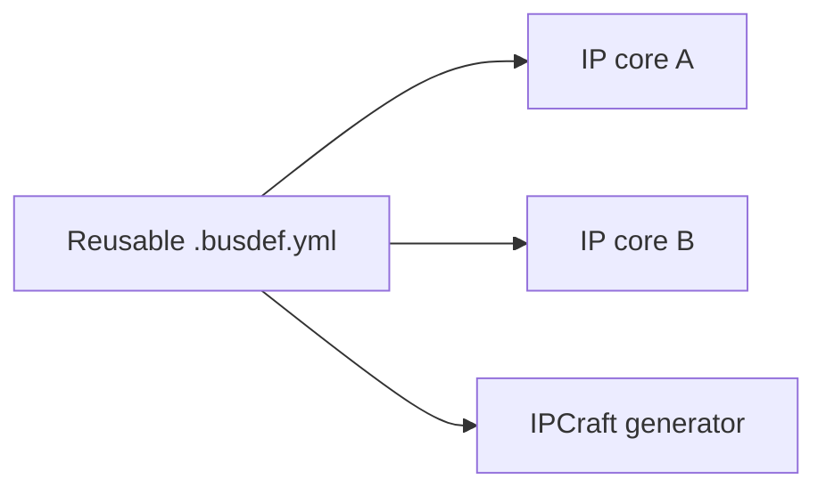
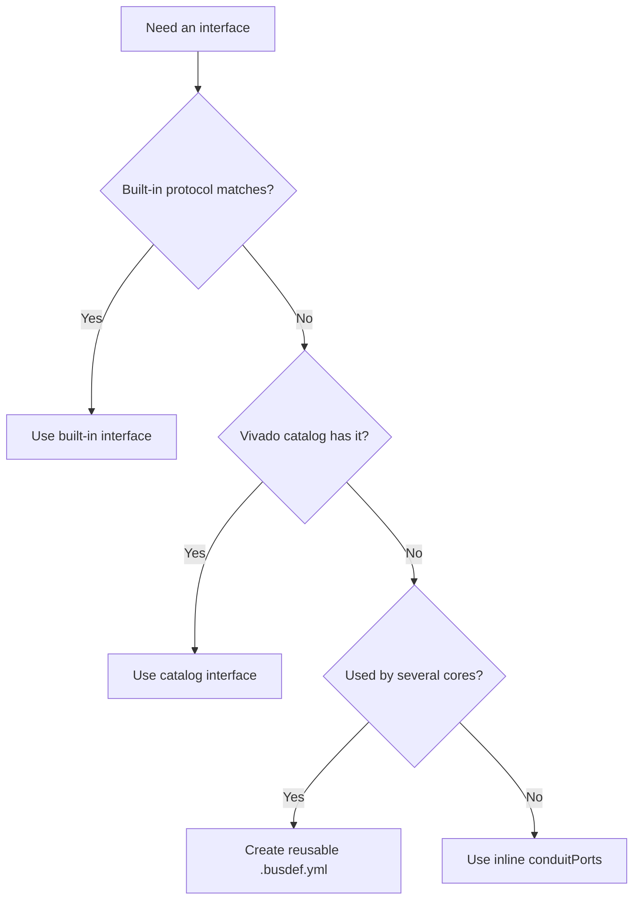

# Custom Interfaces

A custom interface is a named group of signals that does not use one of
IPCraft's built-in protocols.

Use a built-in or Vivado catalog interface when one matches. Those definitions
let external tools understand and sometimes connect the interface automatically.
Use a custom interface for project-specific or proprietary signal groups.

## Standard and custom interfaces

| Interface | Signal list | Tool understanding |
|---|---|---|
| AXI or Avalon | Fixed by the protocol | Vivado or Quartus understands the bus |
| Vivado catalog | Supplied by Vivado | Vivado understands the interface identity |
| Custom | Defined by the project | Tools preserve the group but may not connect it automatically |

For example, a diagnostic group might contain an enable flag, a 12-bit sample,
and a 3-bit status value. It is useful to keep those signals together even
though they do not form a standard bus.

## Signal model

Each signal has:

| Field | Meaning |
|---|---|
| `name` | Logical signal name |
| `direction` | `in`, `out`, or `inout` |
| `width` | Number of bits or a parameter name; omitted for one bit |
| `description` | Optional explanation |
| `presence` | Whether the signal is required or optional |

Direction is described from one interface role. The generator reverses it for
the opposite role when vendor metadata requires both views.

## Inline definition

Keep a one-off interface inside the IP core:

```yaml
busInterfaces:
  - name: DIAG_OUT
    type: ipcraft:busif:conduit:1.0
    mode: conduit
    physicalPrefix: diag_
    conduitPorts:
      - name: ENABLE
        direction: in
      - name: SAMPLE
        direction: out
        width: 12
      - name: STATUS
        direction: out
        width: 3
```

`conduit` means the signals are grouped without an implied bus transaction.

## Reusable definition

When several cores use the same interface, save it as `<name>.busdef.yml`.
This gives the signal list one source of truth and makes it discoverable in the
workspace.



Reusable definitions also have a full identity: vendor, library, name, and
version. This four-part identity is often shortened to VLNV.

Only files named `*.busdef.yml` are discovered automatically as YAML bus
definitions. A core can also point to a library with `useBusLibrary`.

## Interface mode

Mode describes which side initiates or produces data:

| Mode | Typical canvas side |
|---|---|
| `slave`, `sink`, `conduit` | Left |
| `master`, `source` | Right |

A simple pass-through group normally uses `conduit`. A proprietary protocol
with clear initiator and responder roles may use `master` and `slave`.

## Generated vendor files

For Vivado, IPCraft can generate the bus-definition and abstraction-definition
XML needed to describe a custom type. One definition is generated per type,
even when several interfaces use it.

For Quartus Platform Designer, custom signals are emitted as a generic conduit.
The signals remain grouped, but Platform Designer does not infer protocol
connections.

## Decision guide



See [Defining a custom interface](../how-to/defining-a-custom-interface.md) for the editor
workflow.
