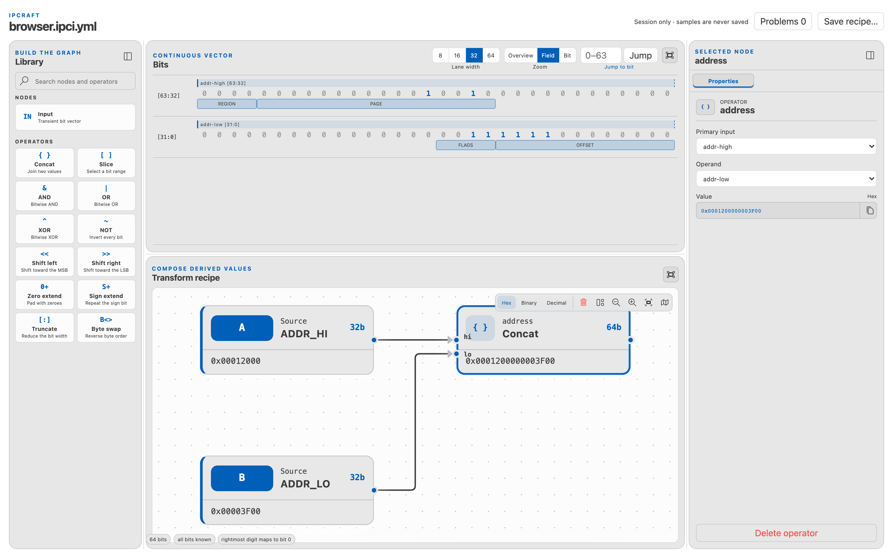
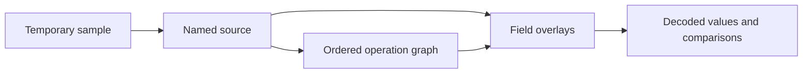
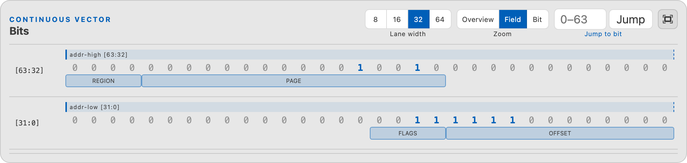
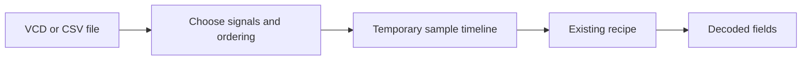

# Data Inspector Design

The Data Inspector decodes values from pasted literals, simulator waveforms,
Vivado ILA, SignalTap, and CSV captures. It is an analysis tool and never edits
an IP core, memory map, or generated HDL.

## Data model

The model separates four ideas:

- a sample is temporary captured data;
- a source has a stable name and width;
- an operation derives one value from earlier values;
- a field interprets a named bit range.

This separation lets a saved recipe work with new samples later.

## Four-state bits

`src/dataInspector/BitVector.ts` stores every bit as `0`, `1`, `X`, or `Z`.
`X` means the value is unknown; `Z` means high impedance. Values from 1 to 4096
bits remain exact without relying on JavaScript's integer limit.

Ordering is fixed:

- the highest bit appears on the left and bit 0 on the right;
- the rightmost literal digit supplies the lowest bits;
- `concat(A, B)` places A above B;
- byte order and word order are independent capture settings;
- extension and truncation require explicit operations.

Logical operations preserve useful known results. For example, unknown AND zero
is zero, while unknown AND one remains unknown.

## Literals

`parseLiteral.ts` accepts sized Verilog values, VHDL binary and hexadecimal
values, C-style `0b` and `0x` values, and decimal values with a width.

An input too wide for the selected width is rejected instead of silently
truncated. Weak HDL states are normalized with a warning while the original text
remains available.

## Fields

Fields support hexadecimal, binary, unsigned, signed, enum, floating-point, and
fixed-point views. Numeric results become unknown if required bits contain `X`
or `Z`.

Fields in one overlay group cannot overlap. Different groups may describe
alternative views of the same bits. Importing a register layout copies field
metadata once; it does not create a live link to the memory map.

## Operation graph

Recipes store operations in dependency order. References between sources and
operations become edges on the canvas.

| Operation | Width rule |
|---|---|
| Concat | Adds the two widths |
| Slice | Uses the selected inclusive range |
| AND, OR, XOR, NOT | Preserves width; binary operations require equal widths |
| Shift | Preserves width and inserts zeros |
| Extend | Increases to an explicit width |
| Truncate | Keeps low bits at a smaller width |
| Byte swap | Preserves a width divisible by eight |

Connections that would create a cycle or join incompatible widths are rejected.
An unwired operation stays only in the current webview until it becomes valid.

`evaluateRecipe.ts` evaluates the graph without side effects. Besides each
result, it reports which source supplied every bit and which ranges were
inserted, masked, or dropped.

## Capture import

`vcd.ts` indexes selected waveform signals and exposes values by timestamp.
`csvCapture.ts` recognizes common Vivado ILA and SignalTap headers and imports
one selected signal column at a time.

Captured samples remain temporary. Recipes save the decoding structure, not the
potentially large capture content.

## Saved recipes

An `.ipci.yml` recipe stores source definitions, fields, operations, and useful
view settings. It does not store pasted samples, VCD content, CSV rows, current
selection, or panel sizes.

Canvas node positions may be stored so a shared recipe opens with a useful
layout. Zoom and other temporary navigation state remain local to the session.

## Main implementation areas

| Area | Location |
|---|---|
| Exact bit values | `src/dataInspector/BitVector.ts` |
| Literal parsing | `src/dataInspector/parseLiteral.ts` |
| Field validation and decoding | `src/dataInspector/fieldLayout.ts` |
| Graph edits | `src/dataInspector/recipeGraph.ts` |
| Evaluation | `src/dataInspector/evaluateRecipe.ts` |
| Capture readers | `src/dataInspector/vcd.ts`, `csvCapture.ts` |
| React interface | Data Inspector webview components |

For user instructions, see [Using the Data Inspector](../how-to/use-data-inspector.md).
