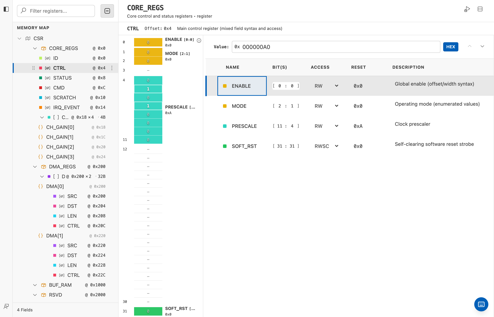
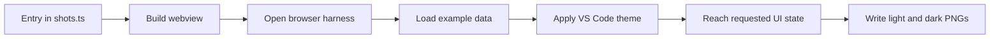

# Documentation Screenshots

IPCraft generates documentation screenshots from the compiled webviews. This
keeps images aligned with the current interface and makes captures repeatable.

## Generate all screenshots

```bash
npm run docs:screenshots
```

The command builds the webview bundles, opens each documented state in
Playwright, and writes light and dark PNG files to `docs/images/`.

Markdown pages embed only the light image because it also works well when the
documentation is printed:

```md

```

Do not edit generated PNG files by hand.

## How capture works



The capture list is `scripts/docs-screenshots/shots.ts`. One entry describes
the webview, input data, viewport, optional clipped element, and any interaction
needed before capture.

```ts
export interface Shot {
  id: string;
  harness: 'memorymap' | 'ipcore' | 'dataInspector';
  source: string;
  viewport?: { width: number; height: number };
  clip?: string;
  setup?: (page: Page) => Promise<void>;
}
```

The output name is `docs/images/<id>-<theme>.png`.

## Add a screenshot

1. Choose a real example that clearly shows the feature.
2. Add one entry to `scripts/docs-screenshots/shots.ts`.
3. Use `setup` only when the capture needs a click, selection, or host message.
4. Run `npm run docs:screenshots`.
5. Inspect both theme variants.
6. Add the light PNG to the relevant Markdown page.

Prefer one screenshot that explains a workflow over several images of similar
states. Use a Mermaid diagram instead when the page explains data flow,
ownership, or internal architecture.

## Supported webviews

| Harness | Content |
|---|---|
| `memorymap` | Memory Map editor |
| `ipcore` | IP Core editor |
| `dataInspector` | Data Inspector |

The harnesses live in `src/test/browser/`. They load the real compiled bundles
without starting VS Code.

## Native VS Code views

The browser harness cannot capture views rendered by VS Code itself:

- the IPCraft Build tree in the Explorer;
- the template preview opened as a text editor;
- native menus, notifications, and status-bar items.

Capture these manually in a clean VS Code window when a screenshot is essential.
Use the light theme, crop to the relevant area, and avoid personal paths or
unrelated extensions.

The Scaffold Pack Preview is a standalone webview. It could be automated with
a dedicated harness, but it is not currently part of this pipeline.

## Themes

A normal browser does not provide VS Code color variables. The harness injects
the matching variables before the webview starts so controls read the correct
colors when they are created.

Theme files are under `scripts/docs-screenshots/theme/`. To refresh one from a
running VS Code webview, open Developer Tools and copy its `--vscode-*`
variables:

```js
copy(
  ':root{' +
    Array.from(document.documentElement.style)
      .filter((name) => name.startsWith('--vscode-'))
      .map(
        (name) =>
          `${name}:${document.documentElement.style.getPropertyValue(name)}`,
      )
      .join(';') +
    '}',
);
```

Update the relevant CSS file and regenerate the screenshots.

## Important capture rules

- Wait for real content, not only the webview root element.
- Fail when a required selector or state is missing.
- Keep carets, hover effects, and transitions out of the result unless they are
  the subject of the image.
- Use stable, representative project data.
- Never include credentials, user paths, or private project names.
- Keep Markdown image descriptions short and specific.

## Verification

After generating images:

1. Confirm every expected light and dark file was updated.
2. Confirm no image shows a loading state.
3. Compare controls and text with the matching VS Code theme.
4. Build the documentation:

   ```bash
   python3 -m pip install -r docs/requirements.txt
   mkdocs build --strict
   ```

5. Run `npm run test:browser` to confirm the shared browser harnesses still
   work.

Screenshot generation is intentionally not a required CI step. Run it when a UI
change makes an existing image inaccurate or when a new visual workflow is
documented.
