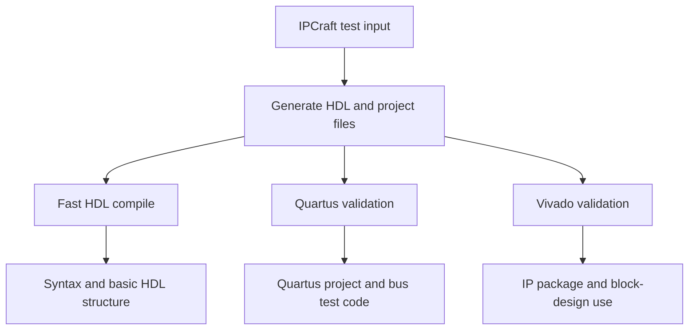
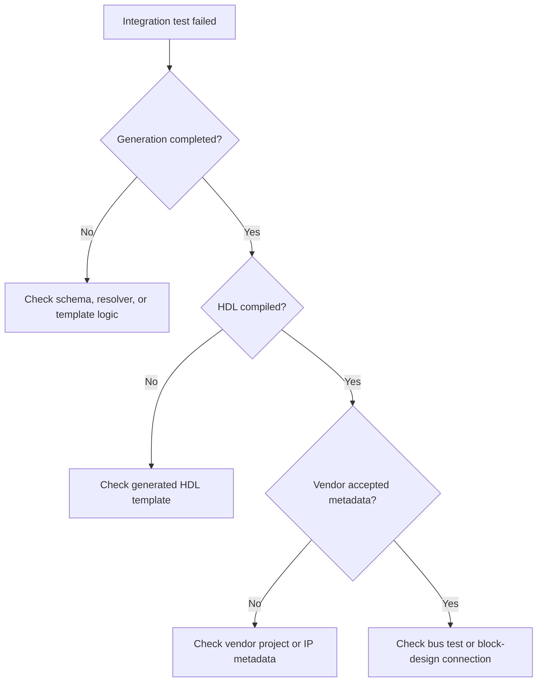

# How EDA Integration Tests Work

Unit tests can prove that IPCraft produced the expected text. They cannot prove
that Quartus or Vivado accepts that text. EDA integration tests close that gap
by running generated files through the real vendor tools.

EDA means electronic design automation. In this page it refers to Quartus and
Vivado.

## What the tests prove

Each level answers a different question:

| Check | Question answered |
|---|---|
| Unit test | Did the generator choose the expected values? |
| HDL compile | Is the generated VHDL or SystemVerilog valid? |
| Quartus validation | Can Quartus read and use the generated project files? |
| Vivado validation | Can Vivado package and place the generated IP? |

Passing a lower level does not guarantee that a vendor tool accepts the
project. Vendor formats contain rules that a normal HDL compiler does not know.

## Test flow

### 1. Generate temporary examples

The suite builds projects from small YAML inputs in `src/test/fixtures/`. The
inputs cover supported buses, languages, register layouts, and vendor options.

Generated files are temporary test output. Source templates remain under
`src/generator/templates/`.

### 2. Validate Quartus output

The Quartus suite runs in Docker so contributors and CI use a consistent tool
environment. It checks the generated project script and, when available, the
generated bus testbench.

A bus functional model is test code that behaves like a bus controller. It
sends reads and writes to the generated design so the suite can confirm that
the wrapper and register logic work together.

### 3. Validate Vivado output

The Vivado suite starts Vivado in batch mode. It checks the generated IP
package, then creates a small block design and connects the IP where applicable.

This catches problems that a text comparison cannot, including invalid
interface metadata, missing clock relationships, and unsupported block-design
connections.

## Why these tests run separately

Vendor tools are large and slow, and many contributors have only one installed.
Keeping these suites separate makes the everyday unit tests fast while still
providing a strong validation gate in CI.

The tests also allow individual vendor paths to be selected. A contributor who
changes only Vivado output does not need to run Quartus locally.

## Failure ownership

Use the first failing stage to narrow the cause:

Do not repair a generated test file by hand. Change the source generator or
template, rebuild, and rerun the suite.

## Main implementation areas

| Area | Location |
|---|---|
| Integration tests | `src/test/integration/` |
| Test inputs | `src/test/fixtures/` |
| Generator source | `src/generator/` |
| Source templates | `src/generator/templates/` |
| Integration Jest setup | `config/jest.integration.js` |

## Running the suites

See [Running the EDA integration tests](../how-to/run-eda-integration-tests.md)
for prerequisites, commands, and troubleshooting.
