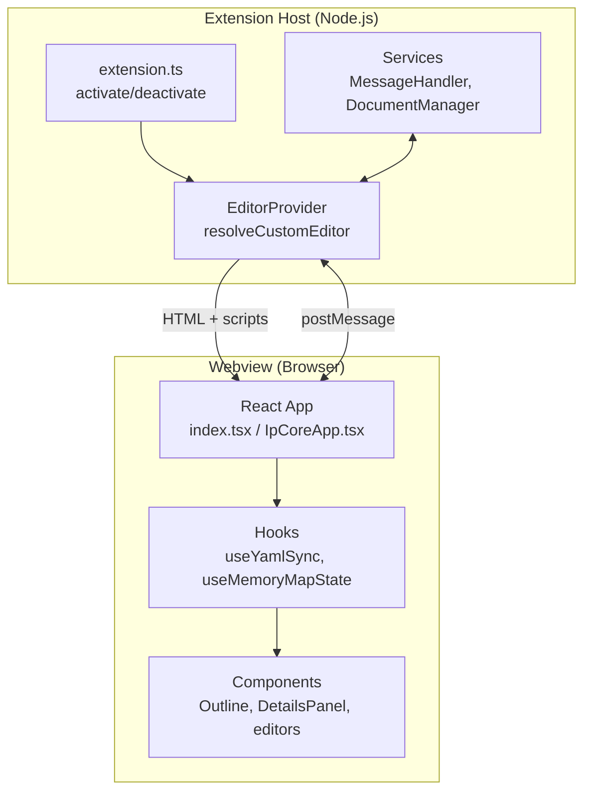

# VS Code Extension Model

This page explains the VS Code custom editor architecture used by IPCraft. Understanding this model is essential before working on the codebase.

## Custom Editors

VS Code custom editors replace the default text editor for specific file types. IPCraft registers two:

| View Type | File Pattern | Provider |
|-----------|-------------|----------|
| `fpgaMemoryMap.editor` | `*.mm.yml` | `MemoryMapEditorProvider` |
| `fpgaIpCore.editor` | `*.ip.yml` | `IpCoreEditorProvider` |

These are declared in `package.json` under `contributes.customEditors` with file selectors. When a user opens a matching file, VS Code activates the extension and opens the custom editor instead of the default text editor.

## Two-Process Architecture



**Extension Host** runs in Node.js. It can:

- Read/write files via the VS Code API
- Register commands and editors
- Manage document lifecycle

**Webview** runs in an embedded browser iframe. It can:

- Render React UI
- Receive data from the extension host
- Send user changes back

They **cannot** call each other's APIs directly. All communication uses `postMessage`.

## Message Protocol

Messages are plain objects with a `type` field:

| Direction | Type | Purpose |
|-----------|------|---------|
| Host -> Webview | `update` | Send YAML text (+ filename, resolved imports for IP Core) |
| Webview -> Host | `ready` | Signal that webview is mounted and ready for data |
| Webview -> Host | `update` | Send modified YAML text back |
| Webview -> Host | `command` | Request host action (`save`, `validate`, `openFile`) |

### Lifecycle

1. VS Code opens a matching file -> calls `resolveCustomTextEditor`
2. Provider generates webview HTML (via `HtmlGenerator`) and waits for `type: 'ready'`
3. Provider sends `type: 'update'` with the document text
4. Webview parses, normalizes, and renders
5. On user edit: webview posts `type: 'update'` back
6. Host applies changes via `DocumentManager.updateDocument()`

## Extension Lifecycle

```typescript
// src/extension.ts
export function activate(context: ExtensionContext): void {
  // Register providers, commands
}

export function deactivate(): void {
  // Cleanup
}
```

`activate` is called when the first matching file is opened. `deactivate` is called when VS Code shuts down.

## Commands

Commands are registered in `package.json` and implemented in `src/commands/`:

| Command | Title |
|---------|-------|
| `fpga-ip-core.createIpCore` | New IP Core |
| `fpga-ip-core.createMemoryMap` | New Memory Map |
| `fpga-ip-core.createIpCoreWithMemoryMap` | New IP Core + Memory Map |
| `fpga-ip-core.generateVHDL` | Generate VHDL |
| `fpga-ip-core.parseVHDL` | Import from VHDL |
| `fpga-ip-core.viewBusDefinitions` | View Bus Definitions |

## Security

Webview HTML is generated with a Content Security Policy (CSP) in `HtmlGenerator`. The current policy permits Tailwind CDN and inline script/style for the runtime styling setup.
