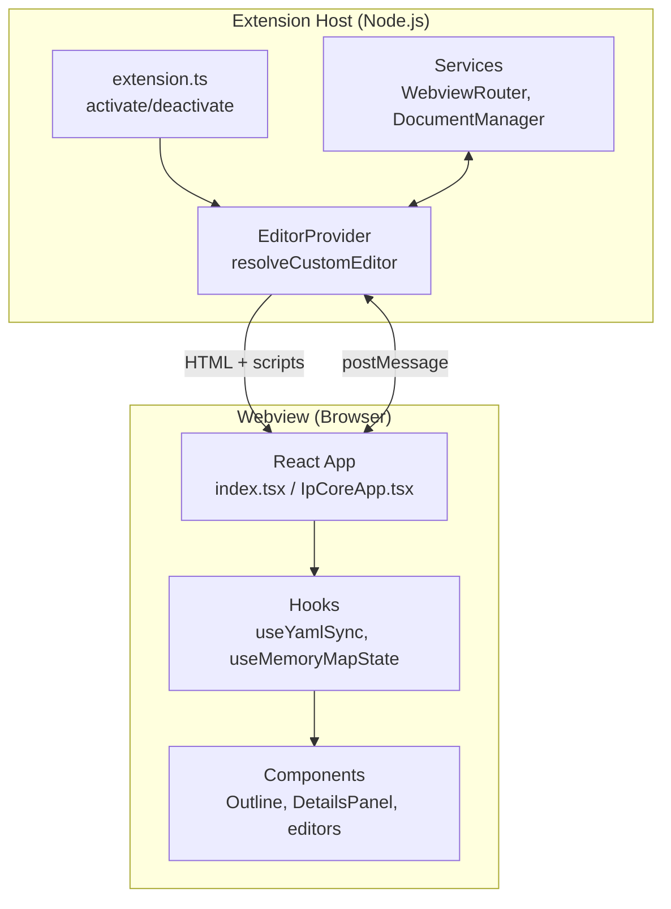

# VS Code Extension Model

This page explains the VS Code custom editor architecture used by IPCraft. Understanding this model is essential before working on the codebase.

## Custom Editors

VS Code custom editors replace the default text editor for specific file types. IPCraft registers two:

| View Type | File Pattern | Provider |
|-----------|-------------|----------|
| `fpgaMemoryMap.editor` | `*.mm.yml` | `MemoryMapEditorProvider` |
| `fpgaIpCore.editor` | `*.ip.yml` | `IpCoreEditorProvider` |

These are declared in `package.json` under `contributes.customEditors` with file selectors. When a user opens a matching file, VS Code activates the extension and opens the custom editor instead of the default text editor.

## Two-Process Architecture


```mermaid
graph TB
    subgraph "Extension Host (Node.js)"
        E[extension.ts<br/>activate/deactivate]
        P[EditorProvider<br/>resolveCustomEditor]
        S[Services<br/>WebviewRouter, DocumentManager]
    end
    subgraph "Webview (Browser)"
        R[React App<br/>index.tsx / IpCoreApp.tsx]
        H[Hooks<br/>useYamlSync, useMemoryMapState]
        C[Components<br/>Outline, DetailsPanel, editors]
    end
    E --> P
    P -->|"HTML + scripts"| R
    P <-->|"postMessage"| R
    S <--> P
    R --> H --> C
```

**Extension Host** runs in Node.js. It can:

- Read/write files via the VS Code API
- Register commands and editors
- Manage document lifecycle

**Webview** runs in an embedded browser iframe. It can:

- Render React UI
- Receive data from the extension host
- Send user changes back

They **cannot** call each other's APIs directly. All communication uses `postMessage`.

## Message Protocol

Messages are plain objects with a `type` field, routed host-side through
`WebviewRouter.on(type, handler)`:

| Direction | Type | Purpose |
|-----------|------|---------|
| Webview -> Host | `ready` | Signal that webview is mounted and ready for data; flushes any updates queued before it fired |
| Host -> Webview | `update` | Send YAML text (+ filename, resolved imports for IP Core), stamped with a `docVersion` |
| Webview -> Host | `update` | Send modified YAML text back, stamped with a monotonic `editId` and the `baseDocVersion` it was edited against |
| Webview -> Host | `command` | Request host action (`save`, `validate`, `openFile`), checked against a command allow-list |

Every `update` carries a revision stamp so a slow echo or a stale edit can be told apart from a
genuine change — see [YAML Data Flow](yaml-data-flow.md) for the full protocol.

### Lifecycle

1. VS Code opens a matching file -> calls `resolveCustomTextEditor`
2. Provider generates webview HTML (via `HtmlGenerator`) and waits for `type: 'ready'`
3. Provider sends `type: 'update'` with the document text and current `docVersion`
4. Webview parses, normalizes, and renders
5. On user edit: webview posts `type: 'update'` back with `editId` + `baseDocVersion`
6. Host applies changes via `DocumentManager.updateDocument()`, rejecting stale `baseDocVersion`s

## Extension Lifecycle

```typescript
// src/extension.ts
export function activate(context: ExtensionContext): void {
  // Register providers, commands
}

export function deactivate(): void {
  // Cleanup
}
```

`activate` is called when the first matching file is opened. `deactivate` is called when VS Code shuts down.

## Commands

Commands are registered in `package.json` and implemented in `src/commands/`:

| Command | Title |
|---------|-------|
| `fpga-ip-core.createIpCore` | New IP Core |
| `fpga-ip-core.createMemoryMap` | New Register Map |
| `fpga-ip-core.createIpCoreWithMemoryMap` | New IP Core + Register Map |
| `fpga-ip-core.generateHdl` | Generate Top-Level HDL |
| `fpga-ip-core.scaffoldProject` | Scaffold Project |
| `fpga-ip-core.generateTestbench` | Generate CocoTB Testbench |
| `fpga-ip-core.generateAndBuildVivado` | Generate & Build (Vivado OOC) |
| `fpga-ip-core.generateAndBuildQuartus` | Generate & Build (Quartus) |
| `fpga-ip-core.buildVivadoOoc` | Build: Vivado OOC Synthesis |
| `fpga-ip-core.buildQuartusCompile` | Build: Quartus Compile |
| `fpga-ip-core.parseVHDL` | Import from VHDL (Experimental) |
| `fpga-ip-core.parseHwTcl` | Import from Altera Platform Designer (Experimental) |
| `fpga-ip-core.parseComponentXml` | Import from Xilinx Component XML (Experimental) |
| `fpga-ip-core.viewBusDefinitions` | View Bus Definitions |
| `fpga-ip-core.scanVivadoCatalog` | Scan Vivado IP Catalog |
| `fpga-ip-core.openInVivado` | Open in Vivado |
| `fpga-ip-core.openInQuartus` | Open in Quartus |
| `fpga-ip-core.openAsText` | Open as Text Editor |
| `fpga-ip-core.openAsVisual` | Open as Visual Editor |
| `fpga-ip-core.migrateLegacy` | Migrate Legacy IP Cores (vendor: → targets:) |

## Security

Webview HTML is generated with a Content Security Policy (CSP) in `HtmlGenerator`. The policy is `default-src 'none'` with `style-src`/`font-src`/`script-src` restricted to `webview.cspSource` (the extension's own bundled resources) — no inline script/style and no CDN sources are permitted. Tailwind is compiled at build time into the webpack bundle, not loaded at runtime.
