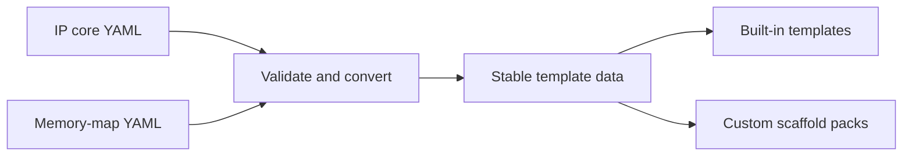

# Data Available to Generator Templates

Templates need stable, predictable data. IPCraft therefore converts an IP core
and its memory maps into one documented template object before rendering any
files.

Pack authors can use this object without knowing how the editor stores its
temporary state.

## Why conversion is necessary

Raw YAML is written for people. A template needs additional calculated values,
such as resolved widths, sorted registers, expanded interface arrays, and the
selected bus type.

Passing raw YAML directly to templates would make every template repeat those
calculations and handle missing values differently.

## Conversion steps

Small resolver modules each calculate one part of the final data:

| Resolver | What it adds |
|---|---|
| Clock and reset | Active reset level, clock period, and related ports |
| Parameters | Resolved parameter values and port widths |
| Registers | Sorted registers, fields, addresses, and access behavior |
| Addressing | Bus address width and related constants |
| Bus | Bus type, signal names, and expanded interface arrays |

A resolver is simply a focused conversion function. It receives known input
and returns calculated values without rendering files.

## Validation boundary

IPCraft validates input before building template data. It also checks the
template-data version requested by a scaffold pack.

This version check gives pack authors a clear error when a pack expects a newer
or incompatible data shape. It is safer than allowing a template to render
partially with missing values.

## Bus rules

Bus-specific behavior is kept in a registry rather than spread across every
template. A rule describes details such as bus family, address behavior, and
signal naming.

Adding a bus normally means adding one rule and the matching templates instead
of changing each unrelated resolver.

## Register behavior

The converted register data includes information required by generated HDL,
including software access, hardware access, reset values, and special behavior
such as write-one-to-clear fields.

Templates should use these calculated values instead of interpreting raw access
strings themselves.

## What pack authors can rely on

A compatible scaffold pack can rely on:

- core identity and selected HDL language;
- resolved ports, parameters, clocks, and resets;
- expanded bus interfaces and bus signals;
- sorted registers and fields;
- calculated address and width values;
- documented condition values used by `scaffold.yml`.

Internal editor values such as `rowId`, selected cells, and unfinished drafts
are not part of template data.

For the available values and file-generation options, see the
[generator reference](../reference/generator.md). For a practical workflow, see
[scaffold packs](../how-to/customizing-generated-files-with-scaffold-packs.md).

## Boundary of compatibility

The versioned data object protects the information supplied to templates. It
does not guarantee that every generated file is valid for every external tool.
Compile generated HDL and run the relevant vendor integration test before
publishing a pack.
