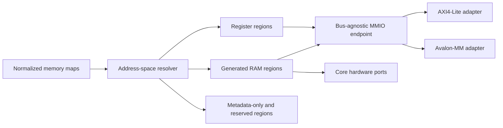

# Generated RAM Buffers

## Status

Draft concept. This document proposes generator behavior; it does not describe
functionality available today.

## Problem

The memory-map schema can describe an address block with `usage: memory`, but
the HDL generators only implement registers. A memory block currently survives
normalization and appears in generated metadata, while the bus-facing HDL has
no storage or address decoder for it.

The DAQ controller makes the mismatch visible:

```yaml
- name: SAMPLE_BUFFER
  baseAddress: 0x1000
  range: 4K
  usage: memory
  description: 1024 x 32-bit sample buffer, backed by a separate BRAM
```

For this input, the current register projection:

- emits no storage for `SAMPLE_BUFFER`;
- calculates `addr_map_size` and `addr_width` from the last register instead of
  the complete address map;
- truncates the bus address before it can reach `0x1000`; and
- can only return register data from the bus-agnostic register file.

`usage: memory` is therefore metadata, not an executable hardware contract.

## Goal

Allow a memory address block to opt into a synthesizable, bus-accessible RAM
with a second native port for the generated core. The same normalized memory
description must drive:

- address-space validation and sizing;
- the versioned template context;
- VHDL and SystemVerilog generation;
- AXI4-Lite and Avalon-MM access;
- vendor metadata; and
- generated verification.

The generated RTL should infer ordinary FPGA block RAM where supported. The
concept must not depend on a Xilinx or Intel memory primitive.

## Non-goals for the first version

- AXI burst support;
- asynchronous clock-domain crossing;
- ECC, parity, or byte-enable behavior on the hardware-side port;
- initialization files;
- asymmetric bus and hardware port widths;
- multiple bus interfaces exposing the same memory map;
- vendor-specific RAM primitives; and
- changing the Memory Map editor in the first generator increment.

These can be added after the address-space and transaction contracts are
stable.

## Proposed authoring model

Keep `usage` as the IP-XACT-compatible classification and add an explicit
implementation request. Existing memory blocks remain descriptive unless they
opt in.

```yaml
- name: SAMPLE_BUFFER
  baseAddress: 0x1000
  range: 4K
  usage: memory
  access: read-only
  defaultRegWidth: 32
  implementation: inferredRam
  hardwareAccess: write-only
  description: 1024 x 32-bit sample buffer
```

Proposed fields on an address block:

| Field            | Values                                          | Default    | Meaning                             |
| ---------------- | ----------------------------------------------- | ---------- | ----------------------------------- |
| `implementation` | `metadata`, `inferredRam`                       | `metadata` | Whether the generator emits storage |
| `hardwareAccess` | `none`, `read-only`, `write-only`, `read-write` | `none`     | Native access exposed to core logic |

Both property names are camelCase in schemas and TypeScript. Template-context
projections use the existing snake_case convention.

`implementation: inferredRam` is valid only when:

- `usage` is `memory`;
- `range` resolves to a positive byte count;
- `defaultRegWidth` is a positive multiple of eight;
- `baseAddress` and `range` are aligned to the word size;
- `range` is an integer multiple of the word size; and
- `access` is `read-only`, `write-only`, or `read-write`.

The bus data width and `defaultRegWidth` must match in the first version.
Rejecting mismatched widths is preferable to silently dropping or duplicating
bits.

The string size forms already accepted by the schema, such as `4K` and `1M`,
need one canonical parser shared by validation, address resolution, metadata,
and template projection. Suffixes mean powers of 1024.

### Why generation is opt-in

Existing projects use `usage: memory` to reserve or document address space.
Automatically turning every such block into storage would change resource
usage and top-level behavior during regeneration. An explicit
`implementation` preserves compatibility and separates these meanings:

- `metadata`: describe a memory window owned elsewhere;
- `inferredRam`: ask IPCraft to implement the window.

A later `external` implementation could forward bus-side requests to
user-owned logic, but that protocol should be designed separately.

## Generated hardware contract

### Bus port

The bus port operates on byte addresses. Within a generated RAM block:

```text
wordIndex = (busAddress - baseAddress) / wordBytes
depth     = rangeBytes / wordBytes
```

Bus writes honor the bus byte-enable lanes. Disabled bytes retain their
previous values. Bus reads are synchronous and return one cycle after the read
request, matching the current register-file read timing.

Block `access` controls software access:

| Access       | Bus read                                          | Bus write                                            |
| ------------ | ------------------------------------------------- | ---------------------------------------------------- |
| `read-only`  | Allowed                                           | Error or ignored where the bus has no error response |
| `write-only` | Error or zero where the bus has no error response | Allowed                                              |
| `read-write` | Allowed                                           | Allowed                                              |

### Hardware port

`hardwareAccess` is stated from the core's perspective and is independent of
software `access`. Each block with `hardwareAccess` other than `none` exposes a
namespaced, word-addressed synchronous port between the generated MMIO endpoint
and the core:

```text
<block>_hw_en
<block>_hw_addr
<block>_hw_write
<block>_hw_wdata
<block>_hw_rdata
<block>_hw_rvalid
```

The generated core stub receives this port through a narrow block-specific
record or packed structure, rather than six unrelated top-level ports.
`read-only` omits the write members and `write-only` omits the read-response
members. The hardware address is a word index from zero, not an absolute byte
address.

The bus and hardware ports share the primary bus clock and reset in the first
version. The memory contents are not reset; FPGA RAM reset semantics are
device-specific and resetting every word often prevents block-RAM inference.

### Concurrent access

The generated memory has two independently addressed synchronous ports:

- the bus owns port A;
- the core owns port B;
- accesses to different words proceed independently; and
- a same-cycle write collision to the same word is outside the portable
  contract.

Simulation should assert or warn on two writes to the same word. Read-during-
write data for the same address is unspecified in the first version because
FPGA families differ. Designs that require deterministic collision behavior
must arbitrate before driving the hardware port.

Here, "dual-port" describes two independently addressed synchronous ports.
The generator should select the narrowest implementation required by the
authored access modes:

| Bus access         | Hardware access            | Generated memory shape                       |
| ------------------ | -------------------------- | -------------------------------------------- |
| `read-only`        | `write-only`               | Simple dual-port: hardware writes, bus reads |
| `write-only`       | `read-only`                | Simple dual-port: bus writes, hardware reads |
| `read-write`       | Any mode other than `none` | True dual-port, single clock                 |
| Any mode           | `read-write`               | True dual-port, single clock                 |
| Any supported mode | `none`                     | Single-port                                  |

This specialization matters because a simple dual-port RAM has one write port
and one read port, while a true dual-port RAM allows both ports to write.
Calling every configuration "simple dual-port" would hide a material synthesis
difference.

### Portable inference templates

The built-in pack must generate standard synchronous HDL rather than instantiate
Xilinx `xpm_memory_*`, Intel `altsyncram`, or another vendor primitive. Vivado
and Quartus should infer the device memory resource from the same generated
source.

The portable subset is:

- `ieee.numeric_std` for VHDL address conversion;
- a clocked read with a registered output;
- no reset or bulk clear of the memory array;
- no initialization file;
- one shared clock in the first version;
- equal widths on both ports;
- byte enables only where the access contract requires them; and
- no synthesis attributes in the portable template.

Do not copy the Xilinx shared-variable example verbatim. Its
`std_logic_unsigned`, `conv_integer`, and unprotected `shared variable` usage
is accepted by some tool modes but is not a good cross-vendor VHDL contract.

For the common DAQ configuration (`access: read-only`,
`hardwareAccess: write-only`), generate this simple dual-port VHDL shape:

```vhdl
library ieee;
use ieee.std_logic_1164.all;
use ieee.numeric_std.all;

entity sample_buffer_ram is
  generic (
    G_DATA_WIDTH : positive := 32;
    G_DEPTH      : positive := 1024;
    G_ADDR_WIDTH : positive := 10
  );
  port (
    clk    : in  std_logic;
    wr_en  : in  std_logic;
    wr_addr: in  std_logic_vector(G_ADDR_WIDTH - 1 downto 0);
    wr_data: in  std_logic_vector(G_DATA_WIDTH - 1 downto 0);
    rd_en  : in  std_logic;
    rd_addr: in  std_logic_vector(G_ADDR_WIDTH - 1 downto 0);
    rd_data: out std_logic_vector(G_DATA_WIDTH - 1 downto 0)
  );
end entity;

architecture rtl of sample_buffer_ram is
  type ram_type is array (0 to G_DEPTH - 1)
    of std_logic_vector(G_DATA_WIDTH - 1 downto 0);
  signal ram : ram_type;
begin
  process (clk)
  begin
    if rising_edge(clk) then
      if wr_en = '1' then
        ram(to_integer(unsigned(wr_addr))) <= wr_data;
      end if;
      if rd_en = '1' then
        rd_data <= ram(to_integer(unsigned(rd_addr)));
      end if;
    end if;
  end process;
end architecture;
```

Generate the equivalent SystemVerilog shape from the same resolved context:

```systemverilog
module sample_buffer_ram #(
  parameter int DATA_WIDTH = 32,
  parameter int DEPTH = 1024,
  parameter int ADDR_WIDTH = 10
) (
  input  logic                  clk,
  input  logic                  wr_en,
  input  logic [ADDR_WIDTH-1:0] wr_addr,
  input  logic [DATA_WIDTH-1:0] wr_data,
  input  logic                  rd_en,
  input  logic [ADDR_WIDTH-1:0] rd_addr,
  output logic [DATA_WIDTH-1:0] rd_data
);
  logic [DATA_WIDTH-1:0] ram [0:DEPTH-1];

  always_ff @(posedge clk) begin
    if (wr_en)
      ram[wr_addr] <= wr_data;
    if (rd_en)
      rd_data <= ram[rd_addr];
  end
endmodule
```

These templates deliberately do not define the value returned when the read
and write addresses are equal in the same cycle. Generated simulation checks
must flag that condition unless a later contract explicitly selects and
implements a collision policy.

The true dual-port variants use the same array and registered-read rules, but
provide `en`, `write`, `addr`, `wdata`, and `rdata` for each port. The bus port
also has `wstrb`; hardware-port writes remain full-word in the first version.
Use a single clocked process or `always_ff` block so there is one HDL writer for
the array. Apply bus byte strobes as per-byte array slices. Both variants must
pass Vivado and Quartus inference tests before being added to the built-in
pack.

Vendor-specific packs may replace the portable module with a primitive-backed
implementation. Such a replacement must preserve the generated entity/module
ports, one-cycle read latency, byte-enable behavior, and collision contract.
The portable built-in pack remains the reference behavior.

## Generator architecture

RAM support belongs beside register preparation, not inside bus-specific
templates.



### Address-space resolver

Add a pure resolver that produces a sorted, validated list of regions. It owns:

- parsing byte-size strings;
- calculating each half-open interval `[baseAddress, endAddress)`;
- detecting overlaps;
- calculating the complete address width;
- distinguishing implemented, metadata-only, and reserved regions; and
- deriving RAM word width, depth, and local address width.

`addressingResolver` should consume this result. `addr_width` must cover the
highest declared block end, while bus success must come from an implemented
region hit rather than the current `address < addr_map_size` approximation.
This prevents holes and reserved blocks below the highest address from being
reported as valid registers.

### Template context

Add a top-level `memory_blocks` array to the generator contract. A projected
entry should contain resolved values so templates perform no size parsing or
address arithmetic:

```yaml
memory_blocks:
  - name: SAMPLE_BUFFER
    base_address: 4096
    range_bytes: 4096
    word_width: 32
    word_bytes: 4
    depth_words: 1024
    local_addr_width: 10
    access: read-only
    hardware_access: write-only
```

Also add:

```yaml
has_memory_blocks: true
implemented_regions:
  - kind: register
    base_address: 0
    end_address: 96
  - kind: memory
    base_address: 4096
    end_address: 8192
```

Adding these fields is backward-compatible for built-in templates, but it
changes the public scaffold-pack contract and therefore requires a minor
contract version increment.

### Bus-agnostic endpoint

The module currently named `<entity>_regs` is already the bus-agnostic target
for reads and writes. In the first increment it can retain that generated file
and entity name for compatibility, while its responsibility becomes the
complete implemented MMIO address space:

1. decode a request once;
2. route it to a register bank or RAM block;
3. return read data and completion; and
4. report whether the address and operation were valid.

The endpoint needs an explicit response contract, for example:

```text
wr_en, wr_addr, wr_data, wr_strb -> wr_valid, wr_error
rd_en, rd_addr                   -> rd_data, rd_valid, rd_error
```

AXI4-Lite maps errors to `SLVERR`. Avalon-MM has no response signal in the
current bus definition, so it completes the transfer and returns zero for an
invalid read while keeping the behavior visible in generated simulation
checks. The endpoint, not each bus adapter, remains the source of address-hit
truth.

Do not model RAM words as expanded registers. A 4 KiB buffer would create 1024
register objects, inflate the template context, produce large case statements,
and usually synthesize flip-flops instead of block RAM.

### Generated files

Keep RAM implementation in focused templates:

```text
rtl/<entity>_ram_<block>.vhd
rtl/<entity>_ram_<block>.sv
```

The MMIO endpoint instantiates these modules. The scaffold manifest emits them
only when `has_memory_blocks` is true. Keeping storage separate from register
behavior makes RAM inference easy to inspect and allows later replacement with
a vendor-specific implementation.

The package templates define the block-specific hardware-port records or
packed structures. The top and core templates wire those typed ports without
adding address decoding to the user-owned core stub.

The source templates should be access-specialized rather than one template
containing every possible port:

```text
inferred_ram_single_port.vhdl.j2
inferred_ram_simple_dual_port.vhdl.j2
inferred_ram_true_dual_port.vhdl.j2
inferred_ram_single_port.sv.j2
inferred_ram_simple_dual_port.sv.j2
inferred_ram_true_dual_port.sv.j2
```

All six templates consume the same resolved memory-block contract. Their
selection is generator logic and must not be repeated in scaffold manifests or
bus templates.

## DAQ controller result

After opting in, `SAMPLE_BUFFER` becomes 1024 words of 32 bits:

| Property               |                     Value |
| ---------------------- | ------------------------: |
| Bus byte range         | `0x1000` through `0x1fff` |
| Word indices           |        `0` through `1023` |
| Bus byte lanes         |                         4 |
| Hardware address width |                   10 bits |
| Storage                |                  32 Kibit |

Acquisition logic writes samples through the hardware port. Software reads the
same words through AXI4-Lite. The natural DAQ contract is therefore
`access: read-only` with `hardwareAccess: write-only`; software write access can
be enabled deliberately if the test or application needs it.

The DAQ interface address width must cover the end of the buffer. A 13-bit byte
address is required for addresses through `0x1fff`; an authored 12-bit AXI
address override cannot represent that range and must fail validation instead
of being truncated.

## Additional RAM conformance example

Add `examples/ram_buffer_conformance_avmm` as a generated Avalon-MM example and
DE10-Nano hardware target. It should be smaller and more diagnostic than the
DAQ controller, and contain two implemented memory blocks:

```yaml
- name: RAM_BUFFER_CONFORMANCE
  addressBlocks:
    - name: SAMPLE_BUFFER
      baseAddress: 0x1000
      range: 4K
      usage: memory
      access: read-only
      defaultRegWidth: 32
      implementation: inferredRam
      hardwareAccess: write-only

    - name: SCRATCHPAD
      baseAddress: 0x2000
      range: 1K
      usage: memory
      access: read-write
      defaultRegWidth: 32
      implementation: inferredRam
      hardwareAccess: read-only
```

`SAMPLE_BUFFER` proves the natural acquisition path: a small example core
writes a deterministic counter or seeded pattern through the hardware port,
then software reads and checks it over Avalon-MM. Control/status registers
start the fill, report completion, and expose the seed without adding special
test-only ports to the RAM.

`SCRATCHPAD` proves software writes, reads, and byte enables. The core reads the
same storage through its hardware port and exposes a checksum register, proving
that the second port observes bus writes. Together the blocks exercise both
simple and true dual-port template selection without requiring the full DAQ
application.

Keep hand-written scenario logic, the example core, and the DE10-Nano harness
as `managed: false` files so regeneration updates the RAM and bus endpoint
without overwriting the verification behavior.

## Diagnostics

Generation should stop with a source-oriented error for:

- overlapping address blocks;
- a generated RAM with a missing or invalid range;
- unaligned base or range;
- a RAM width that differs from the bus data width;
- an address-port override too narrow for the declared map;
- unsupported access modes; or
- duplicate normalized block names.

A `usage: memory` block left as `implementation: metadata` is valid. The
built-in scaffold may show an informational staging diagnostic that no HDL is
generated for it, but custom packs must still be able to consume its metadata.

## Verification strategy

### Resolver tests

- parse integer, hexadecimal, `4K`, and `1M` ranges;
- reject malformed or fractional sizes;
- calculate region ends and address widths;
- reject overlaps and alignment errors;
- reject a too-narrow authored bus address width; and
- project stable `memory_blocks` context entries.

### Generated-template tests

For both VHDL and SystemVerilog:

- render the expected single-port, simple dual-port, or true dual-port template
  from each access-mode combination;
- compile the generated array with GHDL and Icarus Verilog;
- apply bus write strobes per byte;
- expose hardware ports only when requested;
- avoid resetting the memory array;
- decode the first and last word of each block; and
- return an error for holes, reserved space, and out-of-range addresses.

Do not use source-text matching as the primary proof of RAM behavior. Compile
and simulate the rendered HDL; reserve text assertions for properties such as
the absence of a reset loop or vendor primitive.

### Cocotb testbench verification

Extend the generated verification manifest with resolved memory regions and
access capabilities. Add a transport-independent RAM scenario module, modeled
after the existing register conformance scenarios, and run the same logical
checks through AXI4-Lite, Avalon-MM, and the DE10-Nano hardware transport.

The testbench must:

1. write and read every bus-writable memory using walking-bit, address-derived,
   and seeded pseudorandom patterns;
2. verify partial-byte writes for every byte lane and confirm disabled bytes
   retain their previous value;
3. drive the hardware port directly, then read the result through the bus;
4. write through the bus, then check the value or checksum observed by the
   hardware port;
5. check the first word, last word, and transitions between register, hole,
   reserved, and RAM regions;
6. verify read-only and write-only behavior;
7. issue simultaneous accesses to different words on both ports;
8. flag same-address collisions instead of depending on returned data; and
9. use a fixed default seed while accepting a reported override for
   reproducibility.

Never compare uninitialized RAM contents. Each test must write a location
before reading it, or use the example core's deterministic fill-complete
handshake.

Run the standalone RAM tests for both HDL languages before testing the complete
MMIO endpoint. This separates inference-template failures from AXI/Avalon
transaction failures.

### Vendor synthesis verification

Generated HDL compilation proves syntax and behavior but not block-memory
inference. Add synthesis gates for one representative 1024 x 32-bit memory:

- Vivado must infer a block-memory resource and must not implement the array as
  thousands of flip-flops or LUT RAM.
- Quartus must infer an embedded memory resource appropriate to the selected
  device. The DE10-Nano Cyclone V target should report M10K usage for the
  buffer.
- Synthesis elaboration must preserve the expected width and depth; simulation
  tests remain the proof of one-cycle read latency.

Parse stable machine-readable or Tcl-queryable utilization data rather than
matching human-formatted report prose. Record the tool version, target part,
and inferred resource counts in the test result.

### DE10-Nano hardware verification

Use `examples/ram_buffer_conformance_avmm` for the board gate and follow the
existing `regmap_conformance_avmm` structure:

```text
examples/ram_buffer_conformance_avmm/
  tb/ram_scenarios.py
  tb/verification_manifest.json
  altera/debug/hardware_runner.py
  altera/hdl/de10_nano_top.vhd
  altera/qsys/ram_buffer_conformance_system.tcl
  altera/quartus/de10_nano_project.tcl
  altera/quartus/Makefile
```

The Platform Designer system contains the generated Avalon-MM peripheral and a
JTAG-to-Avalon-MM master. The hardware runner must reuse the same manifest and
scenario definitions as cocotb through a narrow `read`, `write`, and
`write_sequence` transport interface.

The board workflow is:

1. regenerate the example and verification manifest;
2. run the VHDL cocotb suite;
3. generate Platform Designer output;
4. compile and fit the Cyclone V project;
5. inspect the Quartus resource report and fail unless the RAM maps to M10K
   blocks;
6. program `de10_nano.sof`;
7. run the manifest scenarios through System Console and JTAG-to-Avalon-MM; and
8. write `output_files/hardware-result.json`.

The hardware result records the Git revision, generated bitstream SHA-256,
manifest SHA-256, board identifier, Quartus version, random seed, individual
checks, resource inference summary, and overall pass/fail status. LEDs may show
runner progress and failure state, but the JSON result is the automated
acceptance artifact.

Required on-board checks are:

1. core pattern fill followed by JTAG bus reads of the first, middle, and last
   sample-buffer words;
2. full scratchpad write/read sweeps;
3. per-lane 8-bit writes through the JTAG master;
4. scratchpad checksum agreement between host and core;
5. repeated seeded random accesses across both blocks;
6. rejection or defined completion behavior for holes and block boundaries;
7. persistence across interface reset when the RAM itself is not reset; and
8. a second fill with a different seed to prove the first result was not an
   initialization artifact.

The DE10-Nano gate proves the Intel implementation. Vivado synthesis remains
the Xilinx inference gate; a Xilinx board run is not required for the first
version because no supported Xilinx hardware runner exists in this repository.

## Delivery sequence

1. Add the canonical byte-size parser and address-space resolver, then correct
   address width and overlap validation for all block usages.
2. Extend the specification and generated domain types with the opt-in fields.
3. Version and populate the `memory_blocks` template contract.
4. Add the bus-agnostic endpoint response signals and update both bus adapters.
5. Generate access-specialized inferred RAM and typed core-side ports in both
   HDL languages.
6. Add standalone RAM and MMIO cocotb verification using shared,
   transport-independent scenarios.
7. Add Vivado and Quartus synthesis inference gates.
8. Add `ram_buffer_conformance_avmm` and run its shared scenarios on a
   DE10-Nano through JTAG-to-Avalon-MM.
9. Opt the DAQ `SAMPLE_BUFFER` into generation and update its tutorial.
10. Add editor controls only after the YAML and generator contracts have
    proven stable.

Each step should retain one request-to-one-response timing and compile before
the next layer is added.

## Open decisions

The first implementation still needs explicit agreement on:

1. Whether the DAQ sample buffer is bus read-only or also writable by software.
2. Whether same-address read-during-write should remain unspecified or choose a
   portable old-data policy.
3. Whether metadata-only memory blocks should produce an informational
   diagnostic in the built-in scaffold.
4. Whether the existing `<entity>_regs` name should remain indefinitely or be
   migrated to `<entity>_mmio` in a later major contract version.
