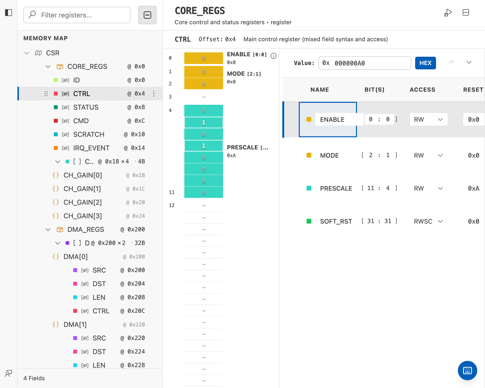
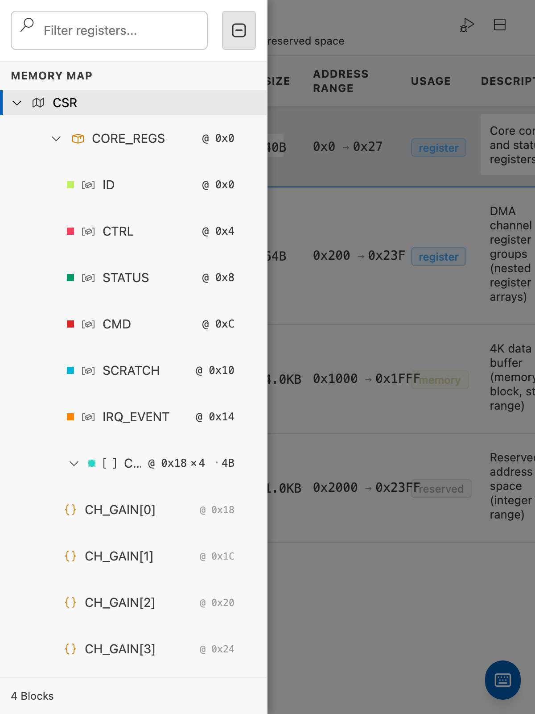
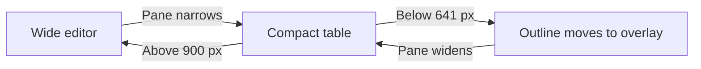

# Responsive Design

IPCraft runs inside editor columns that users can resize. The layout must remain
usable in a wide editor, a split editor, and a narrow side-by-side view.

## What changes with width

| Editor width | User-visible behavior |
|---|---|
| Up to 640 px | Memory Map outline becomes an overlay; tables use compact cards |
| 641–900 px | Outline narrows and less important columns are hidden |
| 901 px and wider | Full outline and all table columns are visible |

The editor is designed for desktop use. The narrow layout supports resized VS
Code panes; it is not a separate mobile application.

| Wide editor | Narrow editor with outline open |
|---|---|
|  |  |

## Memory Map layout

The wide layout places the outline beside the details panel. In the narrow
layout, a button opens the outline over the editor and a backdrop closes it.

The overlay must:

- remain above table and visualizer content;
- close when the backdrop is selected;
- return focus to the button that opened it;
- keep controls large enough for pointer and touch use.

## IP Core layout

The IP Core editor contains a toolbar, library palette, canvas, and inspector.
It does not use the Memory Map outline overlay. When space is limited, its
panels must shrink or scroll without covering the canvas controls.

## Implementation values

The shared values are defined in `src/webview/index.css`:

| CSS value | Purpose |
|---|---|
| `--sidebar-width` | Wide Memory Map outline |
| `--sidebar-width-tablet` | Medium-width outline |
| `--sidebar-width-mobile` | Narrow overlay width |
| `--touch-target-min` | Minimum interactive control size |

Colors use VS Code theme variables so the layout works in light, dark, and
high-contrast themes.

## Verification

When changing layout code, check all three width ranges and confirm:

- the selected item remains visible;
- tables can scroll without covering headers;
- the outline opens, closes, and returns keyboard focus;
- visualizers remain readable;
- labels do not overlap controls;
- interactive controls meet the minimum target size;
- light, dark, and high-contrast themes remain readable.

Automated browser tests should set explicit viewport sizes for behavior that
depends on a breakpoint.
