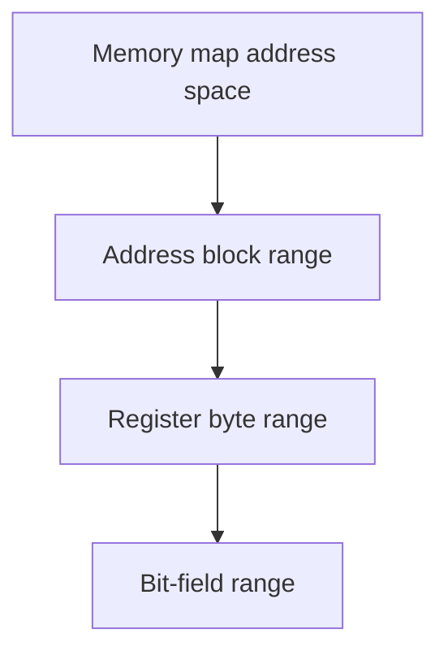

# Spatial Editing

Some IPCraft items occupy a range rather than only a list position:

- an address block occupies addresses;
- a register occupies bytes inside a block;
- a bit field occupies bits inside a register.

Spatial editing means insert, move, resize, and delete operations must keep
those ranges valid.

## Hierarchy



Each level has its own unit. A register offset is measured in bytes; a field
offset is measured in bits. Do not reuse calculations between levels without
converting units explicitly.

## Saved positions are authoritative

Array order controls presentation, but offsets and bit ranges control hardware.
Valid maps may contain empty space, so positions cannot be reconstructed from
array order alone.

```text
Register bits: 31                          0
               [ STATUS ][ gap ][ ENABLE ]
```

The gap is intentional data, not an error.

## Operations

| Operation | Expected result |
|---|---|
| Insert | Add an item in available space and return its final position |
| Delete | Remove an item and apply the layout rule for that editor |
| Move | Change order while preserving unrelated space where required |
| Resize | Change one range without crossing a neighbor or boundary |

The exact layout rule depends on the operation. Bit-field insertion and deletion
close gaps; field movement keeps existing gaps. This distinction is deliberate.

## One-operation pipeline


The editor must not save an intermediate overlapping layout. One gesture creates
one complete document update so undo and document versions remain predictable.

## Guarantees

After a successful operation:

- every item stays inside its parent range;
- sibling items do not overlap;
- saved positions match the visual layout;
- array order matches the editor's display order;
- selection follows the moved item rather than its old index;
- editor-only row IDs are not written to YAML.

An operation that cannot meet these guarantees should return a clear error and
leave the document unchanged.

## Main implementation areas

| Area | Responsibility |
|---|---|
| `LayoutEngine.ts` | Bit-field position rules |
| `SpatialInsertionService.ts` | Insert fields, registers, and blocks |
| `FieldOperationService.ts` | Structured field operations |
| `reorderPreview.ts` | Shared drag destination calculation |
| `rowIdentity.ts` | Preserve selection across reparsing |

See [bit field handling](../architecture/bit-field-handling.md) for detailed
field rules and [bit field developer reference](../reference/bitfield-interaction.md)
for functions and callbacks.
