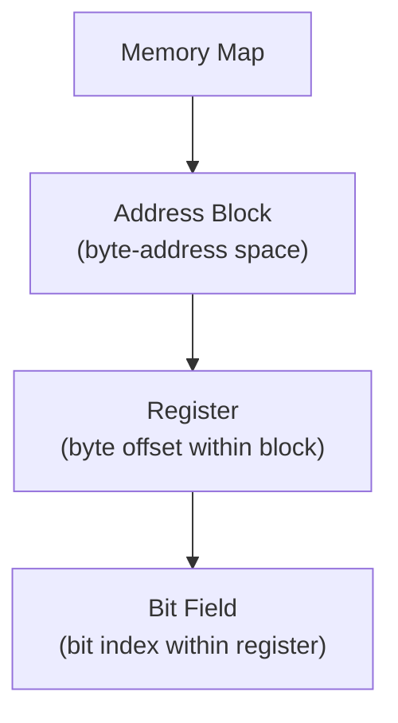
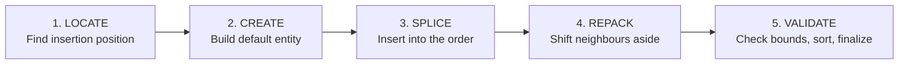

# Spatial Editing

The "what" and "why" of editing a memory map by direct manipulation: the mental
model behind moving, resizing, creating, and reordering entities in a coordinate
space while the system keeps the layout valid.

This is the conceptual companion to two code-facing documents:

- [Bit Field Handling](../architecture/bit-field-handling.md) -- how the editor
  is structured and how a change flows to disk (the "how" and "where").
- [Bit Field Interaction Reference](../reference/bitfield-interaction.md) --
  exact shortcuts, callback contracts, and function signatures (the dictionary).

## What spatial editing is

A memory map is a set of entities laid out along coordinate axes. **Spatial
editing** means the user changes an entity's *position* or *extent* by acting on
its visual representation -- dragging an edge, dropping it into a new slot,
pressing an arrow key -- and the system is responsible for turning that gesture
into a valid layout. The user never types raw offsets to move things; they
manipulate the picture and the numbers follow.

The promise the system makes in return: **every accepted gesture yields a legal
layout.** No overlaps, nothing out of bounds, and never a half-applied change.

## The entity hierarchy

Three nested entities share one mental model -- a span with a position and a
width inside a parent's coordinate space.

| Entity | Coordinate space | Position | Extent |
|--------|------------------|----------|--------|
| Address block | Byte addresses in the map | Base address | Size in bytes |
| Register | Byte offsets in the block | Offset | Size (width in bytes) |
| Bit field | Bit indices in the register | LSB index | Width in bits |

Because the model is identical at every level, the same operations and the same
guarantees apply whether you are nudging a bit field or relocating an address
block.

## Notation and the source-of-truth principle

Bit fields are written in **MSB-first datasheet notation**: `[hi:lo]`, the same
way a hardware reference manual prints them. A single-bit field is `[n:n]`.
Registers and blocks use byte offsets and base addresses.

One rule governs every entity:

> **The persisted position notation is the single source of truth.** Any numeric
> conveniences derived from it -- an LSB index, a bit width, a high/low tuple --
> are computed when needed and are never written back to the file.

This keeps the saved document minimal and unambiguous, and it means the editor
can recompute the whole layout from notation alone at any time.

## Gaps are legitimate

Unused space between entities is meaningful, not an error:

- Reserved bits between two fields (a hole at `[3:1]`, for example).
- Padding or address holes between registers or blocks.

A guiding distinction runs through the whole system:

- Operations that **rearrange** entities (relocate, reorder) must **preserve
  gaps**. Moving a field past its neighbour should swap their positions and keep
  the reserved bits intact, not silently absorb them.
- A small set of **structural** operations deliberately **compact** the layout,
  packing entities together with no gaps. This is reserved for cases where dense
  packing is the explicit intent.

Choosing the wrong philosophy for an operation is a classic source of bugs --
e.g. a reorder that accidentally compacts and eats a reserved-bit gap.

## The operations

| Operation | Meaning | Gap behavior |
|-----------|---------|--------------|
| **Insert** | Add a new entity adjacent to the selected one | Neighbours shift to make room |
| **Create** | Draw a brand-new entity into empty space | Fills part of an existing gap |
| **Resize** | Grow or shrink one edge of an entity | Bounded by neighbours; cannot overlap |
| **Relocate** | Drag an entity to a different position | Other entities part to receive it; gaps preserved |
| **Reorder** | Swap an entity with an adjacent one | Positions exchange; gaps preserved |
| **Delete** | Remove an entity | Leaves a gap (no automatic compaction) |

Resize and relocate are continuous, direct-manipulation gestures (drag). Reorder
is a discrete swap (arrow key or button). Insert and create add new entities.

## Insertion as a pipeline

Insertion is the most involved operation because it both adds an entity and
rebalances its neighbours. Conceptually it always runs the same five stages:

| Stage | Purpose |
|-------|---------|
| **Locate** | Find the selected entity and compute where the new one goes |
| **Create** | Build a default entity (a 1-bit field, a 4-byte register, a block with one register) |
| **Splice** | Place the new entity into the ordered collection |
| **Repack** | Shift neighbours to resolve the collision the insertion caused |
| **Validate** | Confirm bounds, sort into canonical order, and either commit or reject |

## Invariants the system guarantees

These hold after every accepted operation, at every level of the hierarchy:

- **Non-overlap** -- no two entities claim the same coordinate.
- **In-bounds** -- nothing extends past its parent's capacity (a field cannot
  exceed the register width; a register cannot exceed the block).
- **Atomicity** -- a change is applied in full or not at all. A rejected
  operation leaves the prior layout untouched; there is no partial or corrupt
  intermediate state.
- **Canonical order** -- entities are kept sorted by position so the file and
  the UI read consistently.
- **Stable identity** -- an entity keeps its identity across a move. A bit
  field, for instance, retains its colour and its selection when it is reordered,
  because identity is tracked independently of position.

When an operation cannot satisfy these invariants (an insert with no room, a
resize that would overlap), it is **rejected with a human-readable reason** and
the layout is unchanged.

## Glossary

| Term | Meaning |
|------|---------|
| **Bits notation** | MSB-first `[hi:lo]` description of a field's bit span |
| **Offset** | The least-significant coordinate of an entity (its LSB for fields, its byte offset for registers) |
| **Width / size** | The extent of an entity (bit count for fields, byte count for registers/blocks) |
| **Gap** | Legitimate unused space between two entities |
| **Segment** | A single span in a register's bit space -- either a field or a gap; the segments tile the register end to end |
| **Repack** | Recompute positions after a change |
| **Compact / dense pack** | Repack that removes gaps |
| **Gap-preserving repack** | Repack that keeps holes intact |
| **Relocate** | Drag-move an entity to a new position |
| **Reorder** | Swap an entity with an adjacent one |

## Where to go next

- To understand **how the bit-field editor is built** and how an edit reaches
  the file, read [Bit Field Handling](../architecture/bit-field-handling.md).
- For the **exact keyboard shortcuts, callbacks, and function signatures**, see
  the [Bit Field Interaction Reference](../reference/bitfield-interaction.md).
- For the layout rules registers and blocks must satisfy, see
  `recomputeBitfieldLayout`/`recomputeRegisterLayout`/`recomputeBlockLayout` in
  [`LayoutEngine.ts`](https://github.com/bleviet/ipcraft-vscode/blob/main/src/webview/algorithms/LayoutEngine.ts).
