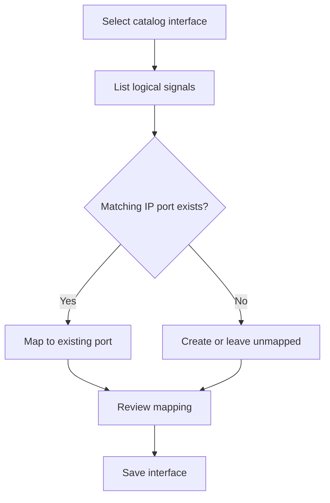

# Vivado Interface Catalog

IPCraft can read interface definitions from an installed Vivado catalog. This
lets users choose interfaces that Vivado already understands instead of
recreating each one as a custom interface.

## Interface choices

IPCraft works with three kinds of interface:

| Kind | Source | Best use |
|---|---|---|
| Built-in | Shipped with IPCraft | Common buses supported directly by the generator |
| Vivado catalog | Read from the local Vivado installation | Vendor interfaces that Vivado already defines |
| Custom | Defined in the project | Project-specific signal groups |

The source affects how an interface is discovered, but the canvas presents all
three as interfaces with named logical signals.

## Discovery flow

IPCraft reads the same interface metadata that Vivado uses for IP packaging.
The source files remain owned by Vivado; IPCraft stores only the selected
interface identity and the user's signal mapping.

## Mapping signals

Adding a catalog interface does not discard existing ports. IPCraft opens a
mapping step where each logical interface signal can be connected to an
existing IP port or a newly created port.

For example, a logical clock signal may map to the IP port `sample_clk` even if
the catalog calls that signal `CLK`.

The saved mapping is explicit. Later generation does not need to guess from
port names.

## What is saved

The IP core document records:

- the interface identity supplied by Vivado;
- the interface mode, when the definition supports modes;
- the mapping from logical signals to physical IP ports.

It does not copy the complete Vivado installation catalog into the project.
Another machine must have a compatible definition when it needs to browse or
validate that interface.

## Limits

- Catalog discovery depends on a configured Vivado installation.
- A catalog entry does not automatically provide IPCraft HDL generation rules.
- A user must review signal direction, width, and clock or reset relationships.
- Project-specific interfaces should still use a reusable custom definition.

## Implementation map

| Responsibility | Location |
|---|---|
| Read Vivado interface files | Extension-side Vivado services |
| Present search and selection | IP Core webview |
| Save interface mapping | IP core domain and YAML editing layers |
| Generate Vivado metadata | `src/generator/` |

See [Defining a custom interface](../how-to/defining-a-custom-interface.md) when the
interface is not available from the built-in or Vivado catalogs.
