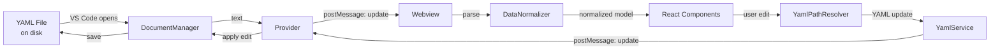

# YAML Data Flow

How data moves between the YAML file on disk, the extension host, and the webview UI.

## Overview

## Document Open (Host -> Webview)

1. VS Code opens a `*.mm.yml` or `*.ip.yml` file
2. The provider waits for the webview to post `{ type: 'ready' }`
3. The provider sends `{ type: 'update', text, filename }` (IP Core also includes resolved imports via `ImportResolver`)
4. The webview parses the YAML and normalizes it into an in-memory model

## Parsing and Normalization

YAML input can vary in shape (e.g. `memory_maps` key, arrays, or direct objects). `DataNormalizer` produces consistent in-app structures regardless of the input format.

Key services:

| Service | Role |
|---------|------|
| `DataNormalizer` | Converts varying YAML shapes into uniform app state |
| `YamlService` | Parse/dump YAML, handles bit-field format cleanup |
| `YamlPathResolver` | Applies precise path-based updates to the parsed YAML object |

## User Edit (Webview -> Host)

1. User modifies a value in the React UI
2. Component calls `onUpdate(path, value)` -- e.g. `onUpdate(['fields', 0, 'name'], 'status')`
3. `YamlPathResolver` applies the update to the parsed YAML document
4. `YamlService` serializes back to text
5. Webview posts `{ type: 'update', text }` to the host
6. `MessageHandler` routes to `DocumentManager.updateDocument()`
7. VS Code document is updated

## Update Path Types

| Change Type | Path | Example |
|-------------|------|---------|
| Single property | `['fields', index, 'property']` | Change a field name |
| Structural (insert, delete, reorder) | `['fields']` | Replace entire fields array |
| Block-level | `['address_blocks', index, ...]` | Modify a block property |

Structural changes replace the entire array to avoid intermediate invalid states (e.g. overlapping bit ranges during a reorder).

## IP Core Import Resolution

For `*.ip.yml` files, `ImportResolver` resolves `$ref` references to external memory map files before sending data to the webview. This allows the IP Core editor to display linked memory maps inline.
