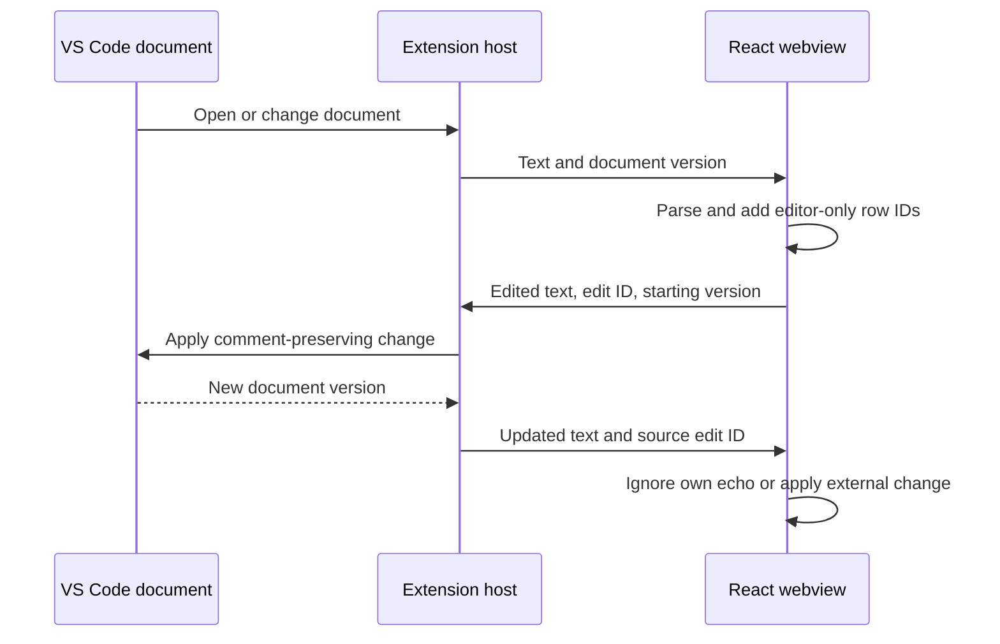

# YAML Data Flow

The extension host owns the VS Code document. The webview owns the visible
editor state. Versioned messages keep them synchronized without losing external
edits or repeating the webview's own changes.

## Complete flow

```mermaid
sequenceDiagram
    participant File as VS Code document
    participant Host as Extension host
    participant View as React webview
    File->>Host: Open or change document
    Host->>View: Text and document version
    View->>View: Parse and add editor-only row IDs
    View->>Host: Edited text, edit ID, starting version
    Host->>File: Apply comment-preserving change
    File-->>Host: New document version
    Host->>View: Updated text and source edit ID
    View->>View: Ignore own echo or apply external change
```

## Opening a document

1. The provider waits for the webview's `ready` message.
2. The host sends YAML text and the current document version.
3. `src/domain/parse.ts` converts the YAML object into the normalized editor
   model.
4. The parser adds values such as `rowId` that help React keep rows stable.

For IP core files, the host resolves supported imports before sending data to
the editor.

## Editing

1. A component requests a path or structured operation.
2. `src/yamledit/` updates the parsed YAML document while preserving comments
   and number spellings such as hexadecimal values.
3. Serialization removes `rowId`, `__kind`, and other editor-only values.
4. The webview sends an increasing edit ID and the document version it started
   from.
5. `DocumentManager` applies accepted writes in order.

Simple properties use a path such as `['fields', 0, 'name']`. Structural
changes replace a complete array or use a named operation such as
`['__op', 'field-move']` so no invalid intermediate state reaches the file.

## Stale edits and echoes

If the document changed after the webview's starting version, the host rejects
the edit and requests a full refresh. The webview also drops:

- an echo carrying its own completed edit ID;
- an update older than the newest version already shown.

`src/services/WebviewRouter.ts` and
`src/webview/sync/revisionFilter.ts` implement the two sides of this rule. Change
and test them together.

## YAML libraries

Use `js-yaml` for read-only parsing or simple output where formatting does not
matter. Use `yaml` v2 and `src/yamledit/` for edits written back to an existing
document. The latter preserves comments and hexadecimal spelling.
