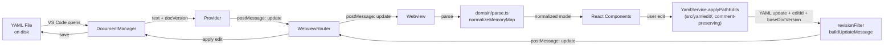

# YAML Data Flow

How data moves between the YAML file on disk, the extension host, and the webview UI.

## Overview

```mermaid
graph LR
    F["YAML File<br/>on disk"] -->|"VS Code opens"| D["DocumentManager"]
    D -->|"text + docVersion"| P["Provider"]
    P -->|"postMessage: update"| R["WebviewRouter"]
    R -->|"postMessage: update"| W["Webview"]
    W -->|"parse"| N["domain/parse.ts<br/>normalizeMemoryMap"]
    N -->|"normalized model"| UI["React Components"]
    UI -->|"user edit"| Y["YamlService.applyPathEdits<br/>(src/yamledit/, comment-preserving)"]
    Y -->|"YAML update + editId + baseDocVersion"| S["revisionFilter<br/>buildUpdateMessage"]
    S -->|"postMessage: update"| R
    R -->|"apply edit"| D
    D -->|"save"| F
```

## Document Open (Host -> Webview)

1. VS Code opens a `*.mm.yml` or `*.ip.yml` file
2. The provider waits for the webview to post `{ type: 'ready' }`
3. The provider sends `{ type: 'update', text, filename, docVersion }` (IP Core also includes resolved imports via `ImportResolver`)
4. The webview parses the YAML and normalizes it into an in-memory model

## Parsing and Normalization

YAML input can vary in shape (e.g. `memory_maps` key, arrays, or direct objects).
`src/domain/parse.ts` (`normalizeMemoryMap` / `normalizeIpCore`) produces consistent in-app
structures regardless of the input format — this replaced an earlier `DataNormalizer`/
`YamlSanitizer` pair that duplicated the conversion logic per editor.

Key modules:

| Module | Role |
|--------|------|
| `src/domain/parse.ts` | Converts varying YAML shapes into the normalized domain model shared by both editors |
| `src/domain/serialize.ts` | Converts the normalized model back to schema-valid YAML, stripping computed/UI-only properties (`rowId`, `__kind`) |
| `src/yamledit/` (`applyPathEdits`) | Format-preserving path-based updates to the parsed YAML document (comments, hex spellings survive); `src/webview/services/YamlService.ts` is a thin wrapper around it |
| `YamlPathResolver` | Resolves a path against the parsed object, tolerating both camelCase and legacy snake_case keys |

## User Edit (Webview -> Host)

1. User modifies a value in the React UI
2. Component calls `onUpdate(path, value)` -- e.g. `onUpdate(['fields', 0, 'name'], 'status')`
3. `YamlService.applyPathEdits` (`src/yamledit/`) applies the update to the parsed YAML document
4. `revisionFilter.buildUpdateMessage` stamps the payload with a monotonic `editId` and the last-seen `baseDocVersion`
5. Webview posts `{ type: 'update', text, editId, baseDocVersion }` to the host
6. `WebviewRouter` routes it to `DocumentManager.updateDocument()`, rejecting it (`forceResync: true` reply) if `baseDocVersion` is stale
7. VS Code document is updated; the host echoes `{ type: 'update', text, docVersion, sourceEditId }` back, and `revisionFilter.shouldApplyUpdate` decides whether the webview re-parses it (drops echoes of its own edit and stale/out-of-order updates)

See [CLAUDE.md](../../CLAUDE.md) "Revisioned sync protocol (V-3/V-4)" for the full FIFO contract
this replaced (byte-equality echo suppression with no version numbers).

## Update Path Types

| Change Type | Path | Example |
|-------------|------|---------|
| Single property | `['fields', index, 'property']` | Change a field name |
| Structural (insert, delete, reorder) | `['fields']` | Replace entire fields array |
| Block-level | `['addressBlocks', index, ...]` | Modify a block property |
| Structured operation | `['__op', 'field-move']` | Bypasses path-edit logic; routed through `FieldOperationService` + `reorderBitfieldLayout` |

Structural changes replace the entire array to avoid intermediate invalid states (e.g. overlapping bit ranges during a reorder).

## IP Core Import Resolution

For `*.ip.yml` files, `ImportResolver` resolves `memoryMaps[].import` / `fileSets[].import` references to external files before sending data to the webview. This allows the IP Core editor to display linked memory maps inline.
