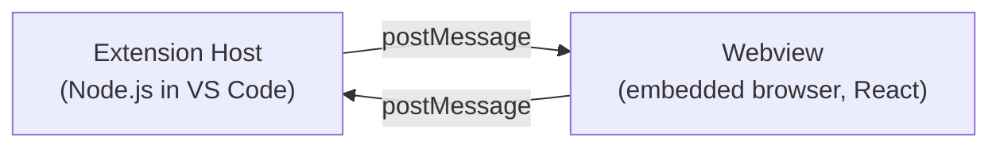

# Quick Start

## Two Runtimes

This project runs in two separate processes that communicate via `postMessage`:



**Extension Host** -- reads/writes files, registers commands, opens editors. Cannot render complex UI.

**Webview** -- renders React UI for Memory Map and IP Core editors. Cannot access user files directly.

## Key Files to Start With

### Extension Host

| File | Purpose |
|------|---------|
| `src/extension.ts` | Activation + provider registration |
| `src/providers/MemoryMapEditorProvider.ts` | Custom editor for `*.mm.yml` |
| `src/providers/IpCoreEditorProvider.ts` | Custom editor for `*.ip.yml` |
| `src/services/MessageHandler.ts` | Routes messages from webview |

### Memory Map Webview

| File | Purpose |
|------|---------|
| `src/webview/index.tsx` | Main app shell |
| `src/webview/components/Outline.tsx` | Sidebar tree navigation |
| `src/webview/components/DetailsPanel.tsx` | Routes to sub-editors |
| `src/webview/components/register/RegisterEditor.tsx` | Register editing UI |
| `src/webview/components/BitFieldVisualizer.tsx` | Visual bit field diagram |

### IP Core Webview

| File | Purpose |
|------|---------|
| `src/webview/ipcore/IpCoreApp.tsx` | IP Core editor app shell |

### Shared Behavior

| File | Purpose |
|------|---------|
| `src/webview/hooks/useMemoryMapState.ts` | Parsed memory map state |
| `src/webview/hooks/useSelection.ts` | Selection tracking |
| `src/webview/hooks/useYamlSync.ts` | Bi-directional YAML sync |
| `src/webview/services/SpatialInsertionService.ts` | Insert with repacking |

## Setup

```bash
npm install
npm run compile
```

Press **F5** in VS Code to launch an Extension Development Host. Open a `*.mm.yml` or `*.ip.yml` file.

## Typical Edit Loop

1. Start watch build: `npm run watch`
2. Make code changes
3. Reload the Extension Development Host window (`Ctrl+Shift+F5`)
4. Validate with focused tests: `npm run test:unit -- <test-file>`

## First Good Tasks

- Add or update unit tests in `src/test/suite/**`
- Fix UI behavior in a focused component
- Improve validation or error text in services/hooks
- Improve documentation in `docs/`
