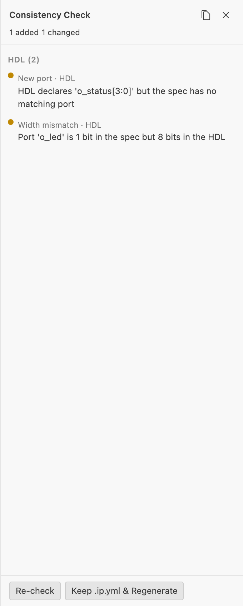

# Checking Consistency

How to catch drift between an IP Core spec and the HDL or vendor files generated from it.

Generated files can be hand-edited after scaffolding — a signal renamed in the top-level entity, a port added directly to the HDL, a `component.xml` regenerated by Vivado. Consistency checking cross-references the `.ip.yml` spec against those artifacts and reports every mismatch in both directions, so drift is caught before it causes an integration failure.

## Prerequisites

- An IP Core (`.ip.yml`) that has already been scaffolded at least once, so a top-level HDL file exists to check against

## Choose a check

| Command | Compares the spec against | Use when |
| --- | --- | --- |
| `IPCraft: Check Consistency` | The top-level HDL entity/module for **every** file in `fileSets`, plus `altera/<name>_hw.tcl` and `xilinx/component.xml` if they exist | You want the full picture, including generator-owned files that would be silently overwritten on the next generate |
| `IPCraft: Check HDL Consistency (managed:false)` | Only HDL files explicitly marked `managed: false` (hand-authored, never touched by generation) | You only care about drift in files you deliberately protected from regeneration |

Both are available from the Command Palette, the `.ip.yml` editor title bar, the Explorer/editor context menu, and the **IPCraft** menu.

## Run it

1. Open the `.ip.yml` file (visual editor or text editor)
2. Run **IPCraft: Check Consistency** (or the HDL-only variant) from the Command Palette
3. A toolbar badge in the visual editor also runs the full check automatically whenever the editor opens and whenever the HDL or vendor files it depends on change, so you may already see a result before running the command manually

## Reading the results

Results appear in three places at once:

| Location | What you see |
| --- | --- |
| Toolbar badge (visual editor) | A live count reflecting the current state — click it to open the findings panel |
| Findings overlay panel | Every finding, grouped by source, with **Re-check** and **Keep .ip.yml & Regenerate** actions |
| Output channel (`IPCraft Consistency Check` / `IPCraft HDL Consistency`) | The same findings as plain text, plus an information/warning toast |

Each finding has a **kind** — `missing-port`, `extra-port`, `direction-mismatch`, `width-mismatch`, `parameter-default-mismatch`, `missing-register`, `field-range-mismatch`, and others — and a **severity**:

| Severity | Meaning |
| --- | --- |
| Amber | Additive or reconcilable — e.g. a port exists in the HDL but not yet in the spec, and could plausibly be adopted |
| Red | Destructive or conflicting — e.g. a port the spec declares is missing from the HDL, or a width/direction disagreement |

There is no diff view opened directly by this feature — pair it with the diff shown in the [staging overlay](create-your-first-ip-core.md#review-and-accept-the-staged-output) when you re-scaffold to see the actual text change.

## Resolving findings

| Finding kind | Typical fix |
| --- | --- |
| Extra port/parameter in HDL | Add the matching field to the `.ip.yml` spec (canvas or YAML), or ignore the finding if the addition was intentional and out of scope for the spec |
| Missing port/parameter in HDL | Someone deleted it by hand — either restore it in the HDL or remove it from the spec |
| Direction/width/default mismatch | Decide which side is correct, then edit the other to match |
| Missing register/field-range mismatch | Regenerate the register file, or reconcile the memory map manually if the HDL was hand-tuned |

After fixing the spec side, re-run **IPCraft: Scaffold Project** (see [Generating a Project](generating-a-project.md)) to bring the generated files back in sync, or edit the HDL directly if it is `managed: false`.

## Next steps

- [Generating a Project](generating-a-project.md) — regenerate files once the spec is corrected
- [Building a Project](building-a-project.md) — run a headless synthesis build once the spec and HDL agree
