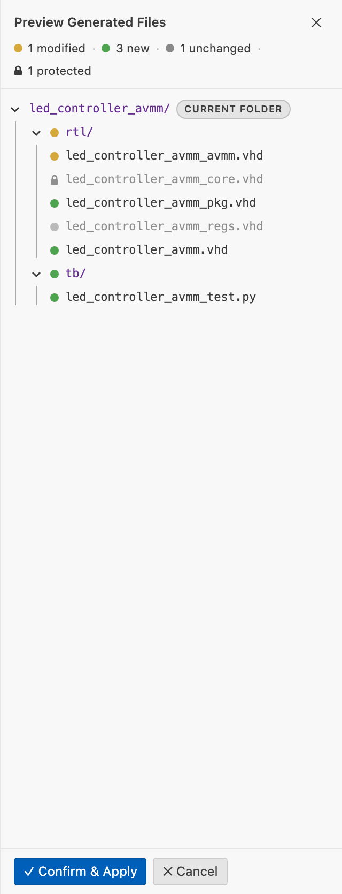

# Creating Your First IP Core

How to go from an empty folder to a generated RTL project using the visual canvas editor.

## Prerequisites

- IPCraft installed in VS Code
- An empty workspace folder (or any folder you want to add the IP core to)

## Create the file

1. Open the Command Palette (`Ctrl+Shift+P`)
2. Run `IPCraft: New IP Core` (use `IPCraft: New IP Core + Register Map` instead if your core needs memory-mapped registers — see [Memory-Mapped Registers](../tutorials/memory-mapped-registers.md))
3. Choose a file name — this becomes the core's default `name` in the spec

IPCraft creates `<name>.ip.yml` and opens it in the visual canvas editor. The file is the single source of truth for the core — its VLNV, clocks, resets, ports, bus interfaces, and code generation settings all live here as plain, version-controllable YAML:

```yaml
vlnv:
  vendor: user # from the ipcraft.import.vendor setting
  library: my_library
  name: my_core # taken from the file name you chose
  version: 1.0.0
description: A new IP Core definition
```

**VLNV** stands for Vendor · Library · Name · Version — the four-part identifier that uniquely names an IP core across tools and repositories. Set `ipcraft.import.vendor` in Settings once and every new blank core inherits it as the default vendor.

You can switch to the raw YAML at any time with `Ctrl+Shift+V`.

## The canvas


The canvas renders the core as a live block diagram. Every change made in the Library Palette or Inspector is reflected here instantly, and vice versa.

| Panel | Location | Purpose |
| --- | --- | --- |
| Library Palette | Left | Draggable primitives: generics, infrastructure (clocks/resets/ports/interrupts), bus protocols |
| IP Block Canvas | Center | The SVG schematic — clocks/resets on the left edge, ports and bus interfaces on the right, generics along the bottom |
| Inspector | Right | Properties of whatever is currently selected on the canvas |

| Key | Action |
| --- | --- |
| `Delete` | Remove the selected element |
| `Ctrl+D` / `Cmd+D` | Duplicate the selected element |
| `Ctrl+Z` / `Ctrl+Y` | Undo / Redo |
| `Ctrl+0` / `Cmd+0` | Reset zoom to 100% |
| `Ctrl+Wheel` | Zoom in / out |
| Plain wheel / middle-mouse drag / `Space`+drag | Pan |
| `Ctrl+F` / `Cmd+F` | Open port search |

See the [IP Core Editor Reference](../reference/ip-core-editor.md) for the full component and validation model.

## Add clocks, resets, and ports

Drag each element from the Library Palette's **Infrastructure** category onto the canvas — clocks and resets go on the left edge, ports on the right edge. Click any placed element to edit its fields in the Inspector.

| Element | Key fields |
| --- | --- |
| Clock | Name (e.g. `clk`, `axi_clk`); optional frequency hint used for timing-aware vendor packaging; associated reset |
| Reset | Polarity — `activeLow` (default, `rst_n`) or `activeHigh` (`rst`); associated clock |
| Port | Name, direction (`in` / `out` / `inout`), width (numeric or a generic reference) |
| Generic/Parameter | Integer, boolean, or string variant — exposes a VHDL generic / SystemVerilog parameter at integration time |

The canvas colors each clock domain differently, so with two clocks every port associated with `clk_a` appears in one color and `clk_b` ports in another — clock-domain crossings become visible at a glance.

## Add a bus interface

A bus interface groups related signals (address, data, handshake) into one named connector. IPCraft knows the signal maps for common bus standards, so you describe *what* the interface is rather than wiring every signal by hand.

1. Open the Library Palette — bus types are grouped under **Protocols**
2. Find the bus type you need (e.g. AXI4-Lite Slave), or use the search box to filter
3. Drag it onto the right edge of the canvas block
4. Click the new bus interface, then edit its fields in the Inspector

| You want… | Use |
| --- | --- |
| Register access (control/status) | AXI4-Lite Slave or Avalon-MM Slave |
| Burst DMA from the core | AXI4 Master |
| Simple memory-mapped I/O | APB Slave |
| Custom/proprietary bus | Custom Interface (conduit) — see [Custom Interfaces](../concepts/custom-interface.md) |

The Inspector's `physicalPrefix` field sets the HDL signal prefix, e.g. `s_axi_` → `s_axi_awaddr`, `s_axi_awvalid`.

## Generate your RTL

Run **IPCraft: Scaffold Project** from the Command Palette, the editor title bar, or the **IPCraft** menu. It generates RTL, a testbench, and vendor project files in one step — see [Generating a Project](generating-a-project.md) for the full output layout and per-piece generation commands.

| Output | What it is |
| --- | --- |
| `<name>.vhd` / `.sv` | Top-level entity/module instantiating core + bus wrapper |
| `<name>_core.vhd` / `.sv` | User logic skeleton — this is where your code goes |
| `<name>_pkg.vhd` / `.sv` | Register constants and types package |
| `<name>_axil.vhd` / `<name>_avmm.vhd` (+ `.sv`) | Bus wrapper matching the bus type on your register-mapped slave interface |
| `<name>_regs.vhd` / `.sv` | Register decode logic (if a register map is linked) |
| `tb/<name>_test.py`, `tb/Makefile` | cocotb test skeleton and simulation Makefile |
| `component.xml` / `<name>_hw.tcl` | Vivado IP-XACT / Platform Designer component (per configured target) |

## Review and accept the staged output

Before anything is written to disk, IPCraft shows a staging overlay with exactly what will happen:



| Status | Meaning |
| --- | --- |
| New | File does not exist yet — will be created |
| Modified | Existing file whose content differs — will be overwritten unless excluded |
| Unchanged | Generated content is identical to what's on disk — no write needed |
| Protected (lock icon) | User-owned file (`managed: false`) — excluded from Apply by default |

Click **View Diff** next to any modified file to open a side-by-side diff before committing. Click **Confirm & Apply** to write all staged, non-excluded files, or **Cancel** to discard the run.

A file is only protected from overwrite if something explicitly marks it `managed: false` — either a `fileSets` entry you add yourself, or a scaffold pack rule. The default `builtin-ipcraft` pack does **not** mark `<name>_core.vhd` as protected, so re-running Scaffold Project regenerates it from the template and any hand-edited logic there is overwritten unless you protect it explicitly.

## Next steps

- [Generating a Project](generating-a-project.md) — every generation command and the full output layout
- [Building a Project](building-a-project.md) — run a headless Vivado/Quartus build against the generated files
- [Memory-Mapped Registers](../tutorials/memory-mapped-registers.md) — link a register map to a bus interface
- Prefer to follow along inside VS Code? Run `IPCraft: Open Walkthrough...` → **Design Your First IP Core**
