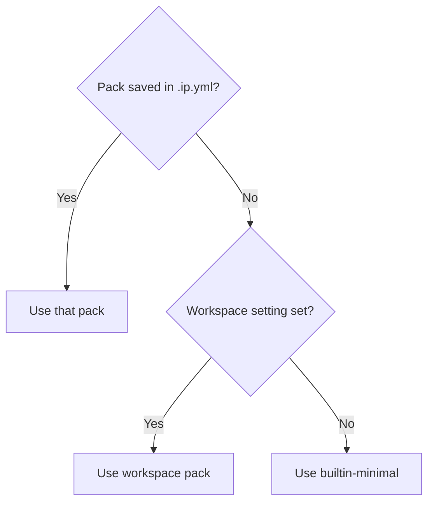
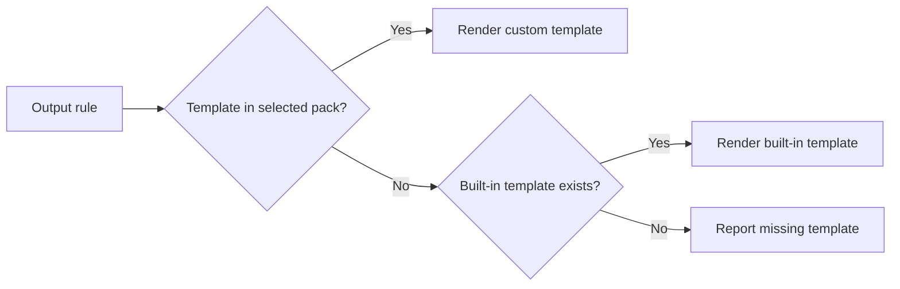

# Customizing Generated Files with Scaffold Packs

A scaffold pack controls which files IPCraft generates and where it puts them.
Use one when the built-in file layout does not match your project.

A pack contains:

- `scaffold.yml`, which lists the output files;
- optional `.j2` templates, which describe their contents.

`.j2` files use Nunjucks, a template language that replaces names such as
`{{ name }}` with values from the current IP core.

## Choose a pack

IPCraft includes these packs:

| Pack | Use it when |
|---|---|
| `builtin-minimal` | You need one empty top-level HDL file |
| `builtin-ipcraft` | You want the complete IPCraft RTL structure |
| `example-register-only` | Your project already has most RTL and needs only register decoding |
| `example-no-regfile` | You want IPCraft's structure but will write the register decoder yourself |
| `example-with-docs` | You also want generated Markdown register documentation |

Open an `.ip.yml` file and select a pack from **Scaffold Template** in the
editor toolbar.


The selection is saved with the IP core. If the file does not choose a pack,
IPCraft uses the workspace setting `ipcraft.generate.scaffoldPack`, followed by
`builtin-minimal`.



## Preview a template

1. Open a `.j2` file.
2. Run **IPCraft: Preview Template Output** from the Command Palette or editor
   title bar.
3. Choose an `.ip.yml` file if the workspace contains more than one.
4. Save the template to refresh the preview.

The preview is read-only. Use **IPCraft: Pin Preview IP Core** to change which
IP core supplies the preview data.

## Create a pack from a built-in pack

This is the simplest way to begin:

1. Run **IPCraft: Export Built-in Scaffold Pack**.
2. Select the closest built-in or example pack.
3. Enter a short folder name, such as `aurora-rtl`.
4. Open the exported `scaffold.yml`.

IPCraft writes the copy under:

```text
.vscode/ipcraft/packs/aurora-rtl/
├── scaffold.yml
├── top.vhdl.j2
├── top.sv.j2
└── ...
```

The Scaffold Pack Preview beside `scaffold.yml` shows the resulting file tree:

```text
rtl/
├── spi_controller_pkg.vhd       generated
├── spi_controller.vhd           generated
├── spi_controller_core.vhd      protected
└── spi_controller_regs.sv       skipped: condition is false
```

- **generated** means IPCraft will write or replace the file;
- **protected** means IPCraft writes it once and then leaves it alone;
- **skipped** means the file's condition does not match the current IP core.

## Create a small pack from scratch

Create this directory:

```text
.vscode/ipcraft/packs/my-pack/
├── scaffold.yml
├── top.vhdl.j2
└── top.sv.j2
```

Add a manifest:

```yaml title=".vscode/ipcraft/packs/my-pack/scaffold.yml"
name: "my-pack"
description: "One top-level HDL file"
fullGeneration: false

files:
  - source: "top.vhdl.j2"
    target: "rtl/{{ name }}.vhd"
    condition: "not is_systemverilog"

  - source: "top.sv.j2"
    target: "rtl/{{ name }}.sv"
    condition: "is_systemverilog"
```

Then select `my-pack` from **Scaffold Template** and generate the project.

## Manifest fields

| Field | Required | Meaning |
|---|---|---|
| `name` | Yes | Pack name shown by IPCraft |
| `description` | No | Short explanation shown in the preview |
| `fullGeneration` | No | Gives generated tests the complete register and bus data when `true`. A full-generation pack that declares testbench-like output and its own build/run entry point owns the complete output tree, so IPCraft does not append framework, `docs/`, `altera/`, or `xilinx/` files |
| `generateFrameworkTestbench` | No | Explicitly enables or suppresses IPCraft's `tb/*` and `.vscode/settings.json` framework testbench output. When omitted, it remains enabled for compatibility unless the pack owns the complete output tree |
| `requirements` | No | Input compatibility this pack needs — see below |
| `files` | Yes | Output rules |
| `files[].source` | Yes | Template to render |
| `files[].target` | Yes | Output path, relative to the generated project |
| `files[].condition` | No | Generate only when the expression is true |
| `files[].managed` | No | Replace on later runs unless set to `false` |
| `files[].executable` | No | Set the POSIX executable bit after writing the file |

Use `managed: false` for files that users are expected to edit. IPCraft creates
the file on the first run and does not replace an existing copy later.

```yaml
- source: "core.vhdl.j2"
  target: "rtl/{{ name }}_core.vhd"
  managed: false
```

Use `executable: true` for pack-owned helper scripts that must be runnable
directly (`./script.sh`) instead of only via `bash script.sh`. IPCraft sets
the owner/group/other execute bits after writing the file, without touching
any other permission bit already present. This has no effect on filesystems
that don't support POSIX permission bits (e.g. some Windows/exFAT mounts) —
`ipcraft verify` compares file content only and never reports a mode-only
difference as stale.

```yaml
- source: "qsys_tb_gen_sh.j2"
  target: "qsys/qsys_{{ name }}_tb_gen.sh"
  executable: true
```

## Declare input requirements

A pack that only makes sense for certain IP cores can declare `requirements` in
`scaffold.yml`. IPCraft checks these before rendering any file — an
incompatible IP core fails generation with a clear reason instead of
producing a partial or invalid file tree.

```yaml
requirements:
  hdlLanguages:
    - vhdl
  busTypes:
    - avmm
  memoryMappedSlave: required
  logicalPorts:
    - address
    - read
    - write
    - writedata
    - readdata
```

| Field | Meaning |
|---|---|
| `hdlLanguages` | HDL languages this pack supports (`vhdl`, `systemverilog`) |
| `busTypes` | Bus type ids this pack supports (`axil`, `axi4`, `avmm`, `axis`, `avst`) |
| `memoryMappedSlave` | `required` or `forbidden` — whether the IP core must (not) have a memory-mapped slave interface |
| `logicalPorts` | Logical port names (case-insensitive) that must be active on the primary bus interface — useful for buses such as Avalon-MM where every port is optional, so an interface with no enabled ports would otherwise render with no signals |

Omitting `requirements` entirely (or any field within it) imposes no
constraint on that dimension — existing manifests keep working unchanged.

## How templates are found

IPCraft checks the selected pack first and then the built-in template library.
You only need to copy templates you want to change.



The same rule applies to Cocotb and vendor project templates. A custom
`component.xml.j2` is different: it replaces the complete Vivado component
file, not part of it.

## Common template values

The complete list is in the [generator reference](../reference/generator.md).
These values cover most small packs:

| Value | Meaning |
|---|---|
| `name` | IP core name |
| `is_systemverilog` | `true` for SystemVerilog output |
| `has_memory_mapped_slave` | The core has a memory-mapped slave interface |
| `bus_type` | Short bus name such as `axil` or `avmm` |
| `registers` | Registers sorted by address |
| `user_ports` | Ports that are not part of a bus |
| `generics` | IP core parameters |

Common conditions are:

```yaml
condition: "not is_systemverilog"
condition: "is_systemverilog"
condition: "has_memory_mapped_slave"
condition: "includeRegs and has_memory_mapped_slave"
```

## Verify the pack

Before sharing a pack:

1. Preview every changed template.
2. Check generated and skipped files in the file-tree preview.
3. Generate both supported HDL languages when applicable.
4. Compile the generated HDL.
5. Run the generated tests.

For a complete example, follow
[Build and verify your own scaffold pack](../tutorials/build-and-verify-a-scaffold-pack.md).

## Troubleshooting

| Problem | Check |
|---|---|
| Pack not found | Folder name and `.vscode/ipcraft/packs/<name>/scaffold.yml` |
| Template not found | The resolved `source` name in the pack or built-in library |
| File always skipped | Its condition in the Scaffold Pack Preview |
| Preview has no IP core | Create an `.ip.yml` file or pin an existing one |
| Preview does not refresh | Save the `.j2` file |
| Protected file is replaced | Confirm the rule has `managed: false` and the file already exists |
