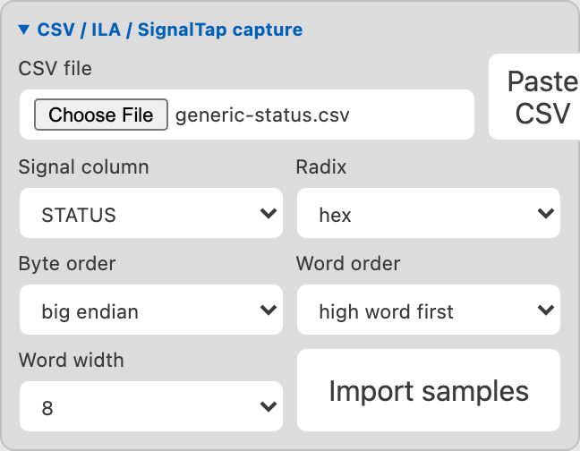

# Data Inspector Capture Examples

These mock captures demonstrate the three CSV paths supported by the Data
Inspector. Download or copy the files from this repository, then follow the
settings shown for each example.

All examples are intentionally small. They are designed to explain capture
mapping and sample navigation, not to reproduce every column emitted by a vendor
tool.

## Before loading a capture

The capture controls appear after the main workspace is open. For each example:

1. Run **IPCraft: Open Data Inspector**.
2. Enter the example's initial literal and width.
3. Select **Decode**.
4. Select the **Capture** inspector tab and open **CSV / ILA / SignalTap capture**.
5. Choose the mock CSV file.
6. Apply the mapping settings from the example.
7. Select **Import samples**.

The initial literal only establishes the source width and opens the workspace.
The imported CSV samples replace it as you move along the timeline.



## Example 1: generic CSV status-register trace

Use this example for logs produced by a script, testbench, firmware test, or any
tool that can write a header row followed by samples.

File: [generic-status.csv](examples/data-inspector/generic-status.csv)

```csv
sample,STATUS
0,00000000
1,00031211
2,00043220
3,00010001
```

### Import settings

Start with literal `32'h00000000` and width 32.

| Setting       | Value             |
| ------------- | ----------------- |
| Signal column | `STATUS`          |
| Radix         | `hex`             |
| Byte order    | `big endian`      |
| Word order    | `high word first` |
| Word width    | `8`               |

The generic `sample` column is not treated specially. Select `STATUS` explicitly
as the signal column.

### Suggested field layout

Add these fields manually, or import a compatible 32-bit status-register layout:

| Name         | Bits      | Interpretation   |
| ------------ | --------- | ---------------- |
| `BUSY`       | `[0:0]`   | unsigned         |
| `FIFO_LEVEL` | `[15:4]`  | unsigned         |
| `FSM_STATE`  | `[18:16]` | unsigned or enum |

### Expected results

| Sample | Raw value    | BUSY | FIFO_LEVEL    | FSM_STATE |
| ------ | ------------ | ---- | ------------- | --------- |
| 1      | `0x00000000` | 0    | 0             | 0         |
| 2      | `0x00031211` | 1    | 289 (`0x121`) | 3         |
| 3      | `0x00043220` | 0    | 802 (`0x322`) | 4         |
| 4      | `0x00010001` | 1    | 0             | 1         |

If an imported register supplies enum values, `FSM_STATE` can show labels such as
`PROCESS` or `DRAIN` instead of numbers.

## Example 2: Vivado ILA address trace

Use this example to see automatic Vivado ILA header detection and metadata-column
exclusion.

File: [vivado-ila-address.csv](examples/data-inspector/vivado-ila-address.csv)

```csv
Sample in Buffer,Sample in Window,ADDR
0,-4,00012000
1,-3,00012004
2,-2,00012008
3,-1,0001200C
4,0,00013F00
```

The exact headers `Sample in Buffer` and `Sample in Window` identify this as a
Vivado ILA export. The Data Inspector reports the detected format and initially
offers `ADDR` as the signal column instead of treating the two metadata columns
as signals.

### Import settings

Start with literal `32'h00000000` and width 32.

| Setting       | Value             |
| ------------- | ----------------- |
| Signal column | `ADDR`            |
| Radix         | `hex`             |
| Byte order    | `big endian`      |
| Word order    | `high word first` |
| Word width    | `8`               |

### Suggested field layout

| Name     | Bits      | Interpretation |
| -------- | --------- | -------------- |
| `PAGE`   | `[31:12]` | hex            |
| `OFFSET` | `[11:0]`  | hex            |

### Expected results

The first four samples walk through four-byte-aligned offsets in page `0x12`.
The trigger-window sample then moves to page `0x13`, offset `0xF00`.

| Sample in Window | ADDR         | PAGE   | OFFSET  |
| ---------------- | ------------ | ------ | ------- |
| -4               | `0x00012000` | `0x12` | `0x000` |
| -3               | `0x00012004` | `0x12` | `0x004` |
| -2               | `0x00012008` | `0x12` | `0x008` |
| -1               | `0x0001200C` | `0x12` | `0x00C` |
| 0                | `0x00013F00` | `0x13` | `0xF00` |

The Data Inspector timeline currently numbers imported rows; the Vivado metadata
columns are used for preset detection and are not displayed as timeline labels.

## Example 3: SignalTap bus with unknown states

Use this example to confirm that capture import preserves four-state logic and
that known fields remain useful when another part of the signal is unknown.

File: [signaltap-bus.csv](examples/data-inspector/signaltap-bus.csv)

```csv
Data:,Time:,BUS
0,0 ns,0000
1,10 ns,0001
2,20 ns,00A5
3,30 ns,XXA5
4,40 ns,ZZZZ
```

The exact headers `Data:` and `Time:` identify a SignalTap export. They are
excluded from the initial signal selection, leaving `BUS`.

### Import settings

Start with literal `16'h0000` and width 16.

| Setting       | Value             |
| ------------- | ----------------- |
| Signal column | `BUS`             |
| Radix         | `hex`             |
| Byte order    | `big endian`      |
| Word order    | `high word first` |
| Word width    | `8`               |

### Suggested field layout

| Name         | Bits     | Interpretation   |
| ------------ | -------- | ---------------- |
| `UPPER_BYTE` | `[15:8]` | hex              |
| `STATE`      | `[7:4]`  | unsigned or enum |
| `FLAGS`      | `[3:0]`  | binary           |

### Expected results

| Time  | BUS      | UPPER_BYTE | STATE   | FLAGS  |
| ----- | -------- | ---------- | ------- | ------ |
| 0 ns  | `0x0000` | `0x00`     | 0       | `0000` |
| 10 ns | `0x0001` | `0x00`     | 0       | `0001` |
| 20 ns | `0x00A5` | `0x00`     | 10      | `0101` |
| 30 ns | `0xXXA5` | `0xXX`     | 10      | `0101` |
| 40 ns | `0xZZZZ` | `0xZZ`     | unknown | `ZZZZ` |

At 30 ns, `UPPER_BYTE` is unknown while `STATE` and `FLAGS` still decode because
their bits are known. At 40 ns, numeric decoding reports `-- (unknown bits)` and
the binary view preserves the `Z` states.

As with the Vivado example, the current timeline displays the imported row number
rather than the SignalTap `Time:` value.

## Example 4: preview byte and word ordering

The same CSV cell can represent different values depending on how the exporting
tool orders words and bytes. Use this one-row generic capture:

```csv
BUS
12345678
```

Start with a 32-bit source and select hexadecimal radix. Set **Word width** to 16,
then compare these mappings:

| Byte order    | Word order      | Imported result |
| ------------- | --------------- | --------------- |
| big endian    | high word first | `32'h12345678`  |
| big endian    | low word first  | `32'h56781234`  |
| little endian | high word first | `32'h34127856`  |

Choose the mapping that describes the capture file, not the byte order of the CPU
that will eventually consume the value. If the result only becomes correct after
an unrelated transform, the capture mapping is probably wrong.

## Adapt the mock files

When replacing these examples with a real capture:

- keep a single header row;
- choose a source width large enough for every value in the selected column;
- keep the radix consistent within the selected column;
- make the source width divisible by the selected word width; and
- preserve `X` and `Z` digits when the capture contains unresolved states.

The current Data Inspector UI imports one selected signal column at a time. To
combine multiple independently captured signals, import or paste them as named
sources and use explicit transform steps such as `concat`.
