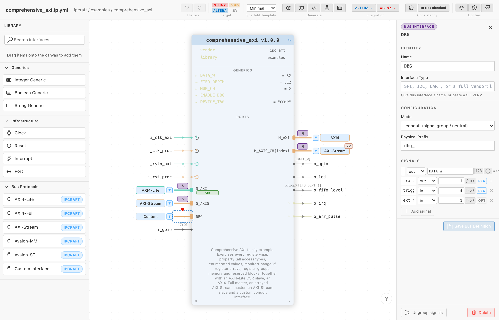

# Defining a Custom Interface

Use a custom interface to keep related signals together when no built-in
protocol matches them. A **conduit** is a group with no implied bus transaction.

Use this when a connection between cores does not fit a standard protocol — a proprietary streaming link, a diagnostic port grouping unrelated signals, or a chip-level conduit with no bus semantics. See [Custom Interface](../concepts/custom-interface.md) for the full data model this guide walks through.

## Prerequisites

- An open `.ip.yml` file in the visual canvas editor

## Add the interface

1. Open the Library Palette (left sidebar of the canvas) and find **Custom Interface** under **Bus Protocols**
2. Drag it onto the edge of the canvas block
3. Click the new interface to select it — the Inspector opens on the right

## Configure it

In the Inspector's **Configuration** section:

| Field | What it controls |
| --- | --- |
| Mode | `conduit` for a pass-through signal grouping with no transaction semantics; `slave`/`master` if the interface has an initiator/responder distinction (a named proprietary protocol) |
| Physical Prefix | HDL signal prefix, e.g. `dbg_` → `dbg_trace_data`, `dbg_trigger` |
| Interface Type | Leave blank for a one-off conduit, or enter vendor, library, name, and version to give it a reusable identity |

## Add signals

In the **Signals** section, click **Add signal** for each wire the interface needs. Each signal has:

| Field | Notes |
| --- | --- |
| Direction | `in`, `out`, or `inout` — asymmetric like a standard bus port: a signal declared `out` on a master instance becomes `in` on a slave instance |
| Name | Appears in the generated RTL port list as `<physicalPrefix><name>` |
| Width | A literal integer or a reference to one of the core's generics/parameters |
| Presence | `REQ` (required, always generated) or `OPT` (optional) |

## Reuse across IP cores

An interface defined inline (via `conduitPorts` in the `.ip.yml`) is private to that one core. To share the same signal contract across multiple cores:

1. Select the interface and click **Save Bus Definition** in the Inspector
2. Choose a name — IPCraft writes a `<name>.busdef.yml` file to the project directory and switches the interface to reference it via `useBusLibrary`
3. On another IP core, drag **Custom Interface** onto the canvas, then pick the saved definition from the Inspector — or rely on auto-discovery: any `*.busdef.yml` file in the workspace is picked up automatically and offered as a known interface type, no per-core configuration needed

Once shared, editing the `.busdef.yml` file updates every IP core that references it — a single source of truth for both the canvas and the HDL generator.

## Generated output

| Target | What gets generated |
| --- | --- |
| Vivado | A matching Bus Definition + Abstraction Definition XML pair under `busdef/`, generated automatically for any interface type not in the built-in Vivado catalog. Reused across instances of the same type — one XML pair regardless of how many interfaces reference it. |
| Quartus (Platform Designer) | Mapped to Platform Designer's generic `conduit` interface class — signals appear in the IP catalogue but are not auto-connected by protocol matching |

## Next steps

- [Custom Interface](../concepts/custom-interface.md) — the full signal definition model, storage formats, and when to prefer a standard bus type instead
- [Vivado Interface Catalog](../concepts/vivado-interface-catalog.md) — check whether Vivado already ships metadata for your protocol before building a custom one
- [Creating Your First IP Core](create-your-first-ip-core.md) — adding standard bus interfaces, clocks, resets, and ports
