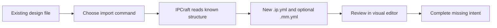

# Importing an Existing Design

IPCraft can create an IP core description from VHDL, Quartus Platform Designer,
or Vivado IP-XACT files. Import is a starting point: review the result before
generating new files.

## Choose the source

| Source | Command | Result |
|---|---|---|
| VHDL entity | **IPCraft: Import from VHDL (Experimental)** | `.ip.yml` |
| Quartus `_hw.tcl` | **IPCraft: Import from Altera Platform Designer (Experimental)** | `.ip.yml` |
| Vivado `component.xml` | **IPCraft: Import from Xilinx Component XML (Experimental)** | `.ip.yml` and sometimes `.mm.yml` |

## Import VHDL

1. Open the Command Palette.
2. Run **IPCraft: Import from VHDL (Experimental)**.
3. Select a `.vhd` or `.vhdl` file containing an entity.
4. Review the new `<entity-name>.ip.yml` in the IP Core editor.

You can also run the command from the IPCraft menu or the title bar of an open
VHDL file.

The importer reads:

| VHDL content | IPCraft result |
|---|---|
| Entity name | Core name |
| Generics | Parameters |
| Clock-like ports | Clocks |
| Reset-like ports | Resets and polarity |
| Other ports | Ports with direction and width |
| Recognized bus signal groups | Bus interfaces and physical prefixes |

Bus detection compares signal groups with supported definitions. It can
distinguish common AXI, AXI Stream, Avalon Memory-Mapped, and Avalon Streaming
patterns, but naming conventions vary. Always check the chosen bus type and
each signal mapping.

## Import Quartus Platform Designer metadata

1. Run **IPCraft: Import from Altera Platform Designer (Experimental)**.
2. Select the component's `_hw.tcl` file.
3. Review the generated `<component-name>.ip.yml`.

The importer reads component metadata, parameters, ports, and interfaces that
are explicitly described in the Tcl file. It does not import the complete
Platform Designer system around the component.

## Import Vivado component metadata

1. Run **IPCraft: Import from Xilinx Component XML (Experimental)**.
2. Select `component.xml`.
3. Review the generated `<component-name>.ip.yml`.

If the component contains memory-map information, IPCraft also creates a linked
`.mm.yml` file. The importer does not recreate the surrounding Vivado block
design.

## What import cannot determine reliably

Source files describe structure, but they do not always explain design intent.
Review these items after every import:

- vendor, library, name, and version;
- clock and reset relationships;
- bus type, mode, and signal mapping;
- parameter limits and descriptions;
- user-facing port descriptions;
- links to memory maps;
- special register behavior that is absent from the source metadata.

Do not assume a successful import means generated output is equivalent to the
original project. Generate into a separate directory, review the staged files,
and compile them before replacing any existing flow.

## Default identity settings

| Setting | Default | Purpose |
|---|---|---|
| `ipcraft.import.vendor` | `user` | Vendor assigned to imported cores; `user` may use the Git email domain |
| `ipcraft.import.library` | `ip` | Default library |
| `ipcraft.import.version` | `1.0.0` | Default version |

VLNV is the four-part identity: vendor, library, name, and version.

## Next steps

- [Check consistency](check-consistency.md)
- [Generate a project](generating-a-project.md)
- [Specification schemas](../reference/specification-schemas.md)
