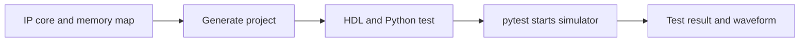

# Running a Cocotb Simulation

Cocotb lets you test generated HDL with Python. IPCraft can generate the HDL,
a Python test, and the files needed to start a simulator.

## Quick start

You need:

- Python 3.10 or newer
- `pytest` and `cocotb`
- GHDL for VHDL, or Icarus Verilog for SystemVerilog

Install the Python packages:

```bash
python3 -m pip install cocotb pytest
```

Generate the project in IPCraft, open a terminal in the generated project, and
run:

```bash
pytest -v
```



## Generated files

The exact names depend on the selected scaffold pack. A typical project has:

```text
generated-project/
├── rtl/                 # Generated VHDL or SystemVerilog
├── test/                # Cocotb tests and register-map helper
├── Makefile             # Optional simulator shortcut
└── pytest.ini           # Pytest configuration, when supplied by the pack
```

The register-map helper gives tests named access to registers and fields. This
is clearer than repeating numeric addresses and masks throughout a test.

## Run tests

Run every test:

```bash
pytest -v
```

Run one file:

```bash
pytest -v test/test_my_core.py
```

Run one test function:

```bash
pytest -v test/test_my_core.py::test_reset_values
```

If the generated project provides a Makefile, you can also run:

```bash
make
```

## Choose a simulator

Cocotb reads the `SIM` environment variable. Examples:

```bash
SIM=ghdl pytest -v
SIM=icarus pytest -v
```

Use GHDL for generated VHDL and Icarus Verilog for generated SystemVerilog
unless your scaffold pack documents another simulator.

## Read the result

A successful run reports each test as `PASSED`. A failed assertion includes
the Python file and line number. Start with the first failure because later
failures may be a consequence of it.

Generated tests may also produce a waveform file. Open it with a waveform
viewer such as GTKWave to inspect signal changes over time.

## Use the VS Code Testing view

With the Python extension installed, VS Code can discover the generated
`pytest` tests:

1. Open the generated project folder.
2. Open the **Testing** view.
3. Choose **Configure Python Tests** if discovery has not run.
4. Select `pytest` and the generated test directory.
5. Run or debug a test from the test tree.

The terminal command remains the best way to confirm the same tests work in
automation.

## Write a custom register test

Import the generated register map, then use its names instead of raw numbers.
The generated module and class names vary by pack; inspect the generated helper
for the exact import.

```python
from my_core_register_map import REGISTER_MAP


def test_register_layout():
    control = REGISTER_MAP["CONTROL"]
    assert control.offset == 0

    enable = control.fields["ENABLE"]
    assert enable.mask == 0x1
```

To extract or update a field in a register word:

```python
enable_value = (register_value & enable.mask) >> enable.lsb
updated_value = (register_value & ~enable.mask) | (1 << enable.lsb)
```

Keep layout checks separate from bus transactions. A layout test validates the
generated register description; a cocotb coroutine validates the behavior of
the simulated hardware.

## Troubleshooting

### RTL sources are not found

Run the test from the generated project root. Check that the paths in the
generated Makefile or Python runner match the `rtl/` directory.

### The simulator is not found

Confirm it is on `PATH`:

```bash
ghdl --version
iverilog -V
```

### Pytest finds no tests

Test filenames normally start with `test_`, and test functions start with
`test_`. Also check that you are running `pytest` from the generated project.

### GHDL rejects VHDL syntax

Generated VHDL uses VHDL-2008. Make sure the generated runner passes
`--std=08` and that your GHDL version supports it.

### `cocotb.runner` cannot be imported

Check the installed version:

```bash
python3 -m pip show cocotb
```

Install the version required by the generated project or its requirements
file.

## Related pages

- [Generating a project](generating-a-project.md)
- [Memory-mapped registers](../tutorials/memory-mapped-registers.md)
- [Testing](../testing.md)
