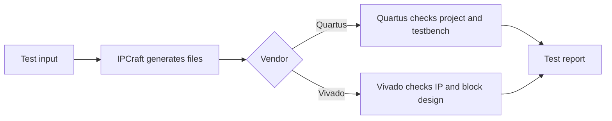

# Running the EDA Integration Tests

These tests generate vendor project files and ask Quartus or Vivado to validate
them. Run the suite for the vendor whose generator or templates you changed.

## Quick start

Install project dependencies first:

```bash
npm install
```

Then run one suite:

```bash
npm run test:integration:quartus
npm run test:integration:vivado
```



## Requirements

### Quartus

The Quartus suite runs through Docker. You need:

- Docker running locally
- Permission to start containers
- The configured Quartus image available to Docker

### Vivado

The Vivado suite needs a local Vivado installation. The `vivado` command must
be on `PATH`, or the configured Vivado path must point to it.

Both suites also need the `ipcraft-spec` submodule:

```bash
git submodule update --init --recursive
```

## What each suite checks

| Suite | What it proves |
|---|---|
| Quartus project check | Generated Tcl and project settings can be read by Quartus |
| Quartus testbench check | Generated bus test code compiles with the generated design |
| Vivado IP check | Generated IP-XACT metadata passes Vivado's integrity checks |
| Vivado block-design check | The generated IP can be placed and connected in a block design |

These tests are slower than unit tests because they start external tools. They
are intentionally separate from `npm test`.

## Skip a missing tool

If you have only one vendor tool, run only that vendor's command. Do not treat
a locally unavailable tool as proof that its generated output is valid; rely on
the matching CI job or ask another contributor to run it.

## Read the output

A successful run names each generated example and ends with a passing Jest
summary. A skipped check states which tool or optional stage was unavailable.

For a failure:

1. Find the first vendor error, not the final Jest summary.
2. Note the generated example and output path.
3. Re-run only the failing suite.
4. Compare the generated file with the source template in
   `src/generator/templates/`.

Do not edit files under `dist/`; they are copied from the source templates
during the build.

## Troubleshooting

### Docker cannot start

Confirm Docker is running:

```bash
docker info
```

Then confirm the configured Quartus image is present or can be pulled.

### No Quartus examples were generated

Check that the test inputs include an Altera or Intel target and that the
generator completed before Docker started.

### No Vivado examples were generated

Check that the test inputs include an AMD target and that Vivado generation is
enabled for the selected example.

### Vivado cannot be started

Run:

```bash
vivado -version
```

If that fails, add Vivado's `bin` directory to `PATH` or update the project
setting that points to Vivado.

### A test times out

Check whether the vendor process is still active. First runs are often slower
because tools create caches. If the process is stuck, inspect the vendor log in
the generated output directory.

### Generated output looks stale

Remove only the suite's temporary generated-output directory, rebuild, and
rerun the test. Do not edit cached output to fix a template problem.

## Related pages

- [How EDA integration tests work](../concepts/eda-integration-tests.md)
- [Testing](../testing.md)
