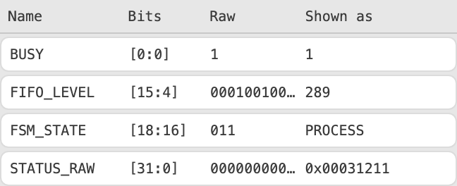
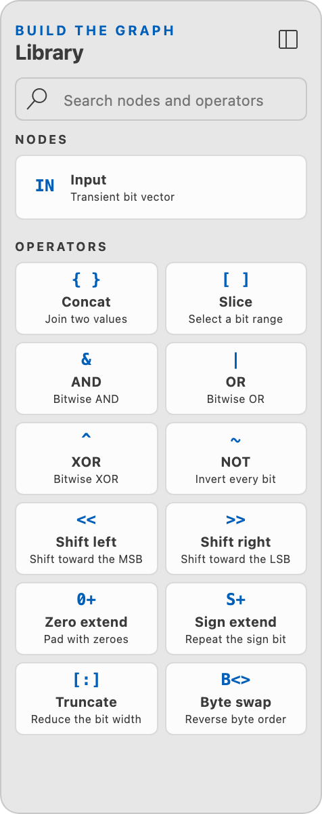

# Using the Data Inspector

The Data Inspector turns a pasted value or capture into named fields without
changing the IP core or memory map that defines the hardware. Use it for quick
register reads, simulation values, multi-word composition, numeric decoding, and
capture review.

This guide is organized by task. You do not need to configure every option for
every use case.

## Choose a workflow

| Goal                                  | Start with                                      | Options you need                                |
| ------------------------------------- | ----------------------------------------------- | ----------------------------------------------- |
| Inspect one value                     | `IPCraft: Open Data Inspector`                  | Literal, Width, Lane width, Zoom                |
| Decode a register read                | `IPCraft: Open Register in Data Inspector`      | Literal, imported fields, Interpretation        |
| Describe an ad hoc bit layout         | `IPCraft: Open Data Inspector`                  | Add field, MSB, LSB                             |
| Combine high and low words            | Add source                                      | `concat` step                                   |
| Extract or normalize bits             | Transform canvas and Library                    | Slice, mask, shift, extend, truncate, byte swap |
| Review simulator activity             | Inspector > Capture                             | VCD signal selection and sample timeline        |
| Review ILA, SignalTap, or CSV samples | Inspector > Capture                             | Column, radix, width, byte order, word order    |
| Reuse a setup                         | `Save recipe…` or `IPCraft: New Data Inspector` | Sources, fields, transforms, view settings      |

## The four parts of an inspection

The interface is easier to understand when treated as a pipeline:

```text
transient samples -> named sources -> transform steps
                              |
                              +-> fields decode ranges
```

- A **sample** is the value pasted or loaded from a capture. It is temporary.
- A **source** gives a sample a stable name and width.
- A **transform step** produces a derived value from one or two earlier values.
- A **field** assigns a name and interpretation to a bit range.

A saved recipe contains sources, fields, transforms, and view settings.
It deliberately does not contain pasted values or capture history.


## Open the Data Inspector

Use the Command Palette and choose one of these commands:

- **IPCraft: Open Data Inspector** opens a temporary inspection panel. This is
  the simplest starting point for a pasted value or capture.
- **IPCraft: Open Register in Data Inspector** asks for a register from a
  workspace memory map and opens the panel with that register's field layout.
- **IPCraft: New Data Inspector** creates a reusable `*.ipci.yml` recipe and
  opens it in the Data Inspector Recipe Editor.

## Use case 1: inspect a single value

1. Run **IPCraft: Open Data Inspector**.
2. Paste the value into **Literal**.
3. Set **Width** when the value does not declare or imply its width.
4. Select **Decode**.
5. Read the result in the bit ribbon. Bit 0 is always on the right, and the most
   significant bit is always on the left.

Common accepted forms include:

| Format              | Example                   | Width behavior               |
| ------------------- | ------------------------- | ---------------------------- |
| Verilog hexadecimal | `32'hDEAD_BEEF`           | Declared by the literal      |
| Verilog binary      | `16'b0000_XXXX_0011_ZZZZ` | Declared by the literal      |
| VHDL hexadecimal    | `x"0123_ABCD"`            | Four bits per digit          |
| VHDL binary         | `b"1010_0011"`            | One bit per digit            |
| C-style hexadecimal | `0xDEADBEEF`              | Zero-extends to **Width**    |
| C-style binary      | `0b10100011`              | Zero-extends to **Width**    |
| Decimal             | `3735928559`              | Requires the **Width** field |

Underscores are accepted as digit separators. `X` and `Z` states remain visible;
the inspector does not replace them with zero. Numeric interpretations that need
known bits show `-- (unknown bits)` when the selected range contains `X` or `Z`.

### Make a wide value easier to read

- Set **Lane** in the Bits header to 8, 16, 32, or 64 bits. This changes wrapping
  only, not the value.
- Use **overview** zoom for compact hexadecimal lanes.
- Use **by field** zoom for bits with field overlays.
- Use **by bit** zoom when individual bit numbers matter.
- Enter an index under **Jump to bit** and select **Jump** to move to and highlight
  that exact bit in a wide value.
- Focus a lane and use `ArrowUp`, `ArrowDown`, `Home`, or `End` for keyboard
  navigation.

### Read the bit visualizer

The **Continuous Vector Bits** visualizer always draws the most significant bit
on the left and bit 0 on the right. Values wider than the selected lane width
wrap into lanes in descending address order.


Each lane contains three aligned layers:

- The top source band identifies where each source contributed bits. A label
  beginning with `+` marks bits inserted by a transform, such as zeros added by
  a shift or zero extension.
- The middle track shows the actual `0`, `1`, `X`, and `Z` states. Nibble and
  byte boundaries remain visible at field and bit zoom.
- The field overlay labels decoded ranges. Selecting an overlay selects the
  corresponding field and its source in the Inspector.

When a transform result is selected on the canvas, the visualizer switches to
that result and projects source fields through the transform where their ranges
remain meaningful. Masked-out bits stay present but are visually de-emphasized;
they are never removed from the vector. The status line reports the displayed
width, whether unresolved states are present, and the rightmost-digit ordering
rule.

## Use case 2: decode a memory-mapped register read

Suppose an ILA, debugger, or software log reports a 32-bit `STATUS` value and the
register already exists in an IPCraft memory map.

1. Run **IPCraft: Open Register in Data Inspector**.
2. Choose the memory-map register.
3. Paste the captured register value and select **Decode**.
4. Open the **Fields** tab in the right Inspector and select a row to change how
   that range is shown.

You can also start from an open inspector:

1. Choose a register under **Import register layout**.
2. Select **Copy fields**.

Importing is a one-way copy of field geometry and metadata. It does not change the
`.mm.yml` file, and the inspector does not stay linked to it. If the captured value
and register have different widths, correct the value width or field ranges before
using the result.

For each selected field, choose an **Interpretation**:

| Interpretation | Use it for                               | Constraint                                           |
| -------------- | ---------------------------------------- | ---------------------------------------------------- |
| `hex`          | Addresses, masks, raw register fragments | Works with known or unknown states                   |
| `binary`       | Flags and bit patterns                   | Works with known or unknown states                   |
| `unsigned`     | Counts, sizes, indices                   | All bits must be known                               |
| `signed`       | Two's-complement integers                | All bits must be known                               |
| `enum`         | State and mode names                     | Mapping must come from the register layout or recipe |
| `float`        | IEEE-754 values                          | Field must be 16, 32, or 64 bits                     |
| `fixedPoint`   | Signed Q-format values                   | Set **Fractional bits** from 0 to width minus 1      |

Enter an **Expected literal** to add a `pass`, `fail`, or `unknown` comparison to
the decoded row. The expected value is parsed at the field's width, so a sized HDL
literal must declare the same width.



## Use case 3: describe an ad hoc bit layout

Use manual fields when no memory-map register describes the value.

1. Decode the source value.
2. Select **Add field**. A one-bit field is created in the highest unassigned bit
   of the default group.
3. Select the new field row.
4. Set **Name**, **MSB**, and **LSB**.
5. Choose its interpretation.
6. Repeat for the remaining ranges.

Fields in the same overlay group may not overlap. To represent two valid views of
the same bits, enter a name under **New overlay group**, select **Add group**, and
assign the alternative fields to that group. For example, one group can decode a
32-bit word as four bytes while another treats it as a single signed value.

## Use case 4: combine high and low words

Use multiple sources when a logical value was captured in separate signals or
registers. For example:

```text
ADDR_HI = 32'h0001_2000
ADDR_LO = 32'h0000_3F00
```

To build one 64-bit address:

1. Decode `ADDR_HI` as the first input and rename the source to `ADDR_HI`.
2. Select **Add source**.
3. Rename the new source to `ADDR_LO`, set its width to 32, enter its value, and
   select **Set**.
4. Add **Concat** from the Library by clicking it or dragging it onto the
   Transform canvas.
5. Connect `ADDR_HI` to the concat high input and `ADDR_LO` to its low input.
6. Select the concat node to inspect the combined value in Bits.

Concatenation is explicit: the **Input (high operand for concat)** becomes the
most significant part, and **Low operand** becomes the least significant part.
For the values above, the result is:

```text
64'h0001_2000_0000_3F00
```

Source bands above the ribbon identify which source supplied each result range.
Select any source or transform step on the canvas to show that value in the bit
ribbon.

### Use the operator Library

The Library is the source of every node that can be added to a transform graph.
Click an item to create it near the center of the canvas, or drag it to choose its
initial position. Use **Search nodes and operators** to filter by operation name
or description.



The **Input** node creates another named transient value. The Operators section
contains Concat, Slice, AND, OR, XOR, NOT, Shift left, Shift right, Zero extend,
Sign extend, Truncate, and Byte swap. A newly added operator remains a dashed
draft until its required ports are connected and its parameters are valid.

Selecting any node opens its settings in the right Inspector. Use the canvas
toolbar to delete selected components, arrange nodes left to right, zoom, fit the
graph, or show the minimap.

## Use case 5: extract, mask, or reorder a value

Add the required operations from the Library and wire them on the Transform
canvas. Evaluation follows the graph dependencies, and a later operation can use
an earlier result as either input.

| Operation                 | Result                                                       |
| ------------------------- | ------------------------------------------------------------ |
| `concat`                  | Places the input above the low operand and adds their widths |
| `slice`                   | Keeps the inclusive `[MSB:LSB]` range                        |
| `and`, `or`, `xor`        | Combines equal-width values bit by bit                       |
| `not`                     | Inverts the input bit by bit                                 |
| `shiftLeft`, `shiftRight` | Keeps the width, drops shifted-out bits, inserts zeros       |
| `zeroExtend`              | Adds known zeros at the high end to reach **Width**          |
| `signExtend`              | Repeats the sign bit at the high end to reach **Width**      |
| `truncate`                | Keeps the low **Width** bits and reports the dropped range   |
| `byteSwap`                | Reverses byte order; input width must be divisible by 8      |

### Example: extract a masked field

To evaluate `(STATUS & MASK) >> 8`:

1. Use the first source for `STATUS`.
2. Add a same-width source for `MASK` and set its sample to the mask value.
3. Add an `and` step with `STATUS` as input and `MASK` as operand.
4. Add a `shiftRight` step using the `and` result and set **Amount** to 8.
5. Select the shift result to inspect it in the bit ribbon.

Each step shows its width equation, result literal, errors, and any dropped
ranges. Deleting a connected component leaves the consumer port open; that step
and its downstream chain display `X` until the connection is repaired.

## Use case 6: inspect a VCD waveform

1. Decode any initial value so the workspace is visible.
2. Select an input node, open the Inspector's **Capture** tab, expand **VCD
   capture**, and choose a `.vcd` file.
3. Select one or more signals.
4. Select **Index selected signals**.
5. Use **Previous**, **Next**, or the slider to move through samples.

The timeline shows the sample number, timestamp, and VCD timescale. Field rows
whose source bits changed since the preceding sample are marked `changed`.

Selecting several VCD signals creates several sources. Add a `concat` or other
transform when you want to view them as one combined output; their order is never
guessed.

## Use case 7: inspect CSV, Vivado ILA, or SignalTap samples

1. Decode an initial value and set the first source width to the captured signal
   width.
2. Select an input node, open the Inspector's **Capture** tab, and expand **CSV /
   ILA / SignalTap capture**.
3. Choose a CSV file or select **Paste CSV**.
4. Choose the **Signal column** and its **Radix**.
5. Set **Byte order**, **Word order**, and **Word width** explicitly.
6. Select **Import samples**.
7. Use the timeline controls to move through rows.

The first CSV row must contain column names. The current interface maps one signal
column at a time. It recognizes common Vivado ILA and SignalTap metadata headers
and excludes those columns from the initial signal choice.

Ordering settings mean different things:

- **Byte order** controls byte order within each word.
- **Word order** controls the order of words across the complete value.
- **Word width** defines the word boundary used by both choices.

Do not use `byteSwap` as a substitute for choosing the correct capture mapping.
Capture mapping should first reproduce the value as emitted; transforms should
then express intentional protocol or design operations.

For copy-pasteable generic CSV, Vivado ILA, and SignalTap mock captures with exact
settings and expected field values, see
[Data Inspector capture examples](data-inspector-capture-examples.md).

## Use case 8: save and share the setup

From a temporary panel, select **Save recipe…**. To start with an empty saved
recipe, run **IPCraft: New Data Inspector**. Both create an `*.ipci.yml` file.

A recipe saves:

- source names and widths;
- field ranges, groups, interpretations, and expected values;
- imported-field provenance;
- ordered transform steps;
- lane width and zoom settings.

A recipe does not save pasted samples, VCD data, CSV rows, or capture history.
After reopening it, paste or load a new sample to apply the same decode setup.
Recipe edits are written back to the YAML file by the custom editor.

## Troubleshooting

| Problem                                   | What to check                                                                                         |
| ----------------------------------------- | ----------------------------------------------------------------------------------------------------- |
| Decimal input is rejected                 | Set an explicit **Width** before decoding                                                             |
| Literal width does not match              | Sized HDL literals must match **Width**; unsized hex and binary values zero-extend but never truncate |
| Field shows `invalid`                     | Ensure `0 <= LSB <= MSB < source width`                                                               |
| Field layout reports overlap              | Move one field or assign the alternative view to another overlay group                                |
| Numeric result says unknown               | The selected range contains `X` or `Z`; use hex or binary to inspect the raw states                   |
| Float interpretation fails                | Use a 16-, 32-, or 64-bit field                                                                       |
| Bitwise step fails                        | Make the input and operand widths equal                                                               |
| Byte swap fails                           | Use a width divisible by 8                                                                            |
| CSV value has the wrong order             | Verify word width first, then word order and byte order independently                                 |
| Imported register fields are out of range | Decode a value with the register width or correct the copied field ranges                             |
| Additional input has no sample            | Samples are transient; select the input, enter a value, and choose **Set**                            |

For the design rationale and exact ordering semantics, see
[Data Inspector design reference](../concepts/data-inspector.md).
