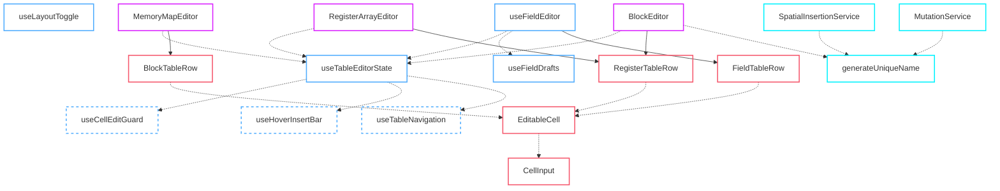

# Webview Architecture Review -- DRY Violations and Refactor Plan

## Executive Summary

The `src/webview` directory contains two largely independent webview applications:
the **Memory Map Editor** (entry: `index.tsx`) and the **IP Core Editor** (entry:
`ipcore/IpCoreApp.tsx`). This review focuses on the Memory Map Editor side,
where four structurally similar table-editing views --
`BlockEditor`, `MemoryMapEditor`, `RegisterArrayEditor`, and `RegisterEditor` /
`FieldsTable` -- duplicate large blocks of state management, event wiring, and
rendering logic.

**Commit history context.** The 15 most recent webview commits reveal a clear
pattern: bug fixes for cell-editing, blur-commit, and Enter/ESC behaviour had to
be applied in parallel across `BlockEditor`, `MemoryMapEditor`,
`RegisterArrayEditor`, and `FieldTableRow`. An extraction refactor (`d518cc4`,
`09fcdc4`) pulled some common elements into shared components
(`RegisterTableRow`, `EditorHeader`, `TwoPanelEditorLayout`, `HoverInsertBar`,
`TableContextMenu`) and hooks (`useHoverInsertBar`, `useCellEditGuard`). However,
the extraction was incomplete: it removed duplication for UI shells but left the
"editor orchestration" logic -- row selection, active-cell tracking, insert/delete
handlers, clamp-on-change effects, `useTableNavigation` wiring, and
`useCellEditGuard` integration -- duplicated verbatim across all three parent
editors.

The `cancelEditRef` prop was removed from `RegisterTableRow` in `dfb66da`, then
re-added in the very next commit `2fdd646`, and then the Name cell's commit
strategy was changed from onBlur to onInput and back to onBlur (with guard)
across `c75b246` and `b8c23e2`. This churn confirms that editing behaviour is
not governed by a single source of truth: each editor independently wires the
same protocol and each fix has to be replicated.

---

## Findings

### F1: Duplicated "Table Editor Orchestration" Pattern

The following identical state + lifecycle block appears in three components:

| Component | File | Lines |
|-----------|------|-------|
| `BlockEditor` | `components/memorymap/BlockEditor.tsx` | 71-113 |
| `RegisterArrayEditor` | `components/memorymap/RegisterArrayEditor.tsx` | 46-178 |
| `MemoryMapEditor` | `components/memorymap/MemoryMapEditor.tsx` | 79-119 |

Each duplicates:

1. **Selection triplet**: `useState<number>(-1)` for `selectedXIndex`,
   `useState<number | null>(null)` for `hoveredXIndex`,
   `useState<ActiveCell>({ rowIndex: -1, key: 'name' })` for `xActiveCell`.

2. **Clamp-on-change effect**: a `useEffect` that resets selection when the
   data array changes length (identical logic, different variable names).

3. **`useCellEditGuard` integration**: called identically in all three, returning
   `{ cancelEditRef, captureEditSnapshot }`.

4. **`useHoverInsertBar` integration**: called identically in `BlockEditor` and
   `MemoryMapEditor` (missing from `RegisterArrayEditor`).

5. **`useTableNavigation` wiring**: called with identical callback shapes
   (`onEdit`, `onDelete`, `onMove`, `onInsertAfter/Before`) that differ only in
   the data array name and the column-key type.

6. **Insert/delete handlers**: `tryInsertReg` / `tryInsertBlock` / `insertAtGap`
   / `deleteReg` / `deleteBlock` follow the same structure:
   `splice -> onUpdate -> setSelected -> setHovered -> setActiveCell -> scrollIntoView`.

7. **Row interaction callbacks**: every `.map()` render passes the same
   `onRowClick`, `onCellClick`, `onMouseEnter`, `onMouseLeave`, `onContextMenu`
   lambdas that call `setSelectedXIndex(idx); setHoveredXIndex(idx); setXActiveCell(...)`.

**Impact**: any behavioural fix (e.g. Enter/ESC, blur-commit guard, row key
stability) must be applied in at least 3 places, as the commit history confirms.

---

### F2: Inconsistent Name-Cell Commit Strategy

The name cell's commit lifecycle is inconsistent across table row types:

| Row Component | Commit on | Guard on ESC | Notes |
|---------------|-----------|--------------|-------|
| `RegisterTableRow` (registers) | `onInput` + `onBlur` | `cancelEditRef` | Blur handler re-commits; causes flash on Enter |
| `MemoryMapEditor` (blocks inline) | `onInput` + `onBlur` | `cancelEditRef` | Same pattern, inline in the component |
| `FieldTableRow` (fields) | `onInput` (draft) + `onBlur` (commit) | `cancelEditRef` | Draft-validated approach; different from above |

The recent commits `b8c23e2`, `c75b246`, `5e999d7`, `2fdd646`, `dfb66da` are
all attempts to unify this behaviour. The commits oscillate between
onInput-only and onInput+onBlur strategies across components, confirming there
is no single canonical pattern.

---

### F3: Redundant Layout Toggle Boilerplate

In `index.tsx` (lines 34-80), four identical layout state + toggle pairs are
declared:

```typescript
const [registerLayout, setRegisterLayout] = useState<RegisterLayout>('side-by-side');
const toggleRegisterLayout = () => { ... };
// ... repeated for block, memoryMap, array
```

These are threaded through `DetailsPanel` as eight separate props (four state
values + four toggle functions). This is a classic sign of missing abstraction:
the concept is "a panel layout preference", parameterised by panel name.

---

### F4: `MemoryMapEditor` Has Inline Cell Rendering

`BlockEditor` and `RegisterArrayEditor` both use the extracted
`RegisterTableRow` component. `MemoryMapEditor` still renders its block-row
cells inline (lines 256-418), meaning its editable cells do not benefit from
fixes applied to `RegisterTableRow`. This is the only view that still has
inline cell rendering, and it contains its own `onBlur` / `onFocus` /
`onInput` wiring patterns for each cell.

---

### F5: Missing Shared "Editable Cell" Abstraction

Every editable cell across the codebase manually wires:
- `onFocus={() => captureEditSnapshot()}`
- `onInput={(e) => onUpdate(path, value)}`
- `onBlur` with `cancelEditRef` guard (sometimes)
- `data-edit-key="..."` attribute
- Active cell highlight class computation

This 5-line pattern is written ad-hoc in:
- `RegisterTableRow.tsx` (4 cells x 5 lines = 20 lines)
- `MemoryMapEditor.tsx` (5 cells x 5 lines = 25 lines inline)
- `FieldTableRow.tsx` (5 cells x 5+ lines = 25+ lines)

There is no `<EditableCell>` component or `useCellEditor` hook that
encapsulates this protocol.

---

### F6: `useFieldEditor` Is a God Object

`useFieldEditor` (448 lines, 40+ returned values) manages:
- Selection state (selected index, hovered index, active cell)
- Draft state for name/bits/reset (6 state pairs)
- Validation errors (3 state pairs)
- Drag preview state
- Insert error state
- DOM refs
- `useCellEditGuard` integration
- `useTableNavigation` integration
- Selection clamp effects
- Draft pruning effects
- Order-signature tracking effects

It returns everything in a flat bag of ~40 values. Consumers destructure
subsets and thread them through to `FieldTableRow`. The hook mixes concerns:
table orchestration (identical to `BlockEditor`'s pattern), field-specific
draft management, and validation.

---

### F7: Duplicated "Next Name" Generation

The pattern for generating a unique default name when inserting a new row is
repeated:

| Location | Pattern |
|----------|---------|
| `BlockEditor.tryInsertReg` (L132-144) | `for (const r of regs) { match /^reg(\d+)$/i }; name = reg${maxN+1}` |
| `BlockEditor.insertAtGap` (L163-175) | Identical to above |
| `BlockEditor` array insert (L306-313) | Same pattern but `/^ARRAY_(\d+)$/i` |
| `RegisterArrayEditor.insertNestedReg` (L73-80) | Identical to `tryInsertReg` |
| `RegisterEditor.onCreateField` (L151-158) | Same pattern but `/^field(\d+)$/` |

---

### F8: Inconsistent Context Menu Management

`BlockEditor` and `MemoryMapEditor` each independently manage `contextMenu`
state and render `<TableContextMenu>`. The previous extraction (`d518cc4`)
moved the context menu *component* to shared, but left the state management
and the `useEffect` for outside-click dismissal inline in each editor.
After `d518cc4` the `useEffect` was removed from `BlockEditor` but the
context-menu state and the `closeContextMenu` handler remain duplicated.

---

### F9: Two Independent VS Code Message Bridges

The Memory Map Editor uses `useYamlSync` (a simple message listener + sender).
The IP Core Editor uses `useIpCoreSync` + a raw `window.addEventListener` in
`IpCoreApp.tsx` (lines 605-656). Both independently implement the same
`ready` + `update` message protocol, with `IpCoreApp` also handling
`stagingStart` and additional metadata fields. There is no shared
`useExtensionHost` abstraction.

---

## Detailed Solution

### S1: `useTableEditorState<TRow, TColumnKey>` -- Shared Table Orchestration Hook

Extract the duplicated state management from `BlockEditor`,
`MemoryMapEditor`, and `RegisterArrayEditor` into a single generic hook.

```typescript
// hooks/useTableEditorState.ts

interface UseTableEditorStateOptions<TRow, TColumnKey extends string> {
  /** The live rows array from the parent's data model. */
  rows: TRow[];
  /** Path fragment used in useCellEditGuard (e.g. ['registers']). */
  rowsPath: (string | number)[];
  /** Ordered column keys for navigation. */
  columnOrder: readonly TColumnKey[];
  /** Callback to commit changes to the YAML document. */
  onUpdate: YamlUpdateHandler;
  /** Container ref for keyboard and focus management. */
  containerRef: React.RefObject<HTMLElement>;
  /** Optional data-attribute name for row selector (default: 'data-row-idx'). */
  rowSelectorAttr?: string;
  /** Optional callbacks for custom insert logic. */
  onInsertAfter?: () => void;
  onInsertBefore?: () => void;
  /** Optional callback for custom move logic (swap). */
  onMove?: (fromIndex: number, delta: number) => void;
  /** Optional onAfterRevert callback forwarded to useCellEditGuard. */
  onAfterRevert?: (snapshot: TRow[]) => void;
  /** Whether to enable HoverInsertBar tracking. Default: true. */
  enableHoverInsert?: boolean;
}

interface UseTableEditorStateReturn<TRow, TColumnKey extends string> {
  // Selection
  selectedIndex: number;
  setSelectedIndex: React.Dispatch<React.SetStateAction<number>>;
  hoveredIndex: number | null;
  setHoveredIndex: React.Dispatch<React.SetStateAction<number | null>>;
  activeCell: ActiveCell<TColumnKey>;
  setActiveCell: React.Dispatch<React.SetStateAction<ActiveCell<TColumnKey>>>;

  // Cell edit guard
  cancelEditRef: React.MutableRefObject<boolean>;
  captureEditSnapshot: () => void;

  // Hover insert bar (if enabled)
  insertHoverGap: number | null;
  insertBarScrollY: number | null;
  insertBarTbodyProps: { onMouseMove: ...; onMouseLeave: ... };
  insertBarHoverProps: { onMouseEnter: ...; onMouseLeave: ... };
  clearInsertBar: () => void;

  // Row interaction helpers
  handleRowClick: (idx: number) => void;
  handleCellClick: (idx: number, key: TColumnKey) => void;
  handleMouseEnter: (idx: number) => void;
  handleMouseLeave: () => void;

  // Delete helper
  deleteRow: (idx: number) => void;

  // Selection sync for external state
  selectRow: (idx: number, key?: TColumnKey) => void;
}
```

This hook internally composes `useCellEditGuard`, `useHoverInsertBar`, and
`useTableNavigation`, and owns the clamp-on-change `useEffect`. The three
editor components shrink to ~50 lines each: data derivation, insert logic,
visualizer wiring, and `<TwoPanelEditorLayout>` assembly.

---

### S2: `useLayoutToggle` -- Shared Layout State Hook

Replace the four duplicated layout state pairs with a single hook factory.

```typescript
// hooks/useLayoutToggle.ts

type PanelLayout = 'stacked' | 'side-by-side';

function useLayoutToggle(initial: PanelLayout = 'side-by-side') {
  const [layout, setLayout] = useState<PanelLayout>(initial);
  const toggle = useCallback(() => {
    setLayout((prev) => (prev === 'stacked' ? 'side-by-side' : 'stacked'));
  }, []);
  return { layout, toggle } as const;
}
```

Usage in `index.tsx`:

```typescript
const registerLayout = useLayoutToggle();
const blockLayout = useLayoutToggle();
const memoryMapLayout = useLayoutToggle();
const arrayLayout = useLayoutToggle();
```

`DetailsPanel` receives a single `layouts: Record<string, { layout, toggle }>`
prop (or four named pairs) instead of eight separate props.

---

### S3: `<EditableCell>` -- Shared Editable Cell Component

Encapsulate the 5-line cell wiring protocol:

```typescript
// shared/components/EditableCell.tsx

interface EditableCellProps {
  /** Column key for navigation and data-attributes. */
  columnKey: string;
  /** Whether this cell is the active cell. */
  isActive: boolean;
  /** Called when the cell is clicked. */
  onCellClick: (e: React.MouseEvent) => void;
  /** CSS class for the <td>. */
  className?: string;
  /** Inline style overrides. */
  style?: React.CSSProperties;
  children: React.ReactNode;
}
```

And a companion for the input controls:

```typescript
// shared/components/CellInput.tsx

interface CellInputProps {
  /** Edit key for data-edit-key attribute. */
  editKey: string;
  /** Current display value. */
  value: string;
  /** Called on every input. */
  onInput: (value: string) => void;
  /** Called on blur (commit). Optional -- not all cells use blur-commit. */
  onBlur?: (value: string) => void;
  /** Called on focus (snapshot). */
  onFocus: () => void;
  /** If true, blur-commit is skipped (ESC was pressed). */
  cancelEditRef?: React.MutableRefObject<boolean>;
  /** Variant: 'text' | 'textarea' | 'dropdown'. Default: 'text'. */
  variant?: 'text' | 'textarea' | 'dropdown';
  /** Additional class name. */
  className?: string;
  /** Options for dropdown variant. */
  options?: readonly string[];
}
```

---

### S4: `generateUniqueName` Utility

Extract the duplicated name-generation logic:

```typescript
// utils/naming.ts

function generateUniqueName(
  existingItems: { name?: string }[],
  prefix: string,
  pattern?: RegExp
): string {
  const re = pattern ?? new RegExp(`^${prefix}(\\d+)$`, 'i');
  let maxN = 0;
  for (const item of existingItems) {
    const match = String(item.name ?? '').match(re);
    if (match) {
      maxN = Math.max(maxN, parseInt(match[1], 10));
    }
  }
  return `${prefix}${maxN + 1}`;
}
```

---

### S5: Extract `BlockTableRow` from `MemoryMapEditor`

`MemoryMapEditor` is the only editor that still renders its row cells inline.
Extract a `BlockTableRow` component (analogous to `RegisterTableRow`) so that
cell-editing fixes apply uniformly.

```typescript
// components/memorymap/BlockTableRow.tsx

interface BlockTableRowProps {
  block: MemoryMapBlockDef;
  idx: number;
  isSelected: boolean;
  isHovered: boolean;
  blockActiveCell: BlockActiveCell;
  color: string;
  cancelEditRef: React.MutableRefObject<boolean>;
  captureEditSnapshot: () => void;
  onUpdate: YamlUpdateHandler;
  onRowClick: () => void;
  onCellClick: (key: BlockEditKey) => void;
  onMouseEnter: () => void;
  onMouseLeave: () => void;
  onContextMenu?: (e: React.MouseEvent) => void;
}
```

---

### S6: Decompose `useFieldEditor`

Split the monolithic hook into composable parts:

1. **`useTableEditorState`** (from S1) handles selection, cell guard,
   navigation, hover insert.
2. **`useFieldDrafts`** manages name/bits/reset draft state and validation.
3. **`useFieldEditor`** becomes a thin orchestration wrapper that composes the
   two, adds field-specific insert/delete logic, and returns the combined API.

This reduces `useFieldEditor` from ~448 lines to ~120 lines, and makes each
concern independently testable.

```typescript
// hooks/useFieldDrafts.ts

interface UseFieldDraftsOptions {
  fields: BitFieldRecord[];
  registerSize: number;
}

interface UseFieldDraftsReturn {
  nameDrafts: Record<string, string>;
  setNameDrafts: ...;
  nameErrors: Record<string, string | null>;
  setNameErrors: ...;
  bitsDrafts: Record<number, string>;
  setBitsDrafts: ...;
  bitsErrors: Record<number, string | null>;
  setBitsErrors: ...;
  dragPreviewRanges: Record<number, [number, number]>;
  setDragPreviewRanges: ...;
  resetDrafts: Record<number, string>;
  setResetDrafts: ...;
  resetErrors: Record<number, string | null>;
  setResetErrors: ...;
  ensureDraftsInitialized: (index: number) => void;
  clearAllDrafts: () => void;
}
```

---

### S7: Shared `useExtensionHost` Hook (Lower Priority)

Unify the message-passing protocol for both webviews into a typed hook.
This is lower priority because the two webviews are bundled separately and
share minimal code, but it would prevent future divergence.

```typescript
// hooks/useExtensionHost.ts

interface UseExtensionHostOptions<TIncoming> {
  vscode: VsCodeApi | undefined;
  onMessage: (message: TIncoming) => void;
}

interface UseExtensionHostReturn {
  postMessage: (message: Record<string, unknown>) => void;
  sendUpdate: (text: string) => void;
}
```

---

## Step-by-Step Implementation Plan

### Phase 0: Infrastructure (no visual changes)

1. Create `utils/naming.ts` with `generateUniqueName`. Add unit tests.
2. Create `hooks/useLayoutToggle.ts`. Unit test the toggle behaviour.
3. Both are new files with no existing consumers yet -- zero risk.

### Phase 1: Extract `useTableEditorState` (core deduplication)

1. Create `hooks/useTableEditorState.ts` implementing the interface from S1.
   Internally compose `useCellEditGuard`, `useHoverInsertBar`, and
   `useTableNavigation`.
2. Write unit tests for selection clamping, delete-with-selection-adjust,
   and hover-insert clearing.
3. Refactor `BlockEditor` to use `useTableEditorState` instead of its
   inline state. Verify: all keyboard navigation, insert, delete,
   reorder, Enter/ESC behaviour is preserved.
4. Refactor `RegisterArrayEditor` the same way.
5. Refactor `MemoryMapEditor` the same way.
6. Run the full test suite and manual smoke test after each editor.

### Phase 2: Extract `BlockTableRow` from `MemoryMapEditor`

1. Create `components/memorymap/BlockTableRow.tsx` following the pattern
   of `RegisterTableRow`.
2. Refactor `MemoryMapEditor` to use `BlockTableRow` instead of inline
   cells.
3. Verify all block-level editing (name, base address, usage,
   description) still works.

### Phase 3: Unify Name-Cell Commit Strategy

1. Decide on the canonical pattern: **`onInput` live-commit for all cells**,
   with `onBlur` used only as a fallback safety net (guarded by
   `cancelEditRef`). Document this in the `useCellEditGuard` JSDoc.
2. Apply this pattern consistently in `RegisterTableRow`, `BlockTableRow`,
   and `FieldTableRow`.
3. Remove the stale `nameDrafts` cleanup effect from `useFieldEditor` if
   the name cell no longer uses draft state.
4. Verify Enter/ESC behaviour across all editors (most critical
   regression area).

### Phase 4: Create `<EditableCell>` and `<CellInput>` Components

1. Create `shared/components/EditableCell.tsx` and
   `shared/components/CellInput.tsx` as described in S3.
2. Refactor `RegisterTableRow` to use `<EditableCell>` + `<CellInput>`.
3. Refactor `BlockTableRow` the same way.
4. Refactor `FieldTableRow` the same way.
5. This phase is purely cosmetic (reduces line count) and should not
   change behaviour.

### Phase 5: Decompose `useFieldEditor`

1. Create `hooks/useFieldDrafts.ts` (S6).
2. Refactor `useFieldEditor` to compose `useTableEditorState` (from Phase 1)
   and `useFieldDrafts`. The hook's public API does not change, so
   `RegisterEditor` and `FieldsTable` do not need modifications.
3. Verify field editing, bits validation, reset validation, drag preview,
   and insert/delete.

### Phase 6: Apply `useLayoutToggle` in `index.tsx`

1. Replace the four layout state + toggle pairs in `index.tsx` with
   `useLayoutToggle`.
2. Simplify `DetailsPanel` props. This is a prop-threading cleanup with
   no behavioural change.

### Phase 7: Replace `generateUniqueName` Calls

1. Replace all inline `maxN` loops in `BlockEditor`, `RegisterArrayEditor`,
   `RegisterEditor`, and `useFieldEditor` with `generateUniqueName` from
   `utils/naming.ts`.

### Phase 8 (Optional): Shared `useExtensionHost`

1. Extract `useExtensionHost` from `useYamlSync` and `useIpCoreSync`.
2. Both webview entry points use the shared hook.
3. This phase can be deferred since the two webviews are independently
   bundled.

---

## Risk Assessment

| Phase | Risk | Mitigation |
|-------|------|------------|
| 1 (useTableEditorState) | Highest -- all keyboard/edit behaviour is consolidated | Refactor one editor at a time; full manual test after each |
| 2 (BlockTableRow) | Low -- extraction, no behaviour change | Visual diff comparison |
| 3 (Commit strategy) | Medium -- touches all blur handlers | Focused test: Enter, ESC, Tab, click-away in every cell type |
| 4 (EditableCell) | Low -- cosmetic | Automated + visual regression |
| 5 (useFieldEditor decomp) | Medium -- internal refactor of complex hook | API stays the same; test field insert/delete/move/reorder |
| 6-7 | Negligible -- prop cleanup + utility swap | Automated tests sufficient |

---

## Files Changed per Phase

### Phase 0
- **[NEW]** `utils/naming.ts`
- **[NEW]** `hooks/useLayoutToggle.ts`

### Phase 1
- **[NEW]** `hooks/useTableEditorState.ts`
- **[MODIFY]** `components/memorymap/BlockEditor.tsx`
- **[MODIFY]** `components/memorymap/RegisterArrayEditor.tsx`
- **[MODIFY]** `components/memorymap/MemoryMapEditor.tsx`

### Phase 2
- **[NEW]** `components/memorymap/BlockTableRow.tsx`
- **[MODIFY]** `components/memorymap/MemoryMapEditor.tsx`

### Phase 3
- **[MODIFY]** `components/memorymap/RegisterTableRow.tsx`
- **[MODIFY]** `components/memorymap/BlockTableRow.tsx` (new from Phase 2)
- **[MODIFY]** `components/register/FieldTableRow.tsx`

### Phase 4
- **[NEW]** `shared/components/EditableCell.tsx`
- **[NEW]** `shared/components/CellInput.tsx`
- **[MODIFY]** `shared/components/index.ts`
- **[MODIFY]** `components/memorymap/RegisterTableRow.tsx`
- **[MODIFY]** `components/memorymap/BlockTableRow.tsx`
- **[MODIFY]** `components/register/FieldTableRow.tsx`

### Phase 5
- **[NEW]** `hooks/useFieldDrafts.ts`
- **[MODIFY]** `hooks/useFieldEditor.ts`

### Phase 6
- **[MODIFY]** `index.tsx`
- **[MODIFY]** `components/DetailsPanel.tsx`

### Phase 7
- **[MODIFY]** `components/memorymap/BlockEditor.tsx`
- **[MODIFY]** `components/memorymap/RegisterArrayEditor.tsx`
- **[MODIFY]** `components/register/RegisterEditor.tsx`
- **[MODIFY]** `hooks/useFieldEditor.ts`

## Implementation Progress (Completed)

All phases of the refactoring plan outlined above have been successfully executed and verified. The `src/webview` architecture has been transformed from having heavily duplicated editor components into a clean, composed architecture.

### New Architecture Diagram



### Key Improvements Achieved

1. **Orchestration Centralization**: By introducing `useTableEditorState`, we eliminated ~300 lines of identical state, event wiring, and clamp-on-change effects across the top-level table editors.
2. **Standardized Cell Editing**: The creation of `EditableCell` and `CellInput` enforced a uniform "live-commit on input + guarded on blur" protocol across all row types (`BlockTableRow`, `RegisterTableRow`, `FieldTableRow`).
3. **De-bloated God Object**: `useFieldEditor` was decomposed. Draft state is now cleanly managed by `useFieldDrafts`, and table orchestration relies entirely on `useTableEditorState`.
4. **Utility Hardening**: Fragile, duplicated inline `maxN` logic was replaced universally with the `generateUniqueName` utility, making insertion naming robust.
5. **No Verification Errors**: The final refactored architecture compiles fully and passes the strict ESLint configuration with zero warnings.
