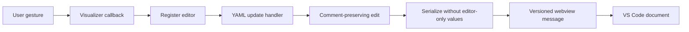

# Bit Field Developer Reference

This contributor reference lists the data shapes, callbacks, and functions used
by bit-field editing. Users looking only for commands should use the
[keyboard shortcuts](keyboard-shortcuts.md).

For the mental model see [Spatial Editing](../concepts/spatial-editing.md); for
how the pieces fit together see
[Bit Field Handling](../architecture/bit-field-handling.md).

## Data shapes

Runtime position properties on a field (all camelCase; none are persisted):

```text
bitRange : [hi, lo]        // canonical [MSB, LSB] tuple
offset   : lo              // LSB index
width    : hi - lo + 1     // field width in bits
```

Persisted field keys: `name`, `bits`, `access`, `resetValue`, `description`, and
optional `enumeratedValues` / `monitorChangeOf`.

### `ProSegment` (`bitfield/types.ts`)

A tagged union; the segment list tiles the register bit space MSB-first.

```typescript
type ProSegment =
  | { type: 'field'; idx: number; start: number; end: number; name: string; color: string }
  | { type: 'gap'; start: number; end: number };
```

`start` is the LSB of the span, `end` the MSB.

### Bit-ownership array

`buildBitOwnerArray(fields, registerSize)` returns an array of length
`registerSize` where `owners[bit] = fieldIndex | null`. Drives hit testing,
resize-boundary calculation, and gap detection.

## Keyboard shortcuts

### Visualizer (focused bit-field cell)

Direction maps to the layout's orientation.

| Layout | Reorder (swap with neighbour) | Resize (grow/shrink an edge) |
|--------|-------------------------------|------------------------------|
| `pro` (horizontal) | `Alt+Left` toward MSB, `Alt+Right` toward LSB | `Shift+Left` / `Shift+Right` |
| `vertical` (stacked) | `Alt+Up` toward LSB, `Alt+Down` toward MSB | `Shift+Up` / `Shift+Down` |

### Field table

| Key | Action |
|-----|--------|
| `Arrow` keys / `h` `j` `k` `l` | Move the active cell |
| `Alt+Up` / `Alt+Down` | Move the selected field up/down (focus follows the field) |
| `F2` / `Enter` / `e` | Edit the active cell |
| `d` / `Delete` | Delete the selected field |
| `o` | Insert field after | 
| `O` (`Shift+o`) | Insert field before |

`Ctrl` / `Cmd` chords are not hijacked by table navigation.

## Pointer gestures

| Gesture | Trigger | Result | Commit callback |
|---------|---------|--------|-----------------|
| Resize | `Shift` + drag an edge of a field | New field range, clamped to neighbours | `onUpdateFieldRange` |
| Create | `Shift` + drag inside a gap | New field over the dragged span | `onCreateField` |
| Relocate | `Ctrl`/`Cmd` + drag a field | Field moved; others part to receive it (live preview) | `onBatchUpdateFields` |
| Toggle reset bit | Click a bit cell | Flip that bit of the owning field's `resetValue` | `onUpdateFieldReset` |

Relocate commits atomically through `onBatchUpdateFields`; sequential per-field
updates would pass through overlapping intermediate states.

## Callback contracts (`RegisterEditor` <- `BitFieldVisualizer`)

| Callback | Signature | Meaning |
|----------|-----------|---------|
| `onUpdateFieldRange` | `(idx: number, [hi, lo]: [number, number])` | One field's range changed |
| `onBatchUpdateFields` | `(updates: { idx: number; range: [hi, lo] }[])` | Many ranges changed atomically |
| `onCreateField` | `({ bitRange: [hi, lo]; name: string })` | New field from a gap drag |
| `onUpdateFieldReset` | `(idx: number, value: number \| null)` | A reset bit toggled |
| `onDragPreview` | `(updates \| null)` | Transient Ctrl-drag preview (no YAML write) |

## Function reference

### Parse / format (`utils/BitFieldUtils.ts`)

| Function | Signature | Notes |
|----------|-----------|-------|
| `parseBitsRange` | `(bits: string) => [hi, lo] \| null` | Strict bracketed parse |
| `parseBitsLike` | `(text: string) => { offset, width } \| null` | Tolerant (accepts `7:0`) |
| `formatBitsRange` | `(hi: number, lo: number) => string` | Builds `'[hi:lo]'` |
| `fieldToBitsString` | `(field) => string` | Prefers `offset`/`width`, falls back to `bits` |

### Validation (`shared/utils/fieldValidation.ts`)

| Function | Signature |
|----------|-----------|
| `validateBitsString` | `(bits: string) => string \| null` (error message or null) |
| `parseBitsInput` | `(text: string) => { offset, width, ... }` |
| `parseBitsWidth` | `(bits: string) => number \| null` |
| `parseReset` | `(text: string) => number \| null` |
| `validateResetForField` | reset-value bounds check against field width |

### Layout (`algorithms/LayoutEngine.ts`)

| Function | Signature | Gaps |
|----------|-----------|------|
| `recomputeBitfieldLayout` | `(fields, regWidth) => LayoutField[]` | Removed (compact pack from bit 0) |
| `reorderBitfieldLayout` | `(fields, movedIdx, direction: 'lsb' \| 'msb', regWidth) => LayoutField[]` | Preserved; skips gap segments to swap the moved field with the next field |

### Segments and ownership (`bitfield/utils.ts`)

| Function | Signature |
|----------|-----------|
| `getFieldRange` | `(field) => { lo, hi } \| null` |
| `groupFields` | `(fields) => { idx, start, end, name, color }[]` |
| `buildProLayoutSegments` | `(fields, registerSize) => ProSegment[]` |
| `repackSegments` | `(segments: ProSegment[]) => ProSegment[]` (gap-preserving) |
| `toFieldRangeUpdates` | `(segments) => { idx, range: [hi, lo] }[]` |
| `buildBitOwnerArray` | `(fields, registerSize) => (number \| null)[]` |
| `findResizeBoundary` | resize clamp bounds from neighbours |
| `findGapBoundaries` | extent of the empty run under the cursor |

### Reorder / resize helpers

| Function | File | Signature |
|----------|------|-----------|
| `computeCtrlDragPreview` | `bitfield/reorderAlgorithm.ts` | Ctrl-drag preview segments |
| `getKeyboardReorderUpdates` | `bitfield/keyboardOperations.ts` | Gap-preserving reorder range updates |
| `getKeyboardResizeRange` | `bitfield/keyboardOperations.ts` | One-bit edge grow/shrink, bounded |

### Reset / register value (`bitfield/utils.ts`)

| Function | Signature | Notes |
|----------|-----------|-------|
| `bitAt` | `(value, bitIndex) => 0 \| 1` | Read one bit |
| `setBit` | `(value, bitIndex, desired: 0 \| 1) => number` | Write one bit |
| `extractBits` | `(value, lo, width) => number` | Slice a sub-value |
| `maxForBits` | `(bitCount) => number` | Max value for a width |
| `applyRegisterValueToFields` | decompose a register value onto each field |

Value math uses `Math.pow(2, n)` arithmetic (safe to 53 bits), avoiding 32-bit
bitwise truncation. Masks at width >= 53 fall back to `Number.MAX_SAFE_INTEGER`.

### Insertion (`services/SpatialInsertionService.ts`)

All methods are static and side-effect free, returning `InsertionResult<T>`:

```typescript
interface InsertionResult<T> {
  items: T[];        // updated array (unchanged on error)
  newIndex: number;  // index of the new item (-1 on error)
  error?: string;    // human-readable reason (only on failure)
}
```

| Method | Purpose |
|--------|---------|
| `insertField(dir, fields, selectedIndex, registerSize)` | Insert a 1-bit field after/before the selection |
| `insertFieldAfter` / `insertFieldBefore` | Directional variants |
| `insertRegister` / `insertRegisterAfter` / `insertRegisterBefore` | Insert a default 4-byte register |
| `insertBlock` / `insertBlockAfter` / `insertBlockBefore` | Insert a block with one register |

| Repacker | File | Functions |
|----------|------|-----------|
| Field | `algorithms/BitFieldRepacker.ts` | `repackFieldsForward`, `repackFieldsBackward` |
| Register | `algorithms/RegisterRepacker.ts` | `repackRegistersForward`, `repackRegistersBackward` |
| Block | `algorithms/AddressBlockRepacker.ts` | `repackBlocksForward`, `repackBlocksBackward` |

### Field operations (`services/FieldOperationService.ts`)

`applyFieldOperation` dispatches the `__op` ops used by the table:

| Op | Effect |
|----|--------|
| `field-move` | Swap `fields[index]` and `fields[index+delta]` (positions recomputed afterwards by `reorderBitfieldLayout`) |
| add / delete | Add a field at the first free bit / remove by index |

## Table draft layers

`FieldsTable` resolves a row's displayed bit range in priority order:

1. `dragPreviewRanges[index]` -- live Ctrl-drag preview (highest)
2. `bitsDrafts[rowId]` -- the user's uncommitted text edit
3. `fieldToBitsString(field)` -- the committed data-model value

Draft maps (`nameDrafts`, `bitsDrafts`, `resetDrafts` and their error maps) are
**keyed by `rowId`**, not by array index (`useFieldDrafts.ts`). On a reorder or
other structural change `useFieldEditor` calls `clearAllDrafts()`.

## Inline bits editing with cascade

When the user edits a bit range in the table:

1. Parse the new bits string (`parseBitsInput`).
2. Validate format and total register usage (`validateBitsString`).
3. Update the edited field's `offset` / `width` / `bitRange`.
4. Cascade fields below upward to stay non-overlapping (widths preserved).
5. Commit the full updated field array.

## Layout views

| View | File | Orientation | Used by `RegisterEditor` |
|------|------|-------------|--------------------------|
| `pro` | `bitfield/ProLayoutView.tsx` | Horizontal, MSB left, per-bit value cells | Yes (stacked register layout) |
| `vertical` | `bitfield/VerticalLayoutView.tsx` | Stacked rows | Yes (side-by-side register layout) |
| `default` | `bitfield/DefaultLayoutView.tsx` | Legacy grid | No (fallback branch only) |

## Commit path



## Test files

| Test file | Covers |
|-----------|--------|
| `algorithms/LayoutEngine.test.ts` | Compact + gap-preserving + gap-skipping layout |
| `algorithms/BitFieldRepacker.test.ts` | Forward/backward field repacking, edge clamping |
| `algorithms/RegisterRepacker.test.ts` | Register repacking |
| `algorithms/AddressBlockRepacker.test.ts` | Block repacking |
| `services/SpatialInsertionService.test.ts` | Field/register/block insertion pipeline |
| `services/FieldOperationService.test.ts` | `field-move` array mutation |
| `hooks/useFieldEditor.test.ts` | Draft management, selection, insertion, reorder |
| `hooks/useTableNavigation.test.tsx` | Navigation, Alt+arrow move, focus-follows-field |
