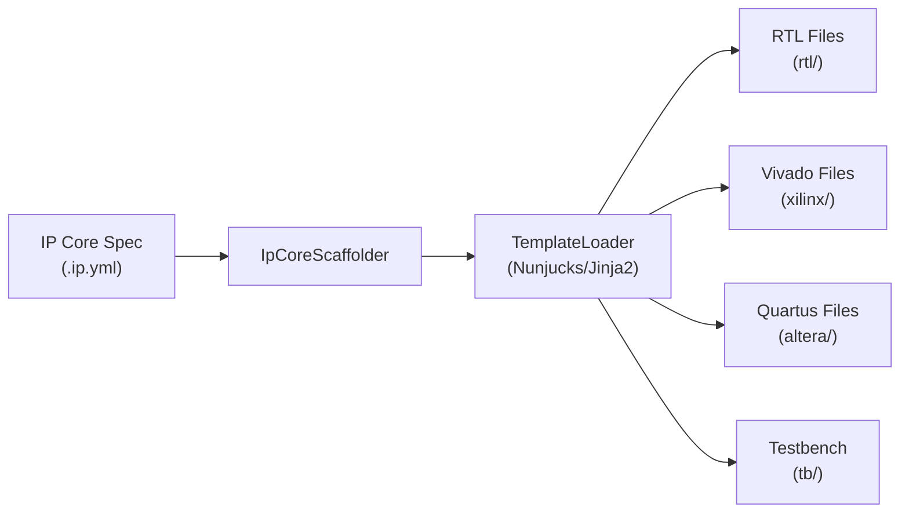

# Generator Reference

The generator scaffolds complete RTL projects from IP Core specifications. It produces VHDL or SystemVerilog source files, vendor integration files, vendor build scripts, and optional testbenches.

## Overview

Generation is triggered by `IPCraft: Scaffold Project` or the individual generate commands. The entry point is `IpCoreScaffolder.generateAll()`.



## Generated Output

The scaffolder produces files organized by category next to the `.ip.yml` file.

**VHDL layout** (`ipcraft.generate.hdlLanguage: "vhdl"`):

```text
<ip_name>/
  rtl/
    <ip_name>_pkg.vhd        # Package with register constants and types
    <ip_name>.vhd             # Top-level entity (instantiates core + bus wrapper)
    <ip_name>_core.vhd        # User logic skeleton
    <ip_name>_<bus>.vhd       # Bus wrapper (axil or avmm)
    <ip_name>_regs.vhd        # Register file with field decode
  tb/
    mm_loader.py               # Generic .mm.yml reader
    <ip_name>_test.py          # cocotb test skeleton
    conftest.py                # pytest session fixture
    test_<ip_name>_sim.py      # pytest wrapper functions
    Makefile                   # GNU Make entry point
  docs/
    <ip_name>_datasheet.md    # Generated Markdown IP datasheet (ports, generics, registers)
  xilinx/
    component.xml             # Vivado IP-XACT descriptor
    xgui/<ip_name>_v*.tcl    # Vivado XGUI customization
    <ip_name>_project.tcl    # Creates Vivado OOC synthesis project in build/ooc/
    <ip_name>_run_ooc.tcl    # Batch OOC synthesis runner
    <ip_name>_run_xpr.tcl    # Batch full synthesis + implementation runner
    <ip_name>_ooc.xdc        # OOC timing constraints (create_clock entries)
  altera/
    <ip_name>_hw.tcl          # Platform Designer component
    test.qsys                  # Platform Designer test system (BFM validation)
    <ip_name>_project.tcl    # Creates Quartus project in altera/build/
    <ip_name>.sdc             # SDC timing constraints (virtual pins + clocks)
```

**SystemVerilog layout** (`ipcraft.generate.hdlLanguage: "systemverilog"`):

```text
<ip_name>/
  rtl/
    <ip_name>_pkg.sv
    <ip_name>.sv
    <ip_name>_core.sv
    <ip_name>_<bus>.sv
    <ip_name>_regs.sv
  tb/
    (same as VHDL layout)
```

## Generation Options

| Option | Type | Default | Purpose |
|--------|------|---------|---------|
| `targets` | `string[]` | `[]` | Vendor toolchain IDs to generate packaging files for (e.g. `['vivado']`, `['vivado','quartus']`). Empty = HDL + testbench only. |
| `hdlLanguage` | `'vhdl' \| 'systemverilog'` | `'vhdl'` | RTL language for generated source files |
| `includeHdl` | `boolean` | `true` | Generate RTL source files |
| `includeRegs` | `boolean` | `true` | Generate register file |
| `includeTestbench` | `boolean` | `true` | Generate testbench scaffold |
| `includeDocs` | `boolean` | `true` | Generate a Markdown IP datasheet (`docs/<ip_name>_datasheet.md`) |
| `includeVivadoProject` | `boolean` | `false` | Generate Vivado project and build scripts |
| `targetPart` | `string` | from settings | FPGA part for Vivado project |
| `includeQuartusProject` | `boolean` | `false` | Generate Quartus project files |
| `quartusDevice` | `string` | from settings | Device part for Quartus project |
| `updateYaml` | `boolean` | — | Update `fileSets` in the IP Core YAML after generation |

## Vendor Targets

The `targets` array controls which vendor packaging files are generated:

| Entry | Files Produced |
|-------|----------------|
| *(empty)* | No vendor files |
| `"quartus"` | `altera/<ip_name>_hw.tcl` |
| `"vivado"` | `xilinx/component.xml` + `xilinx/xgui/<ip_name>_v*.tcl` |
| `["vivado","quartus"]` | All vendor files |

Vendor project files (project TCL, build scripts, constraints) are generated separately by `includeVivadoProject` and `includeQuartusProject`, independent of `targets`.

## Bus Type Detection

The generator reads the IP Core's bus interfaces to determine the bus protocol. It looks for an interface with a `memoryMapRef` and maps its type:

| Bus Interface Type | Generator Bus Type | VHDL Template | SV Template |
|--------------------|-------------------|---------------|-------------|
| `AXI4L`, `axi4lite`, `axi*` | `axil` | `bus_axil.vhdl.j2` | `bus_axil.sv.j2` |
| `Avalon-MM`, `avmm`, `avalon*` | `avmm` | `bus_avmm.vhdl.j2` | `bus_avmm.sv.j2` |

If no bus interface with a `memory_map_ref` is found, the generator defaults to AXI-Lite.

## Template System

Templates use [Nunjucks](https://mozilla.github.io/nunjucks/) (Jinja2-compatible) and are located in `src/generator/templates/`:

### VHDL templates

| Template | Output |
|----------|--------|
| `package.vhdl.j2` | VHDL package with register constants |
| `top.vhdl.j2` | Top-level entity |
| `core.vhdl.j2` | User logic skeleton |
| `bus_axil.vhdl.j2` | AXI-Lite bus wrapper |
| `bus_avmm.vhdl.j2` | Avalon-MM bus wrapper |
| `register_file.vhdl.j2` | Register file with decode |

### SystemVerilog templates

| Template | Output |
|----------|--------|
| `pkg.sv.j2` | SV package with register constants |
| `top.sv.j2` | Top-level module |
| `core.sv.j2` | User logic skeleton |
| `bus_axil.sv.j2` | AXI-Lite bus wrapper |
| `bus_avmm.sv.j2` | Avalon-MM bus wrapper |
| `register_file.sv.j2` | Register file with decode |

### Vivado templates

`xilinx/component.xml` (IP-XACT) is **not** rendered from a template — it is built
programmatically by `VivadoComponentXmlGenerator.ts` (see Implementation Files below). A
scaffold pack may override it by supplying its own `component.xml.j2`; if present, that
template is rendered instead of running the built-in generator.

| Template | Output |
|----------|--------|
| `amd_xgui.j2` | `xilinx/xgui/<ip_name>_v*.tcl` |
| `vivado_project.tcl.j2` | `xilinx/<ip_name>_project.tcl` — creates OOC synthesis project in `build/ooc/` |
| `vivado_run_ooc.tcl.j2` | `xilinx/<ip_name>_run_ooc.tcl` — batch OOC synthesis runner |
| `vivado_run_xpr.tcl.j2` | `xilinx/<ip_name>_run_xpr.tcl` — batch full implementation runner |
| `vivado_ooc.xdc.j2` | `xilinx/<ip_name>_ooc.xdc` — OOC timing constraints |

### Quartus templates

| Template | Output |
|----------|--------|
| `altera_hw_tcl.j2` | `altera/<ip_name>_hw.tcl` |
| `altera_test_system.qsys.j2` | `altera/test.qsys` — Platform Designer test system wrapping the component, for BFM-based `_hw.tcl` validation |
| `quartus_project.tcl.j2` | `altera/<ip_name>_project.tcl` |
| `quartus_sdc.j2` | `altera/<ip_name>.sdc` |

### CocoTB testbench templates

| Template | Output |
|----------|--------|
| `cocotb_test.py.j2` | `tb/<ip_name>_test.py` — cocotb test skeleton |
| `cocotb_pytest.py.j2` | `tb/test_<ip_name>_sim.py` — pytest wrapper functions |
| `cocotb_conftest.py.j2` | `tb/conftest.py` — pytest session fixture |
| `cocotb_makefile.j2` | `tb/Makefile` — VHDL simulation Makefile |
| `cocotb_makefile.sv.j2` | `tb/Makefile` — SystemVerilog simulation Makefile |
| `cocotb_dump.v.j2` | `tb/dump.v` — VCD dump module for Icarus/Verilator |
| `mm_loader.py.j2` | `tb/mm_loader.py` — runtime `.mm.yml` reader |
| `vscode_settings.json.j2` | `.vscode/settings.json` — configures pytest test discovery |

### VUnit testbench templates

| Template | Output |
|----------|--------|
| `vunit_run.py.j2` | `tb/run.py` — VUnit test runner script |
| `vunit_tb.vhd.j2` | `tb/<ip_name>_tb.vhd` — VHDL testbench entity |
| `vunit_tb.sv.j2` | `tb/<ip_name>_tb.sv` — SystemVerilog testbench module |

## Testbench Framework

The testbench framework and simulation engine are controlled by `ipcraft.testbench.framework` and `ipcraft.testbench.engine`:

| Framework | Engine | Generated files |
|-----------|--------|----------------|
| `cocotb` | `ghdl` | `Makefile` (GHDL flags), `conftest.py`, `<ip_name>_test.py`, `test_<ip_name>_sim.py`, `mm_loader.py` |
| `cocotb` | `icarus` | Same, with Icarus-specific `Makefile` and `dump.v` |
| `cocotb` | `verilator` | Same, with Verilator Makefile |
| `cocotb` | `questa` | Same, with Questa Makefile |
| `vunit` | `ghdl` | `run.py`, `<ip_name>_tb.vhd` |

See [Run cocotb Simulations](../how-to/run-cocotb-simulation.md) for the full simulation workflow.


The two run-script templates (`vivado_run_ooc.tcl.j2`, `vivado_run_xpr.tcl.j2`) are generated whenever `includeVivadoProject: true`. They accept an optional job count via `-tclargs`:

```bash
vivado -mode batch -source <ip_name>_run_ooc.tcl -nojournal -nolog -tclargs 8
```

`_run_ooc.tcl` sources `_project.tcl` (which recreates the project at `build/ooc/`), launches `synth_1`, opens the synthesis run, and writes `timing.rpt`, `utilization.rpt`, and `cdc.rpt` into `build/ooc/`.

`_run_xpr.tcl` creates a standalone project at `build/xpr/`, runs synthesis and implementation, then writes the same three reports into `build/xpr/`.

## Quartus Build Flow

The Quartus project TCL uses `project_new`, which creates project files in the current working directory. The IPCraft build command runs it from `altera/build/`, so all Quartus output lands there:

```bash
# Step 1 — create project in altera/build/
quartus_sh -t /abs/path/to/altera/<ip_name>_project.tcl

# Step 2 — compile
quartus_sh --flow compile <ip_name>
```

Reports are written to `altera/build/output_files/`.

## Register Processing

`registerProcessor.ts` transforms the YAML specification model into the template context:

- Resolves memory map references (including external `$ref` files)
- Expands bus interface arrays into individual interfaces
- Normalizes bus types to template-compatible keys
- Extracts active bus ports from bus library definitions
- Prepares register data with offsets, fields, and access types

## Implementation Files

| File | Purpose |
|------|---------|
| `src/generator/IpCoreScaffolder.ts` | Orchestrates generation, builds template context |
| `src/generator/registerProcessor.ts` | Register + bus interface processing |
| `src/generator/TemplateLoader.ts` | Loads and renders Nunjucks templates |
| `src/generator/types.ts` | Type definitions (`GenerateOptions`, `IpCoreData`, bus types) |
| `src/generator/VivadoBusDefInstaller.ts` | Installs IP core bus definitions into the Vivado catalog |
| `src/generator/VivadoComponentXmlGenerator.ts` | Generates Vivado IP-XACT `component.xml` |
| `src/generator/testbench/` | Testbench framework/engine abstraction (see below) |
| `src/generator/templates/` | All template files |
| `src/services/BuildRunner.ts` | Spawns vendor tools with stdout/stderr streaming |
| `src/services/ReportParser.ts` | Parses Vivado and Quartus report files |
| `src/providers/ReportsTreeProvider.ts` | Explorer sidebar tree view for build results |
| `src/commands/BuildCommands.ts` | Build command handlers and status bar integration |

### Testbench abstraction (`src/generator/testbench/`)

| File | Purpose |
|------|---------|
| `Framework.ts` | `TestbenchFramework` interface |
| `Engine.ts` | `SimulationEngine` interface |
| `frameworks/CocotbFramework.ts` | CocoTB framework implementation |
| `frameworks/VUnitFramework.ts` | VUnit framework implementation |
| `engines/GhdlEngine.ts` | GHDL engine settings |
| `engines/IcarusEngine.ts` | Icarus Verilog engine settings |
| `engines/VerilatorEngine.ts` | Verilator engine settings |
| `engines/QuestaEngine.ts` | Questa / ModelSim engine settings |

## Headless CLI

`ipcraft generate` runs this same generator from the command line — no VS Code, no extension source tree. Useful for CI (regenerate-and-diff, see `ipcraft-vscode#73`) or scripting.

```bash
npx ipcraft generate path/to.ip.yml --target quartus --lang systemverilog --out gen/
```

| Option | Description |
|---|---|
| `--target <quartus\|vivado>[,<...>]` | Vendor target(s) to scaffold a project for (repeatable or comma-separated). Omit for RTL + testbench only. |
| `--lang <vhdl\|systemverilog>` | HDL language to generate (default: `vhdl`) |
| `--out <dir>` | Output directory (default: alongside the `.ip.yml`) |
| `--pack <name>` | Scaffold pack to use (overrides `scaffold_pack` in the `.ip.yml`) |
| `--quartus-device <part>` | Quartus device part (default: `5CSEBA6U23I7`) |
| `--vivado-part <part>` | Vivado part (default: `xc7z020clg484-1`) |

A schema-invalid `.ip.yml` prints a readable error and exits non-zero:

```bash
$ npx ipcraft generate broken.ip.yml
Generation failed: IP core YAML schema validation failed: simulation.engine: must be equal to one of the allowed values
$ echo $?
1
```

### Stale-output detection: `ipcraft verify`

`ipcraft verify` regenerates a `.ip.yml` in memory and diffs it against what's actually committed in a generated directory — a tooling guarantee that generated output was regenerated after the last spec edit, suitable for CI or a pre-commit hook. It takes the same `--target`/`--lang`/`--pack`/`--quartus-device`/`--vivado-part` options as `generate` (use whatever the directory was originally generated with):

```bash
npx ipcraft verify path/to.ip.yml gen/ --target quartus --lang systemverilog
```

Exits `0` when every generated file matches a fresh generation; otherwise exits non-zero and names every stale (or missing) file:

```bash
$ npx ipcraft verify path/to.ip.yml gen/ --target quartus
Stale: 1 file(s) differ from a fresh generation:
  altera/led_blink.sdc
$ echo $?
1
```
