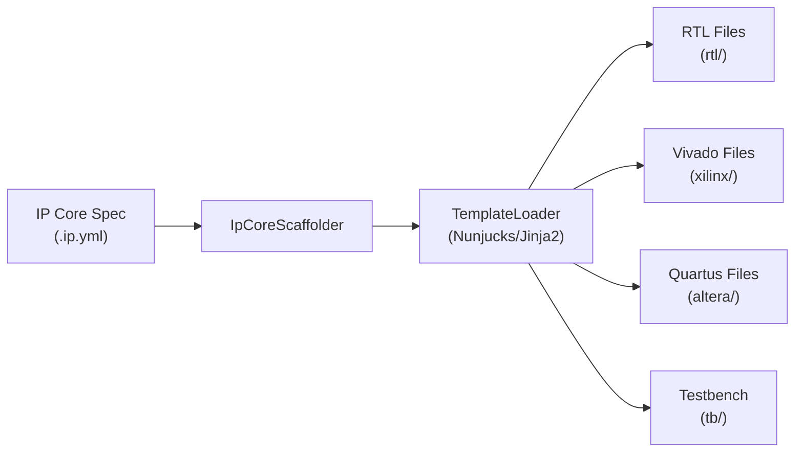

# Generator Reference

The generator scaffolds complete RTL projects from IP Core specifications. It produces VHDL source files, vendor integration files, vendor build scripts, and optional testbenches.

## Overview

Generation is triggered by `IPCraft: Scaffold VHDL Project` or the individual generate commands. The entry point is `IpCoreScaffolder.generateAll()`.



## Generated Output

The scaffolder produces files organized by category next to the `.ip.yml` file:

```text
<ip_name>/
  rtl/
    <ip_name>_pkg.vhd        # Package with register constants and types
    <ip_name>.vhd             # Top-level entity (instantiates core + bus wrapper)
    <ip_name>_core.vhd        # User logic skeleton
    <ip_name>_<bus>.vhd       # Bus wrapper (axil or avmm)
    <ip_name>_regs.vhd        # Register file with field decode
  tb/
    <ip_name>_test.py         # cocotb test skeleton
    Makefile                  # GHDL simulation Makefile
  xilinx/
    component.xml             # Vivado IP-XACT descriptor
    xgui/<ip_name>_v*.tcl    # Vivado XGUI customization
    <ip_name>_project.tcl    # Creates Vivado OOC synthesis project in build/ooc/
    <ip_name>_run_ooc.tcl    # Batch OOC synthesis runner
    <ip_name>_run_xpr.tcl    # Batch full synthesis + implementation runner
    <ip_name>_ooc.xdc        # OOC timing constraints (create_clock entries)
    build/ooc/               # Created by IPCraft: Build (OOC target)
      timing.rpt
      utilization.rpt
      cdc.rpt
    build/xpr/               # Created by IPCraft: Build (XPR target)
      timing.rpt
      utilization.rpt
      cdc.rpt
  altera/
    <ip_name>_hw.tcl          # Platform Designer component
    <ip_name>_project.tcl    # Creates Quartus project in altera/build/
    <ip_name>.sdc             # SDC timing constraints (virtual pins + clocks)
    build/                   # Created by IPCraft: Build
      output_files/
        <ip_name>.sta.summary
        <ip_name>.fit.summary
```

## Generation Options

| Option | Type | Default | Purpose |
|--------|------|---------|---------|
| `vendor` | `'none' \| 'altera' \| 'xilinx' \| 'both'` | `'none'` | Which vendor integration files to generate |
| `includeVhdl` | `boolean` | `true` | Generate RTL VHDL files |
| `includeRegs` | `boolean` | `true` | Generate register file |
| `includeTestbench` | `boolean` | `true` | Generate cocotb test + Makefile |
| `includeVivadoProject` | `boolean` | `false` | Generate Vivado project and build scripts |
| `targetPart` | `string` | from settings | FPGA part for Vivado project |
| `includeQuartusProject` | `boolean` | `false` | Generate Quartus project files |
| `quartusDevice` | `string` | from settings | Device part for Quartus project |
| `updateYaml` | `boolean` | — | Update `fileSets` in the IP Core YAML after generation |

## Vendor Options

| Value | Files Produced |
|-------|----------------|
| `none` | No vendor files |
| `altera` | `altera/<ip_name>_hw.tcl` |
| `xilinx` | `xilinx/component.xml` + `xilinx/xgui/<ip_name>_v*.tcl` |
| `both` | All vendor files (Altera + Xilinx) |

Vendor project files (project TCL, build scripts, constraints) are generated separately by `includeVivadoProject` and `includeQuartusProject`, independent of the `vendor` option.

## Bus Type Detection

The generator reads the IP Core's bus interfaces to determine the bus protocol. It looks for an interface with a `memory_map_ref` and maps its type:

| Bus Interface Type | Generator Bus Type | Template |
|--------------------|-------------------|----------|
| `AXI4L`, `axi4lite`, `axi*` | `axil` | `bus_axil.vhdl.j2` |
| `Avalon-MM`, `avmm`, `avalon*` | `avmm` | `bus_avmm.vhdl.j2` |

If no bus interface with a `memory_map_ref` is found, the generator defaults to AXI-Lite.

## Template System

Templates use [Nunjucks](https://mozilla.github.io/nunjucks/) (Jinja2-compatible) and are located in `src/generator/templates/`:

### VHDL templates

| Template | Output |
|----------|--------|
| `package.vhdl.j2` | VHDL package with register constants |
| `top.vhdl.j2` | Top-level entity |
| `core.vhdl.j2` | User logic skeleton |
| `bus_axil.vhdl.j2` | AXI-Lite bus wrapper |
| `bus_avmm.vhdl.j2` | Avalon-MM bus wrapper |
| `register_file.vhdl.j2` | Register file with decode |

### Vivado templates

| Template | Output |
|----------|--------|
| `amd_component_xml.j2` | `xilinx/component.xml` (IP-XACT) |
| `amd_xgui.j2` | `xilinx/xgui/<ip_name>_v*.tcl` |
| `vivado_project.tcl.j2` | `xilinx/<ip_name>_project.tcl` — creates OOC synthesis project in `build/ooc/` |
| `vivado_run_ooc.tcl.j2` | `xilinx/<ip_name>_run_ooc.tcl` — batch OOC synthesis runner |
| `vivado_run_xpr.tcl.j2` | `xilinx/<ip_name>_run_xpr.tcl` — batch full implementation runner |
| `vivado_ooc.xdc.j2` | `xilinx/<ip_name>_ooc.xdc` — OOC timing constraints |

### Quartus templates

| Template | Output |
|----------|--------|
| `altera_hw_tcl.j2` | `altera/<ip_name>_hw.tcl` |
| `quartus_project.tcl.j2` | `altera/<ip_name>_project.tcl` |
| `quartus_sdc.j2` | `altera/<ip_name>.sdc` |

### Testbench templates

| Template | Output |
|----------|--------|
| `cocotb_test.py.j2` | `tb/<ip_name>_test.py` |
| `cocotb_makefile.j2` | `tb/Makefile` |

## Vivado Build Scripts

The two run-script templates (`vivado_run_ooc.tcl.j2`, `vivado_run_xpr.tcl.j2`) are generated whenever `includeVivadoProject: true`. They accept an optional job count via `-tclargs`:

```bash
vivado -mode batch -source <ip_name>_run_ooc.tcl -nojournal -nolog -tclargs 8
```

`_run_ooc.tcl` sources `_project.tcl` (which recreates the project at `build/ooc/`), launches `synth_1`, opens the synthesis run, and writes `timing.rpt`, `utilization.rpt`, and `cdc.rpt` into `build/ooc/`.

`_run_xpr.tcl` creates a standalone project at `build/xpr/`, runs synthesis and implementation, then writes the same three reports into `build/xpr/`.

## Quartus Build Flow

The Quartus project TCL uses `project_new`, which creates project files in the current working directory. The IPCraft build command runs it from `altera/build/`, so all Quartus output lands there:

```bash
# Step 1 — create project in altera/build/
quartus_sh -t /abs/path/to/altera/<ip_name>_project.tcl

# Step 2 — compile
quartus_sh --flow compile <ip_name>
```

Reports are written to `altera/build/output_files/`.

## Register Processing

`registerProcessor.ts` transforms the YAML specification model into the template context:

- Resolves memory map references (including external `$ref` files)
- Expands bus interface arrays into individual interfaces
- Normalizes bus types to template-compatible keys
- Extracts active bus ports from bus library definitions
- Prepares register data with offsets, fields, and access types

## Implementation Files

| File | Purpose |
|------|---------|
| `src/generator/IpCoreScaffolder.ts` | Orchestrates generation, builds template context |
| `src/generator/registerProcessor.ts` | Register + bus interface processing |
| `src/generator/TemplateLoader.ts` | Loads and renders Nunjucks templates |
| `src/generator/types.ts` | Type definitions (`VendorOption`, `GenerateOptions`, `IpCoreData`) |
| `src/generator/templates/` | All template files |
| `src/services/BuildRunner.ts` | Spawns vendor tools with stdout/stderr streaming |
| `src/services/ReportParser.ts` | Parses Vivado and Quartus report files |
| `src/providers/ReportsTreeProvider.ts` | Explorer sidebar tree view for build results |
| `src/commands/BuildCommands.ts` | Build command handlers and status bar integration |
