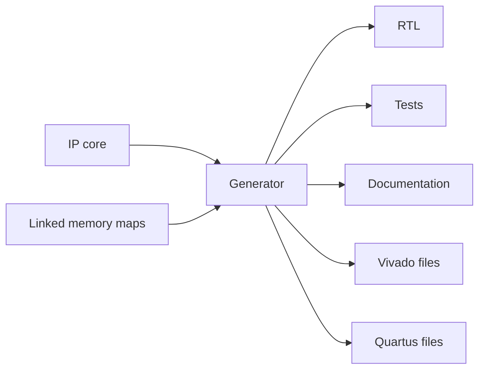
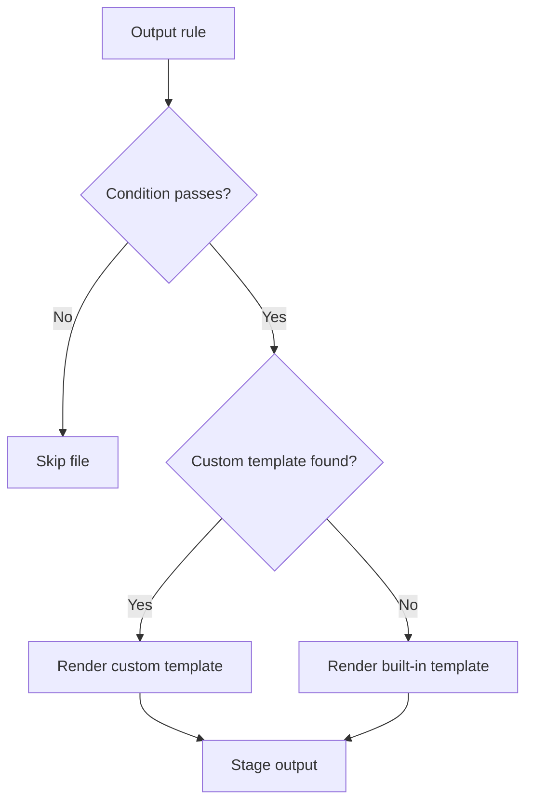

# Generator Reference

IPCraft can generate HDL, tests, documentation, and files for Vivado or Quartus.
The selected scaffold pack controls the exact file list and directory layout.



## Main commands

| Command | Result |
|---|---|
| **IPCraft: Scaffold Project** | Complete output selected by the pack and settings |
| **IPCraft: Generate Top-Level HDL** | RTL only |
| **IPCraft: Generate CocoTB Testbench** | Python and simulator files |
| **IPCraft: Generate Vivado Project** | Vivado project scripts and constraints |
| **IPCraft: Generate Quartus Project** | Quartus project script and constraints |
| **IPCraft: Generate Documentation** | Markdown documentation supplied by the pack |

All generated files are shown in a staging review before IPCraft writes them.

## Common output layout

A complete built-in pack may produce:

```text
generated-core/
├── rtl/
│   ├── <name>_pkg.vhd
│   ├── <name>.vhd
│   ├── <name>_core.vhd
│   ├── <name>_<bus>.vhd
│   └── <name>_regs.vhd
├── tb/
│   ├── <name>_test.py
│   ├── test_<name>_sim.py
│   ├── mm_loader.py
│   └── Makefile
├── docs/
│   └── <name>_datasheet.md
├── xilinx/
│   ├── component.xml
│   └── ...
└── altera/
    ├── <name>_hw.tcl
    └── ...
```

SystemVerilog output uses `.sv` files and normally includes a package, top
module, core module, bus wrapper, and register module.

Smaller packs intentionally produce fewer files. See
[scaffold packs](../how-to/customizing-generated-files-with-scaffold-packs.md).

## Generation options

| Option | Default | Meaning |
|---|---|---|
| `targets` | `[]` | Vendor outputs such as `vivado` or `quartus` |
| `hdlLanguage` | `vhdl` | `vhdl` or `systemverilog` |
| `includeHdl` | `true` | Include RTL files |
| `includeRegs` | `true` | Include generated register logic |
| `includeTestbench` | `true` | Include test files |
| `includeDocs` | `true` | Include generated Markdown documentation |
| `includeVivadoProject` | `false` | Include Vivado project and build scripts |
| `targetPart` | Setting value | Vivado FPGA part |
| `includeQuartusProject` | `false` | Include Quartus project files |
| `quartusDevice` | Setting value | Quartus device part |

The IP Core toolbar writes the common choices to the current file or workspace
settings. Commands may ask for a missing part or device.

## Vendor targets

| Target | Packaging output |
|---|---|
| None | HDL, tests, and documentation only |
| `vivado` | `component.xml` and Vivado XGUI metadata |
| `quartus` | Platform Designer `_hw.tcl` component |
| Both | Both vendor packages |

Project creation is a separate choice. For example, Vivado packaging can be
generated without creating an out-of-context synthesis project.

## Bus selection

The generator uses the memory-mapped interface linked through `memoryMapRef`.
Supported built-in register wrappers include AXI4-Lite and Avalon
Memory-Mapped.

Use a full interface identity when possible, such as
`ipcraft:busif:axi4_lite:1.0`. IPCraft normalizes supported short names before
choosing templates.

## Template system

Templates use Nunjucks and have a `.j2` suffix. IPCraft searches the selected
scaffold pack first, then the built-in template library.



Common template values:

| Value | Meaning |
|---|---|
| `name`, `display_name` | Core names suitable for files and headings |
| `is_systemverilog` | Whether SystemVerilog is selected |
| `bus_type` | Short bus name used by templates |
| `has_memory_mapped_slave` | Whether register-bus output is needed |
| `registers` | Registers sorted by address |
| `bus_ports`, `user_ports` | Physical interface and standalone ports |
| `generics` | Core parameters |
| `clock_port`, `reset_port` | Primary clock and reset names |

The versioned template-data schema is
`src/generator/contract/template_context.schema.json`. Template variables use
snake case by design; TypeScript and IPCraft schema properties use camel case.

## Testbench selection

| Framework | Supported simulator choices | Main output |
|---|---|---|
| Cocotb | GHDL, Icarus Verilog, Verilator, Questa | Python tests and simulator runner |
| VUnit | GHDL | `run.py` and VHDL testbench |

The framework controls how tests are written. The simulator choice controls how
the generated HDL is compiled and run.

See [Running a Cocotb simulation](../how-to/run-cocotb-simulation.md).

## Vendor build output

Vivado builds write reports under `xilinx/build/`; Quartus builds write output
under `altera/build/`. IPCraft parses timing and resource-use reports for the
Build view.

For commands, configuration, and report states, see
[Building a project](../how-to/building-a-project.md).

## Command-line generation

The headless command runs without opening VS Code:

```bash
npx ipcraft generate path/to/core.ip.yml --target quartus --lang vhdl --out gen/
```

| Option | Meaning |
|---|---|
| `--target <vendor>` | Vendor output; repeat or use a comma-separated list |
| `--lang <language>` | `vhdl` or `systemverilog` |
| `--out <directory>` | Generated project directory |
| `--pack <name>` | Scaffold pack override |
| `--quartus-device <part>` | Quartus device |
| `--vivado-part <part>` | Vivado part |

Use `verify` to compare committed output with a fresh in-memory generation:

```bash
npx ipcraft verify path/to/core.ip.yml gen/ --target quartus --lang vhdl
```

It exits with a non-zero status and lists stale or missing files when the
directory differs.

## Contributor implementation

Implementation details belong in [generator architecture](../architecture/generator-backbone.md).
Source templates are under `src/generator/templates/`; copied files under
`dist/templates/` must not be edited.
