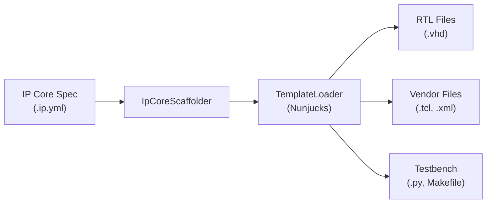

# Generator Reference

The generator scaffolds complete RTL projects from IP Core specifications. It produces VHDL source files, vendor integration files, and optional testbenches.

## Overview

Generation is triggered from the IP Core editor's Generator Panel or via the `IPCraft: Generate VHDL` command. The entry point is `IpCoreScaffolder.generateAll()`.



## Generated Output

The scaffolder produces files organized by category:

```text
<ip_name>/
  rtl/
    <ip_name>_pkg.vhd        # Package with constants and types
    <ip_name>.vhd             # Top-level entity (instantiates core + bus)
    <ip_name>_core.vhd        # User logic skeleton
    <ip_name>_<bus>.vhd       # Bus wrapper (axil or avmm)
    <ip_name>_regs.vhd        # Register file with field decode
  altera/
    <ip_name>_hw.tcl          # Platform Designer component
  amd/
    component.xml             # Vivado IP-XACT descriptor
    xgui/<ip_name>_v*.tcl     # Vivado GUI customization
  tb/
    <ip_name>_test.py         # cocotb test skeleton
    Makefile                  # GHDL simulation Makefile
```

## Vendor Options

| Value | Files Produced |
|-------|----------------|
| `none` | No vendor files |
| `altera` | `altera/<ip_name>_hw.tcl` |
| `amd` | `amd/component.xml` + `amd/xgui/<ip_name>_v*.tcl` |
| `both` | All vendor files (Altera + AMD) |

## Generation Options

Options are configured in the Generator Panel UI or passed programmatically:

| Option | Type | Default | Purpose |
|--------|------|---------|---------|
| `vendor` | `VendorOption` | `'both'` | Which vendor integration files to generate |
| `includeVhdl` | `boolean` | `true` | Generate RTL VHDL files |
| `includeRegs` | `boolean` | `true` | Generate register file |
| `includeTestbench` | `boolean` | `false` | Generate cocotb test + Makefile |
| `updateYaml` | `boolean` | -- | Update the IP Core YAML with generated file paths |

## Bus Type Detection

The generator reads the IP Core's bus interfaces to determine the bus protocol. It checks for a bus interface with a `memory_map_ref` and maps its type:

| Bus Interface Type | Generator Bus Type | Template |
|--------------------|-------------------|----------|
| `AXI4L`, `axi4lite`, `axi*` | `axil` | `bus_axil.vhdl.j2` |
| `Avalon-MM`, `avmm`, `avalon*` | `avmm` | `bus_avmm.vhdl.j2` |

If no bus interface with a memory map reference is found, the generator defaults to AXI-Lite.

## Template System

Templates use [Nunjucks](https://mozilla.github.io/nunjucks/) (Jinja2-compatible) and are located in `src/generator/templates/`:

| Template | Output |
|----------|--------|
| `package.vhdl.j2` | VHDL package with register constants |
| `top.vhdl.j2` | Top-level entity |
| `core.vhdl.j2` | User logic skeleton |
| `bus_axil.vhdl.j2` | AXI-Lite bus wrapper |
| `bus_avmm.vhdl.j2` | Avalon-MM bus wrapper |
| `register_file.vhdl.j2` | Register file with decode |
| `entity.vhdl.j2` | Entity declaration helper |
| `architecture.vhdl.j2` | Architecture stub |
| `altera_hw_tcl.j2` | Altera Platform Designer `_hw.tcl` |
| `amd_component_xml.j2` | AMD Vivado IP-XACT `component.xml` |
| `amd_xgui.j2` | AMD Vivado xgui `.tcl` |
| `cocotb_test.py.j2` | cocotb Python test |
| `cocotb_makefile.j2` | GHDL simulation Makefile |
| `memmap.yml.j2` | Memory map YAML template |

## Register Processing

`registerProcessor.ts` handles the transformation from the YAML specification model to the template context:

- Resolves memory map references (including external `$ref` files)
- Expands bus interface arrays into individual interfaces
- Normalizes bus types to template-compatible keys
- Extracts active bus ports from bus library definitions
- Prepares register data with offsets, fields, and access types

## Implementation Files

| File | Purpose |
|------|---------|
| `src/generator/IpCoreScaffolder.ts` | Orchestrates generation, builds template context |
| `src/generator/registerProcessor.ts` | Register + bus interface processing |
| `src/generator/TemplateLoader.ts` | Loads and renders Nunjucks templates |
| `src/generator/types.ts` | Type definitions (`VendorOption`, `GenerateOptions`, `IpCoreData`) |
| `src/generator/templates/` | Nunjucks template files |
