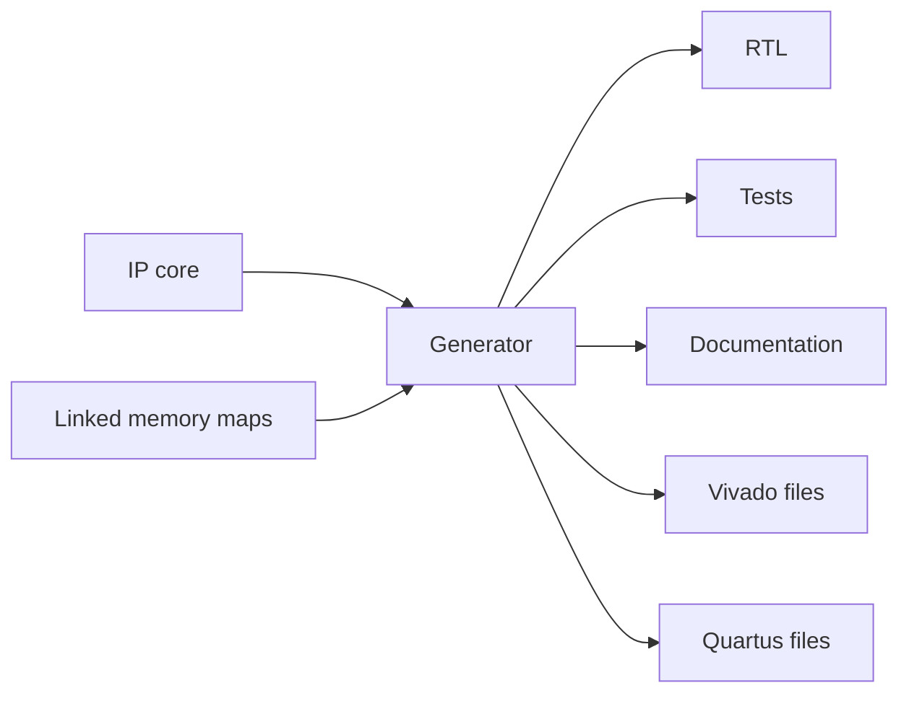
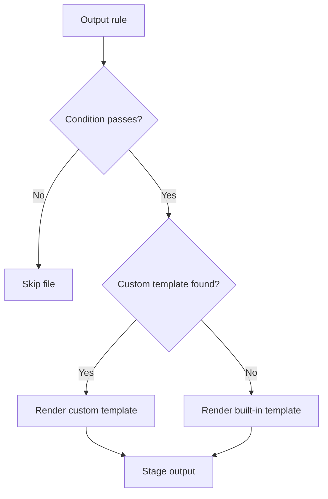

# Generator Reference

IPCraft can generate HDL, tests, documentation, and files for Vivado or Quartus.
The selected scaffold pack controls the exact file list and directory layout.


```mermaid
flowchart LR
    A[IP core] --> C[Generator]
    B[Linked memory maps] --> C
    C --> D[RTL]
    C --> E[Tests]
    C --> F[Documentation]
    C --> G[Vivado files]
    C --> H[Quartus files]
```

## Main commands

| Command                                                | Result                                            |
| ------------------------------------------------------ | ------------------------------------------------- |
| **IPCraft: Scaffold Project**                          | Complete output selected by the pack and settings |
| **IPCraft: Generate Top-Level HDL**                    | RTL only                                          |
| **IPCraft: Generate CocoTB Testbench**                 | Python and simulator files                        |
| **IPCraft: Generate System Testbench from Vivado Tcl** | Tracked VHDL/XSim system-verification runner      |
| **IPCraft: Generate Vivado Project**                   | Vivado project scripts and constraints            |
| **IPCraft: Generate Quartus Project**                  | Quartus project script and constraints            |
| **IPCraft: Generate Documentation**                    | Markdown documentation supplied by the pack       |

All generated files are shown in a staging review before IPCraft writes them.

## Common output layout

A complete built-in pack may produce:

```text
generated-core/
├── rtl/
│   ├── <name>_pkg.vhd
│   ├── <name>.vhd
│   ├── <name>_core.vhd
│   ├── <name>_<bus>.vhd
│   └── <name>_regs.vhd
├── tb/
│   ├── <name>_test.py
│   ├── test_<name>_sim.py
│   ├── register_model.py
│   ├── verification_manifest.json
│   └── Makefile
├── docs/
│   └── <name>_datasheet.md
├── xilinx/
│   ├── component.xml
│   └── ...
└── altera/
    ├── <name>_hw.tcl
    └── ...
```

SystemVerilog output uses `.sv` files and normally includes a package, top
module, core module, bus wrapper, and register module.

Smaller packs intentionally produce fewer files. See
[scaffold packs](../how-to/customizing-generated-files-with-scaffold-packs.md).

## System-verification scaffold

System verification is separate from IP-core scaffold packs. It starts from a
checked-in Vivado recreation Tcl script and stages this fixed, tracked layout in
a `verification/` directory beside the script:

```text
verification/
├── system-verification.yml
├── Makefile
├── scripts/run_xsim.tcl
└── tb/
    ├── axi4lite_master_bfm.vhd
    └── system_verification_tb.vhd
```

The `Makefile` is mandatory. `make run` is the common extension, developer, and
CI entry point; `make run WAVES=1` enables waveform capture. `make clean`
removes only a marked run directory within the scaffold's `.run/` directory or
the project `.ipcraft/system-verification/` run root, and `make help` lists the
supported targets.

IPCraft renders all five source files in memory and sends them through the
standard staging review. Cancelling the review writes none of them. Accepted
sources belong in version control; runtime Vivado/XSim output does not. The VS
Code runner retains each run beneath
`.ipcraft/system-verification/<run-id>/`, including
`system-verification.log`, exported simulation files, and any `result.json` or
optional waveform produced before the run ends. A generated `result.json`
records passed, failed, or cancelled; it includes the resolved interface,
instance, and system base address only after the recreated binding has been
validated.

This runner is VHDL/XSim-only and exercises deterministic, ordered,
single-word reads and writes through a 32-bit-address, 32-bit-data AXI4-Lite
boundary interface. At run time it byte-checks the reviewed configuration and
memory map and revalidates the wrapper language, physical interface shape,
clock/reset boundary ports, target segment, and address assignment. Drift
requires regeneration. It does not use AXI VIP, Cocotb, or Questa. See
[Run System Verification](../how-to/run-system-verification.md) for the complete
configuration and failure-diagnosis procedure.

## Cocotb verification source of truth

For generated cocotb tests, `tb/verification_manifest.json` replaces
`memmap.yml` as the machine-readable test input. IPCraft derives the manifest
once from the normalized memory-map model and records the origin of every kind
of fact:

- register layout, reset values, access types, and array bounds come from the
  specification;
- readable and writable masks, write effects, reserved/unmapped read behavior,
  and hardware/software arbitration come from generator policy;
- bus type, data width, and byte-enable support come from the resolved bus
  binding.

`tb/register_model.py` is the transport-independent scoreboard. The generated
AXI4-Lite and Avalon-MM adapters drive that same model. The
`memmap.yml.j2` template remains available to scaffold packs as a
driver/documentation projection, but generated cocotb tests neither load nor
interpret it. It is therefore not a second verification oracle.

## Generation options

| Option                  | Default       | Meaning                                      |
| ----------------------- | ------------- | -------------------------------------------- |
| `targets`               | `[]`          | Vendor outputs such as `vivado` or `quartus` |
| `hdlLanguage`           | `vhdl`        | `vhdl` or `systemverilog`                    |
| `includeHdl`            | `true`        | Include RTL files                            |
| `includeRegs`           | `true`        | Include generated register logic             |
| `includeTestbench`      | `true`        | Include test files                           |
| `includeDocs`           | `true`        | Include generated Markdown documentation     |
| `includeVivadoProject`  | `false`       | Include Vivado project and build scripts     |
| `targetPart`            | Setting value | Vivado FPGA part                             |
| `includeQuartusProject` | `false`       | Include Quartus project files                |
| `quartusDevice`         | Setting value | Quartus device part                          |

The IP Core toolbar writes the common choices to the current file or workspace
settings. Commands may ask for a missing part or device.

## Vendor targets

| Target    | Packaging output                         |
| --------- | ---------------------------------------- |
| None      | HDL, tests, and documentation only       |
| `vivado`  | `component.xml` and Vivado XGUI metadata |
| `quartus` | Platform Designer `_hw.tcl` component    |
| Both      | Both vendor packages                     |

Project creation is a separate choice. For example, Vivado packaging can be
generated without creating an out-of-context synthesis project.

## Bus selection

The generator uses the memory-mapped interface linked through `memoryMapRef`.
Supported built-in register wrappers include AXI4-Lite and Avalon
Memory-Mapped.

Use a full interface identity when possible, such as
`ipcraft:busif:axi4_lite:1.0`. IPCraft normalizes supported short names before
choosing templates.

## Template system

Templates use Nunjucks and have a `.j2` suffix. IPCraft searches the selected
scaffold pack first, then the built-in template library.


```mermaid
flowchart TD
    A[Output rule] --> B{Condition passes?}
    B -->|No| C[Skip file]
    B -->|Yes| D{Custom template found?}
    D -->|Yes| E[Render custom template]
    D -->|No| F[Render built-in template]
    E --> G[Stage output]
    F --> G
```

Common template values:

| Value                                     | Meaning                                                                                 |
| ----------------------------------------- | --------------------------------------------------------------------------------------- |
| `name`, `display_name`                    | Core names suitable for files and headings                                              |
| `is_systemverilog`                        | Whether SystemVerilog is selected                                                       |
| `bus_type`                                | Short bus name used by templates                                                        |
| `has_memory_mapped_slave`                 | Whether register-bus output is needed                                                   |
| `has_endian_swap`                         | Whether top-level endian reflow logic is needed                                         |
| `registers`                               | Registers sorted by address                                                             |
| `bus_ports`, `user_ports`                 | Physical interface and standalone ports                                                 |
| `interrupt_ports`                         | Interrupt signals with resolved bus-interface and clock associations                    |
| `endian_swap_ports`, `endian_swap_widths` | Ports and fixed widths used by endian reflow logic                                      |
| `generics`                                | Core parameters                                                                         |
| `xgui_pages`                              | Parameter `uiPage`/`uiGroup` layout as a page-group-parameter tree, for the Vivado xGUI |
| `display_items`                           | The same layout flattened into Platform Designer `add_display_item` records             |
| `clock_port`, `reset_port`                | Primary clock and reset names                                                           |

The versioned template-data schema is
`src/generator/contract/template_context.schema.json`. Template variables use
snake case by design; TypeScript and IPCraft schema properties use camel case.
The current contract version is 1.3.0. Version 1.3.0 adds `display_items`,
display labels and Tcl-safe renderings for parameter metadata and defaults.
Platform Designer group entries use stable internal IDs with their authored
`uiPage`/`uiGroup` text in `display_name`; templates should not treat the ID as
the visible label. Packs pinned to `~1.2` or an earlier minor must update their
range after validating the additive parameter layout context; built-in packs
use the compatible `^1.0` range.

## Testbench selection

| Framework | Supported simulator choices             | Main output                       |
| --------- | --------------------------------------- | --------------------------------- |
| Cocotb    | GHDL, Icarus Verilog, Verilator, Questa | Python tests and simulator runner |
| VUnit     | GHDL                                    | `run.py` and VHDL testbench       |

The framework controls how tests are written. The simulator choice controls how
the generated HDL is compiled and run.

See [Running a Cocotb simulation](../how-to/run-cocotb-simulation.md).

## Vendor build output

Vivado builds write reports under `xilinx/build/`; Quartus builds write output
under `altera/build/`. IPCraft parses timing and resource-use reports for the
Build view.

For commands, configuration, and report states, see
[Building a project](../how-to/building-a-project.md).

## Command-line package

The Marketplace extension does not install a global shell command. The
standalone `ipcraft` npm package is prepared in this repository but is not yet
published. Until it is released, use the extension commands documented above.

Contributors can build a local package archive and install that archive in a
clean environment without publishing it:

```bash
npm run package:cli
npm install --global ./build/ipcraft-0.9.2.tgz
ipcraft generate path/to/core.ip.yml --target quartus --lang vhdl --out gen/
```

| Option                         | Meaning                                                                       |
| ------------------------------ | ----------------------------------------------------------------------------- |
| `--target <vendor>`            | Vendor output; repeat or use a comma-separated list                           |
| `--lang <language>`            | `vhdl` or `systemverilog`                                                     |
| `--out <directory>`            | Generated project directory                                                   |
| `--pack <name>`                | Scaffold pack override                                                        |
| `--quartus-device <part>`      | Quartus device                                                                |
| `--vivado-part <part>`         | Vivado part                                                                   |
| `--indent-style <spaces\|tab>` | Indentation style for generated HDL/TCL/XDC/SDC (default: `spaces`)           |
| `--indent-size <n>`            | Spaces per indentation level when `--indent-style` is `spaces` (default: `2`) |

Use `verify` to compare committed output with a fresh in-memory generation:

```bash
ipcraft verify path/to/core.ip.yml gen/ --target quartus --lang vhdl
```

It exits with a non-zero status and lists stale or missing files when the
directory differs. Pass the same `--indent-style`/`--indent-size` (and any
other generation flags) used to produce the committed output, or affected
generated source files will be reported stale against the default 2-space
regeneration.

The CLI source was introduced by [issue #72](https://github.com/bleviet/ipcraft-vscode/issues/72)
and remains in this repository so it uses the same generator as the extension.
Its npm release is tracked by
[issue #116](https://github.com/bleviet/ipcraft-vscode/issues/116) and is a
separate, explicitly manual release after the matching extension version has
been published.

## Contributor implementation

Implementation details belong in [generator architecture](../architecture/generator-backbone.md).
Source templates are under `src/generator/templates/`; copied files under
`dist/templates/` must not be edited.
