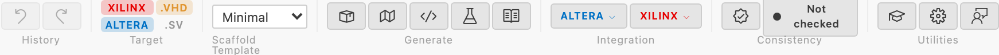

# IP Core Editor Reference

The IP Core editor is the custom visual editor for `*.ip.yml` files. Editing happens
entirely on the **block-diagram canvas** plus its Inspector panel — there is no separate
tabular "form" mode in the current UI.

## Structure

```text
+------------------------------------------------------------------------+
| Toolbar: Undo/Redo | Scaffold pack picker | Target picker | Generate…  |
+----------------+-------------------------------------------+-----------+
| Library        | IP Block Canvas (SVG)                     | Canvas    |
| Palette        |                                           | Inspector |
+----------------+-------------------------------------------+-----------+
```

VLNV (vendor/library/name/version) is shown read-only in the toolbar header.

## State Management

### Hooks (`src/webview/ipcore/hooks/`)

| Hook | Purpose |
|------|---------|
| `useIpCoreState` | Parsed IP Core state, update methods, validation |
| `useIpCoreSync` | Sends YAML updates to the extension host |
| `useCanvasDrop` | Resolves drag-and-drop payloads into IP Core updates |
| `useCanvasUndo` | Undo/redo stack for canvas changes |
| `useCanvasSelection` | Canvas element selection state |
| `useCanvasValidation` | Real-time canvas constraint checks |
| `useGroupPorts` | Groups/batches multi-port updates (e.g. bulk width edits) |
| `useProtocolSuggestions` | Suggests a bus protocol from dropped/parsed signal names |

`useNavigation.ts` also exists but is only consumed by the dead `NavigationSidebar`.

### Canvas Components (`src/webview/ipcore/components/canvas/`)

| Component | Purpose |
|-----------|---------|
| `IpBlockCanvas` | Top-level SVG schematic; owns layout and drop handling |
| `LibraryPalette` | Draggable primitives (generics, infrastructure, bus protocols) |
| `CanvasInspector` | Right-hand property panel for the selected element |
| `CanvasPort`, `CanvasBusBundle`, `CanvasBusSubPort` | Rendered port / bus-interface / expanded-signal elements |
| `CanvasSelectionActions` | Multi-select action bar (e.g. bulk delete/group) |
| `GroupingMappingStep`, `MapConduitToBusDialog`, `PortMappingDialog` | Multi-step flows for grouping loose ports into a bus interface, mapping a conduit to a bus, and physical-to-logical port mapping |
| `RemoveZone` | Drop target for drag-to-remove |
| `StagingOverlay` | Preview overlay shown while reviewing generated/staged output |

## Validation

The IP Core editor performs cross-reference validation:

- Checks that `associatedClock` references an existing clock name
- Checks that `associatedReset` references an existing reset name
- Checks that `memoryMapRef` references an existing memory map

Validation errors appear in a panel at the bottom of the editor. Clicking an error navigates to the relevant element and highlights it.

## Implementation Files

| File | Purpose |
|------|---------|
| `src/webview/ipcore/IpCoreApp.tsx` | App shell, message handling, keyboard shortcuts, toolbar |
| `src/webview/ipcore/components/layout/EditorPanel.tsx` | Mounts `IpBlockCanvas` |
| `src/webview/ipcore/components/canvas/` | Canvas, palette, inspector, and dialog components (see above) |
| `src/webview/ipcore/hooks/` | State management hooks (see above) |

Scaffolding is triggered from the toolbar or the Command Palette (`IPCraft: Scaffold
Project` etc.), not from a mounted `GeneratorPanel` component — see the
[Generator Reference](generator.md) for generation options, vendor integration, and the
template system.

---

## Canvas View

The IP Core editor is the canvas described above. Undo/Redo buttons are in the toolbar.


### Canvas Toolbar

The toolbar groups project-wide actions above the canvas. The file name and VLNV at the
left identify the open IP Core; the controls at the right act on that file or configure
what its generators produce.



Controls appear in the following order from left to right:

| Group | Control or icon | Function |
|-------|-----------------|----------|
| **History** |  Undo | Reverts the most recent canvas change. It is disabled when the canvas undo stack is empty. |
| **History** |  Redo | Reapplies the most recently undone canvas change. It is disabled when the canvas redo stack is empty. |
| **Target** | `XILINX` / `ALTERA` | Shows or hides each vendor's **Integration** menu. The selected vendors also become the target toolchains when you scaffold the complete project. Available pills depend on the registered toolchains. |
| **Target** | `.VHD` / `.SV` | Selects VHDL or SystemVerilog for top-level HDL generation and scaffolding. The highlighted pill is active. |
| **Scaffold Template** | Pack dropdown | Selects the scaffold pack that controls generated project structure and templates. The choice is written to the IP Core and saved as the global default. |
| **Generate** |  Scaffold Project | Stages the complete output selected by the current pack and settings, including RTL, enabled vendor packaging, testbench, and documentation. |
| **Generate** |  Create Register Map | Opens a save dialog for a new `*.mm.yml` file, using the active IP Core's directory and name as defaults. |
| **Generate** |  Generate HDL | Generates top-level HDL in the language selected under **Target**. |
| **Generate** |  Generate Testbench | Generates the configured testbench framework and simulator files. |
| **Generate** |  Generate Documentation | Generates documentation supplied by the selected scaffold pack. |
| **Integration** |  Vendor menu | Opens the vendor-specific generation, editing, project, and build actions described below. This group appears only for vendors enabled under **Target**. |
| **Consistency** |  Check Consistency | Compares the `*.ip.yml` specification with generated HDL and vendor artifacts. It is disabled while a check is running. |
| **Consistency** |  Status | Shows **Not checked**, **Checking**, **Consistent**, or **Drift**. After a completed check, click the status to show or hide the findings. Green means consistent, amber means reconcilable drift, and red means the findings include a destructive conflict. |
| **Utilities** |  Walkthroughs | Opens the IPCraft walkthrough menu. |
| **Utilities** |  Settings | Opens IPCraft settings. |
| **Utilities** |  Feedback | Opens the issue and feedback page. |

The **Integration** dropdowns use the same icons for equivalent Vivado and Quartus
operations:

| Icon | Quartus action | Vivado action |
|------|----------------|---------------|
|  Generate component | Generate a Platform Designer `_hw.tcl` component | Generate a Vivado `component.xml` component |
|  Edit component | Open the component in Platform Designer | Edit the component in IP Packager |
|  Generate project | Generate a Quartus project | Generate a Vivado project |
|  Open project | Open the generated project in Quartus | Open the generated project in Vivado |
|  Build | Run a Quartus full compile | Run Vivado out-of-context synthesis |

Editing, opening, and building actions stay disabled until their required generated
artifact exists (`_hw.tcl`, `component.xml`, `.qpf`, or `.xpr`). Hover over any toolbar
button to see its action name and, where applicable, its keyboard shortcut.

### Library Palette

The palette lists draggable primitives, organised into three collapsible categories:

| Category | Items |
|----------|-------|
| **Generics** | Integer Generic, Boolean Generic, String Generic |
| **Infrastructure** | Clock, Reset, Interrupt, Port (direction is set afterward in the Inspector) |
| **Bus Protocols** | AXI4-Lite, AXI4-Full, AXI-Stream, Avalon-MM, Avalon-ST, Custom Interface |

Drag any item from the palette and drop it onto the canvas to add it to the IP Core. The item's default name is auto-assigned from a hint (e.g., `clk`, `axi_lite`, `DATA_WIDTH`) and can be renamed via the inspector.

### IP Block Canvas

The canvas renders the IP Core as an SVG schematic:

- **Clocks and resets** appear on the left edge as thin stubs.
- **Ports** appear on the left (inputs) or right (outputs/inout) edge.
- **Bus interfaces** appear as wide "bundle" connectors with a protocol badge and a mode indicator (S / M / Src / Sink). Click the expand button to reveal individual bus signals.
- **Generics** appear at the bottom edge.
- **Array bus interfaces** display a count badge (e.g., `×3`) in the top-right corner of the protocol badge.
- **Clock domain colour coding** — each unique clock reference gets a distinct colour applied to its bus bundles.

Navigation:

| Interaction | Action |
|-------------|--------|
| `Ctrl+Wheel` | Zoom in / out |
| Plain wheel | Pan |
| Middle-mouse drag | Pan freely |
| Hold `Space` + left-drag on background | Pan freely |
| Left-drag on background (no `Space`) | Marquee-select multiple ports/interrupts |
| `Ctrl+0` / `Cmd+0` | Reset zoom to 100 % |

### Canvas Inspector

Clicking any element on the canvas selects it and opens the **Inspector** panel on the right. The inspector shows context-specific fields:

| Element kind | Editable properties |
|--------------|---------------------|
| **Clock / Reset** | Name |
| **Port** | Name, direction, width (numeric or generic reference) |
| **Generic** | Name, data type, default value |
| **Bus interface** | Name, mode, physical prefix, associated clock/reset, memory map reference (file picker), port width overrides, array count |
| **Bus signal** (expanded) | Width override |

Clicking a signal inside an expanded bus bundle also opens the inspector with the signal's width configuration.

### Canvas Keyboard Shortcuts

These shortcuts are active when the canvas is visible and no text field is focused:

| Key | Action |
|-----|--------|
| `Delete` | Delete the selected element |
| `Ctrl+D` / `Cmd+D` | Duplicate the selected element (bus interfaces increment their array count) |
| `Ctrl+Z` / `Cmd+Z` | Undo last canvas change (native VS Code document undo) |
| `Ctrl+Y` / `Cmd+Y` | Redo |
| `Ctrl+0` / `Cmd+0` | Reset zoom to 100 % |
| `Ctrl+F` / `Cmd+F` | Open port search |
| `Escape` | Close port search if open, otherwise deselect current element |

### Drag-to-Remove

Dragging an element from the canvas and dropping it outside the canvas (onto the **Remove Zone** strip that appears during the drag) removes the element. This is an alternative to the `Delete` key.

### Custom Interface (Conduit)

Dragging **Custom Interface** from the palette adds a conduit bus interface. In the inspector, you can:

1. Add named signals with configurable directions and widths.
2. Save the interface under a name — it is written to a `<name>.busdef.yml` file in the project directory and becomes reusable across IP Cores in the same workspace.
